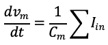
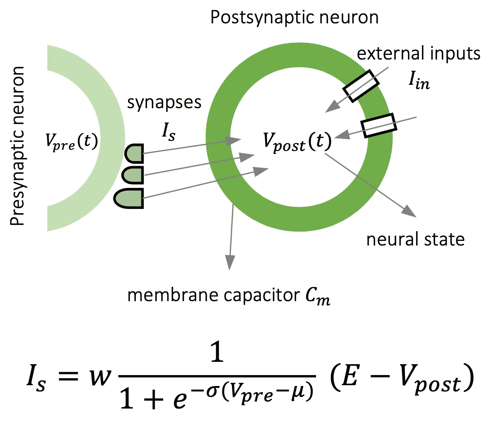
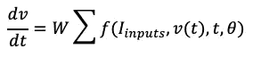
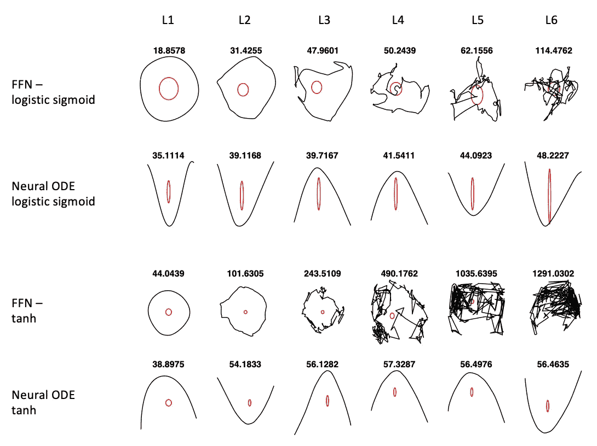
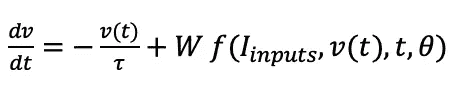
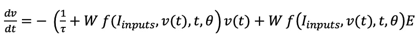
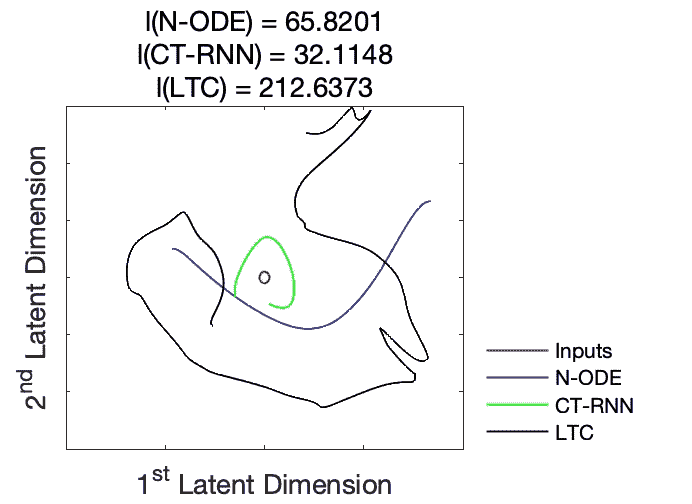

# 神经颂歌被忽视的一面

> 原文：<https://medium.com/analytics-vidhya/the-overlooked-side-of-neural-odes-ab90a5dbdc2a?source=collection_archive---------12----------------------->

我开始喜欢理解如果深度神经网络的隐藏状态由常微分方程(ODEs)指定会发生什么已经有一段时间了。在这篇文章中，我试图指出基于 ODE 的神经网络的一个被忽视但最重要的方面，以促进这一方向未来研究的新见解。

从统计学习的角度，引入了[神经元 ODEs](https://papers.nips.cc/paper/7892-neural-ordinary-differential-equations.pdf) 的概念，作为一类新的深度神经网络[ [陈等 2018](https://papers.nips.cc/paper/7892-neural-ordinary-differential-equations.pdf) ]。作者建议，代替使用一系列隐藏层，我们可以将隐藏状态 *h(t)* 折叠成非常深的表示，形式为 *dh(t)/dt = f(h(t)，t，θ)* 的微分方程，其中神经网络 *f* 由 *θ* 参数化。然后可以通过选择的数值 ODE 解算器计算状态，并通过执行反向模式自动微分(反向传播)来训练网络，或者通过解算器梯度下降，或者通过将解算器视为黑盒并应用[伴随灵敏度方法](https://aip.scitation.org/doi/abs/10.1063/1.525186?casa_token=6GQKEkJjtlgAAAAA%3At1PNwynO3uZ1yfPTRrt3rLmDnheB3MwL14RcaWsJgD5Sommf6dczxzG2eMlmMeGxIdvtHPtuV2Q&)。

神经微分方程体现了几个好处，如自适应计算，更好的连续时间序列建模，记忆和参数效率。

太好了！从那以后，许多神经微分方程的替代方法试图改善它们的表示，使用它们并更好地理解它们。例子有[鲁巴诺瓦等人 NeurIPS 2019](http://papers.nips.cc/paper/8773-latent-ordinary-differential-equations-for-irregularly-sampled-time-series.pdf) 、[杜邦等人 NeurIPS 2019](http://papers.nips.cc/paper/8577-augmented-neural-odes) 、[杜尔坎等人 NeurIPS 2019](https://papers.nips.cc/paper/8969-neural-spline-flows.pdf) 、[贾和本森、NeurIPS 2019](https://papers.nips.cc/paper/9177-neural-jump-stochastic-differential-equations.pdf) 、[严等人 2020](https://openreview.net/forum?id=B1e9Y2NYvS) 、[霍尔等人 2020](https://openreview.net/forum?id=HyeSin4FPB) 、[夸格里诺等人 2020【中](https://openreview.net/forum?id=Sye0XkBKvS)

尽管神经微分方程为我们提供了一个非常强大的概率建模工具，但在我个人看来，它们忽略了近似能力的来源以及为什么基于微分方程的神经模型应该首先受到欢迎的主要原因。我将通过历史课来解决这个问题！

## 18 世纪的神经颂歌

让我们回到 18 世纪，基于 ODE 的细胞模型的第一个版本主要是由物理学家路易吉·加尔瓦尼关于 T2 生物电的研究成果发现的。这项工作之后，生理学家 Emil du Bois-Reymond 在 19 世纪发现了神经细胞中的动作电位(T5)。Bois-Reymond 和他的学生 [Julius Bernstein](https://en.wikipedia.org/wiki/Julius_Bernstein) 一起开发了所谓的*膜假说*，基于该假说，神经细胞膜的行为类似于电子电容器( *Cm* )，其状态由电压-电流一阶微分方程描述。随后， [Louis Lapicque](https://en.wikipedia.org/wiki/Louis_Lapicque) 于 1907 年引入了第一个神经元数学模型，称为[积分-点火](https://en.wikipedia.org/wiki/Biological_neuron_model#Integrate-and-fire)，如下所示:

**方程式 1。**整合与火模式

离子通道工作原理的发现导致了 1952 年[霍奇金和赫胥黎](https://en.wikipedia.org/wiki/Hodgkin%E2%80%93Huxley_model)对动作电位和突触传递动力学的更精确描述，为此他们获得了 1963 年[诺贝尔奖](https://en.wikipedia.org/wiki/Nobel_Prize_in_Physiology_or_Medicine)！事实上，霍奇金和赫胥黎的发现创造了一个基质，用于对上述整合-发射模型中的当前 *I_in* 进行建模，这是由 [Christoph Koch](https://en.wikipedia.org/wiki/Christof_Koch) 小组在 1989 年他的著作《神经元建模的*方法*和 [Terry Sejnowski](https://en.wikipedia.org/wiki/Terry_Sejnowski) 小组在 [Destexhe、Mainen 和 Sejnowski 1994 【T33](https://link.springer.com/article/10.1007/BF00961734)

突触前神经元向突触后神经元的突触电流传递。w 代表突触的最大电导(突触的最大重量)，σ和μ是突触传递参数，E 代表一个突触的反转电位。e 决定一个突触是[兴奋性](https://en.wikipedia.org/wiki/Excitatory_synapse)还是[抑制性](https://en.wikipedia.org/wiki/Inhibitory_postsynaptic_potential)。注意突触传递的 s 形抽象！

如果我们把突触传递简化为一个电导(考虑我们只取上面的 s 形函数，作为突触强度，I_s ≈ f(v(t)，θ))，那么通过把这个突触电导代入 Eq。1、我们有:

**方程式二。**神经元的神经状态。f 是上图所示的 sigmoid 函数，θ包括 sigmoid 函数的参数。德加武！

正如我们所看到的，当我们简化它们的概念时，神经元和突触的生物物理模型的组合出现了神经 ODE 形式。有了这个历史笔记，我试图激发神经颂被忽视的一面，那就是它们与主要植根于神经科学研究的丰富的计算模型的不可否认的联系。最后，我想展示我们如何利用神经微分方程的这一新方面来构建更好的学习系统。

## 论神经颂歌的表现力

[拉古等人。艾尔。ICML 2017](http://proceedings.mlr.press/v70/raghu17a.html) 推出了通过轨迹长度概念统一的深度神经网络表达能力的新度量。他们表明，对于给定的输入轨迹(例如，圆形轨迹)和网络权重的任意初始化，穿过每个隐藏层后的潜在轨迹长度随着网络的深度呈指数增加，并导致实现更复杂的轨迹模式。他们发现这样的表现可以作为一个给定架构的可表达性的可靠度量。

我试图从轨迹长度和形状的角度，将神经 ode 的表达能力与相同大小的完全连接的网络进行比较。为此，我构建了六个紧密连接的层，一次用*逻辑 s 形*激活，一次用 *tanh* 。每层有 100 个神经元(k = 100)，所有的权重和偏置都是从\mathcal{N}随机初始化的。神经 ODE 网络于是被定义为 *dh/dt* = 6 层网络(由显式龙格-库塔(4，5) ODE 解算器实现)，前馈网络被定义为 *h = 6 层网络*。两个网络都服从由两个输入时间序列 *sin(t)* 和 *cos(t)* 确定的二维圆形轨迹，其中 *t = [0，2π]* 。下面，我为 FFN 和神经 ODE 绘制了每个隐藏层( *L1 =隐藏层 1* )后轨迹变换的二维投影。每个轨迹上显示的数字描述了它们的长度。轨迹长度随深度的增加不会出现在神经 ODE 架构中，并且它的潜在轨迹表示从一层到另一层变化不大。这是令人惊讶的，因为从轨迹长度的角度来看，我们没有从神经 ODE 中观察到比其离散化的 FFN 对应物更具表达性的行为！让我们从另一个角度进一步研究这个问题。

**潜在轨迹表征。**在黑色中，2D 图像的输入轨迹的变换(红色圆圈)，经过每个隐层的网络。这些数字描述了弹道的长度。

回到我们的主要观点，当我们从生物学上看似合理的神经和突触模型构建神经 ODE 的模型时，我们极大地简化了它们的模型，以便表明它们可以表达类似神经 ODE 的语义。现在，如果我们不进行简化，并试图表示更接近自然学习系统的神经元方程，并完全部署突触传递电流，会怎么样？我们会得到一个更有表现力的学习系统吗？让我们试试这个！神经元动力学的一个最简单的表现形式是等式。3，其中神经元拥有泄漏隔室( *-v(t)/τ* )，以稳定其自主行为(当没有对细胞的输入时)，如下:

**方程式 3。**一个[漏膜积分器](https://warwick.ac.uk/fac/sci/systemsbiology/staff/richardson/teaching/ma256/IntroSysBio.pdf)模型，或者从机器学习的角度，一个连续时间递归神经网络(CT-RNN)【[船桥等人 1993](https://www.sciencedirect.com/science/article/abs/pii/S089360800580125X) 】。τ决定了神经元接近其静止状态的速度。

现在，如果我们把完整的突触电流 I_s 公式代入这个方程，并写成标准形式，我们得到:

等式 4。液体时间常数网络(LTC)。一种变时间常数的神经模型。表示 ODE 的时间常数部分和 ODE 状态中的神经网络实例外观。这个版本的神经颂是不是更有表现力？让我们看看！

现在让我们对这个进化的神经 ODE 模型进行轨迹空间表现性分析。下面，我构建了一个单层神经 ODE (Eq。2)，一个 CT-RNN(方程式。3)和 LTC 网络(等式。4)，具有不同的宽度(神经元的数量，k = {10，25，100})，并且对于三种不同的激活函数， *ReLU* ， *Logistic sigmoid* 和 *tanh* 。然后，我们计算隐藏层暴露于圆形轨迹时的潜在轨迹空间，如先前实验中所述。下面，当网络的权重和偏差分别从高斯分布 N(0，σ = 2)和 N(0，σ =1)随机设置时，我们看到这些神经常微分方程变体的潜在轨迹表示的实例。

对于单层连续时间模型，计算轨迹长度作为表达性的度量。每个子图上面的数字描述了轨迹长度。

正如我们所观察到的，普通的神经 ODE 和 CT-RNN 架构不会改变它们的潜在表示，而 LTC 网络实现了一系列复杂的模式。此外，我们看到，随着网络规模的增加，LTC 网络的轨迹长度(在每个子图中表示)呈指数增长。LTC 网络生成的模式的复杂性证明了它们在给定简单输入轨迹的情况下实现多种动态的表达能力。同时，我们不能期望神经 ODE 架构具有如此创造性的复杂性。

从潜在轨迹表征看 LTC 的表达动态

总之，我试图激发神经微分方程的一个被忽视的方面，这是它们与自然学习系统的计算元素的密切联系。此外，我还展示了一种更符合生物物理现实的神经微分方程变体——液态时间常数(LTC)网络，如何产生更具表现力的表现形式。

下一个问题是，LTC 神经元网络作为一个学习系统，在现实生活中会有怎样的表现？与最先进的深度学习方法相比，它们可以作为更具表现力的学习系统吗？在我们的工作中提供了一些非常初步的结果。艾尔。ICRA 2019 ，以及更多关于时间连续神经网络数学方面的内容将在几天后在我的博士论文中发表！同时，请随时关注 TEDx 关于这个主题的演讲:

[TEDxVienna 2018](https://www.ted.com/talks/ramin_hasani_simple_artificial_brains_to_govern_complex_tasks)

[TEDxCluj 2019](https://www.ted.com/talks/ramin_hasani_a_journey_inside_a_neural_network?utm_campaign=tedspread&utm_medium=referral&utm_source=tedcomshare)