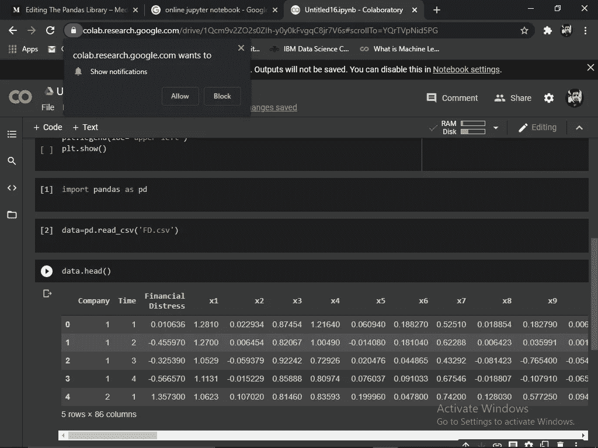
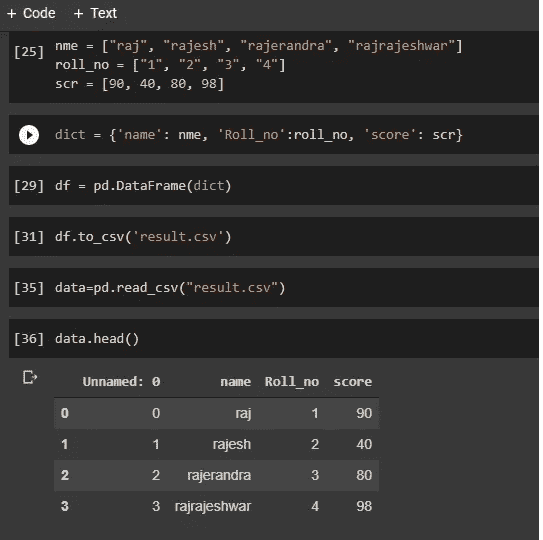
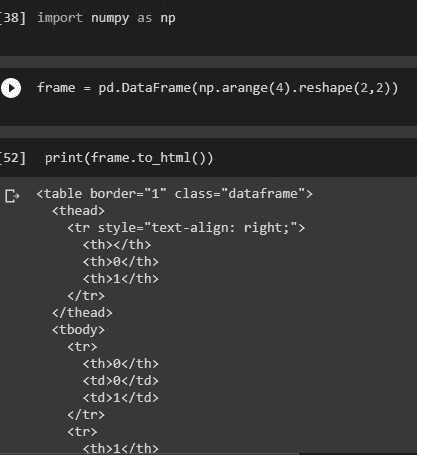
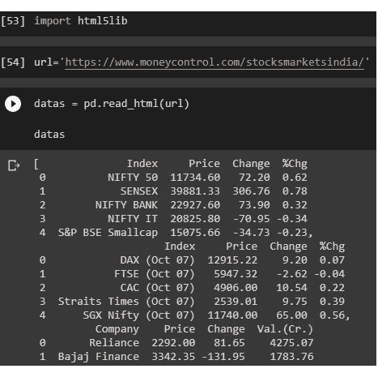
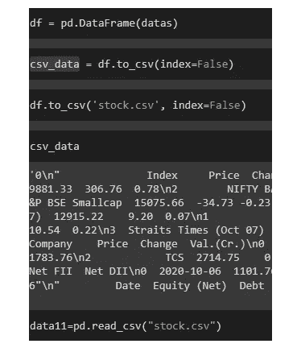
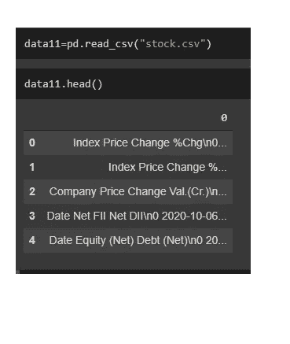

# 用于数据分析和机器学习的深度熊猫库(第 1 部分)

> 原文：<https://medium.com/analytics-vidhya/the-pandas-library-in-depth-part-1-c85dde2931d5?source=collection_archive---------21----------------------->

在这篇文章中，我将解释如何使用 pandas 库访问数据和操作数据。

在上一篇文章中，您已经熟悉了 pandas 库以及它为数据分析提供的基本功能。pandas 是一个专门用于数据分析的库，因此您会认为它主要侧重于计算和数据处理。

没有熊猫图书馆的数据处理是不可能解决机器学习中的问题。我们知道熊猫图书馆被用来从不同的途径获取数据。在这里，我将解释我们如何通过所需的方式访问数据

# 从访问数据

1.  逗号分隔值(csv)
2.  超文本标记语言(Html)
3.  结构化查询语言(SQL)

# 1 .逗号分隔值(csv):-

在机器学习中，csv 文件用于访问数据和解决问题，并将数据存储在 CSV 文件中。数据以表格格式报告，通常使用逗号分隔值来存储表格格式数据。

因此，这种类型的文件是最常见的数据来源，实际上更容易转录和解释。

pandas 为这种类型的文件提供了一组特定的功能。

*   阅读 _csv
*   读取 _ 表格
*   to_csv



这里，我使用 read_csv()函数加载了数据，然后我们可以使用以下函数进行分析:

*   data.describe()
*   data.keys()
*   数据.特征()

以上所有功能都是检查数据状况的常用和基本功能。如果你想以 csv 格式保存数据，不如使用 to_csv()函数。

如何使用 to_csv()函数的简单例子



在这里，我创建了三个列表，然后创建了字典。

# 2.超文本标记语言(Html) :-

今天，互联网上的大部分数据都是通过 html 数据访问函数以各种方式访问的。

HTML 格式 pandas 提供了相应的 I/O API 函数对。

read_html()

to_html()

拥有这两个功能会非常有用。您将会欣赏在 HTML 表中直接转换复杂数据结构(如数据框)的能力，而不必在 HTML 中编写一个很长的列表，特别是如果您正在处理万维网的话。

相反的操作会非常有用，因为现在数据的主要来源只是网络世界。

事实上，互联网上的许多数据并不总是以“随时可用”的形式打包在一些 TXT 或 CSV 文件中。

然而，很多时候，数据是作为网页文本的一部分被报告的。因此，拥有一个阅读的功能会被证明是非常有用的。

这种活动非常普遍，目前被称为网络抓取。

这个过程正在成为数据分析的第一部分(数据挖掘和数据准备)中集成的一系列过程的基本部分。

# to_html():

## 您希望将 dataframe 转换为 html 格式，而不是使用 to_html

当你使用 to_html 时，它会自动将数据帧转换成 html，而不需要贴上类似于 的 html 标签。



to_html 使用

上面的图片是例子

# read_html():

在此功能中，当您从互联网访问数据时，请使用此功能加载数据。



这里上面的图片使用读取 html 数据加载，但这些数据存储在列表中，现在它将转换成 csv 文件。



这里，to_csv 用于以 csv 格式存储数据:



现在加载到 html 格式的数据存储在 csv 文件。这是 to_html，read_html 的基本用法

这里的 to_html 是指将数据帧中的数据存储在 html 中，这意味着使用 to_html 和 read_html 存储在 html 中的所有数据帧都用于将数据加载到数据帧中，以使用 read-html。当我们使用 read-html 函数时，数据被加载到列表中，这些列表在我们转换为数据帧后非常大。

而这些数据帧以 csv 格式存储，这里全部 pic 以上解释了这种方法。

# 3.结构化查询语言(SQL)

在商业中，有各种格式的存储数据，一些数据存储在数据库中，这些数据按照某种方式访问，有不同的方式访问数据库中的数据，但我在这里解释一些常用的功能，在许多应用程序中，数据很少来自文本文件，因为这肯定不是存储数据的最有效的方式。数据通常存储在基于 SQL 的关系数据库中，也存储在最近变得非常流行的许多替代 NoSQL 数据库中。要访问数据库数据，您需要安装 sqlalchemy 库

```
pip3 install sqlalchemy
```

在 CentOS 上

```
pip3 install sqlalchemy
```

在 ubuntu 上

```
pip3 install SQLAlchemy
```

使用此命令

sqlalchemy 库是一个 python 库，用于从数据库中访问数据

SQLAlchemy 最著名的是它的对象关系映射器(ORM)，一个提供**数据映射器模式**的可选组件，其中类可以以开放的、多种方式映射到数据库——允许对象模型和数据库模式从一开始就以干净的解耦方式开发。

sqlalchemy 库的示例

`db = sqla.create_engine(‘sqlite:///mydata.sqlite’)`

下一篇文章我将解释数据访问

1.  mongodb
2.  Microsoft Excel 文件
3.  可扩展标记语言

感谢阅读。

阅读我以前的帖子:-

[https://medium . com/@ ut shinde 999/machine-learning-basic-library-abstract-7440 a3 af 0 D8 c](/@utshinde999/machine-learning-basic-library-abstract-7440a3af0d8c)