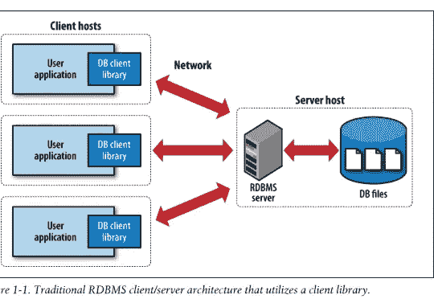
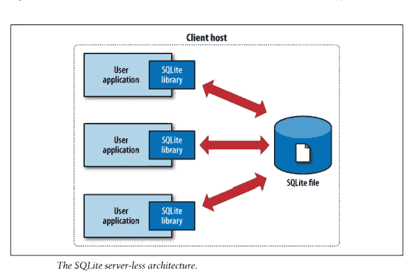
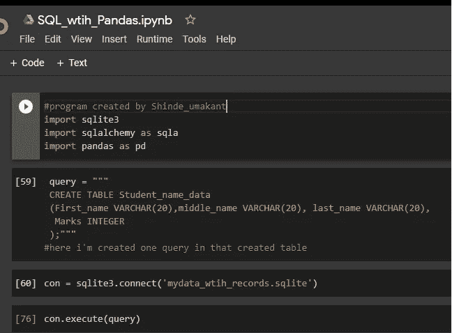
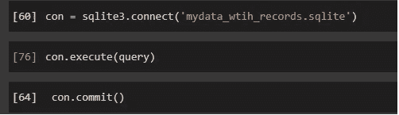
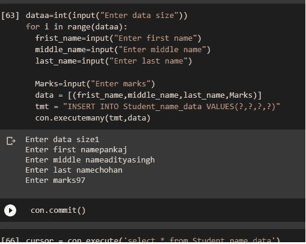
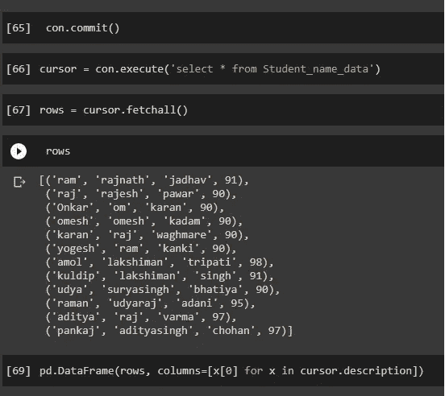
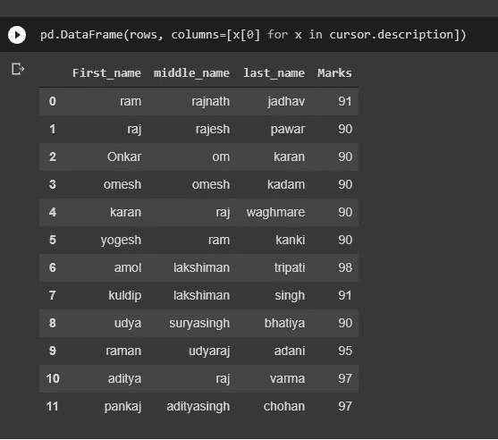
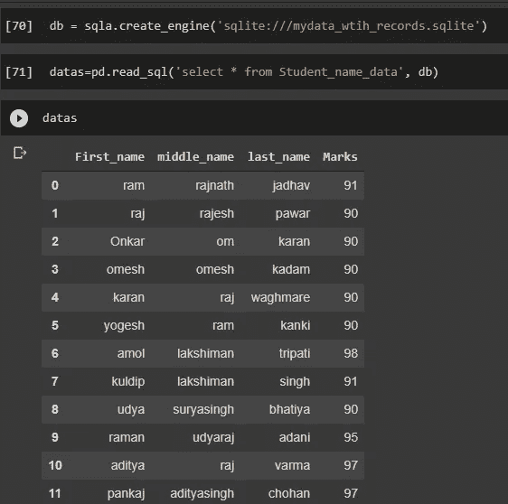
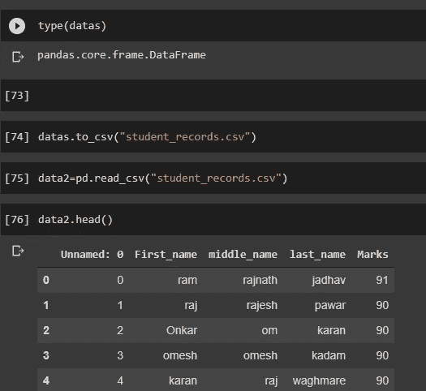
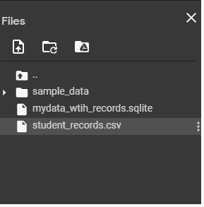

# 用于数据分析/机器学习的 pandas 库和 SQlite3

> 原文：<https://medium.com/analytics-vidhya/the-pandas-library-with-sqlite3-for-data-analysis-machine-learning-87f3c1934df8?source=collection_archive---------6----------------------->

这篇文章的目的是存储数据从数据库使用 sqlite 和访问数据从数据库和存储在 csv 文件。

在我以前的帖子中，我分享了与各种数据库的交互，如 CSV 文件、HTML 文件、sql 文件，现在**我正在解释与数据库的交互，SQL 是数据库的一部分，但其他数据库如 mongodb、NOSQL 和 web XML 文件、Microsoft Excel 文件。**

现在，当你想训练模型时，尝试理解机器学习中的数据，然后首先获得数据，没有数据我们什么也做不了，但数据随处可得，但需要数据是最重要的，这些数据从互联网访问，然后用什么方法访问数据，我们如何访问数据，这些方法或方式我在这里解释，

如何从数据库中访问数据，如何从 microsoft excel 文件、xml 文件中访问数据，以及如何将加载的数据存储在数据框中。

# 从 SQLite3 访问数据:-

sqlite 简介

sqlite 是一个公共领域软件包，它提供以适当格式存储在数据库中的用户定义的记录，这些记录或大或小，但所有记录都以的形式存储在**关系数据库管理系统(RDBMS)中，这些记录数据产生一些摘要。**

sqlite 中不需要服务器，因为它是无服务器的。

sqlite 不是客户端服务器数据库引擎，它嵌入在终端程序中。

从数据库中访问数据，您需要首先在此安装 sqlite3 库。使用以下命令安装 sqlite3。

pip 安装 sqlite

**无服务器:-**

当我们使用 sqlite 库时，sqlite 不需要任何服务器，我们可以直接与数据库交互

以传统方式访问数据是

这里我们可以看到，如果没有 sqlite3 库，我们如何能够访问数据，但这个过程非常深入，它花费的时间太多，因此程序的执行被延迟

这里，当我们使用 sqlite 文件，然后程序运行速度很快

用户程序可以直接与 sqlite 数据库交互，这些过程运行速度很快。

步伐

步骤 1:导入库

第二步:创建数据库和表格

步骤 3:插入数据

步骤 4:获取数据并存储在数据帧中

步骤 5:存储在 csv 文件中

我正在向你们展示一个例子，这个例子就是创建表格，这些表格被存储在一个数据库中，这些表格被访问成数据帧格式，这些数据帧格式被转换成 csv 文件，这个过程我正在与你们分享。

在我创建的数据库和表格中，我插入了数据，如下图所示

这里我创建了数据库和表格，数据库名称是 mydata_with_records.sqlite，并与该数据库连接，“con”是变量

创建的表表名为学生名数据，其中有 4 列存储学生名、中间名、姓氏和分数

con.execute(query)是在数据库中运行查询的函数，该数据库是 mydata_with_records 数据库。

在这里你可以看到。

在这里，我将数据插入到学生表中，但是当您第一次运行此代码时，您希望插入多少学生数据，如 4 个学生数据、5 个学生数据或 6 个学生数据，以执行此代码，并使用 for 循环运行第 n 次，执行数据库中存储的语句和数据，在表中您可以看到。

在这里，所有学生记录数据被选中并使用 con.execute()函数存储在游标变量中，这些列表存储在数据框中(当您将数据提取到任何变量中时，这些数据默认存储在列表中)

在这里你可以看到所有的数据以适当的格式存储到数据框中，并且这些数据被加载到学生表中。但是这些数据不在变量中，在照片下面你可以看到数据存储在数据变量(数据框)中

这里使用 read_sql()函数从 student_name_data 加载数据

以前的照片数据是使用 sql 命令获取的，这段代码使用 pandas read_sql 函数，数据是使用 pandas 函数获取的，这是不同的。

并且所有数据都存储在学生记录 csv 文件中，使用 pandas 中的 to_csv()函数和 data2 变量存储学生记录文件

您可以看到，我们成功地将数据存储在数据库中，并将这些数据加载到数据框中，这些数据框存储在 csv 文件中。加载 csv 文件后，我们可以分析数据。

这个程序的代码在这里 :-

#由 Shinde_umakant 创建的程序

导入 sqlite3

将 sqlalchemy 作为 sqla 导入

进口熊猫作为 pd

查询= " " "

创建表学生姓名数据

(名字 VARCHAR(20)，中间名 VARCHAR(20)，姓氏 VARCHAR(20)，

标记整数

);”””

#这里，我在创建的表中创建了一个查询

con = sqlite3 . connect(' my data _ wtih _ records . SQLite ')

con.execute(查询)

con.commit()

dataa=int(input("输入数据大小"))

对于范围内的 I(数据 a):

frist _ name = input("输入名字")

中间名=输入("输入中间名")

姓氏=输入("输入姓氏")

标记=输入(“输入标记”)

data = [(名字，中间名，姓氏，标记)]

TMT = " INSERT INTO Student _ name _ data 值(？,?,?,?)"

con.executemany(tmt，data)

con.commit()

cursor = con . execute(' select * from Student _ name _ data ')

rows = cursor.fetchall()

行

警察。DataFrame(rows，columns =[x[0]for x in cursor . description])

db = sqla . create _ engine(' SQLite:///my data _ wtih _ records . SQLite ')

datas = PD . read _ SQL(' select * from Student _ name _ data '，db)

数据

类型(数据)

datas . to _ CSV(" student _ records . CSV ")

data 2 = PD . read _ CSV(" student _ records . CSV ")

data2.head()

这个程序是一个示例，我们可以从 html 中访问数据，html 数据可以存储在数据库中，只需更改插入数据的时间代码，在存储数据后，我们可以访问和下一个过程，我在这里分享。

下一篇博客我将分享我们如何从 xml、**、**、**微软 Excel 文件中获取数据。**文件。

如果你没有读过我以前的文章，那就看看吧，我在这里分享链接

[https://medium . com/analytics-vid hya/the-pandas-library-in-depth-part-1-c 85 DDE 2931d 5](/analytics-vidhya/the-pandas-library-in-depth-part-1-c85dde2931d5)