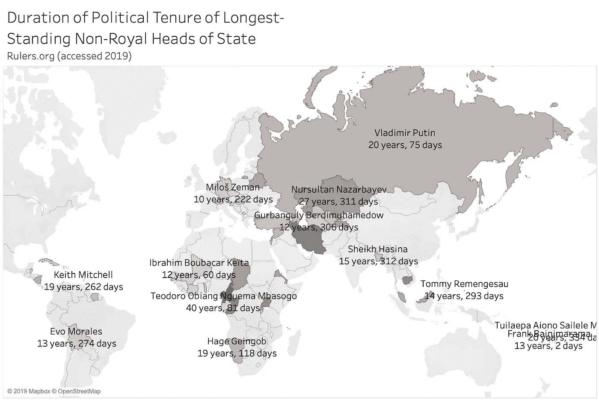
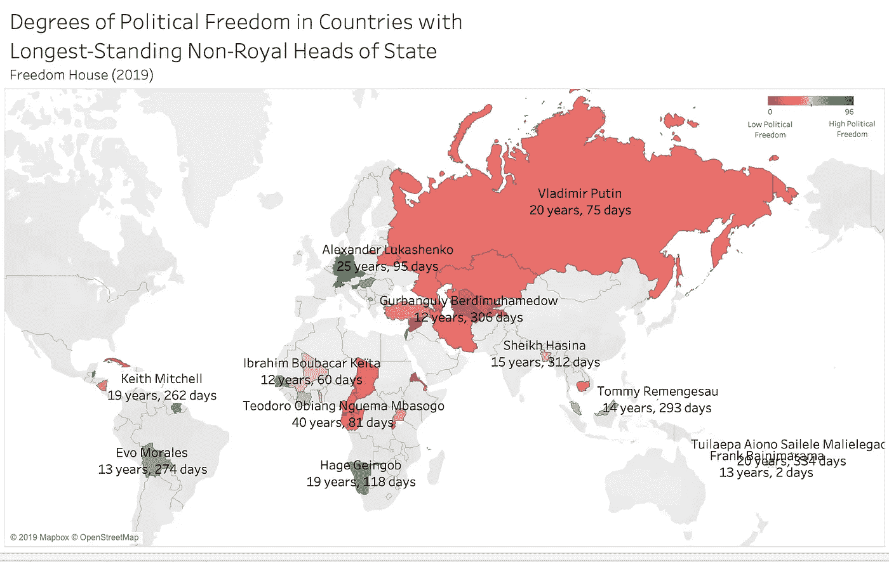
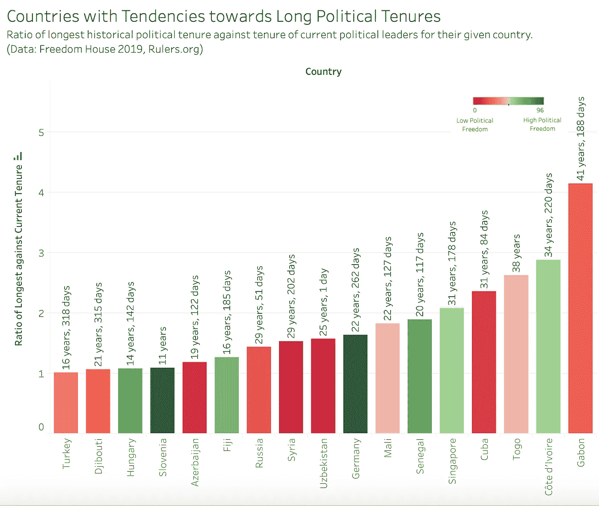

# 量化政治据点:权力的数据可视化。

> 原文：<https://medium.com/analytics-vidhya/the-pap-has-remained-in-power-in-singapore-ever-since-it-came-into-power-in-1959-fa325023932?source=collection_archive---------21----------------------->

自 1959 年执政以来，人民行动党一直在新加坡执政。因此，我们经常在网上看到网民批评人民行动党在全国的“堡垒”的负面言论。事实上，新加坡甚至成为执政党在执政时间最长的政党中排名第三的国家。这个(也许有争议，或者更确切地说，只是有趣的)由不止一个而是几个媒体平台做出的声明，促使我们冒险探索更多关于世界各地执政党任期的长度。

从那以后，我们的思考过程就一直在进行:

“让我们先来看看这些现任领导人执政了多长时间。”

“哦。我们可以看看每个国家的领导人任期最长是多久？”

“你认为地理位置和这个国家领导人任期最长有关系吗？”

“OMG 让我们做一个地图作为数据可视化。我们将看看我们能从那里走向何方……”

所以我们诞生了地图。不是字面意思。但是我们的团队，尽管完全是数据可视化的新手，还是在 Tableau 上创建了一些我们引以为豪的地图。

我们是这样做的:

第一步:我们从[rulers.org](https://slack-redir.net/link?url=http%3A%2F%2Frulers.org)获取数据，并用它来创建我们的第一张数据可视化地图。这张地图描绘了每个国家现任领导人的任期。然而，我们获得的数据只包含现任领导人任期超过 10 年的州。(确切的理由我们不确定，但我们假设 10 年是领导者任期的一个重要基准。

这张地图激起了我们的好奇心，我们想知道是什么因素导致了我们地图上的观察结果。某些国家的政治领袖维持统治如此之久，有什么原因吗？我们提出了很多假设，最终确定了我们最想研究的一个——一个国家的政治自由度越高，其领导人的任期就越长。

这就把我们带到了下一步。

第二步:在这条线索的基础上，我们从 freedomhouse.org 下载了数据，这是一个独立的监督组织，发布世界各地自由和民主水平的数据。利用这些数据，我们制作了另一张地图，它代表了每个国家在政治自由程度以及领导人任期长短方面的情况。

我们的假设是，政治自由度较低的国家会有政治领导人在更长的时间里掌权，但我们的地图显示了一些例外情况:某些国家，如白俄罗斯(亚历山大·卢卡申科，25 年 95 天)和纳米比亚(哈格·根哥布，19 年 118 天)，有很高的政治自由度，但他们的政治领导人仍然在极长的时间里掌权。然而，更仔细地观察这些国家，白俄罗斯是一个前苏联国家，苏联协会可以解释卢卡申科统治的时间长度。

在这一点上，我们让我们的教授检查了我们的工作，根据反馈，我们决定包括当前统治者的长度与该国有史以来最长统治者的长度之比。这一比率表明，现任领导人的任期相对于同一个国家以前长期执政的领导人来说有多重要。较高的比值表明更倾向于较长的领导任期，在位时间最长的统治者的任期远远超过现任领导人，而现任领导人达到了执政 10 年的最低门槛。

从这张图表中，我们发现中东和撒哈拉以南非洲国家对长期政治领导人的倾向最大，前 10 个国家表明比率最高的是非洲国家，新加坡和古巴除外。新加坡和古巴都有来自历史悠久的政治王朝的现任领导人，李显龙和劳尔·卡斯特罗，这也解释了他们出现在名单上的原因。

我们在此总结(激动地！)有几个潜在的领域需要进一步分析，这两个领域最能引起我们的注意:

*   消除自由之家得分的歧义，以隔离哪些因素，如新闻自由；
*   随着民主的衰落潜在的政治意义。

感谢您阅读我们的旅程，请在评论中告诉我们任何意见、建议，甚至您自己的数据调查经验！