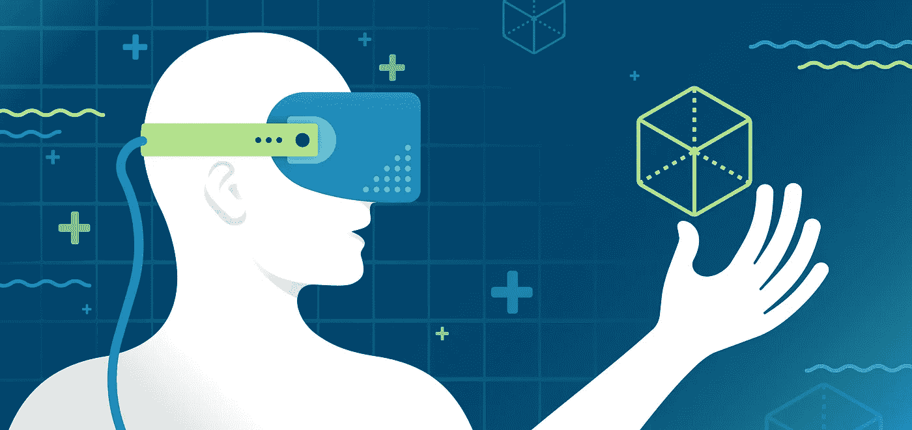
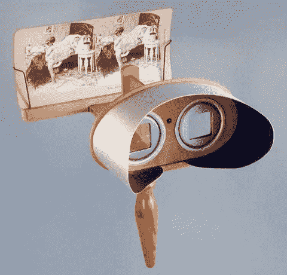
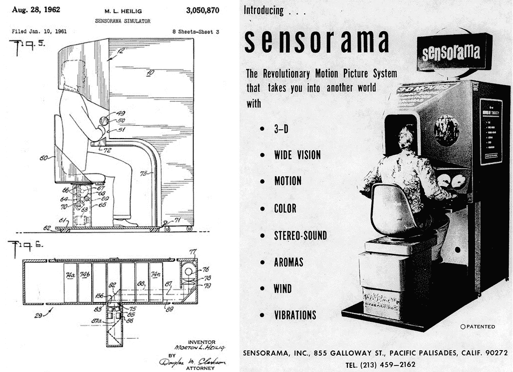
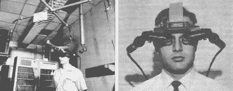
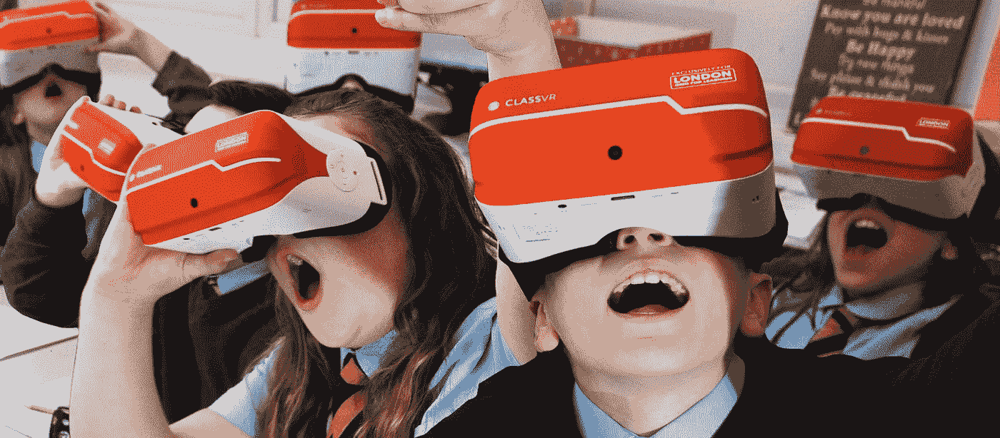
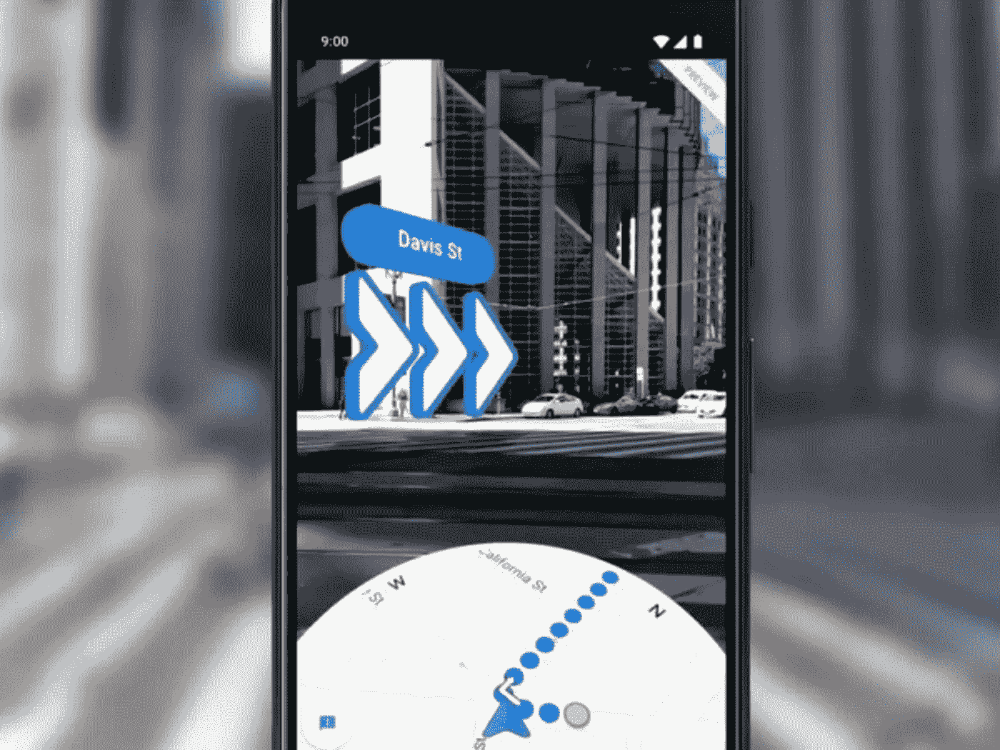
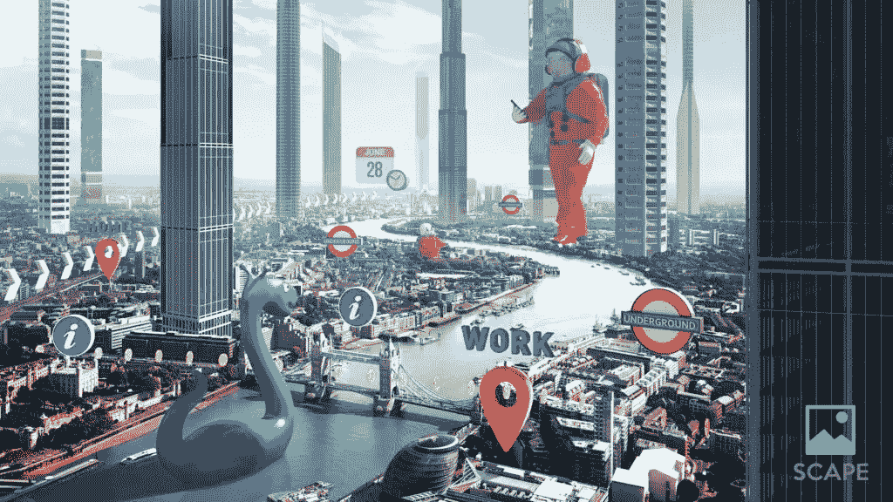
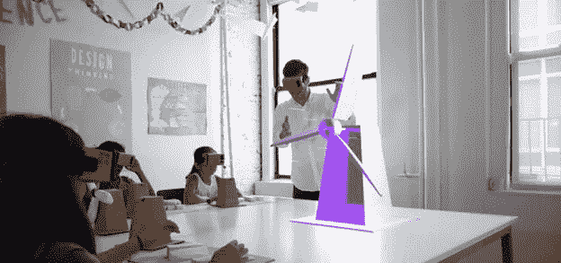
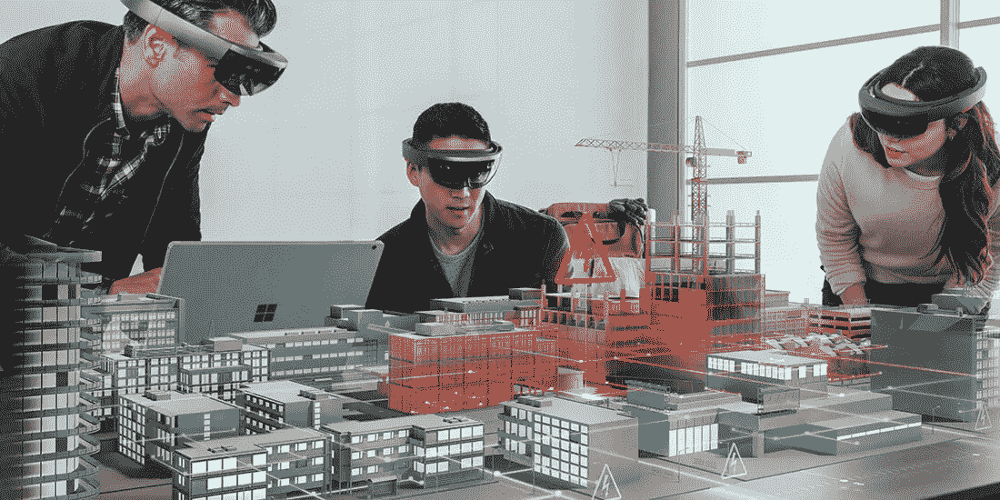
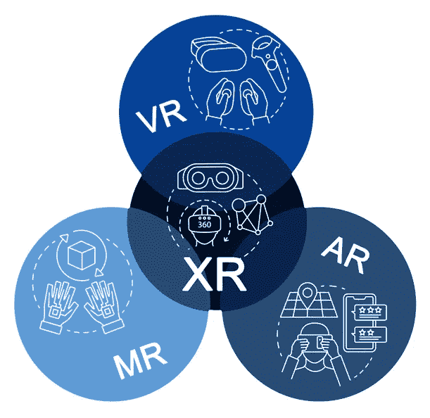

# 沉浸式技术的过去、现在和未来。

> 原文：<https://medium.com/analytics-vidhya/the-past-present-and-future-of-immersive-technologies-88b82a5db28a?source=collection_archive---------13----------------------->

来源:elitevrtraining.com

许多人可能不熟悉“沉浸式技术”这个词，但人们可能听说过虚拟现实(VR)、增强现实(ar)和混合现实(MR)等术语。嗯，有三个非常流行的术语就是沉浸式技术的类型。

所以，在这篇博客中我们将谈论 AR，VR 和 MR 的现在和未来。

在继续之前，最好给这三个术语下一个正确的定义:

**1。虚拟现实:**

虚拟现实(VR)使用 VR 耳机和其他外设，使用户能够沉浸在虚拟环境中，这与用户在物理世界中的位置完全不同。

**2。增强现实(AR):**

增强现实(AR)是一种将计算机生成的图像/图形放置/投影在现实世界对象或现实世界空间之上的技术，以便虚拟元素在某种程度上类似于现实世界实体。

**3。混合现实(MR):**

混合现实(MR)可以称为“两全其美”，因为它将现实世界与虚拟现实结合在一起。AR 和 MR 之间有一条非常细微但非常明显的区别，那就是用户可以在混合现实中通过移动他们的身体部位(如手或腿)来与增强对象进行交互。

人们听说过谷歌的一款产品，名为“谷歌眼镜”。谷歌眼镜(谷歌的 AR 耳机)于 2013 年推出，在市场上失败得很惨。嗯，除了它的设计、价格和隐私问题，另一个导致它失败的原因是这个小玩意远远领先于它的时代。但如果你认为 2013 年是这项技术出现的第一年，那么朋友，你错了。

# 过去:

虚拟现实的历史可以追溯到 1838 年，当时查尔斯·惠斯通发现了一种精神错觉。他证明了如果将两张二维图像放在每只眼睛上，大脑会将其作为三维图像进行处理。通过立体镜观察这些图像，给使用者一种深度感。这是人类第一次体验虚拟现实。

来源:pinterest.cl

虚拟现实的发展一直持续到 1957 年，莫顿·海利格发明了第一个虚拟现实设备 Sensorama。用户必须坐在椅子上，将头伸入橱柜中，在那里他可以看到 3D 视频，体验立体声，还有一个风扇，它会根据电影中的场景吹送特定的香水，椅子会振动，以模拟干扰。

来源:[radiantvisionsystems.com](https://www.radiantvisionsystems.com/)

说到人工智能的历史，伊凡·苏泽兰在 1968 年发明了达摩克利斯之剑(第一个人工智能工具)。这个小工具使用计算机图形向用户显示真实世界空间中简单的线框图形。但这是一个非常庞大的设备，而且非常重，以至于它会被悬挂在天花板上来支撑它的重量。

来源:researchgate.net

到这个时候，我们已经有足够的能力去看 3D 电影，体验立体声音频和其他奇妙的东西，但我们缺乏一个重要的属性，即与我们使用这些设备或计算机化的对象看到的对象的交互。

1969 年，米隆·克鲁格提出了三个项目，叫做“辉光流”、“元空间”和“物理空间”,这三个项目导致了视频游戏的发展。视频播放可以分析和处理用户在现实世界中的交互，并将其转换为通过这些耳机或虚拟对象与对象的交互。

然后在 1989 年，VPL Research 的首席执行官杰伦·拉尼尔创造了虚拟现实这个词。该公司创造了许多像数据手套这样的 VR 产品。因此，VPL 或视觉编程实验室是第一家销售这些产品的公司。

# 现在:

***1。虚拟现实* :**

我们使用一种叫做‘VR 头戴式设备’体验过或者可以体验 VR。嗯，虚拟现实耳机是一种体积庞大的设备，适合放在我们的眼睛上，在许多情况下，我们必须将手机放在里面，播放基本上是 360 度视频或具有虚拟现实功能的视频。

但这只是一个例子，像联想、苹果和索尼这样的科技巨头正在这个领域投入大量资金。一些伟大的 VR 产品是 Oculus Quest、联想 Mirage 和流行的 PlayStation VR。除了只是眼镜，还有其他产品，像 VR 跑步机，运动控制器和 VR 手套。使用这些小工具，用户可以很好地体验虚拟环境，以至于他们几乎忘记自己在现实世界中的位置。嗯，我们已经看到虚拟现实主要用于游戏领域和电影领域，不是吗？但这些只是 VR 的几个应用。虚拟现实还应用于许多其他领域，如旅游和教育。

*   **旅游:**

在旅游业中，用户可以戴上耳机，在有限的时间内体验他/她想要去的地方，从而可以了解他们要去的地方。如果这对你来说听起来有点奇怪，那就想想这个:当你计划你的假期时，你在互联网上看到一些这个地方的照片。但现在，你的导游/规划师可以给你一个虚拟现实耳机，在 3d，360 度的模拟中体验这个地方，这样你就可以对你要去的地方有更好的了解。

资料来源:omnivirt.com

*   **学历:**

通过使用一个 VR 头戴设备，可以模拟整个教室。还有一种叫做“虚拟课堂”的东西，它使用虚拟现实耳机来增加学生的知识记忆。

资料来源:eduscape.com

**2。** ***增强现实:***

让我们回到 Pokémon Go 极其流行的 2016 年。如果你玩过这个游戏，你就会体验到 AR。该游戏用于访问我们的相机，以获得真实世界物体的本质，并使用复杂的算法在街道和桌面等表面上模拟三维神奇宝贝。

如果你没有玩过这个游戏，你仍然可以通过谷歌搜索来体验虚拟现实。只要用你的智能手机在谷歌上搜索“拉布拉多”就可以了。你会看到一个结果“近距离接触真人大小的拉布拉多寻回犬”,只需按下下方的“3D 视图按钮”。你的相机将会打开，你会看到一只拉布拉多寻回犬就在你身边。

此外，我们不能忘记 Snapchat，它向我们介绍了过滤器。是的，它们也是 AR 滤镜，因为它们只是在你的脸上模拟了一个滤镜。

像 VR 一样，AR 也用于众多行业，如汽车和零售。

*   **汽车:**

标志牌和信号灯可以被模拟并放置在道路上，使用 AR 耳机的人可以看到它们并采取相应的行动。此外，在驾驶测试中，可以模拟障碍和标志，司机可以看到它们并采取相应的行动。

*   **零售:**

零售店或商场可以实现 AR 设施。假设你正在使用一个 AR 眼镜，并且你进入了一个杂货店或者一个购物中心的食品区。当你看一个产品时，营养价值会和其他信息一起被模拟，比如价格和成分表。这样，你可以一目了然地得到蜜腺的信息，从而节省你很多时间。

甚至像谷歌和脸书这样的世界领先的公司也在使用 AR 来尽可能地给你最好的体验。让我们看一些例子:

*   **谷歌地图实时视图:**

谷歌地图使用 AR 将方向投影到现实世界物体上或现实世界空间中，以便人们在导航时使用。

资料来源:theverge.com

*   **脸书增强现实地图:**

脸书收购了一家 AR 初创公司，正在创建一张 3D 世界地图。脸书也将很快推出自己的 AR 眼镜。

资料来源:vrscout.com

**3。*混合现实:***

MR 是一项非常强大的技术，用于教育部门、游戏部门、基础设施部门等。

你们很多人可能听说过微软的 HoloLens 产品。2020 年，我们有了升级，HoloLens 2。这是一个非常强大的 MR 耳机，使用它你可以模拟并与现实世界中不在你身边的事物互动。

查看 HoloLens 2 演示。 ]

HoloLens 2 是一款非常受欢迎的小工具，并开放购买，但 3500 美元的定价并不是所有人都能负担得起的。

让我们看看磁共振在以下领域的一些应用:

*   **教育:**

教师在教学时，使用 MR，她可以模拟和控制学生理解主题所必需的图形。实施 MR 将有助于学生更好地理解，而不仅仅是看一个图形。

资料来源:jabozuproduction.weebly.com

*   **基础设施:**

在建筑领域，经销商可以展示建筑在某个地方的外观，还可以使用手势控制建筑的参数。这将减少实际到达该位置所需的努力和时间。

资料来源:redshift.autodesk.com

# 未来:

沉浸式技术的未来是光明的..现在，我们需要随身携带一台计算设备来使用这些耳机。耳机看起来也有点奇怪。我的意思是，你可以在人群中轻松指出使用 MR 或 AR 或 VR 耳机的人。但是现在 5G 技术的出现，很大程度上降低了延迟，提高了速度。所以现在我们在云上进行处理是可行的。所以现在，我们可以有体积更小的设备 MR 耳机，它将在更大程度上类似于普通眼镜。现在，我们有一个名为 Nreal 的品牌的眼镜，它制造看起来像普通眼镜的智能眼镜。

所以，这个博客是关于沉浸式技术的。我们已经经历了 VR、AR 和 MR，但还有一项技术在博客中没有提到。这就是 XR，是扩展现实的缩写。那么什么是扩展现实呢？

**4。*扩展现实(XR)* :**

我们有三种不同的技术，VR，AR 和 MR，但是如果我们把这三种技术结合起来呢？没错，XR 就是这三种技术的结合。当然，XR 是未来。此外，我们有不同的设备用于 VR、AR 和 MR，将只有一个设备:一个设备来管理它们。

来源:[envision-is.com](https://envision-is.com/)

2020 年 5 月，高通宣布，他们将与 15 家全球运营商合作，提供 XR 观众。这些运营商正计划在 2021 年为他们的消费者提供 XR 和 5G。XR viewers 是一种带有高通芯片的眼镜，通过 USB type-C 电缆与用户的智能手机相连，智能手机带有高通骁龙 855 或 865 芯片(可能是高通所有支持 5G 的芯片)。在用户的智能手机中使用这些芯片，XR 观众将使用 5G 功能。XR 查看器的一些用途包括:

*   **移动应用:**

用户使用的应用也可以变成完全基于 MR 的应用。所以现在你实际上可以使用一种你在科幻电影中看到的类似技术。

*   **全息远程呈现:**

同样，有了如此强大的技术和 5G，现在面对面的会议可以发生革命性的变化。成员们可以在家舒适地参加会议，他们的全息投影将在工作场所被看到。

在未来 1-4 年内，XR 观众预计将成为无线观众，在未来 5-10 年内，我们可以预计 5G 将集成在眼镜本身中。

至此，我们结束了这篇博客。希望你喜欢阅读并获得知识。如果你喜欢这个博客，请留下回复和掌声。