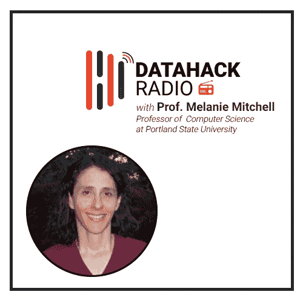

# 梅勒妮·米切尔教授的人工智能之路

> 原文：<https://medium.com/analytics-vidhya/the-path-to-artificial-general-intelligence-with-professor-melanie-mitchell-b85bf4767d4e?source=collection_archive---------0----------------------->

# 介绍

> 人们低估了智力的复杂程度

我们离人工通用智能(AGI)还有多远？似乎每一次突破都让我们离现实更近了一步。然而，这感觉像是在一百万英里之外的未来。

尽管计算硬件有增无减，为什么我们离 AGI 仍然如此遥远？是什么阻碍了我们对通用于多个领域的机器进行编程？

我们邀请了 Melanie Mitchell 教授在 DataHack 广播播客第 19 集回答这些相关而紧迫的问题。她是波特兰州立大学的计算机科学教授，也是多本人工智能书籍的作者。

梅勒妮教授带来了三十多年的教学和学术经验，这个数据黑客电台插曲。倾听她对以下话题的想法令人愉快:

*   自 20 世纪 80 年代以来，人工智能发生了怎样的变化
*   (深度)神经网络的兴起
*   为什么我们离人工智能还很远
*   她的博士论文是关于她开发的一个有趣的程序
*   她即将出版的关于人工智能的书，等等。

我在这里总结了这一集讨论的重点。请务必收听完整的播客！

*在以下任何一个平台上收听并订阅这期节目，以及之前所有的 DataHack 电台播客片段:*

*   [**音云**](https://soundcloud.com/datahack-radio)
*   [**分析 Vidhya**](https://www.analyticsvidhya.com/blog/category/podcast/)
*   [**iTunes**](https://itunes.apple.com/in/podcast/datahack-radio/id1397786677?mt=2)
*   [**谷歌播客**](https://www.google.com/podcasts?feed=aHR0cDovL2ZlZWRzLnNvdW5kY2xvdWQuY29tL3VzZXJzL3NvdW5kY2xvdWQ6dXNlcnM6NDU5MzM1NzYwL3NvdW5kcy5yc3M%3D)

# 梅勒妮·米切尔教授的背景

梅勒妮·米切尔教授的一切是从哪里开始的？她是如何对计算机科学领域着迷的？

正如她在本期节目中告诉我们的那样，她的兴趣是在她大学时代通过道格拉斯·霍夫施塔特的一本名为《哥德尔、埃舍尔、巴赫:永恒的金色辫子》的书点燃的。它本质上是一本关于人工智能的书，激励了 Melanie 教授从事这一领域的研究。

她联系了道格拉斯先生(作者)，就人工智能的某些话题向他请教。这些对话一直延续到梅勒妮教授的计算机科学博士学位，道格拉斯·霍夫斯塔德是她的论文指导老师。这是一个很好的例子，说明了坚持和对激情的信念是如何激励你实现梦想的。

> 在上世纪 80 年代中期和 90 年代初，人工智能是一个相当知名的研究领域。神经网络刚刚开始流行。

我们大多数人现在认为它们是由层和神经元组成的密集网络，但它们花了很长时间才获得“深层”的绰号。当时，这些神经网络还相当肤浅。根本没有足够的计算能力来生成任何深度神经网络！

# 计算机科学博士与山寨机的发展

Melanie 教授拥有密歇根大学的计算机科学博士学位。她的论文围绕着一个可以进行类比的程序的开发，这个程序被称为 Copycat。这被认为是最早的类比方法之一。

你可以阅读更多关于 Copycat 及其功能[在这里](https://en.wikipedia.org/wiki/Copycat_(software))。她的研究是试图让机器推广到新的领域。是的，这意味着人工通用智能——这是一个我们仍在努力在 2019 年取得进展的研究领域。

# 对深度学习兴起的思考

我们在人工智能领域看到的大多数突破都要归功于计算的改进和大数据集的可用性，而不是任何令人兴奋的见解。例如，深度卷积神经网络(CNN)是当今的一种流行趋势，它是在 20 世纪 80 年代发明的！

这些深度 CNN 被用于解决像[手写数字识别](https://datahack.analyticsvidhya.com/contest/practice-problem-identify-the-digits/)这样的问题，但是程度非常有限。计算资源就是不存在。现在吗？我们大多数拥有一台还算不错的机器的人都可以建立一个准确的数字识别模型！

# 人工智能和深度学习的未来趋势

> *“世界上有很多数据。不过，它只是没有被贴上标签。”*

最近一两年最大的收获是什么？无监督学习的持续增长。机器能够通过查看数据来了解模型中的重要特征。与监督学习不同，不需要标记训练数据。这意味着模型训练成本的显著降低。

你可以看到为什么这是一个大多数研究人员会追求的领域！这种思路有可能成为我们在未来几十年实现 AGI 的方法。

# 机器学习算法离人工通用智能还很远(AGI)

> “人们低估了智力的复杂程度。”

梅勒妮教授最近在《纽约时报》上写了一篇发人深省的文章，题为“[人工智能突破意义的障碍](https://www.nytimes.com/2018/11/05/opinion/artificial-intelligence-machine-learning.html)”。它谈到了机器学习算法如何(还)不像人类那样理解事物。这些算法仍然无法理解上下文——这是我们自己思维和行为的一个重要方面。

以自动驾驶汽车为例。几年来，它们一直处于成为主流的边缘——但我们仍然不确定它们何时会真正准备好。

> *“如果路上有一个纸袋，我们就不用担心会被它压死。另一方面，自动驾驶汽车很难判断哪些障碍应该避开，哪些不需要避开。”*

# 即将出版的关于“人工智能:思考人类指南”的书

梅勒妮教授[多年来已经写了多本书](http://web.cecs.pdx.edu/~mm/books.html)，今年晚些时候将出版一本名为《人工智能:思考人类指南》的书。这本书面向各种背景的人。但是它会比大多数一般的人工智能书籍更深入一点。

> 这本书的主题是人工智能实际上需要多少理解它正在处理的数据才能变得可靠。

书中涵盖的主题包括人工智能算法如何工作，它们的应用是什么，它们的局限性等。

# 结束注释

我们一直在阅读和接触关于人工智能的行业观点。听到学术界人士谈论他们对人工智能的想法以及人工智能在不久的将来的发展方向，令人耳目一新。当它来自像 Melanie Mitchell 教授这样有经验和精通的人时，那是特别丰富的。

AGI 是一个备受争议的话题，对于它何时到来还没有真正的共识。感觉上我们离这个领域的每一个突破都越来越近了，但离最终目标还有一百万英里。你对 AGI 有什么看法？你觉得我们现在比 10 年前更接近它了吗？

*原载于 2019 年 3 月 7 日*[*https://www.analyticsvidhya.com*](https://www.analyticsvidhya.com/blog/2019/03/datahack-radio-19-the-path-to-artificial-general-intelligence-with-professor-melanie-mitchell/)*。*