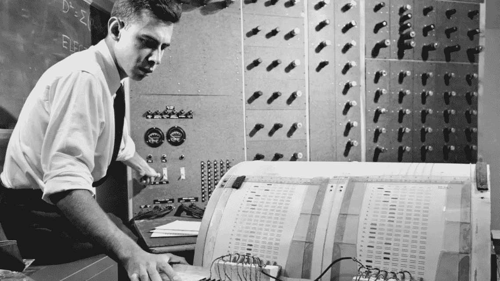
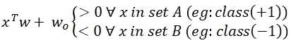
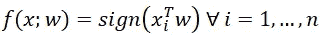
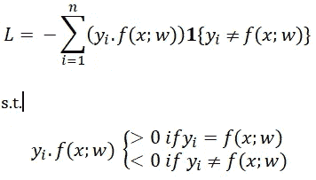
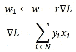

# 二元分类的感知器算法

> 原文：<https://medium.com/analytics-vidhya/the-perceptron-algorithm-for-binary-classification-ab65aaf237d7?source=collection_archive---------8----------------------->

# 介绍

**感知器算法**是最早的监督机器学习技术之一，用于将数据点分为两组。该算法由 Frank Rosenblatt 于 1958 年发明，用于识别不同类型的形状(例如，三角形、正方形、圆形等)。)当某个形状被带到感知机面前时。

弗兰克·罗森布拉特

该算法工作的一个主要假设是数据应该是**线性可分的**，即应该存在一个线性分类器，以零训练误差分离数据。数学上，对于两个集合 A & B，可线性分离的数据可以定义为，

线性可分数据的定义

其中(w，wo)是定义线性分类器的超平面的一些参数。

# 算法是如何工作的

我们将具有零训练误差的线性分类器定义为，

线性分类器

任何算法都是通过*最大化*或*最小化*一个在特定约束下成立的目标函数来工作的。这里，感知器算法试图最小化目标函数，以便为数据集预测正确的标签。

目标函数(L)和约束定义如下，

算法的目标函数

如果预测值‘f(x；w)’和已知标记‘yi’具有相同的符号(例如+1 或-1 ),则点积 yi . f(x；w)将> 0。这意味着上面定义的线性分类器 f(x；w)对 xi 数据点的预测是正确的。

该算法寻求最小化目标函数，该目标函数是定义的线性分类器没有正确预测输出的所有时间的总和。因此，目标函数的范围总是从 0 到某个正值。由于目标函数中固有的负号，它取正值。

**因此，当目标函数值变为 0** 时，该算法终止，这意味着没有点被错误分类。

***渐变体面:最小化目标函数***

与其他算法不同，不可能对这个目标函数求导来求最小值。因此，我们使用**梯度下降法**来最小化 l。

梯度下降的工作逻辑是，即使我们不能解析地求解目标函数(L)的导数，导数仍然给我们关于 L 在 w 中增加的方向的信息。

感知器的梯度下降算法

因此，对于足够小的正“r”值，我们有 L(w1) < L(w)。

# 感知器算法的缺点

1.  数据必须是线性可分的主要假设是这种算法的主要缺点之一。如果数据不是线性可分的，那么算法将永远不会收敛，超平面将继续无限移动。
2.  此外，该算法不考虑超平面的质量，并且收敛到它找到的第一个超平面。因此，失去了定义更好的超平面的机会，该超平面将利用新的测试数据给出更好的精度。

这两个缺点都可以使用更好的分类算法来解决，例如 SVM 等。

# 结论

因此，感知器算法是对数据进行分组分类的首批成果之一，这导致了能够克服感知器缺点的更好的分类器的开发。

谢谢你把这个帖子看完！

注意安全！