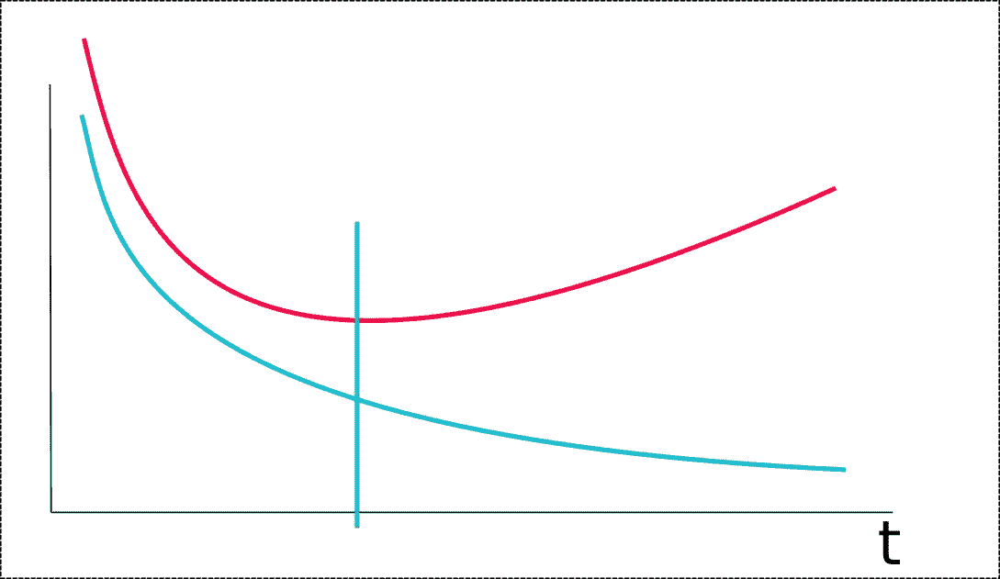
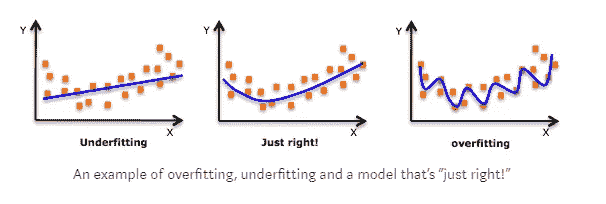
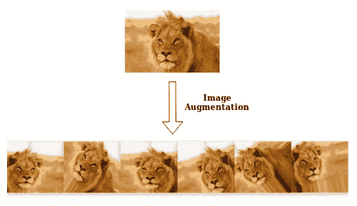
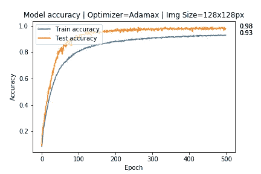
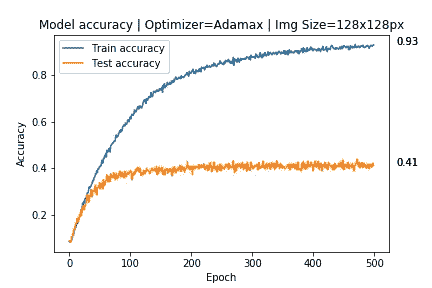
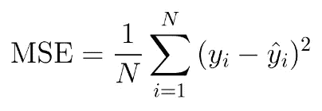
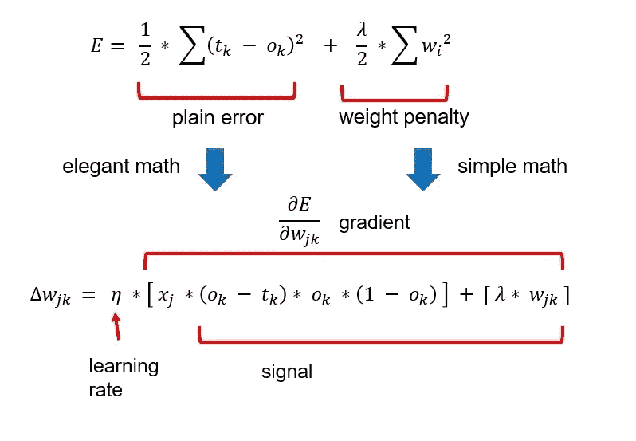
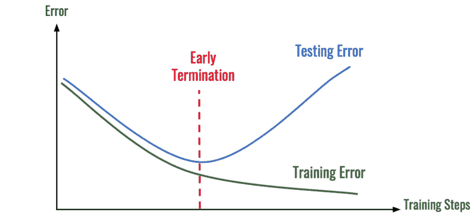

# 非常适合 DNN。

> 原文：<https://medium.com/analytics-vidhya/the-perfect-fit-for-a-dnn-596954c9ea39?source=collection_archive---------4----------------------->

深度学习的主要目标是拥有一个在训练数据和测试数据/新数据上都表现最佳的网络。然而，在**过拟合&欠拟合**的情况下，这个主要目的没有实现。过拟合&欠拟合是在训练深度神经网络时经常遇到的情况。

深度神经网络旨在学习和概括在训练数据中发现的模式，以便它可以在测试数据或新数据上类似地执行。尽管这是人们期望从深度神经网络中得到的理想条件或场景，但这说起来容易做起来难，尤其是对于像卷积神经网络、递归神经网络等由数百万或数十亿个易受过拟合影响的可调参数组成的网络。

# 什么是过度拟合&为什么会发生？

当网络试图从训练数据中学习太多或太多的细节以及来自训练数据的噪声，导致在不可见或测试数据集上的不良性能时。当这种情况发生时，网络不能概括在训练数据中发现的特征/模式。

当训练数据的误差减小到非常小的值，但是新数据或测试数据的误差增大到很大的值时，可以发现训练期间的过拟合。误差与迭代图显示了深度神经网络如何过度适应训练数据。蓝色曲线表示训练数据的误差，红色曲线表示测试数据的误差。绿线相交的点是网络开始过度拟合的实例。如您所见，测试数据的误差急剧增加，而训练数据的误差则减少。

上图说明了模型/网络(只是一个简单的线性回归模型)如何试图适应训练集中的每个数据点。一组新的数据点将导致模型/网络表现不佳，因为它非常接近所有作为噪声和异常值的训练点。训练点上的误差最小或者非常小，但是新数据点上的误差将会很高。

网络过度拟合的一个主要原因是训练数据集的大小很小。当网络试图从一个小数据集学习时，它将倾向于对数据集有更大的控制&将确保精确地满足所有的数据点。它可以被认为是网络试图记住每一个数据点，却没有捕捉到数据的总体趋势。

## 欠拟合

**欠拟合**发生当网络既不能对训练数据建模也不能对测试数据建模导致整体性能不佳时。通过查看左侧的图表，模型没有覆盖所有数据点&在两个训练&测试数据上都有很高的误差。

欠拟合的原因可能是因为网络容量有限、作为网络输入提供的特征数量有限、数据有噪声等。由于欠拟合很容易检测，因此没有广泛讨论&补救措施是尝试不同的机器学习算法，为深度神经网络提供更多容量，从输入数据中去除噪声，增加训练时间等。

# 防止过度配合的措施

## 1.降低网络复杂性

像 CNN 这样的深度神经网络容易过度拟合，因为它包含数百万或数十亿个参数。具有这么多参数的模型可能会过度拟合训练数据，因为它有足够的能力这样做。

通过移除某些层或减少神经元(CNN 中的滤波器)的数量，网络变得不容易过度拟合，因为导致过度拟合的神经元被移除或去激活。网络的参数数量也减少了，因此它不能记住所有的数据点&将被迫进行归纳。

对于在网络能够过度适应之前要去除多少层或者一层中必须有多少神经元，没有通用的规则。降低网络复杂性的常用方法是

1.  可以应用网格搜索来找出神经元和/或层的数量，以减少或消除过拟合。
2.  可以通过删除节点或连接来修剪(修整)过度拟合模型，直到它在测试数据上达到合适的性能。

## 2.数据扩充

避免过度拟合的最佳策略之一是增加训练数据集的大小。如所讨论的，当训练数据的大小很小时，网络倾向于对训练数据有更大的控制。但是在现实世界的场景中，收集大量数据是一项乏味且耗时的任务，因此收集新数据并不是一个可行的选择。

数据扩充提供了在没有任何外部添加的情况下增加现有训练数据大小的技术。如果我们的训练数据由图像组成，图像增强技术，如旋转、水平和垂直翻转、平移、增加或减少亮度或添加噪声、剪切等，可以应用于现有的训练图像，以增加实例的数量。

通过应用上述数据扩充策略，网络在不同视角的同一类对象的多个实例上被训练。狮子照片的增强结果将具有以旋转方式观看的狮子的实例、从上往下观看的狮子或剪切掉包围狮子鬃毛的图像部分。通过应用最后的增强(剪切),网络学习将雄狮有鬃毛的特征与其类别相关联。

数据扩充前后的性能。

数据扩充背后的概念是，通过增加训练数据集的大小，网络无法在所有输入样本(原始图像+扩充图像)上过度拟合&因此被迫一般化。总的训练损失增加了，因为网络没有对增强图像进行准确预测，从而增加了训练损失&优化器(优化算法)调整网络以捕捉训练数据中的广义趋势。

## 3.权重正则化

权重正则化是一种旨在通过惩罚网络中的大权重值来稳定过度拟合的网络的技术。过度拟合的网络通常会出现权重值较大的问题，因为输入的小变化会导致输出的大变化。例如，当网络获得新的或测试数据时，它会导致不正确的预测。

权重正则化惩罚了网络的大权重&迫使优化算法将较大的权重值减少到较小的权重，这导致了网络的稳定性&表现出良好的性能。在权值正则化中，网络结构保持不变，只是修改了权值。

它是如何工作的？

权重正则化通过对损失函数进行惩罚或添加约束来减少过拟合。除了最小化预测值和实际值之间的误差之外，当最小化损失函数时，正则化项是优化算法(如随机梯度下降)必须遵守的约束。

以上两个等式代表两种类型的权重正则化 **L1 & L2。**该等式有两部分，第一部分是实际目标与预测目标之间的误差(损失函数)。第二部分是权重罚项或正则项。

**无正则项**

如果没有正则项，网络的总损失就是损失函数的输出值。如前所述，当网络过拟合训练数据时，预测值和实际值之间的误差非常小。

> 如果训练误差很小，那么误差梯度也很小。那么权重的变化非常小，因为
> 新权重=旧权重 lr *(误差梯度)
> 由于更新的权重值接近旧的权重值，网络仍然保持在过拟合状态。

**带有正则化项**

权重更新方程。(新加坡元)

通过给损失函数增加一个**权重罚值**，网络的总损失/成本增加。优化器现在将被迫最小化网络的权重，因为这会增加整体损失。

通过增加误差/损失，误差梯度 wrt 权重增加，这又导致权重更新的更大变化。没有权重损失，梯度值仍然很小&因此权重的变化也很小。

随着误差梯度的增加，在权重更新规则中，大的权重值减少到较小的值。较大的权重导致对损失函数的较大惩罚，从而将网络推向较小且稳定的权重值。

**L1 正则化**将网络中权重的绝对值之和作为权重罚值相加。 **L2 正则化**将权重的平方值相加作为权重惩罚。

λ项是一个超参数，它定义了有多少网络的权重必须反映在损失函数上，或者仅仅是控制权重惩罚对损失函数的影响的项。

如果数据太复杂，L2 正则化是更好的选择，因为它可以模拟数据中的固有模式。如果数据简单，可以使用 L1 正则化。对于大多数计算机视觉，应用 L2 正则化，也称为权重衰减。

## 4.辍学者

Dropout 是一种防止深度神经网络过度拟合的正则化策略。虽然 L1 & L2 正则化通过修改损失函数来减少过拟合，但另一方面，退出会使某一层的一定数量的神经元在训练期间停止激活。

在每次迭代中，不同组的神经元被去激活&这导致不同组的结果。许多深度学习框架将辍学实现为从前一层接收输入的层，辍学层随机选择未被激发到下一层的神经元。通过去激活可能导致过度拟合的某些神经元，网络在测试数据上的性能得到改善。

在图像分类、图像分割、单词嵌入等各种问题中，丢弃减少了过拟合。

## 5.提前停止

当使用类似**梯度下降、**的优化算法训练神经网络时，模型参数(权重)被更新以减少训练误差。在每次正向传播结束时，网络参数被更新以减少下一次迭代中的误差。

过多的训练会导致网络过度适应训练数据。早期停止提供了在网络开始超载之前可以运行多少次迭代的指导。

上图显示了网络开始过度拟合的点。提前终止点的网络参数最适合该模型。为了将测试误差降低到提前终止点之外，可以通过以下方法来实现

1.  降低学习率。建议应用学习率调度算法。
2.  应用不同的优化算法。
3.  应用 L1 或 L2 正则化。

# 结论

直接在数据集上实现机器学习算法不会产生期望的结果，并且它可能充满训练数据的过拟合或欠拟合表示。

这个博客提供了如何识别过度拟合的见解，以及减少过度拟合和提高测试数据整体性能的措施。