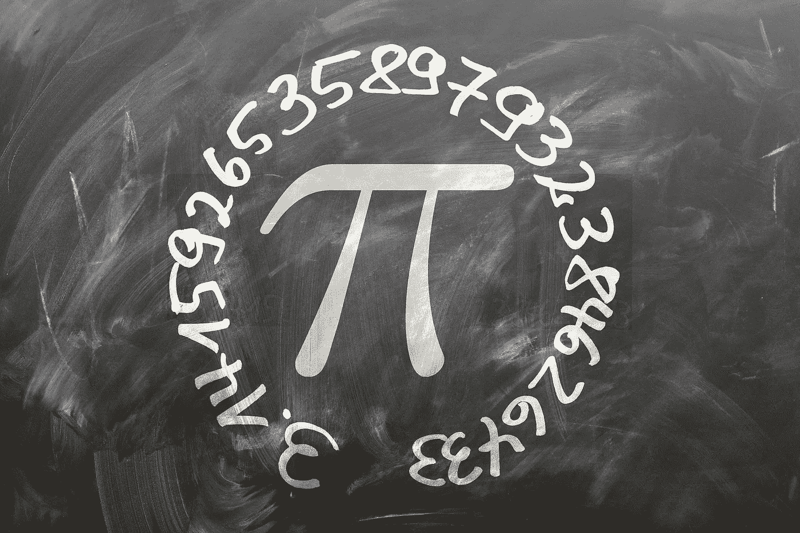

# Python 的完美占位符函数

> 原文：<https://medium.com/analytics-vidhya/the-perfect-placeholder-function-for-python-f907d31f529?source=collection_archive---------16----------------------->

pi-来自 [maxpixel](https://www.maxpixel.net/District-Board-Extensive-School-Pi-Diameter-Ratio-1453836) 的免费商业使用图像

> 我很惭愧地告诉你，我有多少数字进行这些计算(圆周率)，没有其他的业务在那时
> 
> -艾萨克·牛顿

通常，我们需要比较两台机器或两种架构的计算速度。有时，我们需要估计最大百分比…