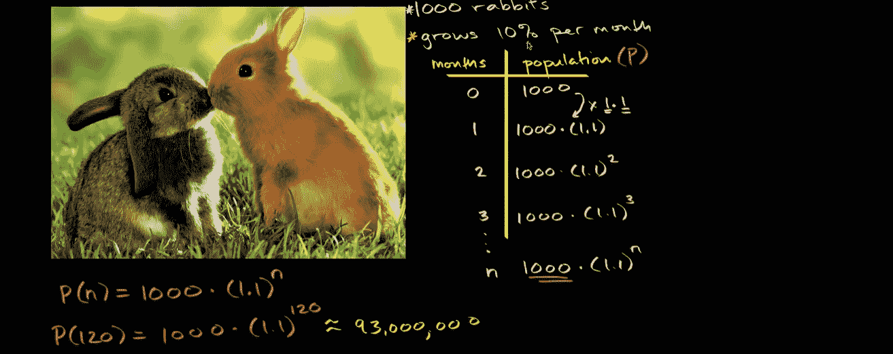
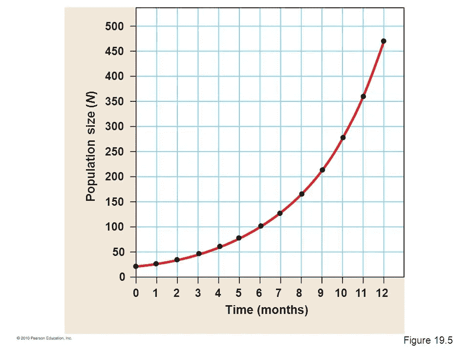
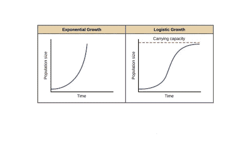
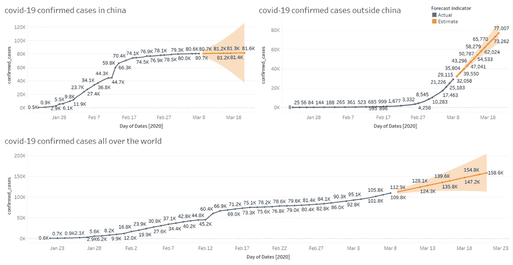
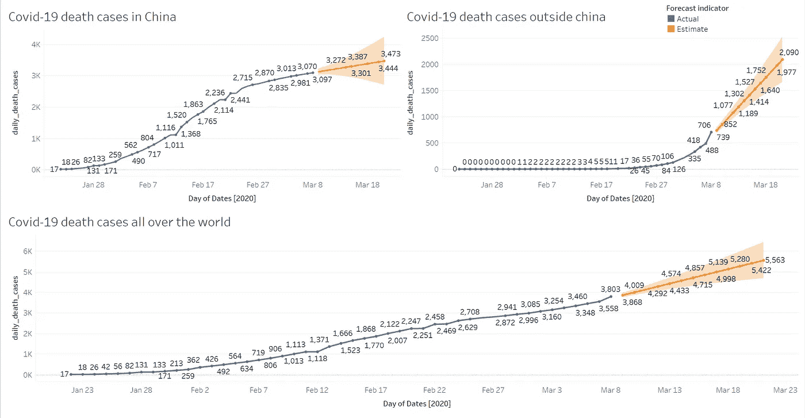

# 在新冠肺炎观察到的指数和逻辑自然现象。

> 原文：<https://medium.com/analytics-vidhya/the-phenomenon-of-exponential-and-logistic-nature-observed-in-covid-19-f2e2b9242301?source=collection_archive---------10----------------------->

在理解新冠肺炎增长中观察到的性质之前，让我们理解什么是指数增长，什么时候它变成逻辑增长？

著名的例子是兔子数量的增长。让我们看看下面这张来自可汗学院的图片。

如果 1000 只兔子的数量以每月 10 %的速度增长，我们可以遵循人口列中的模式，这导致一个函数，

P(n)=1000 * (1.1)^n

其中 n =月，P =人口，乘以 1.1 会加上 10%。

因此，如果我们倾向于计算一只兔子在第 10 年，也就是第 120 个月的数量，那么它的数量将会达到惊人的 9300 万。**指数增长**如下图所示。

人口相对于时间的增长率

以前的人口将对现在的人口状况产生直接影响。但是，在现实世界中，指数增长不会永远持续下去。有一种现象叫做**承载力。**

图片由可汗学院提供

环境中生物物种的承载能力是在给定食物、栖息地、水和环境中可用的其他必需品的情况下，环境可以无限期维持的物种的最大种群规模。因此，兔子的数量趋于减缓，随后趋于平缓，并与承载能力线趋同。这导致了一个被称为**逻辑增长**的“S”形曲线。

*   众所周知，新冠肺炎造成了巨大的破坏。它正在影响经济、健康和考验我们的信心。因为我一直在关注各种新闻频道，比如 NBC、FOX、CNN、第四频道新闻。专家说，在我们发现疫苗并根据数学模型治愈之前，我们预计病毒会感染世界上大约 20-40+%(数百万和数十亿)的人。‘下面让我们来看看新冠肺炎已证实的和死亡的趋势。产生新病毒的原因是现有的病毒，**呈指数增长的经典案例**。

确诊病例随时间的增长率(2020 年 1 月 22 日至 2020 年 3 月 9 日)

死亡人数随时间的增长率(2020 年 1 月 22 日—2020 年 3 月 9 日)

数据集来源:[链接](https://www.kaggle.com/sudalairajkumar/novel-corona-virus-2019-dataset)

从上面的图表中我们可以看到，中国似乎正在实现**的’**形曲线(在确认和死亡两方面)。可能是**承载能力**的影响。大量的隔离措施、洗手、使用口罩和避免手(口、眼)接触等变量正在拯救我们，并阻止病毒呈指数增长。但是，就目前而言，我们看到世界其他地区(不包括中国)的**指数增长**，这在一定程度上令人担忧。但是，所有这些模式在成为逻辑之前都是指数级的。

所以，我想最后说，专家们基于数学模型展示的估计数字是真实的。如果没有任何外部因素的影响，感染病例的增长肯定会达到数百万甚至数十亿。但是，如果采取警惕措施，感染的增长速度将会减慢，以后会逐渐消失。