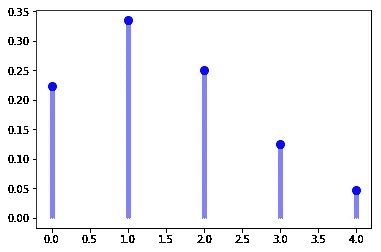

# 泊松分布

> 原文：<https://medium.com/analytics-vidhya/the-poisson-distribution-a061b0cd0221?source=collection_archive---------4----------------------->

# 泊松概率分布



Mylie 平均每 10 次击球就有 3 次安打。她在接下来的 5 次击球中准确击中 2 次的概率是多少？

我们如何着手计算这一结果的概率？(停顿思考)你猜对了！
这是一个泊松概率问题。
让我们开始吧。

泊松概率分布是一种离散概率分布，它表示在固定的时间或空间间隔内发生的给定数量的事件的概率，如果这些事件以已知的恒定平均速率发生，并且与自上次事件以来的时间无关。泊松分布也可用于其他指定间隔内的事件数量，如距离、面积或体积。

# 概率质量函数

泊松分布常用于模拟事件在时间或空间间隔内发生的次数。

离散随机变量 X 被称为具有参数 u> 0 的泊松分布，如果，对于 k = 0，1，2，…，X 的概率质量函数由下式给出:

f(k；u)=P(X=k)= (e^-u *u^k)/ k！

在哪里

u =固定时间间隔内的平均成功次数

e 是欧拉数(e = 2.71828…) k！是 k 的阶乘。正实数 u 等于 X 的期望值及其方差

u=E(X)=方差

泊松分布可以应用于具有大量可能事件的系统，每个事件都是罕见的。在适当的情况下，在固定时间间隔内发生的此类事件的数量是一个服从泊松分布的随机数。

# 假设和有效性

如果下列假设成立，泊松分布是一个合适的模型:

1.  k 是一个事件在一个时间间隔内发生的次数，k 可以取值 0，1，2，…

2.一个事件的发生不影响第二个事件发生的概率。也就是说，事件独立发生。

3.事件发生的平均速率是恒定的。

4.两件事不可能在完全相同的时刻发生；相反，在每个非常小的子间隔，恰好有一个事件发生或不发生。或者实际的概率分布是由二项式分布给出的，并且试验的次数远远大于人们所要求的成功次数。

如果这些条件成立，那么 k 是泊松随机变量，k 的分布是泊松分布。

现在让我们来回答笔记本开头提出的问题。

麦莉平均每 10 次击球就有 3 次安打。她在接下来的 5 次击球中准确击中 2 次的概率是多少？

因为公式是:

f(k；u)=P(X=k)= (e^-u *u^k)/ k！

其中 k=在 5 次尝试中 2 次命中

u = 10 次尝试中有 3 次命中= 1.5 次命中 n 次尝试

P(X =2)= e^-1.5*1.5^2/2！=0.2510

让我们使用 scipy.stats.poisson.pmf 函数来进一步阐明这个概念。

在[17]中:

```
from scipy.stats import poisson
import matplotlib.pyplot as plt
```

泊松的概率质量函数为:

poisson . PMF(k)= exp(-mu)* mu * * k/k！对于 k >= 0。

泊松以 mu 为形状参数(mu 为均值/期望值/方差)。

上面的概率质量函数是以“标准化”形式定义的。要改变分布，请使用 loc 参数。具体来说，poisson.pmf(k，mu，loc)等同于 poisson.pmf(k — loc，mu)。

在[18]中:

```
#Calculate a few first moments: mu = 1.5
mean, var, skew, kurt = poisson.stats(mu, moments='mvsk')
print('Mean=%.3f,Variance=%.3f'%(mean,var) )Mean=1.500,Variance=1.500
```

在[19]中:

```
#pmf(x, mu, loc=0)	Probability mass function.
#Use the Probability mass function to calculate P(X=2)
p= poisson.pmf(2,1.5)
p
```

Out[19]:

```
0.25102143016698353
```

我们手工做的时候得到了和上面一样的答案。让我们显示 k >= 0 和< 5 时的概率质量函数(pmf ):

在[20]中:

```
import numpy as np
fig, ax = plt.subplots(1, 1)
x = np.arange(0,5)
mu = 1.5
ax.plot(x, poisson.pmf(x, mu), 'bo', ms=8, label='poisson pmf')
ax.vlines(x, 0, poisson.pmf(x, mu), colors='b', lw=5, alpha=0.5)
plt.show()#Freeze the distribution and display the frozen pmf:
rv = poisson(mu)
ax.vlines(x, 0, rv.pmf(x), colors='k', linestyles='-', lw=1,
         label='frozen pmf')
ax.legend(loc='best', frameon=False)
plt.show()
```

在[21]中:

```
x
```

Out[21]:

```
array([0, 1, 2, 3, 4])
```

在[22]中:

```
#Check accuracy of cdf and ppf:prob = poisson.cdf(x, mu)
np.allclose(x, poisson.ppf(prob, mu))
```

Out[22]:

```
True
```

在[23]中:

```
#Generate random numbers:
import seaborn as sb
r = poisson.rvs(mu, size=1000)
ax = sb.distplot(r,
                  kde=True,
                  color='green',
                  hist_kws={"linewidth": 25,'alpha':1})
ax.set(xlabel='X=No of Outcomes', ylabel='Probability')
```

Out[23]:

```
[Text(0, 0.5, 'Probability'), Text(0.5, 0, 'X=No of Outcomes')]
```

## 方法

```
rvs(mu, loc=0, size=1, random_state=None)   Random variates.pmf(x, mu, loc=0)   Probability mass function.logpmf(x, mu, loc=0)    Log of the probability mass function.cdf(x, mu, loc=0)   Cumulative density function.logcdf(x, mu, loc=0)    Log of the cumulative density function.sf(x, mu, loc=0)    Survival function (also defined as 1 - cdf, but sf is sometimes more accurate).logsf(x, mu, loc=0) Log of the survival function.ppf(q, mu, loc=0)   Percent point function (inverse of cdf — percentiles).isf(q, mu, loc=0)   Inverse survival function (inverse of sf).stats(mu, loc=0, moments='mv')  Mean(‘m’), variance(‘v’), skew(‘s’), and/or kurtosis(‘k’).entropy(mu, loc=0)  (Differential) entropy of the RV.expect(func, args=(mu,), loc=0, lb=None, ub=None, conditional=False)    Expected value of a function (of one argument) with respect to the distribution.median(mu, loc=0)   Median of the distribution.mean(mu, loc=0) Mean of the distribution.var(mu, loc=0)  Variance of the distribution.std(mu, loc=0)  Standard deviation of the distribution.interval(alpha, mu, loc=0)  Endpoints of the range that contains alpha percent of the distribution
```

# 违反泊松假设的例子

每分钟到达学生会的学生人数可能不会遵循泊松分布，因为该比率不是恒定的(上课时间期间的低比率，上课时间之间的高比率)，并且单个学生的到达不是独立的(学生往往成群结队)。

如果一次大地震增加了类似震级余震的概率，那么一个国家每年发生 5 级地震的次数可能不遵循泊松分布。

在医院重症监护室收治的患者中，患者在 ICU 度过的天数不是泊松分布，因为天数不能为零。该分布可以使用零截断泊松分布来建模。

零事件间隔的数量高于泊松模型预测的数量的计数分布可以使用零膨胀模型来建模。

# 参考

1.  弗兰克·海特(1967)，《泊松分布手册》，美国纽约:约翰·威利父子公司，ISBN 978-0-471-33932-8
2.  Koehrsen，William(2019–01–20)，泊松分布和泊松过程解释，走向数据科学，检索于 2019–09–19
3.  科学统计