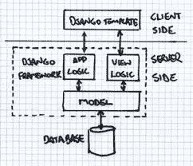
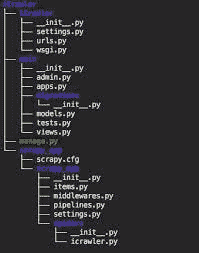
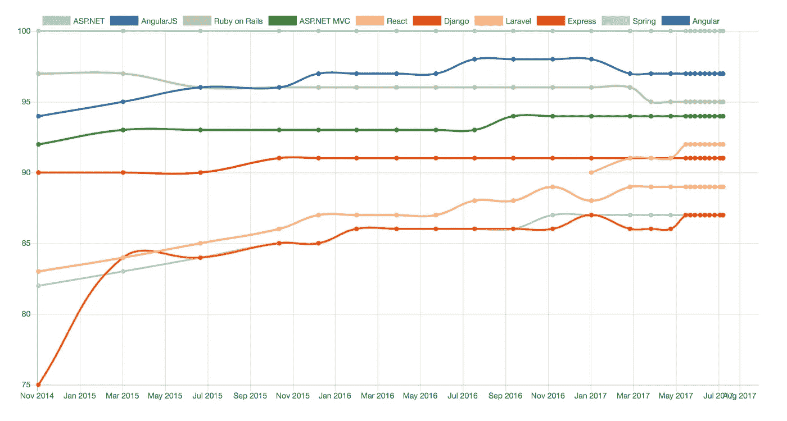

# 姜戈的受欢迎程度

> 原文：<https://medium.com/analytics-vidhya/the-popularity-of-django-9b8b5338dad7?source=collection_archive---------21----------------------->

Django 是 Python 的一个开源框架，它不同于任何独立的服务器解决方案，比如 Spring、Rest API 和 ASP.Net 等等。像任何其他 MVC 框架一样，Django 也使用模型-模板-视图架构模式。
如章程所述:

> *由经验丰富的开发人员构建，它解决了 Web 开发的许多麻烦，因此您可以专注于编写您的应用程序，而无需重新发明轮子。它是免费和开源的。*

**模型**:Django 中的模型指定了接口和架构，用于根据特定的情况定义特定操作的操作。

**视图**:视图包含定义 url 请求的特定调用所完成的操作的方法。

**模板**:模板处理页面的渲染，并定义操作来处理来自模型中特定视图的 url 响应。

姜戈的 MVT 建筑如下所示

几个有用的命令:-
**django-admin start project**:创建项目目录和该项目的内置文件。
**python manage . py startapp**:在当前项目下创建一个 app。
**Python manage . py collect static**:制作静态文件的元信息，迁移到一个静态目录下。

Django 的项目目录如下所示:

manage.py 包含处理当前服务器端解决方案的数据库、连接和模板的代码适配器。
Sqlite 是 sql 数据库，是给定项目的数据库。

Django 框架还没有在全球的生产服务器中使用，但是它的成功是令人羡慕的。你知道是什么驱动了 YouTube 和网飞平台，以至于它的表现被大肆宣传吗？
是的，是姜戈。

Django 目前的趋势和相对位置如下:

编程语言的流行趋势

# 那么，为什么在生产服务器中没有看到 Django 如此广泛的应用呢？

有两个主要原因:
。Django 相对较新，于 2005 年推出，直到 2007 年才全面部署。由于 Django 的影响力相对有限，程序员们不愿意使用 Django。

# 那么 Django 的哪些特性像磁铁一样吸引着开发人员加入这个框架呢？

1.Django 将 SQL 集成到其容器中。
2。Django 是一个独立的服务器解决方案，可以托管在远程或本地服务器上。
3。在 Django 中可以有效地管理防火墙和 reach、端口和套接字的配置。
4。结合 Python 的灵活性，Django 增加了健壮的部署。
5。创建模型和处理程序的灵活性。
6。轻松创建应用程序，集成其中的几个应用程序，并在一个管理面板下管理它们。
7。Django 提供了一个内置的管理面板，节省了大量的代码，当然可以定制。

就是这样。那么你什么时候去姜戈**？**