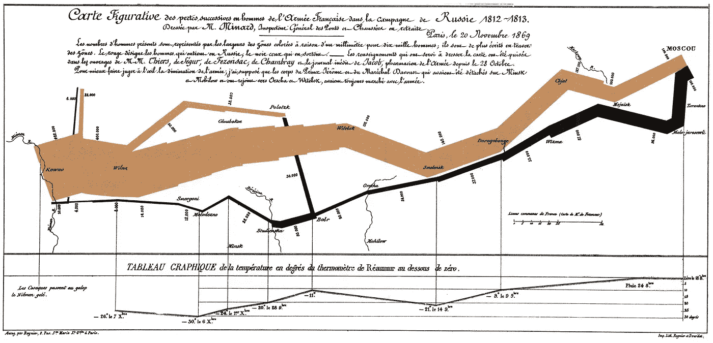
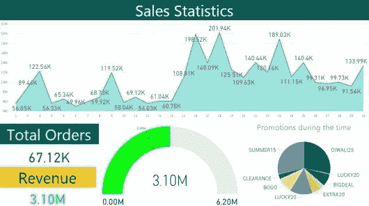

# 商业中设计卓越可视化的力量

> 原文：<https://medium.com/analytics-vidhya/the-power-of-designing-great-visualization-in-business-124e3215410?source=collection_archive---------20----------------------->

视觉表征是人类学习、思考和理解的基本组成部分。

几千年来，人类一直使用可视化来指导、传达意义和讲故事，以表达他们的想法、观点和找出解决方案以及如何解决它们。

让我们来看一个著名的数据可视化例子，它来自法国土木工程师 Charles Minard，他用可视化捕捉了拿破仑向莫斯科进军(以及随后的撤退)的故事。你可以看到随着军队向莫斯科推进，酒吧的厚度逐渐减少。黑条显示了随着军队从莫斯科撤退，军队实力下降的惊人程度。在图形的底部是一条线，
它跟踪温度，温度对军队的规模起到了关键作用。阴影和黑色的条终于回到了开头，观众可以清楚地看到曾经的大部队如何减少到少数士兵，告诉我们一个强有力的故事，温度如何摧毁了拿破仑的军队。

# 这种视觉化教会了我们一件事。人类的感知是强大的。

*但是在视觉提示的帮助下，我们的感知可以得到极大的增强。*

在商业环境中，当我们试图同时解决多个问题和处理大量复杂的数据时，可视化可以帮助我们获得认知上的安慰，并一次消化大量信息。

我们可以通过可视化完成三项基本任务:

1.  **探索:**我们可以搜索重要的事实，目的是发现一个
    问题/解决方案。
2.  **理解:**我们可以检查并理解数据，目的是
    更好地了解我们的业务需求。

3.**沟通:**我们可以向他人传达信息，目的是做出明智的决策。

有效的可视化可以节省大量员工时间，并使团队领导能够根据数据迅速采取行动。它有助于确定给定业务或部门的关键绩效指标，并获得相对于不使用数据的其他业务或部门的竞争优势。

例如，当您试图了解如何降低运营成本时，您可以通过使用可视化数据来支持您的策略，从而对其进行特别的限定。例如，即使我不解释这个鞋类品牌的销售数据，你也可以仅从可视化中找出许多情报。

有一个误区是，我们为理解数字有困难的人可视化数据。然而，即使是最聪明的数学家也会受益于可视化显示的定量信息，因为这有助于你进行批判性思考。

因此，在用可视化讲述有效故事时要记住的教训是:
1。信任是一个关键问题。如果你没有恰当地设计你的视图，它将不太可能被查看它们的人所信任。
2。确保视觉效果具有表现力，并准确传达数据。
3。通过使用适当的图形词汇、利用空白空间和避免不必要的混乱来增强人们的感知。

4.最重要的是，添加适当的上下文或数据来源的历史，以及它试图传达什么。

你不必成为图形艺术专家来做更好的数据可视化。更重要的是理解数据，接受视觉思维和交流的训练，这才是最重要的。专注于营销和艺术的人往往会错过有效的数据可视化的机会，而这实际上有助于公司的发展。

视觉是我们最主要的感觉，从我们最早的祖先开始，他们就通过视觉传达信息和思想，而不是语言。视觉感知进化为更快更好地思考，同样可以应用于商业。数据探索、意义创造和交流应该总是涉及到对商业问题的观察和思考之间的密切合作。