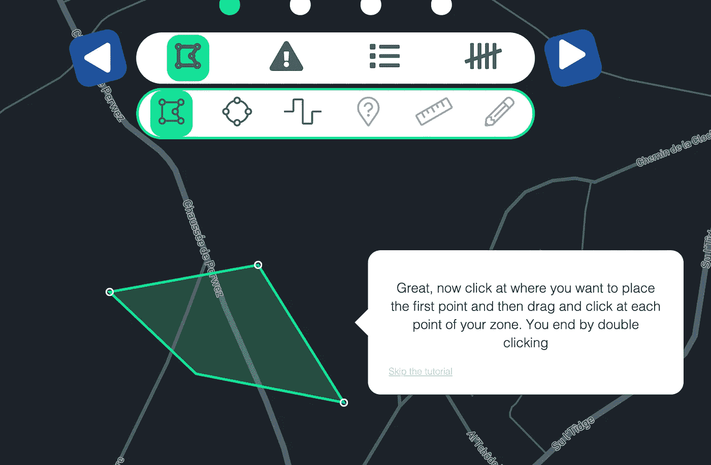

# 游戏化的力量

> 原文：<https://medium.com/analytics-vidhya/the-power-of-gamification-115e40f1338d?source=collection_archive---------35----------------------->

以及为什么它将永远改变你的应用

克里斯托夫·保罗·高在 [Unsplash](https://unsplash.com?utm_source=medium&utm_medium=referral) 拍摄的照片

你们都听说过，*游戏化，*一个不难理解的大词。在我们开始之前，让我们从互联网上随机取一个定义:

> 游戏化是游戏设计元素和游戏原则在非游戏环境中的应用。也可以定义为利用或应用游戏元素的特性来解决问题的一组活动和过程。

我不认为我需要解释更多，它让你的应用程序更加有趣，同时又不失成熟。

让我们把这个主题分成不同的部分，这样会更容易理解，对我来说也更容易写。

# 目标

游戏化就像一块磁铁，一旦用户看了这个应用程序，就把他们留在那里，并继续在应用程序中探索和发展。它还可能吸引一个全新的用户群体，他们永远不会有这个想法。

# 奖励

奖励是游戏的主要概念之一，游戏化也是如此。它们有各种形式和大小，可以来自许多方面。

奖励的形式可以是平台上的额外访问、虚拟货币(真钱可能会让你立刻破产)、你名字的漂亮颜色或简单的金牌，这些都足以激励你的用户。

照片由 [Aditya Joshi](https://unsplash.com/@adijoshi11?utm_source=medium&utm_medium=referral) 在 [Unsplash](https://unsplash.com?utm_source=medium&utm_medium=referral) 上拍摄

当然，你可以出于任何你认为合理的理由给他们这些奖励。向他们介绍你的*游戏化*的良好开端是“创建一个账户！”徽章，这样他们就知道还有更多的未来…

让我们将它与一个知名的开发者论坛 *StackOverflow、*进行比较，这里是你可以在该平台上获得的数百个徽章中的两个。他们什么都不做，什么都不给你，但是，是的，成为一个狂热分子很酷，不是吗？

StackOverflow 截图—由我提供

# 挑战

每个人都喜欢挑战，如果你在申请中包含挑战(不需要太难)，那就更好了。这些可以以多种形式出现，一些应用程序将复活节彩蛋放在他们的应用程序中，当你找到所有彩蛋时，你会得到奖励。你要求他们找到所有的特性，同时他们探索你的应用程序，也许会找到一些他们从来不知道会需要的特性。

一个很好的例子是 *IDRONECT* 中的绘图功能，这是一个无人机管理平台，具有一个令人敬畏的任务规划器。当您开始学习本教程时，您会发现类似这样的内容:

Idronect 截图—由我拍摄

如果你想让你的用户完全理解如何使用你的产品，这是非常完美的。你可能已经知道指导你的用户使用你的应用程序的教程很棒，但实际上它不是！如果你不停地说“这是你的个人资料”、“这里你可以上传一张图片”、“这里是一些菜单”、“这里是另一个菜单”、“你看到这个菜单了吗？它什么也不做，但它就在那里”，…你的用户会很快厌倦。

相反，稍微引导他们，让他们去做艰苦的工作(就像你在上图看到的那样)。它刺激用户使用他们以前可能没有用过的工具。别忘了给他们一个选择。我是一个会一直点击跳过教程的人，即使几秒钟后我会后悔，因为我没有得到应用程序的任何东西，我仍然会很高兴我可以跳过它，稍后继续。

# 统计数字

展示人们的进步对你的用户来说也是很好的刺激。记录他们做的每一件事，有时用他们达到的目标提醒他们，也许给他们奖励？谁知道呢！

让我们以 *Strava* 为例。在你的仪表盘上，你会有一些关于你不同体育活动的每周统计数据。这将激励你的用户把这些数字提高更多。显然，这并不适用于每个人，即使是像我这样最喜欢运动的人…

Strava 截图—由我提供

# 排行榜

这是我要讲的最后一点。如果你想让你的用户互相竞争，排行榜是一个很好的方式(没有明显的原因，如果是为了徽章，但是的，进入前 10 名很有趣，对不对？).

这可能并不适用于每个用例。如果这是一个银行应用程序，让前 10 名用户花最多的钱可能真的没什么用。但是如果你有一个烹饪应用程序，看看谁发布了最多的食谱，谁得到了最好的评论，可能会很有用

# 结论

这就是我的 4 点，可以帮助您的应用程序增长。显然，这并不是对现有的每个应用程序都有用，但是在很多情况下，它在某些时候可能会派上用场。

干杯