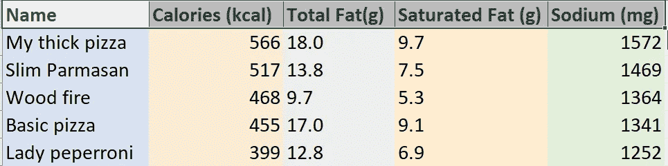
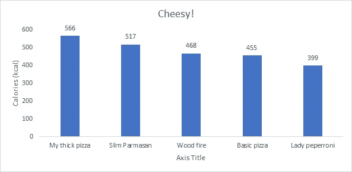
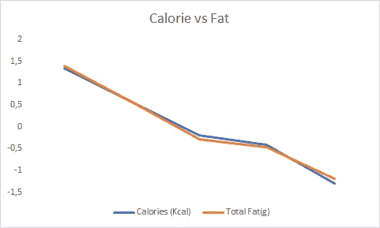

# 信息可视化的力量

> 原文：<https://medium.com/analytics-vidhya/the-power-of-information-visualisation-a3d783470aa5?source=collection_archive---------20----------------------->

为什么要努力比我们现在更好地理解数据？

在过去的二十年里，我们看到了技术的巨大进步，这些技术让我们能够收集、存储和检索数据，但可悲的是，我们忽略了使信息有意义和全面的主要工具:**人类思维**。当我们专注于工具和库时，我们忘记了理解数据所需的人类技能。

**为什么关心自己去分析数据？**

良好的数据分析使我们能够:

1.  为了更好地管理系统
2.  为了在未来特定的条件下做出更好的预测
3.  创造机会和预防问题

计算机不能理解数据，只有人类可以。只有具备必要的数据技能分析技能的人才能理解这些数据。当我们使用电脑更有效、更准确地做我们已经知道如何做的事情时，电脑对我们帮助最大。决策者依赖于经过预处理的结果，这些人大多从未接受过数据分析基本技能的培训。这些技能在今天的工作场所很少见，不是因为问题太复杂，而是因为大多数人从来没有真正试图理解这些数据。

**怎样才能更好的理解数据？**

大多数组织所需的 90%以上的数据分析可以通过基本的分析技能来完成，这些技能很容易通过对统计学的理解来掌握。我们可以用来理解数据的技术之一是**量化信息的可视化表示** -探索数字中的模式含义。掌握这些可视化分析技术可以让我们更好地理解数据，并使其有意义。

例如:举例说明数字和图形对于理解信息的区别。让我们从“Cheesy！”餐桌形式的餐厅**。**

****

**每份比萨的营养成分。**

**现在让我们以直观的形式来看看披萨的卡路里含量。**

****

**条形图中比萨饼的卡路里含量。**

**这种直观的表示让我们理解不同变量之间的关系，图片使这些关系可见。**

****

**不同比萨饼的热量和脂肪含量的比较**

**精心设计的图片或可视化使数据背后的故事变得清晰可见，栩栩如生。它提供了一个强大的手段来从大量的数据中捞取战利品。
当我们以视觉形式呈现量化信息时，我们思考这些信息的能力会大大增强。视觉表征不仅使数字中的模式、趋势和例外可见，它们还帮助我们理解、欣赏和利用这种联系来做出更好的决定。**

****参考文献**——很少，斯蒂芬(2009)。*现在你看到了——定性分析的简单可视化技术。乔纳森·g·库米。***