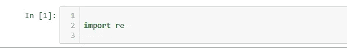
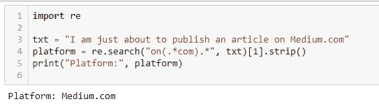
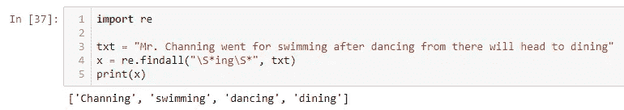
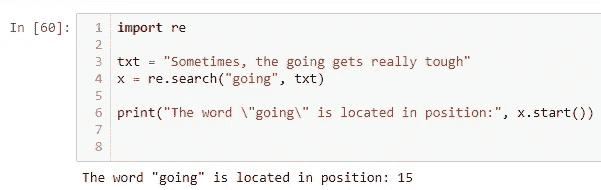
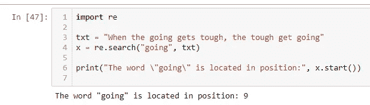
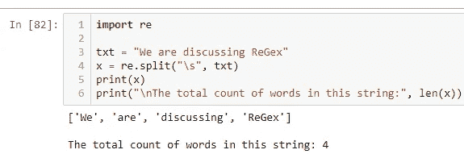
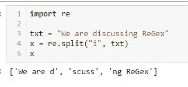
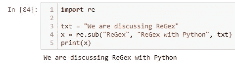

# ReGex | Python 的威力

> 原文：<https://medium.com/analytics-vidhya/the-power-of-regex-python-19e74b24bbbe?source=collection_archive---------12----------------------->


**ReGex 的威力举世闻名**

作为正则表达式的缩写， **ReGex** 或 **Regexp** 被计算机科学领域的语言学家称为一串文本，允许你创建用于匹配、定位和管理文本的模式。给它一个更简单的定义——ReGex 是构成搜索模式的一系列字符。它还用于检查一个字符串是否包含指定的搜索模式。

您通常会发现在字符串搜索算法中使用了这样的搜索模式，特别是针对字符串的**“find”**或**“find and replace”**操作，这种用法还扩展到了编程中的输入验证。众所周知，正则表达式是在理论计算机科学中发展起来的一种技术，它的根基是自动机的 ***理论*** 和 ***形式语法/语言。***

# 谁发明了正则表达式？


**斯蒂芬·科尔·克莱尼**

正则表达式的概念出现在 20 世纪 50 年代，当时美国数学家斯蒂芬·科尔·克莱尼 T20 形式化了正则语言的描述。这一概念因其主要用于 Unix 文本处理实用程序而出名。

今天，正则表达式在计算机科学和语言学的各个领域中被广泛使用。

**举几个 ReGex 的此类领域/应用:-**

*   搜索引擎:每个人都知道基于网络的搜索引擎在当前信息时代的重要性。然而，计算机科学的消费者所面临的最大问题是，在现有的大量信息中，他们如何真正将需要的信息与不需要的信息分开。很明显，ReGex 解决了这个问题，并且帮助计算机行业的成员或者你可以称之为 ***【查询提交者】*** 获得与他们的查询最相关的结果。
*   **文字处理器和文本编辑器的搜索和替换实用程序****:**其中用户可以搜索对话/字符串并用另一个对话/字符串替换它们。我敢打赌。你会经常看到并使用它。不是吗？所有你字& Excel 的粉丝😉
*   **在诸如流编辑器& AWK** 的文本处理实用程序中:前者是一个解析和转换文本的 Unix 实用程序，后者是一个为文本处理而设计的特定领域语言，通常被用作一个包含数据提取的报告工具。
*   **词法分析:**虽然我们知道词法分析是做什么的(即将一系列字符或我们所知的字符串转换成记号)；我们还应该知道正则表达式在词法分析中的重要性。词法分析中的正则表达式有助于扫描和识别属于某种语言的有效字符串/标记/词位集。正则表达式只帮助搜索那些由该语言的规则定义的模式。

## **还有，你应该知道，**

许多编程语言或者内置或者通过库提供正则表达式功能。**正则表达式支持**是许多编程语言的标准库的一部分，其中 ***Java*** 和 ***Python*** 可能是世界上最著名的。并且，与此同时 ReGex 也被内置到其他的语法中，包括 ***Perl*** 和 ***ECMAScript。***

如果到目前为止它已经让你感到有点无聊，让我们稍微点亮阅读:-
你知道对于初学者来说， ***一个正则表达式就像一种“通用语”一样出现，用于人类和外星人之间可能的交流，每当未来发生外星人入侵时。***

😆 😆 😆 😆 👽 👽 😯 😯 👽 👽 😖 😖👽 👽 😯 😯 👽 👽 😖 😖👽 👽 😆 😆 😆 😆

# 想象一下，你曾经遇到过像/^([a-z0–9_\.这样的序列-而你就像是我无法理解的密码。在这个星球上，这意味着什么？


简单地说:“ReGex”语法就像一只猫在你的键盘上玩耍。

# 现在，严肃地说

## 你应该问问全世界的计算机科学家和程序员，为什么正则表达式如此重要？

他们将听到一个共同的裁决。ReGex 通过自动搜索模式****清理和处理基于文本的数据*** 使生活变得简单，因此， ***节省了您手动搜索大量文本数据的时间和麻烦。****

# ***今天，我们将使用 Python3 来使用 ReGex🙌***

**

***一个外行人对如何使用 Python 执行正则表达式的理解***

****干脆，开门见山……****

*在这一点上，我想在 Python 的上下文中给出一个新的、更先进的正则表达式的定义(你也可以在 python.org 上找到相同的定义):-*

> *正则表达式(称为 REs，或 regexe，或 regex 模式)本质上是一种嵌入在 Python 中的微小的、高度专门化的编程语言，并通过 **re** 模块提供。*

*程序员想用 ReGex + Python 回答的那种问题？*

*   *该字符串是否包含我要搜索的一组模式？*
*   *这个字符串完全符合我的模式吗？*
*   *我的搜索模式是否遵循所有预定义的规则？*
*   *我可以为我的正则表达式设置一些新的基本规则吗？*
*   *我的语料库能容纳消费者/用户所有可能的搜索模式吗？*
*   *我的文档与最常见的消费者关键词搜索类型的相关性如何？*
*   *我的文本语料库是否包含任何不相关的字符/符号/关键字，我可以删除这些字符/符号/关键字以保持我的文档的相关性和准确性？*

*是的，ReGex 给出了所有这些问题的答案。现在，我将使用 Python3 来尝试将这一切付诸实践。*

***马上，**让我们做一些不可避免的事情来完成它。让我们导入正确的 Python 模块" **re"** 来实现我们想在 ReGex 中做的任何事情*

**

***从 Python 导入 re 模块***

***re，**是 Python 中的内置包，可以用来处理正则表达式。*

*我们现在开始尝试一个非常基本的正则表达式的例子。这基本上演示了如何导入 re 模块并对样本字符串执行 ReGex 操作。这只是 ReGex 拥有的巨大潜力的一小部分。所以，请不要被你所看到的弄得不知所措，因为随着我们的进步，我们会做更多有趣的事情。*

***所以……**
打开你的 Jupyter 笔记本/ Anaconda 提示符/或者你通常写 Python 脚本的任何地方，简单地导入 **re 模块。***

*一旦你准备好了，在你的编辑器/终端/笔记本上写下下面几行代码。只是检查，如果你得到和我一样的输出。对下面代码的理想输出是- ***“平台:Medium.com”。*** 请确认您在输出控制台上也看到了这一信息。*

**

***一个基本的正则表达式示例***

***这里刚刚发生了什么？***

*刚刚有人告诉我，他准备在某个网络平台上发表文章。我把他的声明写在了某个地方。我现在想做的只是从语句(字符串)中提取平台名称。如果你在上面的代码中看到，我也做了同样的事情。我定义了一个搜索模式，从原始输入字符串中提取序列“Medium.com”。*

*这到底是怎么发生的？*

*这是一个问题，一旦我们深入到 ReGex- **的基本原理，我们就可以回答这个问题，它的函数**、**字符、元字符、集合、序列、**等等。*

# *正则表达式函数*

*Python 中的 **re** 模块提供了一系列函数，允许程序员搜索字符串进行匹配*

1.  *这个 ReGex 函数返回所有匹配的列表。它采用的两个参数是— **第一个参数**是他们想要查找的正则表达式字符串/序列的模式，而**第二个参数**是他们想要从中查找与给定正则表达式相对应的所有匹配模式的主字符串。*

**

***一个演示 findall()用法的例子***

*在上面的例子中，我试图找到给定句子中所有包含 **"ing"** 作为子串(部分)的单词的列表。因此，您会看到，返回的列表是['Channing '，' swimming '，' dancing '，' dining']，其中显然每个单词都有 **"ing"** 作为其一部分。*

***2。search() :** 如果在字符串中找到任何匹配，这个 ReGex 函数返回一个 match 对象。它采用的两个参数是— **第一个参数**是他们想要搜索的正则表达式字符串/序列的模式，第二个参数**是他们想要在其中搜索与给定正则表达式相对应的特定模式的主字符串。如果有两个或更多匹配项，则只返回第一个匹配项。
我将在这里向您展示两个案例:-***

*第一种情况:匹配/搜索字符串出现一次。这很简单，你会看到单词“going”出现在第 15 个位置，知道字符串的起始索引是 0。因此，x.start()返回 15。*

**

***当我想匹配“going”而只有一个“going”时***

*第二种情况:匹配/搜索字符串出现两次(多次)。这是一个例子，当我想匹配“going”时，我可以看到在句子中有两个“going”出现。这里，根据规则，我只得到第一次出现的位置，如果你愿意看的话。x.start()返回 9，因为第一个单词位于第 9 个索引处。它没有考虑字符串末尾的另一个“将要”的单词。*

**

*当我想要匹配“going”并且存在两个“going”事件时*

***3。split() :** 这是一个 ReGex 函数，它返回一个列表，其中的字符串在每次匹配时都被拆分。它采用的两个参数是— **第一个参数**是他们将拆分主字符串的字符/序列、基础(at ),第二个参数**是他们想要拆分的主字符串。我也刚刚给了你一个一行程序的方法来计算一个句子中的字数，下次你打算在任何程序中这样做的时候。😁 😀只需导入 re 并在空格处使用 split(" \ s ")。瞧吧！***

**

*我在空格处拆分了一个句子。*

*让我们来看一个例子，其中我们想要拆分某个字母或单词，而不是空格(这通常是一种常见的情况)。所以下面，我试着在字母**“I”处拆分句子。**功能显然保持不变:-*

**

***我在字母‘I’处拆分了与上面相同的句子***

***4。sub() :** 这个 ReGex 函数用于用您自己选择的文本替换匹配/搜索字符串。它采用的三个参数是— **第一个参数**是您想要替换的子字符串，**第二个参数**是您想要替换的子字符串，**第三个参数**是您想要进行替换的主要相关字符串。*

*如果你在下面的字符串“我们正在讨论正则表达式”中看到，我匹配了一个模式“正则表达式”并用“Python 正则表达式”替换它，这样得到的字符串是 ***“我们正在讨论 Python 正则表达式”。****

**

***在正则表达式中使用 sub()***

# *Python 正则表达式字符备忘单:-*

***正则表达式基础:-***

***。(点)** —除新行
**a** 以外的任何字符—字符 a
**ab** —字符串 ab
**a|b** — a 或 b
**—a ***—0 或更多 a 的
**\** —转义特殊字符*

***正则表达式字符类:-***

***【a b-d】**—a、b、c、d
**【^ab-d】**中的一个字符—a、b、c、d
**[\ b】**—退格字符
**\d** —一位数字
**\D** —一位非数字
**\s** —一个空格* 

***正则表达式标志:-***

***i** —忽略大小写
**m** — ^和$匹配行的开始和结束
**s** —。也匹配换行符
**x** —允许空格和注释
**L** —区域设置字符类
**u** — Unicode 字符类
**(？iLmsux)** —在正则表达式中设置标志*

***正则表达式量词:-***

****** — 0 以上
**+** — 1 以上
**？** — 0 或 1
**{2}** —正好 2 个
**{2，5}** —介于 2 个和 5 个
**{2，}** — 2 个或更多个
**(，5 }【T19)—最多 5 个***

***正则表达式断言:-***

***^** —字符串开始
**\A** —字符串开始，忽略 m 标志
**$** —字符串结束
**\Z** —字符串结束，忽略 m 标志
**\b** —单词边界
**\B** —非单词边界
**(？=…)** —正向前瞻
**(？！…)** —消极前瞻
**(？< =…)** —正面后视
**(？<！…)** —消极后视
**(？()|)** —有条件*

***正则表达式组:-***

***(…)** —捕捉组
**(？P < Y > …)** —捕获组命名为 Y
**(？:…)** —非捕获组
**\Y** —匹配第 Y 个捕获组
**(？P=Y)** —匹配命名组 Y
**(？#…)** —注释*

***正则表达式特殊字符:-***

***\n** —换行符
**\r** —回车符
**\t** —制表符
**\YYY** —八进制字符 YYY
**\xYY** —十六进制字符 YY*

***正则表达式替换:-***

***\g < 0 >** —插入整个匹配
**\g < Y >** —插入匹配 Y(名称或编号)
**\Y** —插入编号为 Y 的组*

*我认为，到目前为止，我们已经很好地了解了 Python 正则表达式的基础知识，并对这些概念有了深入的了解。
也许，是时候看看使用 ReGex(与 Python 一起)的一些真实应用了。*

# *你听说过信用卡诈骗吗？*

**

***ReGex 拥有识别信用卡欺诈的魔力……***

*我有一个朋友叫 Mohan，他在一家信用卡公司工作。他的经理给了他大量的信用卡，并要求他验证信用卡号码。我的朋友研究了一下，发现 ReGex 的知识可以帮助他。*

*他知道我认识 ReGex，他联系了我。他问我是否可以帮他确认他的信用卡上是否有有效的信用卡号码？*

***他给了我以下规则/断言，作为真实信用卡号的基本特征:-***

*它必须以 4、5 或 6 开头。
它必须正好包含 16 位数字。
只能由数字(0-9)组成。
它可能有 4 个一组的数字，由一个连字符 **"-"** 分隔。不得使用任何其他分隔符，如' '、' _ '等。不得有 4 个或更多连续重复的数字。*

## *然后他给了我几个有效的信用卡号码的例子*

```
*6954627879619786
5126424824942942
4127-2267-7924-3914*
```

## *然后他给了我一些无效/欺诈信用卡号码的例子*

```
*62531254792151867 #17 digits in card number → Hence Invalid 
692**44444**24441344  #Consecutive digits >= 4 times → Hence Invalid
5122-2368-7954 **-** 3214 #Separators other than '-' are used → Invalid
65244**x**4521242547 #Contains non digit characters('x') → Hence Invalid
**9**625312582963578 #Doesn't start with 4, 5 or 6 → Hence Invalid*
```

*我说:“好的，我会尽力帮助你的”。*

*我没花多少时间就用下面的代码回复了他。这也解释了使用 Python 和它的有效模块“re”执行 ReGex 是多么容易和快速。你只需要很好地了解你的正则表达式字符集，就是这样！*

*我告诉我的朋友——**“我相信我与你分享的这个代码是为了验证你的信用卡是否有真实的信用卡号码。只需输入您的信用卡号码，然后自己检查。***

## ***你(读者)能看看我的这段代码，告诉我这里到底发生了什么吗？***

*****请考虑 if/else、语句、函数的适当缩进，以便让您的控制台/笔记本识别语法正确的代码块；在执行这个脚本之前。****

> *导入 re
> def cc _ rules(cc _ num _):
> pass _ = 0
> rule 1 = '^[456].+'
> if re.search(rule1，cc _ num _):
> pass _+= 1
> # print(" rule 1 "，pass_)
> rule2 = ' '。join(filter(lambda i: i.isdigit()，cc _ num _)
> if len(rule 2)= = 16:
> pass _+= 1
> # print(" rule 2 "，pass_)
> rule3 = all(item in [0，1，2，3，4，5，6，7，8，9]for list(int(x)for x in rule 2))
> if rule 3 = = true:
> pass _+= 1
> [0–9]{4}\-?[0–9]{4}\-?[0–9]{ 4 } '
> if re . search(rule 4，cc _ num _):
> pass _+= 1
> # print(" rule 4 "，pass _)
> rule 5 = '^[456][0–9]{3}[\s_][0–9]{4}[\s_)？[0–9]{ 4 }[\ s _]？[0–9]{ 4 } '
> if re . search(rule 5，cc _ num _)= = None:
> pass _+= 1
> # print(" rule 5 "，pass_)
> rule6 = r'(\d)\1{3，}'
> if re.search(rule6，rule 2)= = None:
> pass _+= 1
> if pass _ = = 6:
> 返回“有效”
> 否则:【T47*
> 
> *if _ _ name _ _ = = ' _ _ main _ _ ':
> N = int(input())
> assert 0<N<100，" 0<N<100 "
> for I in range(N):
> str _ = input()
> ans _ = cc _ rules(str _)
> print(ans _)*

## *如果您认为您已经了解了这段代码中发生了什么，并且在阅读本文后对 ReGex 现在更有信心，那么请留下掌声。*

*如果你认为你有任何疑问，请在下面的评论中留下你的问题，我很乐意回答。*

# ***谢谢你！***

*快乐正则表达式！
不要忘记使用你的 Python 来更好更快地执行😉*