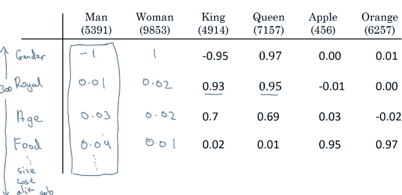
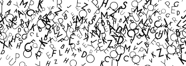
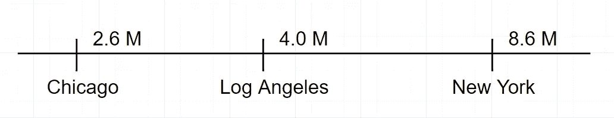
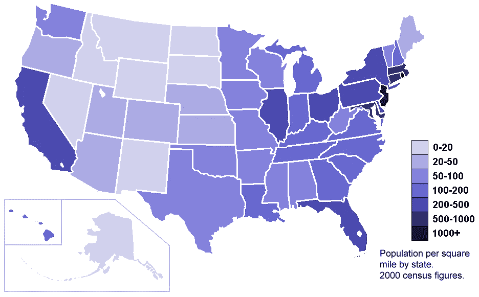
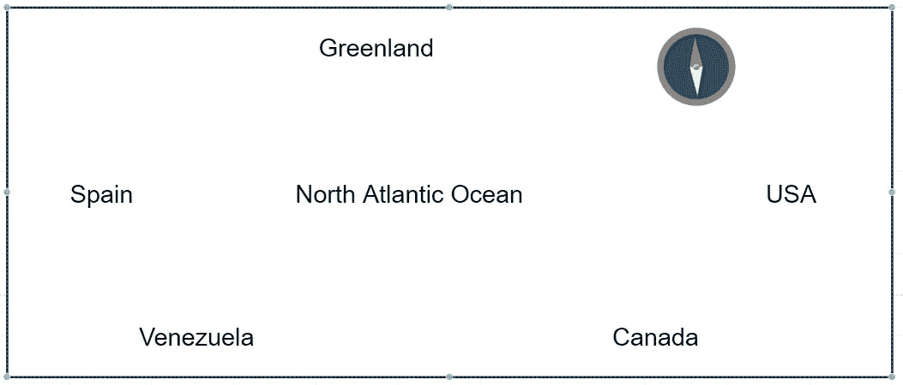
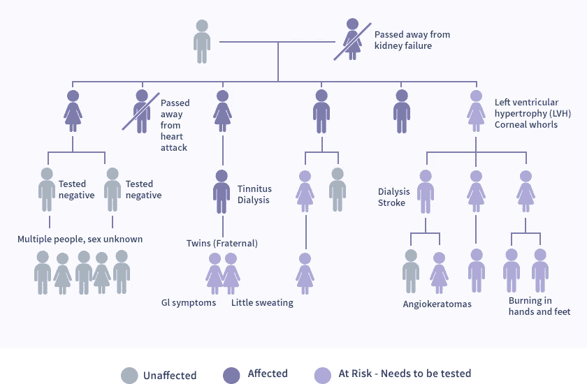
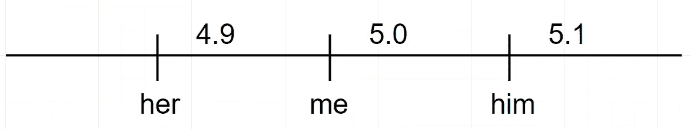
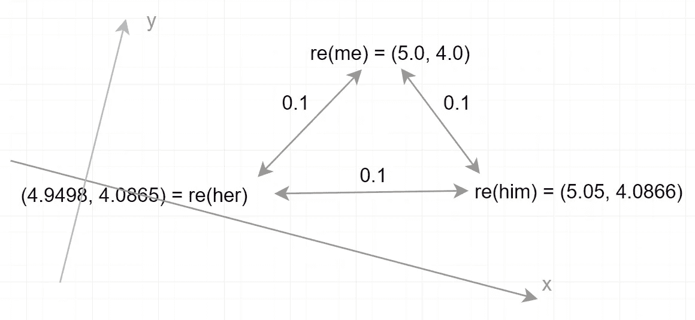

# YYY 的力量

> 原文：<https://medium.com/analytics-vidhya/the-power-of-yyy-fddecfc8df8a?source=collection_archive---------28----------------------->

# 为什么用文字表示，为什么用数字，为什么用嵌入。


不，为什么，我们如何在无尽的雾中安全航行？我们的祖先会怎么做？

> *本文之前是另一篇文章* [*《她 vs .何，一种新的见识》*](/@fleetpro/she-vs-he-a-new-insight-d0f86b88fca0?sk=8af193d8378f7763cd53d2ed5f40e4f6) *，强烈推荐。*

**目标**

我将激发您对单词表示技术的兴趣，这样您就可以在我的下一篇文章中愉快而高效地研究这些技术本身。

# 为什么用一个词表示，像 re(happy) = (2，3)？

> 我们知道如果 A 能代替 B，A 就代表 B。

**表象是有目的的。**

你的名片代表你吗？是也不是。


你不希望你的名片在约会时代表你。

*   当他们需要你的联系方式时，它代表着你。
*   你出现在法庭上并不代表你。
*   你不想在甜蜜的约会中让它代表你。

单词表示的可能目的:

*   显示其拼写或声音:gauge→‘gauge’。
*   表明它在一个词汇中的地位:儿子→714。
*   在一个文档中显示它的频率:女儿→820。
*   表现其情绪:礼物→‘好的’,小的→‘坏的’。
*   传达它的意思:许愿→(3，-5，…，19，95)。

**就服务于其目的的程度而言，表现具有质量。**

*   词频很好的用数字表示:1995，…
*   表情符号不能完全代表 word 的情感，因为“技能”没有表情符号，或者与“专业知识”、“知识”等共享一个表情符号

如果“快乐”的情绪由符号“O”表示，即

*   模型(快乐)= '好'或'好'
*   型号(事故)= '坏'或' X '

那么世界上什么是‘好’+‘坏’，而你可能想要一个操纵:值(小礼物)=值(小)*值(礼物)= 0.3* 100= 30？

# **为什么用数字表示？**

# **因为数字是:**


数字…世界的起源？

*   从低端到高端的自然的深刻表现。
*   与我们的直觉一致，这也是来自大自然。
*   自由操作:加，减，乘，除，积分，导数，…

如果我们能有一个数字推理工具就好了，比如:

*   dist(技能，专长)= 0.1，dist(爱，恨)=无穷大，dist 为距离
*   dist('清洁你的牙齿'，'清洁你的脸')= 0.1，而 dist(牙齿，脸)= 20
*   re(sweet) = (2，3，…)，re 表示
*   dere( re(sweet) ) = sweet，dere 表示取消表示
*   value(sweet date)= | re(sweet date)| = | re(sweet)* re(date)| = | some vector | = 9999，(||表示长度)
*   接下来('我刷牙了')= '脸'
*   下一句(“我爱你。”，上下文)= '我也是'
*   接下来(“他迟到了。”上下文)= '他说对不起。'
*   re(人)+ re(冠)= re(王)，dere( re(王)** 2 ) =帝

所有这些想法的基础是接近性和连续性。数字是处理它们的唯一手段，有丰富的运算，如加、减、正、负、余数、模、乘、积分、衍生——以发展该领域的人工智能，直至无穷。我们将在下一篇文章中更多地讨论它。

```
'numbers' is more related to 'technology' than 'words' is to 'technology'.
Rate = 0.07 / -0.02 = 4.56
```

# **那么，我们为什么需要一个词来表示呢？**

从上面的趣味中，以下哪一项是正确的？

*   电脑更喜欢整洁的数字 523，而不是难看的“author”字符串。
*   数字系统在等着我们。如果我们有一个与人类在应用领域的理解非常一致的单词的数字表示，那么我们就可以利用数字运算的丰富性。
*   就数据和计算的巨大可用性而言，现在时机非常好。

一个数字单词表征系统可能有这样的外观:re(happy) = (3，9)，re(sad) = (-7，-3)，…，其中 re 是表示。



**我们的文字表述应用领域是什么？**

我们希望你的文字表述从文字中捕捉到什么？要看目的。

*   词频，出现的次数。琐碎。
*   这个词第一次被使用，概念化的那一年。容易吗？。
*   它在字典中的位置。琐碎。
*   它的情感在脸书的推特上。富有挑战性。
*   它在患者描述症状时的严重程度。不难。
*   它的意义，一般文化中的语义。最具挑战性。

我们寻求一种数字单词表示模型，该模型很好地捕捉了单词在一般文化中的含义，因此我们可以在消费者市场的自然语言处理(NLP)任务中使用它。尽管如此，一些人瞄准他们各自的特定领域。

**休息一下。AI 能翻译浪漫的细微差别吗？**

2018 年秋天，我乘火车旅行，在一次旅行中，我看到一位中国女士和一位新西兰先生在一起。他们都 50 多岁了，在北京都有生意，不久就要结婚了。他们似乎已经分享了 6 个多月的生活。没有什么看起来不自然，除了他们没有任何共同的语言！这位女士甚至不会用英语念腾讯的“QQ”，而是说“Keke”——一个中文音。这位先生。他说不出一个完整的中文句子，不管它有多短。他们是如何交流情感直到坠入爱河的？“我们有这个。”这位先生从口袋里掏出了一部手机。


想象一下，丈夫拿着一个移动翻译和妻子通话。

两个人的脸靠在一起，他把它放在嘴中间，然后它会把他翻译成中文，把她翻译成英文。手机翻译机够不够浪漫的交流，需要最细腻的细微差别的表达？他们一定过着太空时代的生活。如果他们想靠得更近，我建议他们把翻译从他们中间移开。我说的对吗？或者，给他们一个更好的，浪漫级别的翻译。

**意义是什么意思？如何衡量？**

如果我们试图在一般文化中捕捉单词的含义，那么单词的含义是什么？我们如何衡量它？在我们对意义的表达投入无尽的努力之前，这是至关重要的。为了找到一个词的恰当的数字表示，我们必须对意义进行测量。



单词，句子的意思是什么意思？

如果你觉得难，我也一样。相反，在下一篇文章中，我们可以有不同的想法。

**地图是用于几何捕捉的地点表示**

地图是对某物、某地最成功的描述。我们所说的位置，其实就是表象。

所以，re(多伦多)=多伦多的位置。

我们知道。

地点现在用二维向量表示，比如(纬度，经度)，三维向量(纬度，经度，高度)。

如果目的只是显示地方(城市)的人口数量，我们不需要(lat，long alt)。仅仅将城市名称排列在一条由人口数字标记的直线上就足够了:



所以，芝加哥= 2.6，洛杉矶= 4.0，纽约= 8.6

然而，人们会坚持使用(纬度，经度)表示法，在上面简单地标记或着色人口数量，因为这是一个巨大的潜在机会，可以从几何图形中找到更多的直观信息。地点向量，即(lat，long)，现在变成了地点的必选代词！一个好的单词表示法也会使单词的代词，被到处使用。



位置现在是地点的代名词，多亏了地图。

如果地点以如下方式表示，会发生什么情况:

以下是一个错误表示地点的例子:



这张地图在概念上是对地方的错误描述。

怎么了？

*   它有纬度/经度误差？只是精度问题。
*   它有拓扑错误？对，就是这样。这是一个概念问题。

没有办法在不撕裂或扭曲地球表面的情况下改变美国、加拿大和西班牙的位置。表面的撕裂和扭曲改变了概念。现在，美国和加拿大在大西洋的东面，而西班牙在西面。美国在加拿大的北面。你不能通过简单地拉伸(增加误差)地球表面来得到它。拉伸改变不了地理概念。

**会发生什么？**

如果我们的单词/句子表征允许撕裂/扭曲词义的拓扑结构，会发生什么？

*   dist('她在作弊。'，'我爱她') = 0.01
*   dist('她很诚实。'，'我讨厌她') = 0.01
*   dist(‘她很聪明。’，'我爱她') = 999
*   dist('她在作弊。'，'我讨厌她') = 999


颠倒-如果单词表示不能保持单词的邻近性。

我说过单词/句子表征的基础是邻近性和连续性。撕裂和扭曲不能保持邻近性和连续性。

**家谱可以是文字表示吗？**



家谱是家庭成员的一种文字表示，记录了等级关系。

我为什么问这个问题？因为我想让你有一个非传统的词语表达的灵感。

如果目的是捕捉等级关系，家谱可以是一个很好的名称表示。但是它并不能捕捉谁最喜欢谁，谁的收入是多少等等。

**现在试着建立一个单词表示法。**


让我们建立一个词来表达我的家庭成员之间的亲密关系。如果 A 和 B 私人关系密切，那么 re(A)和 re(B)一定是小数目。

我喜欢我儿子 10 分。所以如果 re(me) = 5，那么 re(him) = 5 + 1/10 = 5.1 或者 re(son) = 4.9。让我们不失一般性地选择 5.1。

更，我喜欢我女儿 10 分。没办法只能给她 re(她)= 4.9。这些表示符合一条直线:



还是那句话，我儿子喜欢我女儿 10 分。但是，根据以上，他们的距离已经给了 0.2 个单位，这意味着他只喜欢她 5 分(0.2 = 1/5。)怎么做才能捕捉到他们的亲密？

你猜对了。这种表现不再符合直线，而是一个平面。



构建{我、他、她}的文字表述，捕捉他们之间的亲密关系。

我选择了丑陋的分数和旋转坐标系，给你一个高科技但实用的氛围，为阅读下一篇文章做铺垫。

上面的词语表达抓住了词语{我，她，他}的亲密度。您可能会问以下问题:

*   把老婆加到词集中怎么办？
*   如果我们也能捕捉到他们的年龄呢？
*   如果我们事先没有办法衡量亲密特征，比如上面的 10 点，会怎么样？
*   如果我们必须捕捉单词的含义，而我们甚至没有度量标准，那该怎么办？

新的单词表示将不能驻留在上述平面中。我们必须再增加一两个维度。

问题:

*   为每个新单词添加一个新维度？
*   为每个新特征增加一个新的维度，比如年龄？
*   我们能说出代表的每一个维度吗？
*   更不用说那些我们无法测量的特征了。


高维空间和大脑。

那么，如果我们有 300 万个单词来表示，我们需要 300 万维的空间吗？300 万个数字乘以 300 万个字已经不少了！谷歌降到了 300。

# **提示。术语嵌入。**

*   我们必须降低表示的维数，例如，将 5 维向量集插入 3 维空间。这就引出了“嵌入”这个术语。谷歌的 word2vec 模型将 300 万个单词嵌入 300 维空间。
*   我们必须找到一种方法来捕捉和嵌入那些无法明确测量的特征。也许这就是现代 NLP 的关键技术之一。
*   命名一个单词表示的维度将是一件非常有趣的事情。从上面的实践来看，re(me) = (5，4)。这里的 5 是什么意思？是不是意味着我和 5 一样社交？建议第一维度的名称为“社交”。二次元可以命名为“血线”吗？还是新的复合概念？留给下面的文章吧。

从现在开始，我们可以互换使用单词表示和单词嵌入这两个术语。

```
'curious' is more related to 'creative' than 'planned' is to 'creative'.
Rate = 0.18 / 0.02 = 9.47'curious' is more related to 'creative' than 'obligated' is to 'creative'.
Rate = 0.18 / -0.01 = 16.36
```

那么，你现在对文字表现手法好奇吗？你想趁热买吗？我将抽出时间向他们简要介绍一下。

**前言延期(Postface)**

我们说“人工智能”的时候“人工”这个词是正面的，有“精雕细琢”的意思吗？或者，是否定的，暗示“不是正版”？

```
'bad' is more related to 'artificial' than 'good' is to 'artificial'.
Rate = 0.15 / 0.09 = 1.67
```

在本文中，我想以直观的方式探索单词嵌入的基本思想，旨在提高您对单词嵌入技术的好奇心。你会发现小而多的角落无法容纳科学思维。如果你期待一个漫长的人工智能之旅，尝试在你的人工智能知识中增加科学、系统的成分。

```
'technology' is more related to 'intelligence' than 'science' is to 'intelligence'.
Rate = 0.15 / 0.15 = 1.03 ----- It's 1, essentially.
```

**关于嵌入的更多信息**

在完成文章正文之前，不要阅读这一部分。

如果你熟悉流形的概念，单词嵌入和[流形嵌入](https://en.wikipedia.org/wiki/Whitney_embedding_theorem)是完全不同的概念。单词嵌入意味着减少一组单词表示的维数，如 2，如{ (5，4)，(3，-6)，(-3，2) }，同时保留主要属性。它不像保存和照顾每一个向量或每一个维度那样严格。这是个技术问题。在那里，少数派可以被压制或忽视。权衡是可以接受的，事实上，也是受欢迎的。

流形嵌入是一个严格的数学问题，例如非正式地研究将局部二维的球的表面放入二维空间而不撕裂它的可能性。这是一个科学问题。你不能删除任何细节。