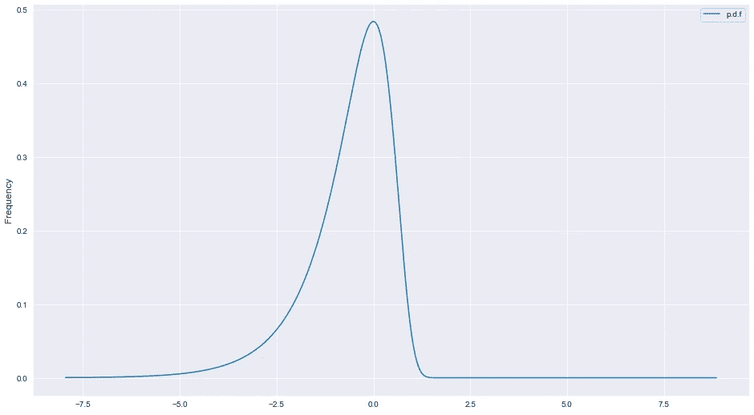

# 自然对数的概率密度函数

> 原文：<https://medium.com/analytics-vidhya/the-probability-density-function-of-a-natural-logarithm-b1506ea9f894?source=collection_archive---------14----------------------->

对数变换随机变量的概率密度函数，其概率分布函数是标准正态分布

在过去的几周里，我一直在对数领域工作，特别是使用自然对数，用“ln”表示。这样生活会更轻松。

我正在处理的数据集有一个由随机变量 X 驱动的分量，该变量呈正态分布(高斯分布)，均值= 0，标准差= 1。