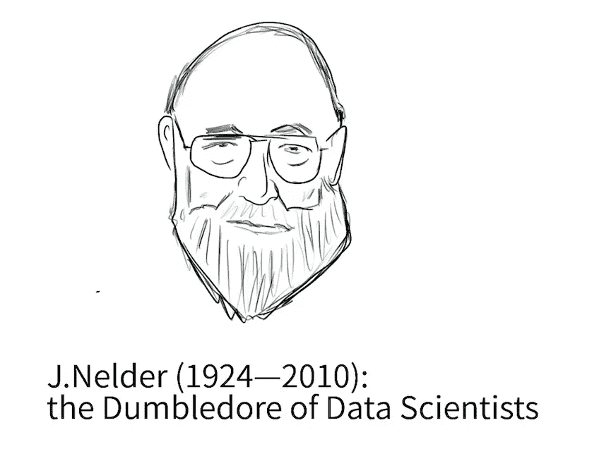
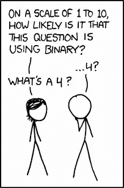

# 模型拟合过程&广义线性模型(GLMs)——第一部分

> 原文：<https://medium.com/analytics-vidhya/the-processes-of-model-fitting-generalized-linear-models-glms-part-1-84561f0ba4b4?source=collection_archive---------14----------------------->

## 建模过程的基本概念，什么是广义线性模型？为什么它们在构建模型中如此重要，但为什么数据科学家不关心它们？

在我看来，我认为 GLMs 在新的“数据科学世界”中的重要性应该得到更多的重视。更多地了解 GLMs 帮助我们理解建模的基本原理，并得到更好的拟合模型(我们的最终目标)。我经常听说由许多数据科学家构建的这些非常复杂的“预测性人工智能启发式模型”，这(大部分时间)听起来非常酷，非常超前。是的，它符合他们的测试数据，但它是一款*的合适型号吗？*

***为什么“良好拟合模型”在预测分析中很重要***

> *一个合适的模型有几个好处。模型的结构形式描述了关联和交互的模式。模型参数的大小决定了效果的强度和重要性。关于参数的推断评估哪些解释变量影响响应变量 Y，同时控制可能的混杂变量的影响。最后，模型的预测值平滑了数据，并在可能的解释变量值处提供了 Y 均值的改进估计。Agresti (2007 年)，*

# ***什么是偶数 glm？***

*Agresti (2007 年)将 GLMs 描述为“一大类模型”，包括“用于连续响应的普通回归和方差分析模型以及用于离散响应的模型”。但是，如果你必须背诵这个定义，对一个和你一起工作的计算机科学家——他/她会完全理解你还是假装理解你？*

**广义线性模型*在建模时**至关重要的原因就在它的名字里。**泛指。*****

*我们已经知道线性模型在现实世界中的用途和广泛应用。但是线性模型的五个假设(线性、独立性、方差齐性和正态性)往往给我们在很多情况下使用它造成了“约束”。具体来说，由于我们想要建模或预测的响应类型。*

*例如，在给定协变量的情况下，如果我们想预测一个感染了新冠肺炎病毒的人存活的几率会怎么样呢？我们可以使用线性模型吗？或者线性模型的线性假设成立吗？没有。但是我们可以很容易地使用 GLM！*

*因此，GLMs 不需要满足大多数这些要求(假设)。事实上，它扩展了正态分布的类别。基本上，**让我们为二进制、计数和正响应创建模型。***

*怎么会？为什么？让我们深入“模型拟合的过程”——来弄清楚这一点。*

*在我的 GLM 课上，我的导师兼助教甚至懒得讲解 GLMs 的精髓。因此，我求助于 80 年代末最受欢迎的“GLM 男孩”——麦卡勒和内尔德。甚至在深入研究 GLMs 的形式之前，他们用了整整一章来简要解释模型拟合的原因**作为解释数据的辅助(** McCullagh 和 Nelder (1989)) **。**然后，他们饶有趣味地讲述了 GLMs 的起源，并介绍了模型拟合的过程——让我们认识到 GLM 的概念及其在建模中的重要性。*

# ***模型拟合过程——根据 McCullagh 和 Nelder***

*概述了三个主要过程:(1)模型选择，(2)参数估计，(3)未来值预测。对于第一部分，我们将讨论模型选择。*

# ***1 型号选择—概述***

## ***步骤 1.1:“研究中的数据种类”***

*当我们获得了我们想要构建和拟合的模型的数据时，第一步是找出我们必须考虑的特定模型类别。基本上，定义你的反应变量，协变量的类型(二分法，定性等)。找出你应该考虑和选择的模型类型。*

*因此，如果我们的模型被认为是*有用的*，模型的类别必须与研究中的数据类型广泛相关。虽然这是微不足道的一步，但往往是最关键的一步。你应该已经被你可能考虑的大量模型类型淹没了——这是开始“漏斗”的方式。*

*例如，如果我们希望对一种疾病的幸存者数量建模(0 或 1，如果他们幸存)，我们将有一个二元响应。也就是说，我们会考虑二元和二项式回归模型的模型类别。*

## ***步骤 1.2:检查模型假设，排除您选择的模型***

*就像我们对线性模型的“经典回归分析”的独立性假设一样——**GLMs 也确实假设了独立的观察值(或者至少是不相关的)。**这在使用 GLMs 时非常重要，就好像时间序列和空间过程的自相关在我们的数据中很明显——它将被排除。同样，第二个约束条件是假设模型中只有一个误差项。*

*因此，检查你的模型假设。你的模型类有哪些模型假设？你的数据或观察是否违反了它们？检查您的残差图。*

## ***步骤 1.3:规模的选择(模型选择中被低估的概念)***

**

*因为这是 GLMs 的另一个巨大优势，也是它们如此重要的原因。尺度的选择非常重要，因为(我喜欢这样想)揭示了隐藏的关系！*

*我认为杜克大学医学中心(2009)的 Michael A. Babyak 博士(2009)很好地概括了开发模型中的尺度概念:*

> *如果一个朋友问我每天上班要走多远，我可以告诉他们我住在离办公室大约 26400 英尺的地方。然而，我更有可能说我住在离办公室 5 英里的地方。如果那个朋友来自一个使用公制的国家，我可能会说我住在大约 8 公里以外。我更喜欢用英里或公里来表示距离，因为这个比例对提问者来说更有直接意义。所有这三个以英尺、英里或公里表示的值指的是完全相同的距离。它们只是彼此的不同版本。*
> 
> *在回归模型中，我们为研究中的变量选择的尺度可以以类似的方式重新制定。因为回归系数表示 x(预测值)变化一个单位时 y 的预期变化，所以该系数的大小部分取决于所用单位的长度。正如在我最初的例子中将标度从英尺改为英里使我的朋友更容易理解或凭直觉判断距离一样，我们可以重新调整回归模型中的变量，以便帮助其他人更好地理解回归系数的潜在含义。*

*如果一个年轻的没有经验的数据分析师(他不知道规模)，检查了 R 上的成对散点图，并得出结论，在响应和协变量之间不存在线性关系。如果不调查协变量或响应转换后是否存在关系，这将是错误的，并会伤害某处的统计学家。这不会创建一个合适的模型。*

*线性回归模型中的一个常见选择是原始标度或对数标度，因为我们再次受到限制。因为，“响应变量的适当尺度必须将协变量效应的可加性与误差的正态性结合起来，包括方差齐性”(Czado，2011)。*

***但是 GLMs 不需要满足这些要求！**有了 GLMs，由于数据的“可加性”只能是粗略的近似值，但最重要的是——**缩放问题大大减少了。我们不再关心这些正态性和方差不变性的假设！我们需要知道的是方差如何依赖于均值，以便进一步分析。***

*这开启了一个全新的世界。我将在下一部分讲述更多内容，包括**参数估计和未来值预测。***

**请注意:以上是我个人对统计概念/书籍的评论/看法。我写这个博客是为了帮助自己准备研究生统计学考试。**

***来源**:*

*   *阿格莱斯蒂，2007 年。*分类数据分析简介*。霍博肯:约翰·威利&之子。*
*   *查多克劳迪娅和托尔斯滕.施密特。2011.*数学统计*。柏林:施普林格。*
*   *麦克·卡拉和内尔德，1991 年。*广义线性模型*。伦敦:查普曼与霍尔。*