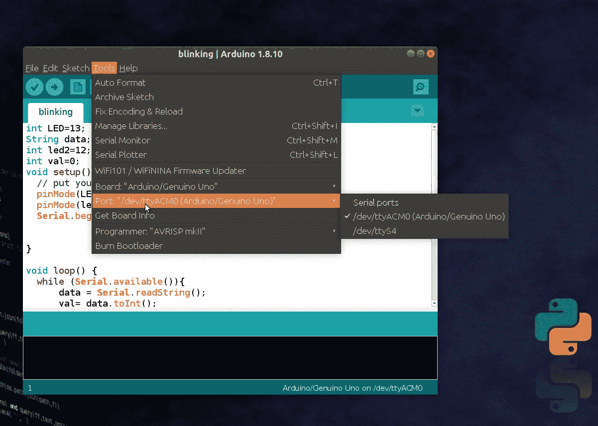
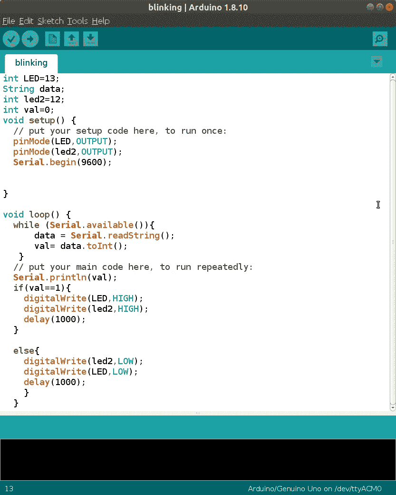

# PySerial 方式

> 原文：<https://medium.com/analytics-vidhya/the-pyserial-way-840c79cbe093?source=collection_archive---------6----------------------->

马库斯·沃利斯在 [Unsplash](https://unsplash.com?utm_source=medium&utm_medium=referral) 上的照片

*使用 Arduino 控制 LED 灯，语音到文本转换 api，当然还有很多 python！！*

> **先决条件:**
> 
> Arduino Uno
> 
> 一些发光二极管和电线(试验板，如果有的话)
> 
> Arduino IDE (可以从这里下载)
> 
> 和 python ❤️

# 步骤 1 安装 PySerial

只需使用 pip 就可以安装 pyserial 模块。遵循以下命令:

> **$ pip 安装 pyserial**

在 bash shell 中打开 python，尝试导入 Pyserial

> **> > >导入序列**

如果没有抛出错误，就可以使用 pyserial 了🎉

# 步骤 2 安装语音到文本转换 Api

使用以下命令安装语音到文本 api

> **$ sudo pip 安装语音识别**
> 
> **$ pip 安装 pyaudio**

**PS** 如果你在下载 pyaudio 时遇到错误，请点击[这里查看](https://ourcodeworld.com/articles/read/974/how-to-solve-installation-error-of-pyaudio-in-ubuntu-18-04-fatal-error-portaudio-h-file-not-found)。

检查两个模块的配置是否正确。在 bash shell 中打开 python，并键入以下命令

**> > >导入语音 _ 识别为 sr**

恳求🎊！我们已经完成了第 2 步..

# 第三步实际编码💻

> **关于 pyserial 的一点…**
> 
> Pyserial 用于使用 Arduino 电缆在 python 脚本之间传输和接收数据。顾名思义，数据是以串行方式传输的。Ser.read 和 ser.write 是两个 python 函数，可用于从 Arduino 脚本读取数据或将数据写入 Arduino 脚本。

将 Arduino 板连接到 PC 的一个端口。查看端口名称。你可以在这里找到它

从 arduino IDE 获取端口名

## 配置 python 脚本

创建一个新的 python 文件，导入 pyserial 和 SpeechRecognition。将此端口添加到 python 脚本中

> #in connect.py
> 
> ser =串行。串行('/dev/ttyACM0 '，9600)

**PS** :我用的是 9600 的波特率。你可以增加到 15200(但我建议去 9600)

连接您的 api 以将文本转换为语音

> r = sr.Recognizer()
> 使用 sr.Microphone()作为源:
> print(" Speak:")
> audio = r . listen(source)
> 
> m=r.recognize_google(音频)

现在检查语音到文本的转换，并执行相应的功能。我在这里控制发光二极管的开关。函数 ser.write()将把数据写入 arduino 的串行监视器，我们将在后面的脚本中使用它。

如果你使用 python3，你需要对你的字符串进行编码，否则它会显示错误。在这里，如果用户说“开”，字符串“1”被传递到串行监视器，而对于“关”，字符串“0”被传递。

> if(m = = ' on '):
> val = ' 1 '
> ser . write(val . encode(" utf-8 "))
> break
> 
> elif(m = = ' off '):
> val = ' 0 '
> print(val . encode(" utf-8 "))
> ser . write(val . encode(" utf-8 "))

太好了！您的 python 脚本已经可以使用了👍

## 配置 Arduino 脚本:

将指示灯连接到 arduino 的第 13 针和第 12 针。现在检查以下代码:

在这里，如果串行数据可用，脚本将读取数据(如果可用)。因为我们要发送一个字符串，所以我们需要使用 to int()函数将字符串转换成 int

现在把代码上传到板上，运行你的 python 脚本。试着说开/关，你会看到发光二极管变亮/变暗

**注意:如果你在上传代码时遇到权限错误，运行下面的命令**

> $**sudo chmod a+rw/dev/tty ACM 0**

请连接到强大的网络，因为没有网络 api 将无法工作

如果你完成了所有的步骤，给自己一个大拇指👍

完整的代码可以在我的 [github 库](https://github.com/ektaarora3501/pyserial)获得。

我希望我涵盖了所有的步骤。如果你被困在任何地方，请随时联系我。我喜欢❤️的建议