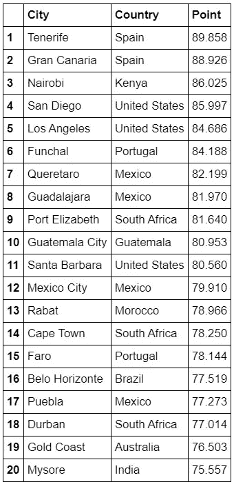
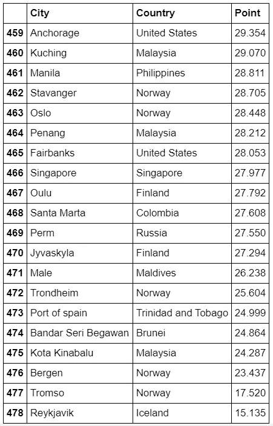
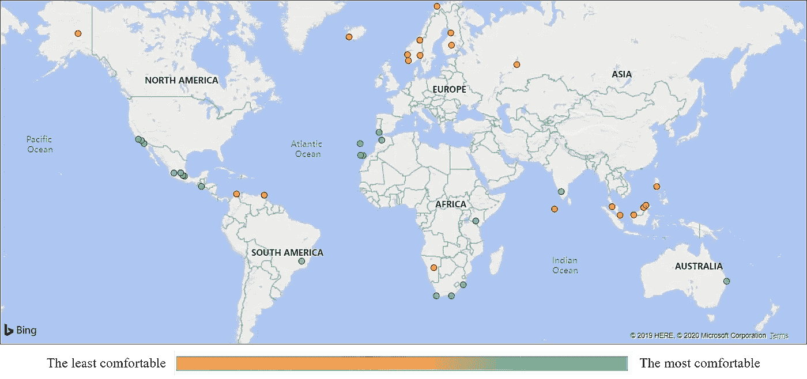
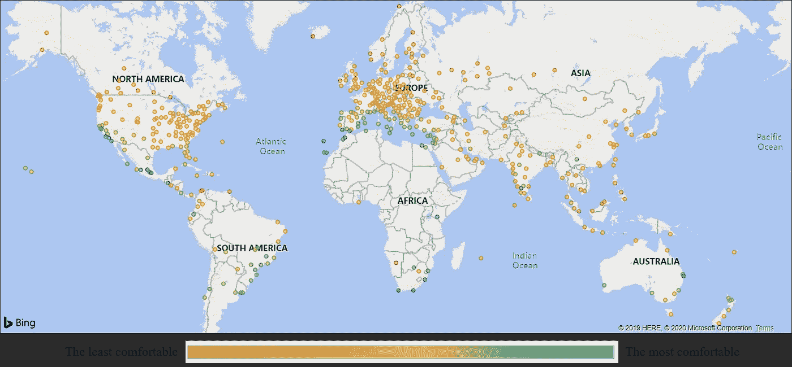

# 寻找世界上最好天气的探索

> 原文：<https://medium.com/analytics-vidhya/the-quest-for-finding-the-best-weather-in-the-world-bd5f24f7da09?source=collection_archive---------13----------------------->

我们都喜欢好天气，欣赏那些室外温度刚刚好的完美日子？但是，假设你想搬到世界上天气最好的城市——你如何找到符合这个定义的城市呢？网上有几篇文章试图解决这个问题，包括 Medium 上的一些文章:

[https://medium . com/@ BambouClub/哪个城市拥有世界上最好的气候-355e013e9e95](/@BambouClub/which-city-has-the-best-climate-in-the-world-355e013e9e95)

[https://medium . com/@ mnolangray/cities-of-the-world-where-you-dont-need-AC-or-heat-mapped-2 a3 d6e 018970](/@mnolangray/cities-of-the-world-where-you-dont-need-ac-or-heat-mapped-2a3d6e018970)

[https://thesysteriousworld . com/全年最佳天气城市/](https://themysteriousworld.com/cities-with-best-weather-year-round/)

不幸的是，上面的文章在他们的研究中没有使用严格的方法，因为他们只采用了过去几十年的平均天气数据，而没有考虑湿度。考虑到气候变化，遥远的历史数据往往是不准确的，因为世界各地的城市开始更频繁地经历极端天气，所以只看过去几年很重要。同样，湿度也至关重要，因为 25 摄氏度在拉斯维加斯非常宜人，在曼谷这样的潮湿城市则相当炎热。

在本文中，我将只分析过去 5 年(2015 年至 2020 年)的历史天气，使用每小时的天气数据以确保最大的准确性。但是给定所有这些数据，我们如何确定什么是“最佳天气”呢？我提议使用一种叫做“完美日子”的新颖指标，从最好到最差对城市进行排名。排名第一的城市将拥有一年中平均最多的“完美日”，在这一天天气正好合适。完美一天的标准是:

*   湿度调节(热指数)峰值温度在 18°C 和 24°C 之间
*   上午 8 点到晚上 10 点之间没有雨/雪/毛毛雨

然后，我找到 5 年的平均得分，我们得到一个指数，显示平均天气有多好，范围在 0.0 到 100.0 之间。

上述标准对我个人的品味来说是主观的，因为我找不到任何严格的研究来确定大多数人认为什么是“完美的”，但希望大多数读者会同意这个定义，如果不是这样，他们有可能在出版物结束时找到自己的答案。

**选择我们的城市**

现在让我们把手弄脏吧！首先，我们需要决定哪些城市应该被纳入我们的排名。我们希望将世界上最大的城市、热门旅游目的地和主要国家的首都很好地结合起来。Numbeo 的城市排名就是一个很好的例子，它提供了全球 433 个城市的价格统计。它偏向于西方国家的城市，代表了 60 个美国城市，但也包括印度的 10 个城市，中国的 6 个城市和其他地区许多国家的首都。因此，我们首先将 Numbeo 的城市列表解析到我们的数据库中，这很容易，因为它们都在一个页面上。

**寻找天气数据集**

事实证明，很难找到一个任意城市的免费天气数据集。NOAA 为世界各地的城市提供免费数据集，但不包括每小时的天气数据。也有两种付费服务提供每小时的天气数据，但它们相当昂贵，并且面向专业组织而不是业余研究人员(AccuWeather，天气公司)。因此，我求助于从一个流行的天气网站上删除必要的数据，其中包含历史每小时的天气。

**结果**

以下是世界前 20 大城市的列表，按照过去 5 年的平均值，从 0 到 100 进行排序。作为一个完美的一天，我计算出一个超过 0.8 分的分数，这基本上意味着它包括每天两个小时的温度(热指数)低于或高于我的完美天气条件。

下面是世界上排名最差的 20 个城市的列表，按照过去 5 年的平均值，从 0 到 100 分排序。

这是前 20 名和后 20 名城市的完整地图。红色的城市不太适合居住，而绿色的城市最适合居住。

这是所有城市的全图，根据城市的舒适度进行分析。

为了在下一篇[文章](/@esimonova/step-by-step-guide-on-working-with-the-weather-dataset-9aa8c77e30a8)中找到世界上最好的天气，我将解释我所做分析的技术细节。