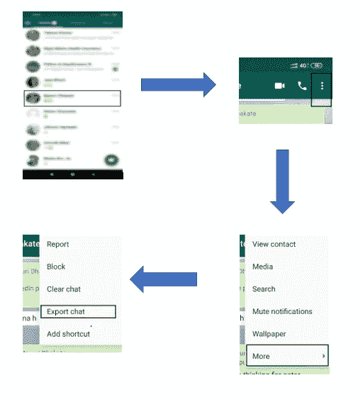
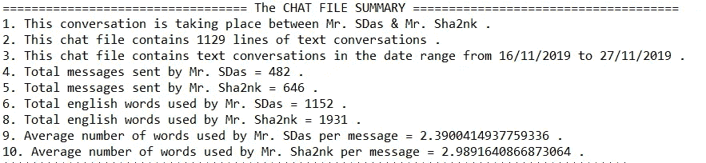
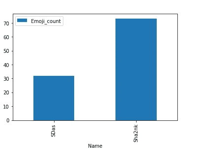
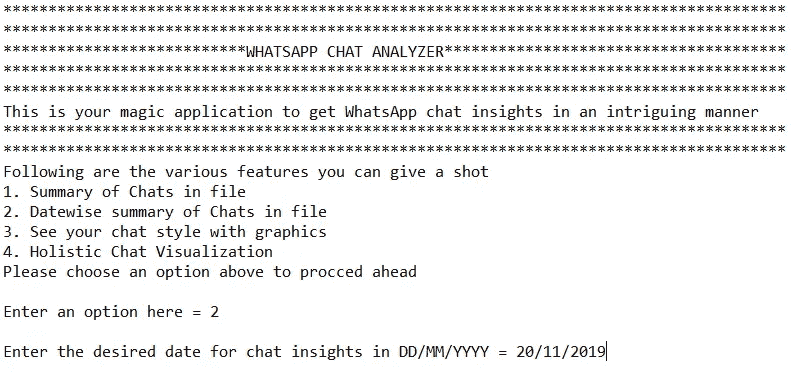
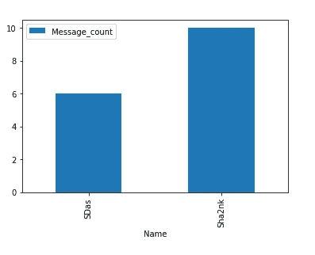
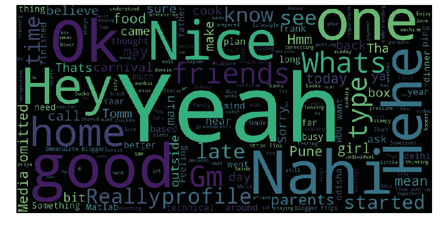

# 最典型的 Whatsapp 聊天分析器，可以统计评估你的友谊

> 原文：<https://medium.com/analytics-vidhya/the-quintessential-whatsapp-chat-analyzer-to-statistically-evaluate-your-friendship-a28ff179bf2f?source=collection_archive---------20----------------------->

有没有想过，得知自己与他人友谊的量化评价是多么令人兴奋和有趣的事情。我们人类天生喜欢群居，因此总是喜欢与他人交往，过着幸福快乐的生活。显然，如果不是有一个可靠的朋友让生活变得如此轻松，一个与世隔绝的人有许多困难和磨难要克服。社交网络巨头已经利用了人类固有的心理诱惑，并为我们提供了难以置信的工具来加强我们与他人的联系，并在个人和职业领域建立联系。虽然有许多渠道可以与他人交流我们的想法、想法和情感，但来自多个社会调查的证据显示，几乎四分之一的世界人口正在使用 Whatsapp，因为他们更喜欢保持联系。

在上述背景下，我想尝试一个有趣的项目，我们可以随着时间的推移分析我们与不同个人的 Whatsapp 聊天，并以惊人的准确性了解令人惊讶的事实。如果我通过这篇文章为您提供一个最简单明了的工具，让您在不侵犯您的隐私或拿您的数据冒险的情况下获得有趣的聊天见解，您认为您会觉得有多强大？

提议的聊天分析范例围绕多个操作层，其构建考虑到了它将消费的信息的敏感性。我已经尝试和测试了分析算法的各个方面，但最终决定分享详细见解的统计版本。所以你的典型聊天分析器由以下工作先决条件和管道组成。

## **第一步:导出 Whatsapp 聊天文件**

作为第一步，我们需要收集要操作的聊天文件。在 Whatsapp 应用程序中打开与个人的任何聊天实例，并遵循以下流程:

*$your_chat_person$ > >点击 3 个竖点(右上)> >【更多】> >【导出聊天】> >点击“无媒体”。*

检索 Whatsapp 聊天文件的屏幕流

它会自动生成一个纯文本文件的聊天考虑到日期与多个*。vcf* 文件用于共享电话联系人，没有媒体实体(即图像、gif、视频等。).

## **第二步:将你的真名转换成假名**

虽然这是可选的，但如果你想分享信任圈之外的见解，并喜欢匿名，这一步是强烈推荐的。导出的文本文件需要用伪名称进行抽象，方法是用带有适当引用的随机名称替换现有名称。在解释洞见的过程中，它将帮助我们去引用和发现有趣的事实。

## 第 3 步:获取包含/不包含停用词的聊天摘要(英语)

你期待已久的真正魔力就发生在这里，通过聊天分析和清晰的统计推断。注意包含或排除英语词汇中常用的停用词。一旦你有了预处理的文本聊天文件和 [my github 分叉的](https://github.com/Shashank545/WhatsApp-Chat-Analyzer/)或克隆的源代码，你就可以飞了。只需在与本地或虚拟环境相关联的 python 实例上运行以下命令，即可快速获得摘要。

*>>python whatsapp chat analyze . py<chat _ file . txt>*

聊天摘要结果的实例

## 第四步:通过表情符号推断你朋友的聊天风格

每个人都有独特的聊天方式。这一步将使你对聊天文件中使用的表情符号的选择和数量有一个初步的了解。亲自尝试一下，看看总结中的显著差异。

谁用过的表情符号更多？

## 第五步:按日期分析聊天记录

为了使它更加精确，您可以尝试此功能来了解在给定日期发生的聊天的强度、数量和频率，以及谁发送了多少条消息或文字。确保在下面聊天分析器的启动提示中选择正确的选项。

欢迎使用 WhatsappChatAnalyzer

2019 年 11 月 20 日交换的消息

## 第六步:聊天可视化

对于高度痴迷于图像、图表、图形和其他可视化工具的人来说，可以利用这一功能来发现与人的特征有合理相似性的直观的未知事实。词群中词的密度越大，你和那个人的友谊就越亲密。这是在漂亮的标准词云功能的帮助下实现的，特别是考虑到人们在各种对话上下文中选择的过滤词。

对话中第一个人的单词云

对话中第二人称的词云

## 结论

你还在等什么？请继续和你的朋友们一起尝试，并对你的结果感到惊讶。这只是一个谦卑的努力，向我的读者展示了我们日常应用在实地测试和强化我们在数据科学和非结构化文本数据领域的知识库方面简单而有趣的潜力。*用更先进的分析技术尝试基于文件的群聊怎么样？这难道不令人兴奋吗？请尝试一下，并与我分享您的观察结果。*

最后但并非最不重要的是，请通过下面的频道关注我，了解更多此类技术内容。

[*中型*](/@Immaculate_sha2nk) *，* [*脸书*](https://www.facebook.com/TheSha2nk) *，* [*推特*](https://twitter.com/TheSha2nk) *，* [*GitHub*](https://github.com/Shashank545)

*！！祝阅读愉快！！*