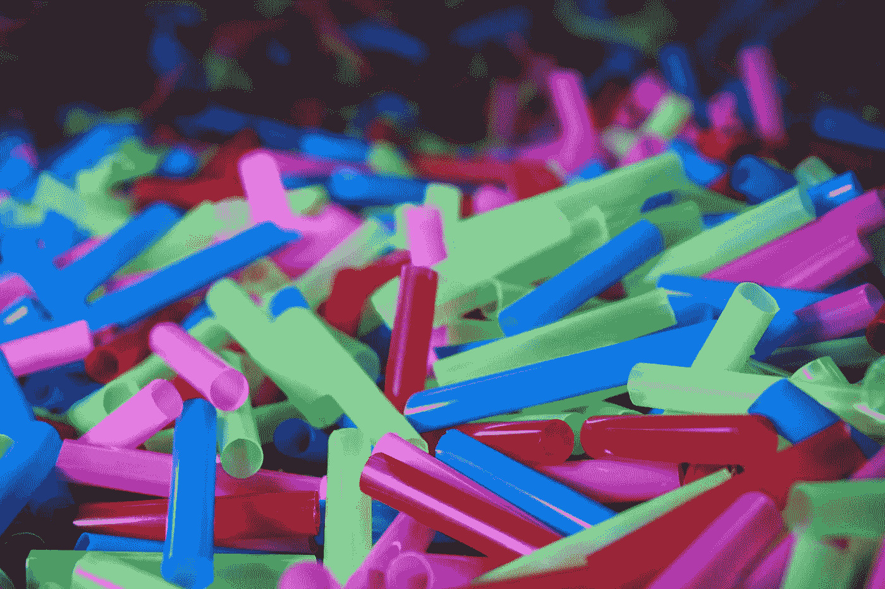
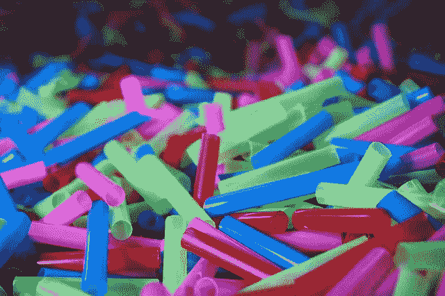
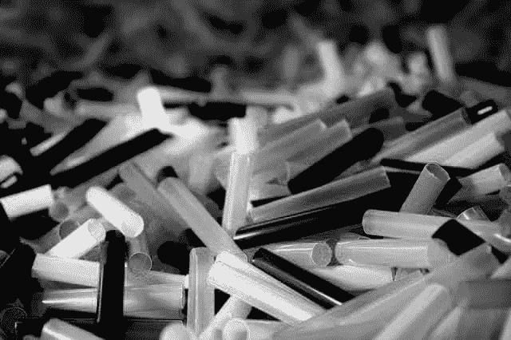
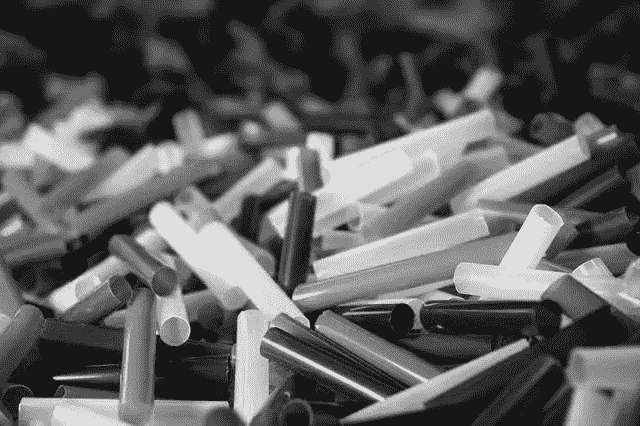
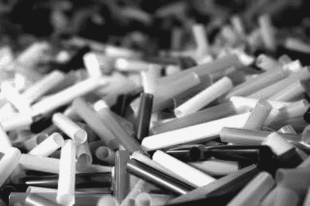
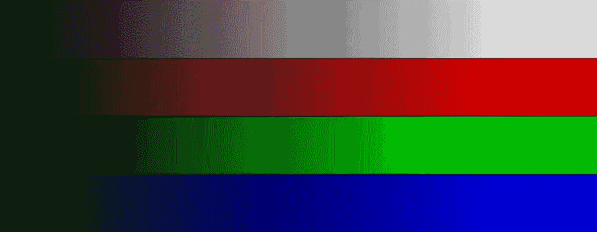
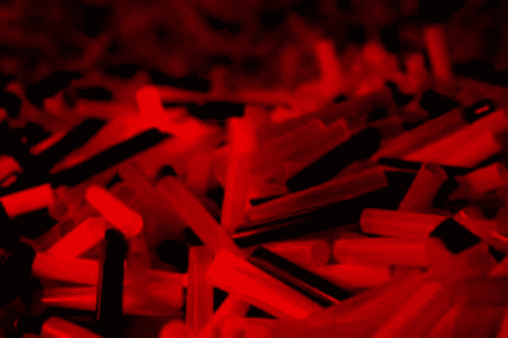
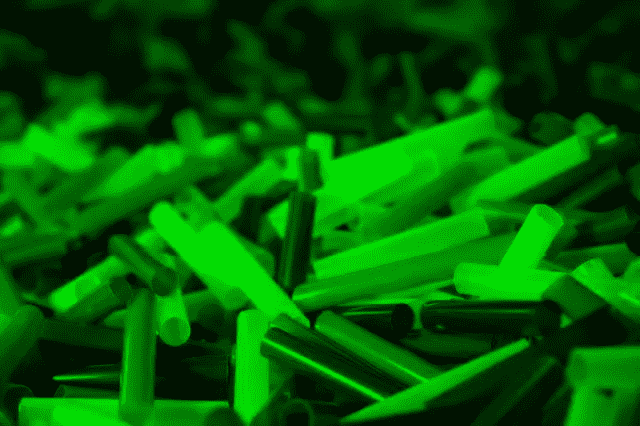
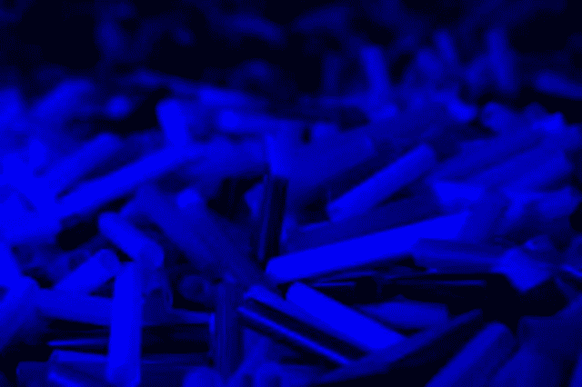

# 图像中的 R、G 和 B

> 原文：<https://medium.com/analytics-vidhya/the-r-g-and-b-in-an-image-971b9aecfb7f?source=collection_archive---------1----------------------->



图片提供:[最大像素](https://www.maxpixel.net/Plastic-Blue-Colorful-Green-Red-Isolated-Color-3148888)

如果你还没有看过系列文章的最后一篇，请在这里阅读:[Python 中的数字图像处理简介](/analytics-vidhya/lessons-on-digital-image-processing-2-983d8bab98c8)。

典型的彩色图像由三个颜色通道组成:红色、绿色和蓝色。每个颜色通道有 8 位，可以表示 256 个不同的值。使用所有三个通道的组合，我们可以创建大约 1600 万种颜色。你可能以前听说过这个术语。现在你知道那是从哪里来的了。

在这篇文章中，我们将学习更多关于图像的不同组成部分。让我们在 python 控制台中尝试一切，这可以通过在终端中运行以下命令来启动。如果你还没有安装 Python，[请按照我上一篇文章](/@yedhukrishnan/lessons-on-digital-image-processing-2-983d8bab98c8)中的说明操作。

```
python3
```

您可以下载并使用下面给出的示例图像。它有不同的颜色，这就是我们需要的。



图片提供:[最大像素](https://www.maxpixel.net/Plastic-Blue-Colorful-Green-Red-Isolated-Color-3148888)

导入库并加载图像:

```
import imageio
image = imageio.imread('colors.jpg')
```

现在我们在控制台中有了一个 NumPy 数组的图像。如果您想查看图像的尺寸，请运行:

```
image.shape
```

你会得到类似`(426, 640, 3)`的东西。这意味着图像的高度为 426 像素，宽度为 640 像素，有三个颜色通道。我们现在对颜色通道感兴趣。让我们将各个通道写入单独的图像文件:

```
imageio.imwrite('red.jpg', image[:, :, 0])
imageio.imwrite('green.jpg', image[:, :, 1])
imageio.imwrite('blue.jpg', image[:, :, 2])
```

`:`用于获取所有值。例如，`image[:, :, 0]`表示获取所有行、所有列和第一个(索引为 0)颜色通道，即红色通道。我将在下一篇文章中更多地讨论索引和切片。如果你很好奇，可以在这里了解更多:[索引和切片](https://docs.scipy.org/doc/numpy-1.13.0/reference/arrays.indexing.html)(或者[这里](https://www.tutorialspoint.com/numpy/numpy_indexing_and_slicing.htm))。

如果您打开刚刚创建的文件，您会看到类似这样的内容。



红色、蓝色和绿色分量

为什么它们看起来都是灰色的？

这是因为它们现在是单通道图像。它们将被保存为灰度图像。如果使用命令看到绿色组件的形状:

```
image[:, :, 1].shape
```

你会看到`(426, 460)`。缺少颜色通道部分。每个像素将具有单个 8 位值(不同于 RGB，RGB 具有 R、G 和 B 三个 8 位值)。

但是如果仔细观察，您会发现红色通道图像中的灰度值对应于彩色图像中的红色量。


红色的分布。在最左边，红色的值是 0，在最右边，它是 255。当我们从左开始写时，该值逐渐增加。

例如，在彩色图像中看到红色吸管。红色像素是`[255, 0, 0]`，它在上面显示的颜色分布图的右侧。绿色和蓝色分量将为零。

在`red.jpg`图中，同样的吸管颜色是白色，也就是 255。并且相同的吸管在绿色和蓝色分量图像中都呈现黑色(`0`)，因为红色像素没有蓝色或绿色分量。



灰度、红色、绿色和蓝色通道的颜色分布。在所有情况下，左边是 0，右边是 255。

如果你想看到实际的颜色，而不仅仅是灰色的图像，你需要保留所有三个通道，并将其他通道的值设置为零。例如，要获得红色分量，请将绿色和蓝色通道值设置为 0，如下所示:

```
red_image = image.copy()
red_image[:, :, 1] = 0
red_image[:, :, 2] = 0
imageio.imwrite('red_image.jpg', red_image)
```

在这里，我制作了一个图像的副本，并将所有蓝色和绿色通道的值设置为零。这是`:`的另一种便捷用法，可以为 NumPy 数组中的多个像素设置相同的值。

同样，您可以创建绿色和蓝色图像。它们现在看起来像这样:



多彩的红色、绿色和蓝色组件

请注意，对于黄色吸管，红色和绿色组件都处于活动状态，但蓝色组件缺失(黑色)。像素值将更接近`[255, 255, 0]`。

RGB 图像中的白色将被表示为`[255, 255, 255]`。对于所有分量，RGB 图像中的灰色像素将具有相同的值。当我们取所有三个值的平均值时，我们得到相同的数字。例如，RGB 中的灰度值`[57, 57, 57]`在灰度图像中将具有值`57`。我们在第一篇文章中讨论过[将 RGB 图像转换成灰度图像。](/@yedhukrishnan/lessons-on-digital-image-processing-1-b7a1fa3acfe9)

现在你知道 RGB 图像是如何制作的了；通过使用 R、G 和 B 颜色通道上的值的组合。同样的技术用于所有现代彩色显示器，包括手机和电视屏幕。这里有一个由慢镜头制作人制作的很酷的视频，解释了这在电视上是如何工作的。

在接下来的文章中，我将解释如何使用 Python 处理数字图像。现在，请分享您的反馈和建议。