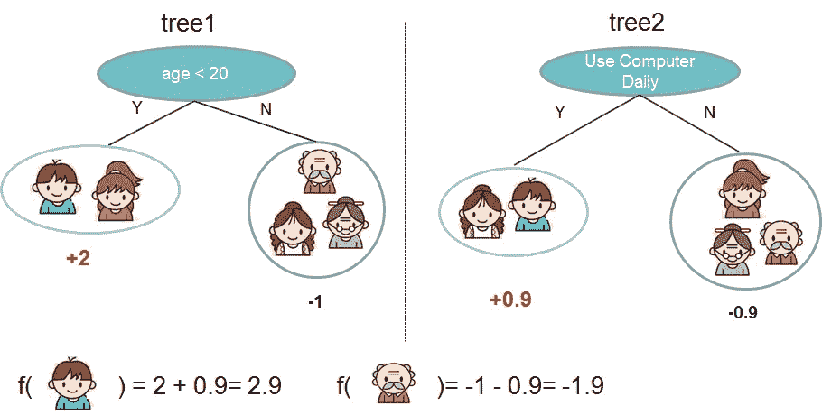
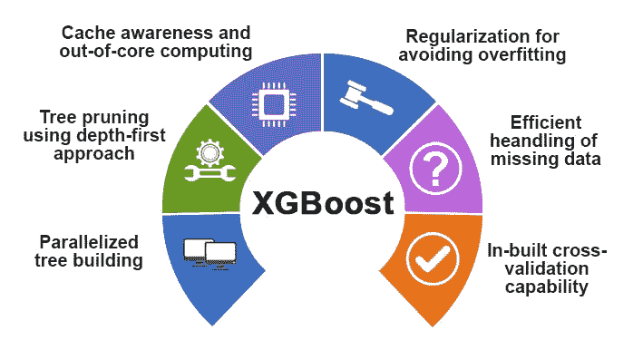
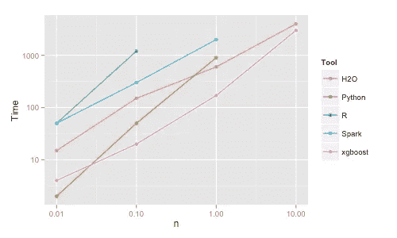
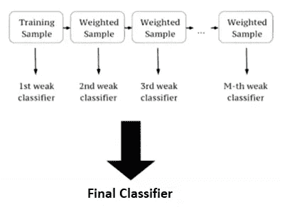

# 最近的 ML 算法女王:XGBoost 及其未来

> 原文：<https://medium.com/analytics-vidhya/the-recent-queen-of-ai-algos-xgboost-and-its-future-22d6df3cd206?source=collection_archive---------8----------------------->

> “有人称之为人工智能，但事实是这项技术将增强我们的能力。因此，我认为我们应该增强我们的智能，而不是人工智能。”—吉尼·罗梅蒂

二叉树、随机森林和回归算法等算法统治 ML 世界已经有十年了，直到 2014 年推出了最新的 XGBoostalgorithm， ***陈天琦。***

**XGBoost** 是一种基于决策树的集成机器学习算法，它使用了梯度推进框架。在涉及非结构化数据(图像、文本等)的预测问题中。)人工神经网络往往优于所有其他算法或框架。

XGBoost 代表 ***极限渐变提升。*** 就像是‘类固醇’上的梯度推进机。它是梯度推进决策树算法的实现，有几个开发者的贡献，现在归属于组织**分布式机器学习社区或 DMLC。**

那么两者的基本区别是什么呢？

***XGBoost 这个名字实际上是指提升树算法的计算资源极限的工程目标。这也是很多人使用 XGBoost 的原因。***

***—陈天齐***

# 了解 XGBoost

要理解 XGBoost，首先要理解梯度下降和梯度提升。

**a)梯度下降:**

成本函数衡量预测值与相应的实际值有多接近。理想情况下，我们希望预测值和实际值之间的差异尽可能小。因此，我们希望成本函数最小化。

与已训练模型相关联的权重使其预测出接近实际值的值。因此，与模型关联的权重越好，预测值就越准确，成本函数就越低。随着训练集中的记录越来越多，权重被学习然后被更新。

梯度下降是一种迭代优化算法。这是一种最小化具有多个变量的函数的方法。因此，梯度下降可用于最小化成本函数。它首先使用初始权重运行模型，然后通过多次迭代更新权重来寻求最小化成本函数。

**b)梯度增强:**

*:构建弱学习者的集合，其中错误分类的记录被赋予更大的权重(“提升”)，以在稍后的模型中正确预测它们。这些弱学习者随后被组合成一个强学习者。Boosting 算法有 AdaBoost、梯度 Boosting、XGBoost 等多种。该图描述了树集合模型。*

**

*预测给定用户是否喜欢电脑游戏的树集成模型。+2，+0.1，-1，+0.9，-0.9 是每片叶子中的预测分数。给定用户的最终预测是来自每棵树的预测的总和。*

*梯度推进将梯度下降和推进的原理带到监督学习中。梯度增强模型(GBM)是按顺序连续构建的树。在 GBM 中，我们取多个模型的加权和。*

*   *每个新模型使用**梯度下降**优化来更新/修正模型要学习的权重，以达到成本函数的局部最小值。*
*   *分配给每个模型的权重向量不是从先前模型的错误分类和分配给错误分类的结果增加的权重中导出的，而是从通过梯度下降优化以最小化成本函数的权重中导出的。梯度下降的结果是和开始一样的模型的函数，只是参数更好。*
*   *梯度 **Boosting** 在每一步的现有函数上增加一个新的函数来预测输出。梯度增强的结果从一开始就是完全不同的函数，因为结果是多个函数的相加。*

***c) XGBoost:***

*XGBoost 的构建是为了推动提升树的计算资源的极限。XGBoost 是 GBM 的一个实现，有很大的改进。GBM 按顺序构建树，但是 XGBoost 是并行的。这使得 XGBoost 速度更快。*

# ***使其成为算法女王的一些主要特性***

*在开发和设计 XGBoost 算法时，主要考虑的是**速度**和**模型性能增强。**此外，它支持 scikit-learn 的功能，如三种类型的梯度增强，即**梯度增强、正则化梯度增强和随机梯度增强。**它还专注于支持一系列不同类型的计算，但这是由一系列不同的参数决定的，数据集的大小和结果的要求形式是其中的一部分。*

*   ***树构造的并行化**在训练期间使用你所有的 CPU 核心。*
*   ***分布式计算**使用机器集群训练非常大的模型。*
*   ***核外计算**适用于内存容纳不下的超大型数据集。*
*   ***数据结构和算法的缓存优化**充分利用硬件。*
*   ***正规化学习目标:***

*在给定一组参数的情况下，要测量模型的性能，我们需要定义一个目标函数。一个目标函数必须总是包含两部分:训练损失和正则化。正则项降低了模型的复杂性。*

***Obj(θ)= L(θ)+ω(θ)***

*其中ω是大多数算法忘记包含在目标函数中的正则项。但是，XGBoost 包括正则化，从而控制模型的复杂性，防止过拟合。*

*其他一些区别于它的特征是-*

*   ***应用广泛**:可用于解决回归、分类和用户自定义预测问题。*
*   ***可移植性**:在 Windows、Linux、MacOsX 上运行流畅。*
*   ***语言**:支持所有主流编程语言，包括 C++、Python、R、Java、Scala、Julia。*
*   ***云集成**:支持 AWS、Azure 和 Yarn 集群，与 Flink、Spark 和其他生态系统配合良好。*

**

# *其卓越性能的一些证据*

*最近**Szilard Pafka**ELTE 布达佩斯 tvö大学的首席数据科学家执行了一些关于 XGBoost 算法的最新基准测试，与梯度提升和袋装决策树进行了速度比较。*

**

*由 **Szilard Pafka** 获得的结果*

## *XGBoost 的构建使用了哪些算法，它是如何超越其他算法的？*

*这种算法有许多不同的名字，如梯度推进、多重加法回归树、随机梯度推进或梯度推进机器。*

**

*Boosting 基本上是一种添加新模型来纠正现有模型所产生的错误的技术。模型按顺序添加，直到没有错误需要消除。一个流行的例子是 Ada Boost 算法，它对难以预测的数据点进行加权。*

*梯度推进是一种方法，其中创建预测先前模型的误差的新模型，然后将这些新模型相加在一起以进行最终预测。它被称为梯度提升，因为它使用梯度下降算法来最小化添加新模型时的损失。*

*这种方法支持回归和分类预测建模问题。*

*为了深入了解，一定要看一看*

*在 Google Cloud 上实现 XGBoost*

# *现在，什么时候使用 XGBoost，什么时候不使用*

## *XGBoost 是一个更好的选择，*

1.  ***你有大量的训练样本***

*→超过 1000 个训练样本，不到 100 个特征。*

*→特征数量少于训练样本数量。*

*2.**你混合了分类和数字特征***

## *XGBoost 不太适合*

1.  *图像识别*
2.  *计算机视觉*
3.  *自然语言处理*
4.  *当训练样本数量明显小于特征数量时。*

# *未来是什么样子的？*

*机器学习是一个非常活跃的研究领域，已经有几个可行的 XGBoost 替代方案。微软研究院最近发布了一个轻量级的 GBM 框架，显示了巨大的潜力。Yandex Technology 开发的 Cat Boost 一直在提供令人印象深刻的基准测试结果。我们有一个更好的模型框架，在预测性能、灵活性、可解释性和实用性方面胜过 XGBoost，这只是时间问题。然而，在一个强大的挑战者出现之前，XGBoost 将继续统治机器学习世界！*