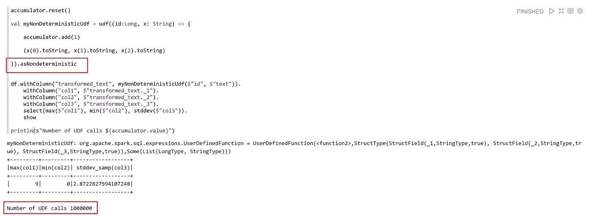
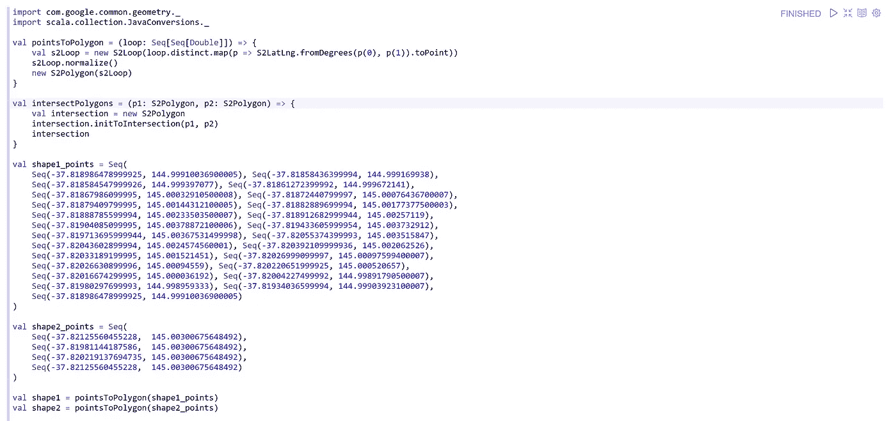

# 不稳定的秘诀

> 原文：<https://medium.com/analytics-vidhya/the-recipe-of-instability-f2e914e31f5a?source=collection_archive---------3----------------------->

## Spark UDFs 非纯计算

火花是快速的，火花是灵活的，火花是可怕的，但有时它碰巧也是令人兴奋的。当 Spark 应用程序中需要大量的逻辑时，最简单的处理方法是编写一个用户定义的函数或简称为 UDF。有一种传统认为 UDF 对性能不太好，因为它们阻止了许多优化，如预测下推等，但有时它们是不可避免的。

在这篇文章中，我将分享一些关于 UDF 在调用非纯函数时如何变得棘手的想法。

## 设置

几乎所有事情都可以使用本地 Spark 安装来完成，但有时真实集群上的行为与本地实例不同，所以我将使用 Azure HDInsight Spark 集群。只要工作节点数大于 1，任何大小都可以。本例中使用的版本是 HDI 4.0 上的 Spark 2.4。我会用齐柏林飞艇，用的笔记本会在帖子最后分享。

同样在 Zeppelin 中， **livy2** 解释器必须被更新以引用一个以后会用到的外部依赖。所以配置值 **livy.spark.jars.packages** 应该设置为**io . SGR:S2-geometry-library-Java:1 . 0 . 0**

## 数据帧和 UDF

从一些经典的数据帧和 UDF 基础开始，让我们启动 Zeppelin，从一个 100 万行的简单数据帧开始，它有一个 id 列和一个包含 id 值的文本列。

假设需要一个复杂的逻辑，使得文本列必须被转换成一个表示文本列的第一、第二和第三个字符的 3 个值的元组。这可以使用 Spark SQL 中的`substring`函数来实现，但是现在，我们将使用 UDF。UDF 还引用了一个累加器，用于计算 UDF 被调用的次数。

UDF 应该像预期的那样将文本列转换成包含 3 个元素的元组。

预计如果上述转换后的列在整个数据帧中具体化，那么将为数据帧中的每一行调用 UDF，在我们的例子中是 1M。

使用 DataFrame 的`explain`函数，上述查询的执行计划显示了对 UDF 的一次调用，这是预期的，加上 Spark 聪明地将创建文本列的表达式包含到相同的计算中。

但是，如果想要提取 UDF 产生的元组的单个元素并对它们做一些事情，会是什么情况呢？UDF 会被每行调用一次吗？

哇！300 万次 UDF 调用，这意味着每个依赖于 UDF 输出的表达式都会被调用一次。另一个事实是调用的数量是 300 万而不是 400 万，因为列`transformed_text`本身在最终的动作结果中是不需要的，所以只有用于拉元组元素的单个表达式才是满足查询所需要的。执行计划清楚地表明了这一事实。

那么为什么会出现这种行为呢？默认情况下，Spark 将任何 UDF 视为确定性函数。这意味着它可以针对相同的输入被多次调用，而没有风险，因为输出将是相同的。这个概念听起来像是由两个主要属性确定的纯函数(复制自维基百科):

1.  对于相同的参数，它的返回值是相同的
2.  它的评估没有副作用

默认情况下将 UDF 视为确定性的这一决定很可能与 Spark 查询执行计划优化有关。

## 每行一次调用

假设我们希望每行调用一次 UDF，如何实现呢？第一个想法可能是在涉及 UDF 的表达式之后直接引入缓存(外加一个动作)。这听起来像一个计划，但它更像一个黑客，而不是一个适当的解决方案。

Spark 社区从 2.3.0 版本就已经提供了这个问题的解决方案。解决方案是将 UDF 标记为非确定性，这样 Spark 将被迫具体化其结果，从而每行调用一次。

每行调用一次 UDF，然后后续表达式从该点开始继续。

因为如果 UDF 内部的逻辑很复杂，对相同的输入重复 UDF 在计算上会很昂贵，所以一些人放置了一个 SPARK [吉拉票](https://issues.apache.org/jira/browse/SPARK-27761)来使 UDF 在未来 SPARK 主版本中默认为不确定的。此外，围绕 UDF 的简单直觉可能导致非确定性模式应该是默认模式的假设，因为这是用户自然期望他们的代码运行的方式。

令人惊讶的是，当我在 Azure 上的 DataBricks 集群上尝试相同的代码时，我不需要将 UDF 标记为非确定性来获得每行一个调用的行为。出于某种原因，它似乎被默认纳入了 DataBricks Spark 发行版。

**不稳定怎么办？**

即使我们有无限的计算能力，并且不介意每行多次执行 UDF，也可能有其他因素需要考虑。在某些特定情况下，UDF 内部的代码可能会为相同的输入返回不同的结果。这清楚地表明了另一个问题，但由于大数据应用的性质，这可能不是很明显，但肯定会造成很多混乱。

稍微偏离一下 Spark world，我们来说一个在空间应用中使用的库。 [S2 几何](https://s2geometry.io/)是谷歌的一个库，用于空间映射和操作几何形状。不幸的是，这个库的 maven 依赖项基于一个自 2011 年以来就没有进行过功能更新的 fork。该库本身是健壮的，与定义空间形状和执行其他操作(如相交等)的功能相关。

尽管如此，任何事物都有其极限和工作条件。让我们使用 Spark 的这个库做一个简单的实验。我在设置部分提到过，我们可以通过更新 **livy2** 解释器的配置值来引用这个库。

## 十字路口的困境

这个实验中涉及的形状基本上是一个多边形，代表墨尔本附近的一个矩形区域，另一个多边形实际上是一条与矩形相交的线段。

这些形状可以在实际应用中找到，虽然这不是一个非常常见的用例，但非常适合我们在这里的讨论。这些形状可以在同一个笔记本中表示，如下所示:

有几个函数可以从一组点中创建 S2 多边形，还有一个函数可以使两个多边形相交并返回相交多边形。由于我不擅长命名，请记住**形状 1** 是矩形，而**形状 2** 是线段。我们可以利用 S2 找出他们各自的领域。

看到这么小的数字有点奇怪，但这是有原因的。S2 将地球上的点投影到单位 1 的球面上。所以 S2 的多边形面积表示单位球面上多边形的面积。例如，要获得以平方公里为单位的人类可读区域，可以计算如下:

> (S2 面积)×(地球表面积)/ 4 π

在我们的例子中，矩形的面积约为 0.06 平方公里。该线段的面积为 5.15007217004638 平方米😯

无论如何，让我们将两个图形相交，并获得交点的面积。我就开门见山，重复这个操作 10 次，看看会发生什么。

这是完全不可靠的，S2 交集对同一组输入随机返回两个不同的结果。实际上，一个结果是预期的接近零的面积，另一个是 12.566…这是 4π，或者说是地球的表面积。我对谁对谁错并不感兴趣，这可能是一个哲学问题。这里我主要关心的是计算的不确定性。

## UDF 是如何工作的？

我想现在你已经明白我想强调的是什么了；非确定性计算将导致混乱的结果，如果从一个火花 UDF 没有被标记为非确定性，但让我们来看看自己。为了模拟这种情况，需要一个 UDF 来相交两个形状并返回相交面积和任何其他计算，例如相交面积与其中一个形状的面积之比。

接下来，创建一个 10 行的数据帧，其中每行有两列，包含我们之前看到的两个相同形状的点。然后调用 UDF，并创建两个额外的列来挑选由 UDF 生成的元组的各个元素。

预计面积列将在这个非常小的数字和 12.566 之间波动。但是，对于相同的相交面积值，相交比率列不一致。例如，两个红色突出显示的行具有相同的交集面积，但交集比率完全不同，尽管它们的列表达式来自同一个源列。如果你还记得这篇文章中的前几个例子，你会注意到根本原因是对同一输入行多次调用 UDF，而每次调用可能会对相交区域面产生不同的结果，从而导致不一致。

现在，我认为确定性 Spark UDFs 与非纯/稳定计算一起使用的复合效果是显而易见的。

如果 UDF 被标记为非确定性的，结果会很好。仍然会有波动，但是每行都是一致的。换句话说，每一行的所有列值都有意义，因为它们来自同一个 UDF 调用。

## 包裹

我并不是因为这种行为而责怪 S2 或 Spark，只是想强调一个特例，它让我更好地理解了 Spark UDFs 是如何在幕后工作的。将一条直线段和一个普通的多边形相交并不是一个常见的用例，但它是一个使模式和含义非常清晰的工具。在类似的情况下，我的建议是将 UDF 标记为非确定性，但更重要的是制定一些方法使底层计算变得纯粹和稳定。在我们的例子中，我有一个先验 UDF，它过滤掉任何形状面积小于某个阈值的行，或者任何识别它们的标准。最有可能的是，它们代表数据集中的极少数，如果值得进一步研究，这些不规则形状可以存储在日志文件中以供研究。无论如何，像大多数软件问题一样，答案将从“视情况而定”开始，上下文和业务领域将影响最佳解决方案。了解事物内部的工作方式对设计和验证最佳解决方案大有帮助。

## 导出的笔记本