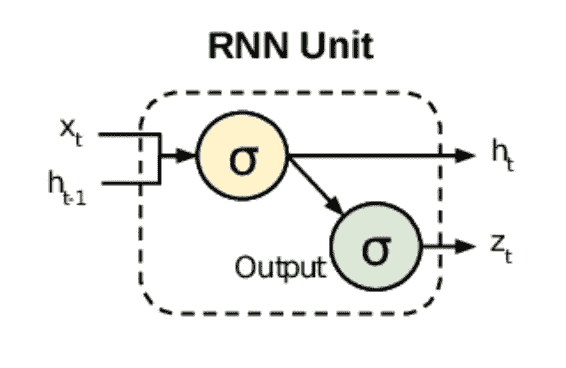
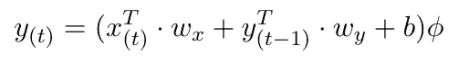
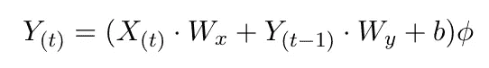
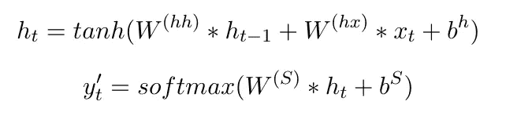
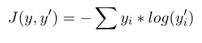

# 递归人工神经元

> 原文：<https://medium.com/analytics-vidhya/the-recurrent-artificial-neuron-ef67778e7a09?source=collection_archive---------19----------------------->

## 递归神经网络的构建模块

人工神经网络介绍系列的前一篇文章解释了递归神经网络(RNN ),它构成了我们今天使用的任何翻译应用程序。今天，我们将讨论这个网络的每个神经元是如何工作的。

RNN 单位[3]

递归人工神经元是 RNN 结构的最基本部分。它具有从激活层的输出到其线性输入的连接，并将输出加回到输入中。在任何时间步，相对于层输入的输出可以给出为:

其中 *y(t)* 是时间 *t* 的输出向量， *x(t)* 是时间 *t* 的输入， *y* ⁽ᵗ⁻ ⁾是前一时间步的输出， *b* 是偏置项，φ是激活，可以是 tanh 或 ReLU。输入和输出分别有不同组的权重 *wˣ* 和*wʸ*[1]。

以上可以以矢量化的形式针对整个层进行计算

其中， *Y⁽ᵗ⁾* 为大小为 *(m，n)* 的输出矩阵，其中 *m* 为批量实例数， *n* 为层单元数， *X⁽ᵗ⁾* 为大小为 *(m，i)* 的输入矩阵， *i* 为输入特征数， *Wˣ* 为输入权重矩阵 n) 和 *Wʸ* 是大小为 *(n，n)* 的前一步输出的权重矩阵。

在每一层，当前存储器 *hᵗ* 和输出 *y'ᵗ* 的最终值计算如下

*tanh* 激活函数压缩 *-1* 和 *1* 之间的结果，而 *softmax* 是一个计算概率分布的激活函数。输出 *y'ᵗ* 是一个与 *xᵗ* 维数相同的向量，所有元素之和为 *1* 。具有最高概率值的元素是下一个预测单词。

随后，为了比较预测的准确性，将预测字 *y'ᵗ* 与实际字 *yᵗ* 进行比较。这是通过损失函数计算的，在这种情况下，交叉熵损失函数描述为

该过程的最后一步是反向传播，其中算法向后遍历所有时间步骤，以更新网络的权重和偏差[2]。

RNN 未能对长而复杂的序列做出好的预测的主要原因是消失/爆炸梯度阻止了有效的学习。这是因为在更新参数时，网络需要计算损失函数导数。关于同一组参数的该操作的多个实例可能导致导数值极大或极小，从而导致未定义的权重和偏差，并进而导致无意义的学习。这个问题通过引入 LSTM 网络得到了解决。

这就结束了我们关于递归神经网络的部分，其中我们回顾了网络的基本结构及其基本单元，递归人工神经元。我们还探讨了网络性能缺陷的原因，这可以归因于其固有的结构。在接下来的章节中，我们将介绍一种替代的长短期记忆网络，它解决了消失/爆炸梯度的问题。

[1]朱利安博士，2018。用 Pytorch 进行深度学习快速入门指南:学习用 Python 训练和部署神经网络模型，伯明翰:Packt。

[2] Kostadinov，S. & Safari，一家奥莱利传媒公司，2018 年。递归神经网络与 Python 快速入门指南第 1 版。，Packt 出版公司。

[3]中等。(2020).使用 Penn Treebank 进行语言建模。[在线]请访问:[https://towards data science . com/language-modeling-with-Penn-tree bank-64786 f641 F6](https://towardsdatascience.com/language-modelling-with-penn-treebank-64786f641f6)[2020 年 3 月 3 日访问]。