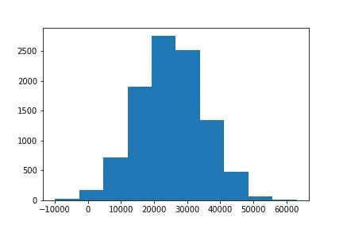
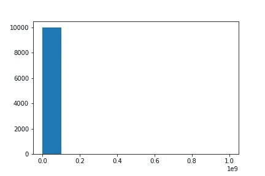
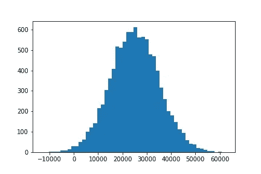
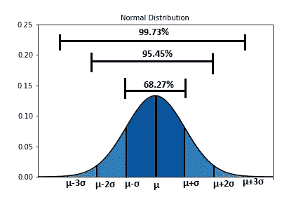
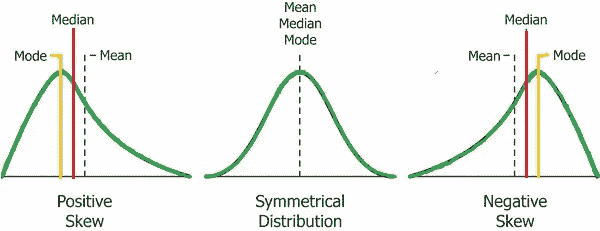
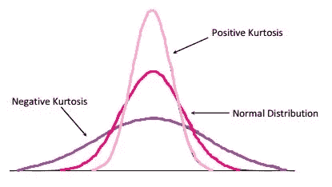

# 统计在机器学习数据分布中的相关性

> 原文：<https://medium.com/analytics-vidhya/the-relevance-of-statistics-in-data-distribution-for-machine-learning-e029aa0e4bb7?source=collection_archive---------16----------------------->

很多次我问自己，统计学与机器学习有什么关系，我可以在我的模型中实现统计的所有实际方面是什么，最后我能够理解一点。所以，我会尽力向你解释。


在 [Unsplash](https://unsplash.com?utm_source=medium&utm_medium=referral) 上由 [Carlos Muza](https://unsplash.com/@kmuza?utm_source=medium&utm_medium=referral) 拍摄的照片

# **数据类型:**

在机器学习中，我们处理以下主要类型的数据:

1.  **数字** —它代表某种定量数据。例如，房价、年龄等。可以进一步分为 ***连续*** 数据(有无限种可能性的数据，如房价)和 ***离散*** 数据(非连续的，如年龄)
2.  **分类** —属于某个类别的数据类型。示例-性别(男性/女性)、国家(美国、印度、中国等)。这类数据之间没有数学关系。
3.  **序数** —是以某种顺序或尺度表示的数据。示例-用 1-5 分制对应用程序进行评级，其中 1 表示非常差，5 表示非常好。在这里，这些类别在数学上是相互关联的。

平均值:平均值就是我们观察的平均值。

**Median** : Median 是一个数字排序列表中的中间数字。

**模式**:模式是一组中出现频率最高的数字。

这三个被称为集中趋势的措施。

```
import numpy as npincomes = np.random.normal(25000, 10000, 10000)
```

上述线围绕 25000 的平均值(“中心”)创建了一个随机的收入分布，标准偏差(分布或“宽度”)为 10000，并创建了 10000 个这样的样本。



这是一种均匀分布，对于这种分布，平均值和中位数几乎相同。

意思是说:18980.688686868617

中位数:25060 . 488686868686

我们可以看到两者都接近 25000。

现在，如果我们在这个数据中加入一些百万富翁，会发生什么。它将如何影响平均值和中位数。让我们看看。

```
incomes= np.append(incomes,[1000000000])
```

现在我的收入直方图是这样的。



现在让我们来计算平均值和中值。

平均而言:12860 . 668686868616

中位数:25860 . 488688686866

我们的中位数仍然相同(即大约 25，000)，但我们的平均值现在是 125，142。

如果我们的数据有一些异常值或一些值可能会扭曲我们的数据，那么中位数是一个很好的衡量标准，可以看出在比平均值更大的数据群体中发生了什么。

# **方差和标准差:**

1.  **方差(** σ **):** 测量数据的分布程度。它是平均值的平方差的平均值。

2.**标准差(σ):** 就是方差的平方根，一般比方差用得多。

如果一个数据点的分布超过平均值的一个标准差，那么可以说它是不寻常的。它用于识别数据中的异常值。



相同的收入分布，bin 值为 50，便于可视化。

现在以同样的收入为例，我知道标准差是 10，000，从图中可以看出，任何超过(均值- σ)和(均值+σ)的值，即超过(500–45000)的值都会急剧下降。所以我们可以说这些值是不寻常的。

# 概率密度函数



上图显示了在给定范围内任何给定点着陆的概率(y 轴代表概率密度)。落在均值一个标准差内的概率是 68%，落在均值两个标准差内的概率是 95%，落在均值三个标准差内的概率是 99.7%(通常称为 68–95–99.7 规则)。大多数数据，即几乎 99.7%的数据位于平均值的三个标准偏差内。

# 朋友圈

这些是测量分布的统计参数。换句话说，这些是*概率密度函数*形状的度量。

**第一时刻:**第一时刻是数据的 ***意思是*** 。

**二阶矩:**二阶矩就是 ***方差*** 。

**三阶矩:**三阶矩是*。*

**

*歪斜*

*它测量分布在其峰值附近的不对称性。*

*   *如果偏度为正，则均值大于中值，分布向右有一个较长的尾部，称为右偏。*
*   *如果偏斜度为负，则均值小于中值，分布向左有一个较长的尾部，称为左偏斜。*

***第四矩:**第四矩是 ***峰度*** 。*

*它测量分布的平坦性或峰值。*

**

*峭度*

*正峰度具有细尖分布，负峰度具有宽分布。较高的峰值具有较高的峰度，对于正态分布，峰度值为零。*

*这些方法用于很好地了解数据。*

*希望这有帮助。感谢阅读。*

*要阅读更多相关内容，请访问我的博客— [学习期刊](https://thelearningjournals.com/blog/)*