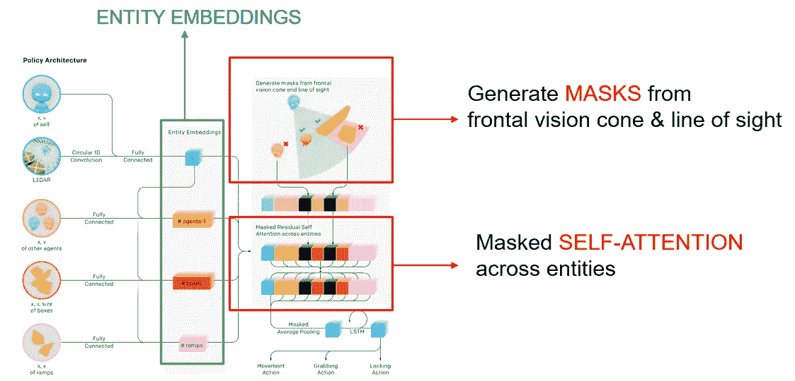

# 神经网络中注意力的上升

> 原文：<https://medium.com/analytics-vidhya/the-rise-of-attention-in-neural-networks-8c1d57a7b188?source=collection_archive---------13----------------------->

你可能已经注意到，在过去的几年里，自然语言处理领域发生了一些非常特别的事情。首先，谷歌翻译达到了前所未有的翻译质量。你可能还会碰到[一些人工智能写的故事](https://openai.com/blog/better-language-models/)关于在安第斯山脉发现的独角兽。

发生了什么事？**注意力机制**开始发挥作用了！

基于注意力的架构目前是最先进的 NLP 模型的基础。他们的主要想法是模仿人类在执行分类或预测任务时有选择地关注句子的某些部分的能力。这篇文章将讨论注意力机制的起源，它们的基本原理和 NLP 中最重要的基于注意力的模型(Transformer，BERT 和 gpt-2)。

这是一篇**介绍性文章**，旨在帮助那些第一次接触该主题并希望在深入研究科学文章或高级 Tensorflow 教程之前掌握主要观点的人。一些解释被有意简化了一点，以方便直觉。

## 注意力的起源

为了解释注意力是如何诞生的，我们先从讨论一个相关的、更广为人知的概念开始:**记忆**。

记忆的概念最初是在深度学习中引入的，以实现对**顺序数据**的建模——即，对于所有那些数据具有内在顺序并且在处理新人时有必要以某种方式记住过去的情况。这包括自然语言和时间序列。

基于记忆思想的最著名的网络是**循环神经网络**，它已经存在了几十年。以下是用于文本分类任务的典型递归神经网络架构-在这种情况下，将报纸文章标题(例如，“尤文图斯前锋罗纳尔多用跳跃挑战地心引力”)分类为足球、经济或时尚三个主题之一:

用于文本分类的递归神经网络

图中显示的绿色单元格实际上就是多次表示的**同一个单元格(参数相同)**。这被称为“展开的”网络表示，旨在促进对底层过程的可视化和理解。序列元素(在本例中是单词)由单元按顺序一个接一个地处理。该单元有自己的内部存储器，由向量 *h* ᵢ(也称为**隐藏状态**)编码，其元素初始化为 0，然后在每次处理新字时更新。

在这个展开的模式中，所有中间内存更新都被显式表示:*h*ᵢ*是直到单词 I 的内存，因此， *h* ₙ是整个**序列内存**，或者换句话说，是完整句子的压缩**合成表示**。*

如果单元机制被适当地设计和优化，如在 LSTM 和 GRU 单元的情况下，记忆向量将被有效地更新到 ***记住*** 输入序列的相关部分，而 ***忘记*** 不相关的部分。在下面的例子中，记忆会清晰地记住尤文图斯和 c 罗，但忘记跳跃和重力。

相关当然是相对于网络被训练做什么而言的。如果目标是其他一些奇怪的任务，比如预测所描述的动作中涉及的身体部位(腿、胳膊、头、腹部……)，那么记忆就会集中在“跳”这个词上。

传统上，ₙ被认为是唯一有尊严的人。中间存储器将被丢弃，并且只有最后一个存储器将被传递到后续层以执行预测或分类任务。

## 瓶颈:翻译

直到大约 2015 年，递归神经网络也是大多数 NLP 任务的最先进技术，包括翻译。

该架构类似于主题分类的架构。同样，输入的句子(要翻译的句子)将通过网络，一次一个元素，并在最终的存储器/序列表示中编码 *h* ₙ *。*事实上，这个网络被称为**编码器**。

然后，ₙ 将被传递给另一个复杂的结构，即**解码器**，它将一次生成一个单词的翻译。

ₙ必须记住很多事情:目的地、旅行时间、旅行者的名字……

这次不讨论解码器架构的细节(顺便说一下，它只是另一个递归神经网络)。重要的一点是**解码者所能看到的关于初始句子的所有信息就是这个单一的合成表示 *h* ₙ** 。

当然，这使得翻译对解码者来说相当困难，尤其是当文本开始变长的时候。例如，在生成翻译时，解码器没有办法动态地关注原始句子中的特定部分——这是人类会做的，看起来是一种更明智和有效的方法。

然而在 2015 年，有人有了一个想法:“为什么不把所有的中间存储器都传给解码器？”。

这是一种非常直接的方式，允许解码器在生成翻译的特定部分时专注于输入的特定部分:这正是我们一直在寻找的。这是神经网络中**第一种形式的注意力:只不过是在递归神经网络上添加了一个聪明的技巧，以帮助它完成翻译任务。**

这个新架构的详细描述和 Tensorflow 教程可以在[这里](https://www.tensorflow.org/tutorials/text/nmt_with_attention)找到。

## 语境化的词汇表征

这种新结构之所以有效，是因为*h*ᵢ*有效地充当了**语境化的单词表征**。事实上，由于它们在这种架构中的构造方式，我们可以预期, *h* ᵢ将主要编码(或记住)单词 I 加上一些关于之前发生的事情——即，加上一些*上下文*。*

要了解这一点，首先考虑网络的低层会发生什么。单词在被传递给递归单元之前必须被转换成向量(当然，该单元不能处理裸露的单词！).这种转换是通过一个简单的**嵌入层**来执行的，它将每个单词(或者更好地说，它的一键编码)分别映射到一个连续的向量。在训练期间学习转换的参数。

由于被单独映射，单词在此阶段看不到彼此。这意味着它们的初始表示(下图中示意为深绿色矩形)是**上下文无关的**，就像 [word2vec](https://radimrehurek.com/gensim/models/word2vec.html) 或其他类似的嵌入一样。

然后，本质上，递归神经网络完成的是**将这些初始的上下文无关的单词表示组合成上下文感知的单词表示**:

对上下文感知表示的搜索确实是机器翻译中的一个关键点。例如，在这两个句子中

这是一条河岸

这是一家商业银行

你只能通过看前面的单词来消除“bank”的歧义。使用递归结构，在每一步后面查看，**“bank”的向量表示可以根据句子**进行有效调整。这样，解码器接收到“bank”的无歧义表示，并且有助于将其导向适当的翻译。

但是当我们需要向前看来消除一个单词的歧义时，又该怎么办呢？

穿过 ***河*** 后，我来到了岸边

*穿过* ***路*** 到达银行

我们可以只使用双向网络，一切正常。通过连接来自两个网络的隐藏状态来获得最终的单词表示:

使用双向 RNN，可以通过从两个方向(后面和前面)查看其他单词来消除单词的歧义。

如果单个层不足以获得令人满意的表示，我们可以通过将多个递归层相互堆叠来构建更复杂的架构:

具有两个堆叠层的双向 RNN。第一层的隐藏状态作为输入传递给第二层。

## 循环架构的局限性

注意力机制的加入提高了循环神经网络的翻译能力。然而，递归架构在有效地将相关单词和**连接起来并消除**的能力方面仍然存在固有的局限性。如果相关的单词彼此相距很多位置，就像这种情况一样，会怎么样呢？

如果两个相连的单词相距很远，RNN 人将很难记住和编码这种关系。如果存在直接连接就好了…

即使使用双向网络来捕获双方的上下文，网络内存仍然很难记住“它”确实连接到了“博物馆”。在这两个词之间打开一个直接连接肯定会更有效率，但是如何在不放弃顺序架构的情况下做到这一点呢？

实际上，放弃**顺序架构**在这里是可取的。被迫按顺序处理序列意味着**缺乏并行性**，这大大增加了训练时间，因此对可用于训练的文档数量造成了严重限制。但是大多数 NLP 模型需要大量的训练文档来学习语言的所有微妙之处，所以这是一个关键点。

顺序架构是一个负担，但似乎仍然是必要的:否则如何考虑句子中单词的顺序？当然，顺序很重要…

狮子追赶斑马并吃掉了它

*斑马追着狮子吃了它*

顺序不可知(或词袋)模型有时适用于文本分类或情感分析，但不适用于翻译任务！

## 位置编码

最后，有人提出了使用位置编码(或位置嵌入)的想法。关键的事实是，关于一个单词在句子中的位置的信息可以有效地编码在一个矢量中——更重要的是，一个低维的矢量。

人们可能本能地认为 10000 个分量的向量对于编码位置 1 到 10000 是必要的。实际上，如果我们使用下面的公式，需要少得多:

计算矢量编码位置 I 的第 j 个分量的公式

参见[此链接](https://kazemnejad.com/blog/transformer_architecture_positional_encoding/)了解其工作原理的直观解释。在下图中，行对应于位置 1 到 10000 的渐进式位置编码，并通过热图表示。向量只有 512 个分量:

显示位置 1 到 10000 的 512 个组件的位置编码(每行一个)的热图

放大到前 10 个位置，我们可以了解编码是如何随着位置的增加而逐渐变化的:

同上，放大位置 1 到 10

为什么这些位置编码如此混乱？例如，通过将它们连接到初始的(上下文无关的)单词嵌入，我们可以摆脱顺序架构，并开放所有可能的连接。结果是一个全新的架构，循环细胞被一个**注意力层**所取代:

实际上，甚至没有必要串联。将编码与初始单词嵌入相加就足够了(当然，两者必须具有相同的维数)。关于这一点的讨论见[这里](https://github.com/tensorflow/tensor2tensor/issues/1591)。

在新的架构中，每个单词在构建自己的上下文感知表示时都会查看所有其他单词，并且每对单词之间都有**直接链接**。而且，培训是高度**并行化的**。

关注的 RNN 与只关注网络:全球架构比较。这是一个单层的简化表示；实际上，在这两种体系结构中，多个层相互堆叠。

与 RNN 一样，**多个关注层**通常堆叠在彼此之上，每个层的输出表示作为输入被传递到下一层。

# 注意力层:它是如何工作的？

由于这一创新，注意力不再只是 RNNs 的一个附加功能，而是一个新的独立架构。但是它到底是如何工作的呢——也就是说，在注意力层的绿色细胞里发生了什么？

像往常一样，第一步是通过一个简单的嵌入层将单词转化为初始的上下文无关矢量表示(结果在上图中表示为深绿色矩形)。这些初始的、上下文无关的表示直观地看起来像这样:

这是一个简化的二维表示，但是实际上，如果您采用预先训练的 word2vec 嵌入，并使用 PCA 将它们投影到一个二维子空间上(单词嵌入通常有数百个维度)，您可以期望看到类似的东西。

银行介于货币和河流之间，也许更倾向于货币，因为这是它最常用的方式。**注意层**(浅绿色细胞)**必须学会根据句子中的其他单词动态转换“银行”(例如)的表示**，就像 RNN 已经做的那样:

这确实与人类大脑中的歧义消除非常相似。rnn 使用它们自己的内部机制实现了这一点，这里将不讨论。新的注意力层呢？

我们通过关注单个句子“**我在河岸**”，并观察单词“ **bank** ”发生了什么变化(句子中的所有其他单词也发生了同样的变化)，来说明注意力机制的功能。

首先，所有单词分别通过嵌入层，并被映射到它们最初的上下文无关表示，包括“bank”。

然后，执行以下步骤:

**步骤 1** :针对句子中的每个单词，计算**与“银行”**的相关程度。“相关”是指它可以以某种方式影响或帮助消除/更好地理解银行的含义，反之亦然。我们将在*数学细节*部分看到“相关度”是如何定量测量的。

在这种情况下， **river** 是句子中唯一与 **bank** 显著“相关”的单词

**第二步**:计算完所有“相关度”后，计算银行对其他每个词的**关注度**。与句子 中的其他单词相比，与“bank”*高度相关的单词的注意力得分**更高。***

相同的两个单词之间的注意力可能因此根据特定的句子而改变。考虑下面的例子:

第一句话中，“河”是唯一与“岸”高度相关的词，所以“岸”的注意力完全指向了“河”。相反，在第二句中，“铺设”也与“银行”高度相关(人们会在银行=河岸上铺设，而不是在银行=商业银行上铺设)，因此“银行”的注意力部分指向“河流”，部分指向“铺设”。这意味着在第一种情况下，“银行”对“河流”的注意得分高于第二种情况。**注意力是一个有限的量，必须分布在所有相关的词中**。

**第三步** : **将“银行”的表示移动到更接近那些具有最高注意力分数的单词的表示**。物理上发生的事情是这样的(括号[ ]表示初始的、上下文无关的单词表示):

如果这句话是“我在银行存了一千万”，

即**目标词**(在这种情况下是 bank)**的最终表示是句子中所有其他词(包括词本身)的加权平均值，权重由注意力分数**提供。这些分数被构造成介于 0 和 1 之间，总和为 1。

对句子中的所有其他单词重复相同的过程(实际上，所有上下文化的表示都是使用矩阵一次性计算的；参见*数学细节*。

注意的一个重要方面是**不是对称的**。例如，考虑下面句子中的单词“river”和“bank”:“由于洪水，水在河岸上流动”。

这里有很多和“河”高度相关的词:除了“岸”，我们还有“水”、“流”、“洪”，表示这条河是涨水的河，而不是干涸的河。这在翻译中可能是相关的(可能存在一些异国语言，其中有一个单独且特定的词来表示“涨水的河”…)。反之，“岸”只与“河”直接相关。“水”、“洪水”等。就其本身而言，对我们理解“银行”的含义没有什么帮助。

这暗示着“银行”会对“河流”给予很大的关注；反过来，“河”就不会那么关注“岸”，因为它的注意力会分布在所有相关的词中。

## 注意力可视化

在步骤 2 中计算的注意力分数可以存储在矩阵中，该矩阵的条目 ij 是单词 I 对单词 j 的注意力——这可以被看作是对单词 j 与消除/更好地理解单词 I 的含义有多相关的**的度量。注意力得分矩阵通常用热图显示(较亮的方块表示较高的注意力得分):**

但是仍然有一个未解决的问题:模型如何执行步骤 1——也就是说，它如何知道两个单词何时“相关”?

秘密在于初始的、**上下文无关的单词表示法**的计算:它们必须合理地放置，以便**相关的单词在几何上彼此接近**。换句话说，必须在几何性质和语言性质之间建立对应关系。直觉上，左边的模式可行，右边的模式不可行:

当然，我们不必手工制作这些初始表示——嵌入层会在训练过程中学习它们。

与注意力不同，**相关度****是对称的**。

## 数学细节

一般注意力层的输出由下面的公式给出(这是你将在所有文章中找到的公式；n 表示嵌入维数):

这个公式可能有点令人困惑，因为它非常笼统，除了我们刚刚检查的情况之外，还包括许多其他情况。在我们的例子中，三个矩阵重合，即 Q = K = v。Q 是形状矩阵(input_seq_len，embedding_dim)，其行包含由嵌入层计算的初始单词表示(=下层的深绿色矩形，包括位置编码)。

Q 的条目是在训练中学会的。

步骤 1 中的“相关性”分数计算如下

这是一个形状为(input_seq_len，input_seq_len)的**对称**矩阵，其条目 ij(或 ji)提供了单词 I 和 j“相关”程度的度量。这个度量就是两个矢量表示之间的点积。在两个向量被归一化的情况下，点积等于余弦相似度，但是在一般情况下不提供适当的距离。然而，作者选择不对行进行规范化，也许是为了给网络留下一些额外的灵活性(嵌入层仍然可以自由地学习规范化的向量，如果它认为合适的话)。

为了将相关性分数转化为注意力分数(步骤 2)，您只需按行取 softmax。在此之前，您用一个固定的归一化因子来划分相关度分数，以便获得一个“更温和”的 softmax(否则，只有非常高度相关的单词才会获得显著的注意力分数)。生成的矩阵由 0 到 1 之间的数字组成，每一行的总和为 1。

注意力得分的非对称矩阵；shape =(输入序列长度，输入序列长度)

最后，将上面的矩阵乘以 q。结果是 matrix of shape (input_seq_len，embedding_dim ),其行包含新的单词表示，因此每个单词表示都是作为初始单词表示的加权平均值获得的。

补充几点:

*   在经历步骤 1、2 和 3 之前，通过**(学习的)仿射变换**变换 Q 的行(或者，换句话说，Q 通过具有线性激活的密集层)。
*   如前所述，**多个关注层**通常是相互堆叠的。这意味着步骤 3 的输出通过另一个学习的仿射变换进行变换，然后再次通过步骤 1、2 和 3…等等。

## 不仅仅是语义

前面的例子可能会导致这样一种想法，即单词的表示只在非常严格的意义上捕捉单词的含义。这意味着只有名词、形容词和一些动词积极参与注意过程，而像冠词、连词等助词。将被视为无关紧要。

事实上，与基本的“词义”相比，语境化的单词表征更能模拟复杂的语言特性。毕竟，这并不奇怪。考虑下面两句话:

*我不能忍受吃肉*

*我看见一只熊在吃肉*

“有意义”的词在两个句子中是一样的:明确 bear 是“a bear”VS“to bear”的是“a”或“不可以”这样明显“无意义”的助词的存在。单词表示必须能够捕捉所有这些类型的关系。为了帮助注意力层完成这项具有挑战性的任务，引入了**多头注意力**。在实践中，这意味着多个单词表示系统(通常为 8 到 16 个)被并行计算，从而产生一组独立的注意力得分矩阵:

多头自我关注。来源:[https://docs . dgl . ai/en/0.4 . x/tutorials/models/4 _ old _ wines/7 _ transformer . html](https://docs.dgl.ai/en/0.4.x/tutorials/models/4_old_wines/7_transformer.html)

这在某种程度上类似于在卷积神经网络中使用多个过滤器:**每个注意力头都是为了捕捉特定的语言属性**。最后，我们仍然可以通过连接不同头部计算的表示来获得唯一的上下文化单词表示。

## 应用的世界

总而言之，注意力机制允许我们非常**有效地计算任何句子中任何单词的上下文化向量表示**。由于位置编码，我们甚至可以在单词表示中包含位置信息，而不需要顺序架构。

每当必须处理一组有限的相互作用的离散输入(无论是顺序的还是非顺序的)时，相同的机制都可以很好地工作，就像在视频游戏中一样。谷歌 Deepmind 最近发布了一个模型， [AlphaStar](https://deepmind.com/blog/article/alphastar-mastering-real-time-strategy-game-starcraft-ii#block-8) ，它学会了如何玩星际争霸，并打败了顶级人类玩家。该模型首先以受监督的方式在历史游戏数据上进行训练，然后通过在强化学习框架内重复与自己对抗来开始学习全新的策略。

猜猜看，注意力机制在架构定义中发挥了作用，对各种游戏元素(角色、建筑等)之间的关系进行建模。基本的想法和以前一样:假设你想为你的角色决定最好的移动或者计算你的胜利几率。您可以首先使用简单的嵌入层将您的“角色”(以及所有其他游戏元素)映射到一个矢量，并获得它的初始上下文无关表示，编码属性如“我是猎人，我是人形，我有这些武器”。在注意力层，你的角色“注意”其他游戏元素，并动态调整其表现以考虑上下文。例如，它可能会注意到一条龙将要杀死它，或者一块大石头将要落到它的头上。角色的最终上下文感知表示可能会编码成类似于“我是一个猎人，一个类人动物……而且我一点也不富裕”的内容。将这个向量传递给最终回归层，我们可以发现在这种情况下获胜的几率非常低。这是一个非常简单的解释，但应该给出一个注意机制潜力的想法。

# 破解翻译:变压器

但是现在让我们回到**翻译**，这是我们最初的问题。我们已经放弃了“注意力 RNN”这个最先进的技术。现在我们已经装备了强大的“注意力网络”,我们还能前进吗？

正如我们所见，这种新的架构允许我们非常**有效地消除任何句子和任何语言中的所有单词的歧义**。此外，嵌入层提供了合理放置的初始上下文无关单词表示。如果是这种情况，从英语到意大利语应该很容易。

然而，有一个问题。例如，考虑一下，如果我们将所有的意大利图片旋转相同的角度会发生什么。我们得到的仍然是意大利语的完美有效的再现:单词之间的所有距离和关系都保持不变。然而，与他们的英国同行相比，根本没有什么**结盟**。事实上，如果两个语言模型被独立地训练，我们不能保证得到的表示在某种程度上是一致的。

那么，如何有效连接这两个世界呢？这正是变压器所要达到的效果。

我们有这个。如何让这两个世界沟通？

Transformer 于 2017 年推出，并立即成为最先进的翻译，为现代谷歌翻译奠定了基础。这是第一个完全基于注意力机制的翻译模型——事实上，这篇论文的标题很有说服力:[注意力是你所需要的全部](https://arxiv.org/abs/1706.03762)。它的名字来源于这样一个事实:转换器，嗯，*将句子从一种语言转换成另一种语言。*

必须为每个单向输入到目标语言的翻译任务训练不同的转换器模型:例如，需要三个不同的转换器模型来执行意大利语到英语、英语到意大利语和法语到英语的翻译。本教程展示了一个完整的 Tensorflow / Keras 实现。

让我们检查一个意大利语到英语的转换模型的架构。我们将省略一些架构上的细节(层规范化、遗漏……)来关注核心组件。转换器由两部分组成，编码器和解码器，就像以前基于递归网络的模型一样。不同的是，内在机制现在完全基于注意力。

## 训练变压器

在训练期间，**对源语言和目标语言**中的相应句子分别被输入编码器和解码器。

**编码器**执行我们刚刚看到的确切步骤:它使用一个注意力层(或者更准确地说，多个堆叠的注意力层)来计算源句子中每个单词的**上下文感知表示。从功能的角度来看，这正是基于 RNN 的体系结构的编码器部分所做的事情:区别仅仅在于网络内部机制的效率提高了。**

**解码器**基本上与目标语言句子的编码器一样，但增加了第二个基于注意力的层，以某种方式**将目标语言的单词表示与源语言的单词表示对齐**。我们将这个附加层称为“**交叉注意层**”，以区别于我们目前所考虑的“自我注意”层。

Transformer 架构:解码器将编码器的输出作为辅助输入，以生成目标语言中的上下文化单词表示，这些单词表示也在某种程度上与源语言中的单词表示“对齐”。

让我们通过关注上面例子中的单词“pizza”来详细了解解码器内部发生了什么。

首先，目标句子中的所有单词都通过一个简单的嵌入层映射到初始的上下文无关表示(+位置编码)，包括“pizza”。

在**自我关注层**中，“pizza”应用前面段落中描述的机制，根据句子中的其他单词(Joe 和 likes)调整自己的表示。在这种情况下，Joe 和 likes 对我们理解比萨饼没有什么帮助，所以我们说“比萨饼”的上下文感知表征(自我注意层的输出)只是

(为了简单起见，我们省略了初步的仿射变换)。

这个输出然后被传递到**交叉注意层**，其机制类似于自我注意层的机制。就像自我注意层学习根据*同一个*句子中的其他单词来表达句子中的每个单词一样，交叉注意层学习根据*另一个*句子中的单词来表达句子中的每个单词——在这种情况下，它学习根据意大利语单词(或者更好地说，根据作为编码器输出而提供的意大利语单词的上下文感知表示来表达英语单词。在这种情况下，我们可能会看到这样的情况

对目标句子中的所有其他单词重复相同的过程。最终的解码器输出是意大利语单词的**上下文感知表示，其也与英语单词**的上下文感知表示有些“一致”。

变形金刚:关注解码器的内部层

与自我关注层一样，**交叉关注分数**可以绘制成矩阵，帮助我们可视化两种语言之间的**对应关系**。同样，我们可以使用**多个注意力头**来捕捉更多的语言属性。

英语到德语翻译任务的交叉注意分数(来源:[https://docs . dgl . ai/en/0.4 . x/tutorials/models/4 _ old _ wines/7 _ transformer . html](https://docs.dgl.ai/en/0.4.x/tutorials/models/4_old_wines/7_transformer.html))

**数学细节**

同样，让我们深入一点数学细节。我们说解码器学习“根据意大利语单词表达英语单词”；让我们看看这在实践中是如何实现的。

自我关注层的工作方式与编码器完全一样。交叉注意层的输出公式也是通常的公式

但是，这一次，K = V 和 Q 不同。确切地说，Q 的行包含由解码器的自我关注层计算的英语单词的上下文感知表示，而 K 的行包含意大利语单词的最终(上下文感知)表示，即编码器的输出:

如果你仔细观察这个公式，你会发现交叉注意层实际上输出了英语单词的新表示，作为意大利语单词(上下文感知表示)的加权平均值。

如前所述，Q 和 K 的行在被传递到交叉注意层之前都经历学习仿射变换。

## 变形金刚:一些结果

让我们来看看谷歌翻译的一些输出，看看变压器模型的力量。单词被正确地消除了歧义…

…甚至代词。

位置嵌入确实有效！

一切都很好，但是…等等！我们是不是忘记了什么？还有几件事需要澄清。

## 目标是什么？

首先，我们应该明确变形金刚的训练目标。在训练过程中，在目标语言中的每个句子的开头和结尾添加两个标记词[START]和[END](实际上，对源语言中的句子也是如此，但我们目前可以忽略这个细节)。得到的训练集是

然后，变压器被训练来预测…嗯，只是将**目标句子向前移动了一个位置**。

使用和以前一样的图片，

听起来像是一个微不足道的任务，对吗？

基于我们所看到的，解码器的内部结构应该如下:

那么，解码器在预测例如“Joe”时，会这样做吗？

其实不是，因为这个快捷方式在解码器里是非法的！

准确的说，**所有的后路都被禁止**。解码器中的自我关注层与编码器中的自我关注层有一个根本的区别:**每个单词在构造自己的上下文感知表示时只能向后看**。

实际的解码器架构

这是**被掩盖的自我关注**的一种形式:一些元素无法关注另一些元素，即一些连接被关闭。这种类型的屏蔽称为**前瞻屏蔽**，因为每个单词只能“向后看”自己，而不能向前看。实际上，相关性矩阵的“非法”条目被设置为-inf，因此 softmax 将有效地忽略这些条目。注意力得分矩阵看起来像这样，一些元素被模糊了。因此，每个单词的注意力将只分布在“合法连接的”元素中。

如果您更仔细地检查解码器目标，您会意识到这不过是一种训练解码器为输入句子中的所有子句子**预测下一个单词的简洁方法:**

我们不需要一个接一个地传递所有的子句子，而是可以利用先行掩蔽技巧来传递整个句子，并在一个段落中预测所有的下一个单词。

因此，我们可以说，转换器被训练成在目标语言中执行**引导的下一个单词预测——由源语言中的句子引导。**

同样，多对自我注意+交叉注意层在解码器中相互堆叠。

## 再讲几句关于掩蔽的话

屏蔽的概念实际上相当普遍:原则上，任何连接都可以被宣布为非法，并从注意力分数计算中排除。这可以应用于自然语言处理之外的其他情况。例如，OpenAI 最近发布了一个基于 RL 的模型,教两组木偶互相玩捉迷藏。如果您看一下模型架构，您会发现:

与 AlphaStar 类似，游戏元素首先被映射到上下文无关的嵌入，然后通过在自我关注层“关注”彼此来改变它们的表示。还有，你看，自我关注层被屏蔽了！但这不再是一个前瞻掩蔽:类似于现实世界中会发生的事情，木偶只是不允许注意他们的视觉锥和视线之外的元素。

另一种(不太令人兴奋，但仍然很重要)的遮罩形式是**填充遮罩**。编码器和解码器都将固定长度的序列作为输入。如果你想给他们传递比这个固定长度短的句子，你必须首先用一系列所谓的[PAD]标记来完成它们。例如，如果建立的固定长度是 10，并且您想将通常的*Joe like pizza*传递给解码器，那么您必须首先将其转换为

(记住，您还必须添加[START]和[END]标记！).

但是，当然，您不希望“Joe”和“pizza”在构造它们自己的上下文感知表示时关注[PAD]标记。因此，**所有的[PAD]令牌必须在自关注和交叉关注层以及编码器和解码器中被屏蔽**。填充掩码必须始终被定义并作为输入传递给转换器。

## 生成翻译

好了，变形金刚已经训练好了！现在，我们如何从零开始为不在训练集中的句子生成新的翻译呢？

首先，要翻译的句子作为输入传递给编码器，而解码器只是将[START]标记作为输入。预测的单词是最终翻译的第一个单词。然后，将[START]标记和第一个生成的单词传递给解码器，解码器预测翻译的第二个单词。重复该过程，直到预测到[END]标记。

# 单语任务呢？

Transformer 的诞生是为了解决翻译问题，但它推广到单语问题的潜力很明显。事实上,“拆卸”变压器，我们获得了两个目前 NLP 的最新模型:BERT 和 gpt-2。

## 伯特

[BERT](https://arxiv.org/pdf/1810.04805.pdf) 是一个仅适用于**编码器的**模型，也是几乎所有 NLP 任务的最新技术。(其实最初的 BERT 早已进化成更高级的型号，就像变形金刚早已进一步发展成重整器，gpt-2 发展成 gpt-3 一样。然而，主要的基本思想保持不变)。

给定一个输入句子，BERT 使用自我注意机制计算出句子中所有单词的强大**上下文感知表示。编码器部分在 Transformer 模型中的作用。然后，这些表示可以被传递到定制的附加层，以执行各种 NLP 任务，例如句子分类、情感分析、问题回答等。**

实际上，BERT(像许多其他语言模型一样)使用**记号**而不是单词——也就是说，输入的句子被分割成记号，而不是单词。如果你看一下多语言 BERT 模型的[词汇文件](https://www.kaggle.com/soulmachine/pretrained-bert-models-for-pytorch/version/3?select=bert-base-multilingual-cased-vocab.txt) (vocab.txt)，你会看到的是多个字母表中的字符和符号的短序列列表，从拉丁语到汉语，其中一些会显得毫无意义。这有助于大大减少词汇量。为每个令牌计算一个上下文化的表示，并且之前讨论的所有原则仍然有效，除了它们在更抽象的级别上应用。

伯特接受的是什么任务训练？这一次，我们所做的是随机屏蔽掉输入句子中的一些单词(这在物理上意味着用标记单词[MASK]替换它们)，并训练模型重新预测它们。在例如全英文维基百科上这样做迫使模型学习重要的语言结构。

注意:这个“**掩蔽语言预测**”任务，即这个“掩蔽掉”然后重新预测输入文本中一些单词的过程，与之前讨论的掩蔽注意概念(即前瞻掩蔽、填充掩蔽……)没有任何关系！不幸的是，在术语上有一些重叠。

伯特还接受了第二项稍微复杂一点的任务训练。我们将在“为分类任务微调 BERT”这一节中讨论它。

BERT 首字母缩写词，来自 Transformer 的双向编码器表示，现在应该很清楚了:**单个单词的上下文感知表示**是通过以双向**方式查看文本中目标单词前后的所有其他单词来构建的。**

伯特实际上不使用文字，而是使用记号。如果您查看 BERT 模型的词汇文件，

## gpt-2

gpt-2 取而代之的是一个只有**解码器的**型号。你可能想知道:这是什么意思，只有解码器？如果没有编码器，我们定义的解码器就没有任何意义——它甚至将编码器的输出作为侧面输入！

其实“解码器专用”这个说法有点不合适。事实上，gpt-2 中并没有保留整个解码器:交叉注意层被扔掉了。剩下的基本上是一个**自我关注层，应用了前瞻遮罩**。

目标与转换器相同:输入的句子向前移动一个位置。由于前瞻屏蔽的存在，这相当于一个重要的**下一个单词预测**任务。与 Transformer 中的完全一样，只是这一次，下一个单词预测任务是免费的，不再受源语言句子的“指导”。

同样，gpt-2 必须在非常大的语料库上训练，例如全英文维基百科。正如你可能猜到的那样，与 BERT 的关键区别在于**单词表示**不再是双向的:它们仅仅通过**查看**后面的单词来构建。

这似乎是一个缺点，因为在每个单词的最终表示中可以包含的上下文较少。事实上，gpt-2 的第一个版本，名为 gpt，在所有基准 NLP 任务中被 BERT 击败。然而，gpt-2(本质上是具有更多参数并在更大语料库上训练的 gpt)在一项任务上仍然优于 BERT:文本预测——相当于**文本生成**。关于 BERT-vs-gpt 挑战的搞笑报告可以在这里[找到](https://blog.floydhub.com/gpt2/)(寻找经理 vs 随机工程师的讨论)。

有一些[链接](https://talktotransformer.com/)可以让你尝试 gpt-2 的全部威力。生成文本的质量确实令人印象深刻。似乎放弃双向性并不总是一个缺点，毕竟！

## 微调 gpt-2

经过预先训练的 gpt-2 模型(你可以免费下载并试用)倾向于生成非常**通用的文本**，已经在这样一个大型和异构的语料库上进行了训练。然而，在你选择的语料库上微调 gpt-2 并教它生成更具体类型或流派的文本是非常简单的。例如，您可以微调 gpt-2 来生成莎士比亚戏剧、恐怖故事或说唱歌曲——所有这些都只需要几行 Python 代码！

这本[互动书](https://play.aidungeon.io/)也是一个很酷的例子，展示了通过对 gpt2 进行微调可以实现什么。

不幸的是，gpt-2 的预培训版本目前只有**英语**版本。然而，你可以利用 **mtranslate** 库(调用谷歌翻译 API)来生成几乎任何你选择的语言的高质量文本。

## 针对分类任务微调 BERT

虽然 gpt-2 专门用于文本生成，但是 BERT 及其后代通常是所有其他 NLP 任务的最佳选择。我们现在将更深入地讨论如何针对定制分类任务微调 BERT，这是一个非常简单的示例，也是工业环境中最常见的示例之一(例如，考虑 FAQ 匹配)。

但是，首先，我们必须说一下伯特接受训练的第二项任务(除了“掩蔽词预测”任务)。这第二个任务叫做**下一句分类**。基本上，通过从训练语料库(例如维基百科)中选择句子对来建立训练集。有些句子对是由连续的句子组成的，而有些句子对是由两个随机选择的句子组成的。然后训练伯特预测哪些句子对是连续的，哪些不是。

每对中的两个句子并不是单独馈入网络的，而是由一个**【SEP】token**单词(也是加在第二个句子的末尾)串联连接的。此外，一个额外的**【CLS】标记**单词被添加在所得到的连接句子的开头。至关重要的是，最终的分类仅使用[CLS]令牌的输出表示来执行。事实上，[CLS]是“分类”的简称。

换句话说，只有[CLS]的最终(上下文感知的)表示被传递到二进制分类层。对于这个次要任务来说，其他所有的表示基本上都被扔掉了(但是它们仍然用于掩蔽词预测任务)。

这种架构稍加修改就可以用于针对**单句分类**微调 BERT。事实上，也可以将一个句子(而不是两个连接的句子)传递给 BERT，只要它封装在[CLS]和[SEP]标记之间。然后可以将[CLS]令牌的输出表示传递给自定义分类层。通常，一个简单的密集(num_classes)图层后跟一个 softmax 就足够了，可能还需要在中间添加一个 Dropout 图层。

最后，一个简短的问答环节包含了我开始玩 BERT 时问自己的一些问题，以及我在几次搜索和讨论后找到的答案:

问:为什么只使用【CLS】标记进行句子分类？我很想将所有输出单词表示传递给分类层。

*答*:原则上，BERT 架构已经被设计成使得【CLS】令牌应该能够自己提供有效的句子表示(或句子嵌入)。如果是这种情况，包含其他输出表示只会增加计算负担，而不会提高性能。

*问*:你说【CLS】令牌应该提供句子嵌入。然后，如果我下载一个预先训练好的 BERT 模型，给它输入我选择的一个句子(按照规定，封装在[CLS]和[SEP]标记之间)，并检索[CLS]的输出表示，我可以将它用作句子嵌入，例如计算句子之间的余弦距离，对吗？

不幸的是，[CLS]令牌似乎并不适合这个特殊的用例。性能甚至比臭名昭著的基线还要差，基线采用句子中单个单词的 word2vec 表示的平均值作为句子表示。这可能是因为 BERT 没有在句子相似性任务上受过明确的训练——不像其他模型，如[通用句子编码器](https://arxiv.org/abs/1803.11175) (USE)，它们实际上更适合这个特定的用例。一种称为[句子的原始 BERT 模型的变体——BERT](https://arxiv.org/abs/1908.10084)也被提出来提高句子相似性的性能。一般来说，人们应该记住，不存在普遍“最佳”的自然语言模型:最佳选择取决于所研究的特定问题。当使用预训练模型进行迁移学习或其他应用时，一个良好的做法是始终检查原始模型已被训练的任务，并验证它们与目标任务的一致程度。

*问*:如果我取所有的输出单词表示(不包括[CLS]和[SEP]标记)，将它们平均，并使用结果向量作为句子嵌入，会怎么样？

*A* :这种方法实际上在应用与上下文无关的单词表示时工作得很好，就像 word2vec 提供的那些(这是一个众所周知的嵌入基线的句子，用来验证更复杂的模型)。不幸的是，也许令人惊讶的是，当使用 BERT 的上下文感知表示时，实验结果并不令人满意。一个可能的原因是，这些表征往往是*非常*上下文感知的，即，被周围的上下文非常“污染”。在 BERT 中，单个单词和周围上下文之间的界限实际上相当松散，很难定义。出于同样的原因，使用 BERT 的单词表示来计算单词之间的余弦相似性或执行其他 word2vec 典型任务可能是危险的。

## 玩基于注意力的模型

如果你现在想玩基于注意力的模型，这里有一些资源可供参考:

*   有几个教程可以用来试验 BERT 和 GPT-2； [huggingface](https://huggingface.co/transformers/v2.1.1/index.html) 为你可能需要的几乎任何东西提供 pytorch 代码和预训练模型。如果你对 Keras 框架比较熟悉，可以在我的 [github](https://github.com/flowel1/attention-networks) 上查看笔记本。一个值得一试的有趣的库是 ktrain，您可以使用它在定制分类任务上对 BERT 进行微调，只需几行代码。
*   我发现 Transformer 上的 [Keras tutoria](https://www.tensorflow.org/tutorials/text/transformer) l 对于深入理解架构非常有启发性，包括文章中没有提到的一些细节(例如层规范化和脱落)。

玩得开心！

[1] K. Cho 等人，*使用统计机器翻译的 RNN 编码器-解码器学习短语表示*，2014 年 9 月

[2] I. Sutskever 等人，*用神经网络进行序列间学习*，2014 年 9 月

[3] D. Bahdanau，K. Cho，I. Benjo，*联合学习对齐和翻译的神经机器翻译*，2015 年 4 月

[4] Y. Wu 等，谷歌的神经机器翻译系统:弥合人工与机器翻译的鸿沟，2016 年 10 月

[5] A. Vaswani 等人，*关注是你所需要的全部*，2017 年 6 月

[6] A .拉德福德等，*通过生成性预训练提高语言理解*，2018 年 6 月

[7] J. Devlin 等人， *BERT:用于语言理解的深度双向转换器的预训练*，2019 年 4 月