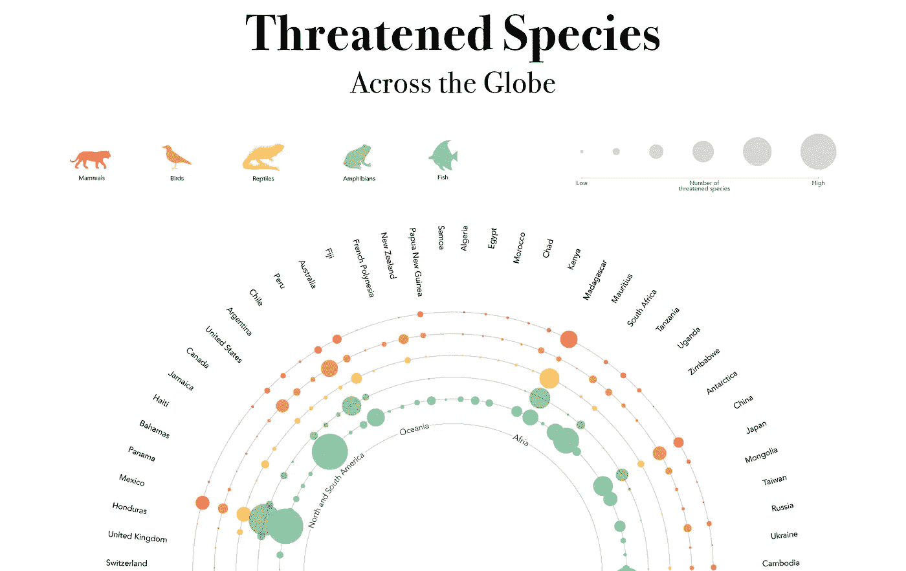
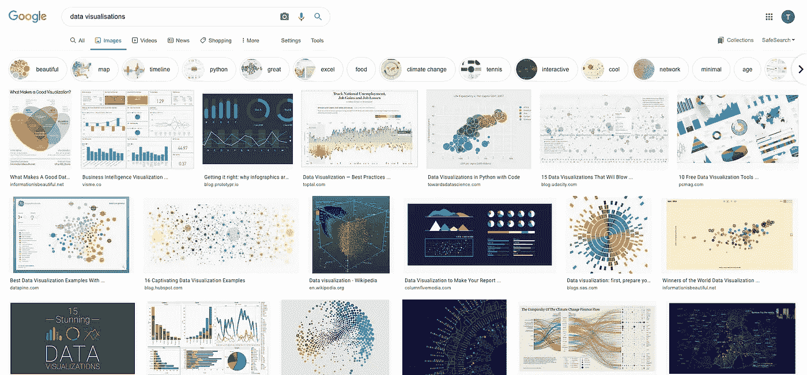
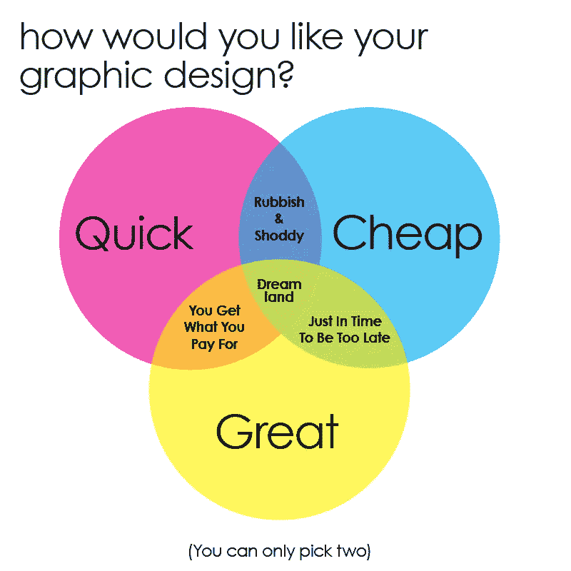
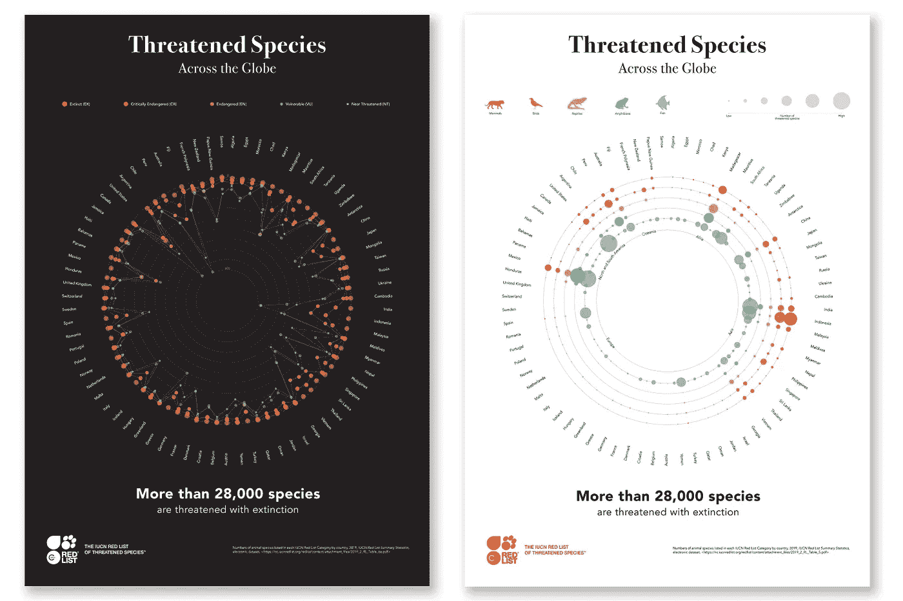
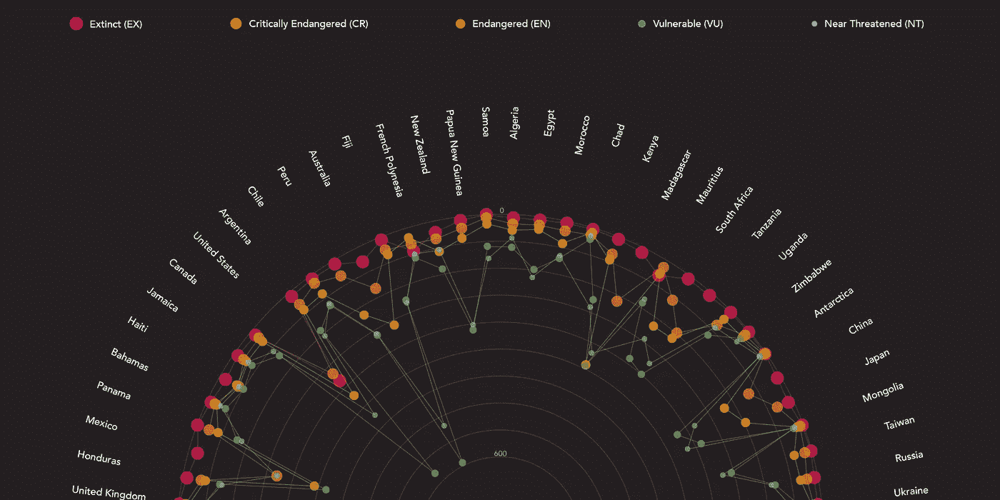

# 环境视觉传达的数据可视化:案例研究

> 原文：<https://medium.com/analytics-vidhya/the-role-of-data-visualisation-in-environmental-visual-communication-a-case-study-50a8f6643e9?source=collection_archive---------8----------------------->

**Tyhe 阅读，** [**全球濒危物种/数据可视化**](https://www.behance.net/gallery/85374469/Threatened-Species-Across-the-GlobeData-Visualisation) **，2019**

数据可视化的目的是什么？它应该是一种通过使用图表、图形和表格快速有效地表示信息的方法。然而，人们普遍发现数据可视化很复杂，很难理解。这是因为被可视化的数据本质上很复杂，还是因为设计者已经没有办法直观地呈现这些数据了？

在写这篇文章的时候，环境问题(尤其是气候变化)和以往一样重要。世界人民正亲眼目睹我们之前几代人对环境的影响。我们已经过了恢复的阶段，现在面临着为了我们的后代防止环境受到更多破坏的任务。

这个案例研究通过在我博士早期阶段对一个创造性输出项目的研究，探索了为什么视觉化很难处理，以及为什么它们在环境视觉交流中是必要的。

# **传统数据可视化**

对数据可视化的快速谷歌图像搜索显示了一个明显的问题；这些观想到底代表了什么？当然，我们可以点击缩略图，进入一个以独特方式展示数据的互动网站。但是，如果数据可视化的目的就像任何其他形式的视觉传达一样，需要容易理解，那么这是否意味着它们作为一种有效的视觉传达设计的形式是失败的呢？

谷歌图片搜索“数据可视化”，2019 年

考虑你每天看到的视觉交流形式；海报、广告、网站、新闻报道、食品包装等。他们都需要能够几乎立即讲述一个故事或分享一条信息，以吸引观众的注意力，并让他们专注于产品。数据可视化需要做同样的事情。虽然它们通常看起来很吸引人，可能会吸引观众，但它们需要能够用清晰的数据呈现来吸引他们的注意力。这是我通过我的研究和我自己的创造性产出(见下文)发现的一个挑战。

我发现的第二个挑战是需要能够快速创造这些观想。客户希望向潜在的利益相关者展示令人惊叹的设计，而不考虑信息如何被理解，新的项目正允许这种情况发生。当我们考虑下面的老式文氏图时，我相信每个人都见过，你可以预测观想会变成什么样。

文氏图

最后，我发现的第三个挑战是人们根本不理解数据。我指的是所有人。设计师，客户，观众，所有人。如果没有对如何解释来自设计者的数据的基本理解，就无法实现有效的设计。如果客户不理解他们想要可视化的数据，他们就不能正确地向设计师做简报。如果受众对围绕数据的问题/主题没有基本的了解，他们就不知道如何解读数据，或者根本不关心。

# 创造性实验/博士研究

攻读博士学位(设计)意味着我将伴随着我的写作创作大量的创造性作品。关于我的项目，我不想说太多细节，我主要是在研究如何为传播者和非传播专家制定战略框架，以指导他们开展环保运动。这项研究的早期阶段一直在关注数据可视化和信息图在表示关于环境的复杂数据方面的有效性，包括挑战性的“棘手问题”。

> 旁注:对于那些不知道信息图和数据可视化之间的区别的人；在这里。信息图依赖于视觉效果(图像、插图、动画等)和文本之间的关系来通知浏览者，并且经常讲述一个故事。数据可视化依赖于通过风格化设计的数据可视化。这些很容易被误解，通常是可以互换的术语。

**Tyhe 阅读，** [**全球濒危物种/数据可视化**](https://www.behance.net/gallery/85374469/Threatened-Species-Across-the-GlobeData-Visualisation) **，2019**

## 任务

我给自己设定了一个非常基本的任务，开始创造性的探索；可视化环境数据。就是这样。因此，首先，我开始研究我能获得的数据集，并最终专注于 IUCN 的汇总统计数据。我能接触到的大量数据也令人难以置信，这让我能够探索一系列可能的解决方案。

## 该过程

首先，我查阅了来自 IUCN 的一系列统计数据，确定了以观众容易理解的方式将数据可视化的可能性。

我开始研究试图直观显示数据的项目，重点是工作的专业质量。

我不擅长勾画自己的想法。我通常画几张草图，然后直接跳到电脑上开始我的设计过程。虽然我不建议这么做，但这是我强迫自己去做的事情。因此，出于这个原因，我确实有两张草图，不会展示，因为它们毫无意义。

## 挑战

我在设计这些数据可视化时面临的最大挑战之一是，我在识别数据边界方面不够彻底。我不得不改变我在可视化上的进度，导致了更慢的工作流程和有时不正确的数据表示。

现在，我无论如何都不是一名数据分析师，但由于我以前的工作经验，我认为我对数据以及如何解读数据有相当好的理解。那些没有这些经验的人可能很难理解这些数据，并以一种不容易理解的方式将它可视化。

**Tyhe 阅读，** [**全球濒危物种/数据可视化**](https://www.behance.net/gallery/85374469/Threatened-Species-Across-the-GlobeData-Visualisation) **，2019**

## 结果

虽然这些实验被认为是相对快速的，但它们确定了设计师在可视化数据时可能面临的许多挑战。首先，这些设计不一定容易理解。他们要求观众有时间能够解码设计。这可能意味着，从可访问性的角度来看，信息图表可能是最适合大量受众的可视化信息形式。

其次，他们需要计划。他们需要许多草图、测试和原型，以确保他们能够被理解。也许 UX 方法的实施将允许一个更好的工作流程，允许早期的构思和测试。

第三，他们需要更多的时间来发展，而不是几个小时。创建数据可视化所需的时间需要得到所有相关方的认可。

**最后，通过这个过程，我认识到他们在教育观众环境视觉传达设计方面有巨大的潜力；如果做对了。它们可能伴随着一个更大的活动，用于向利益相关者推销解决方案，或者只是数据的表示，让受众信任这些数据。**

我仍然处于博士研究的早期阶段，所以很多都是实验性的和基于研究之外的。我计划更彻底地探索数据可视化，并开发一系列有创意的作品，以便更容易理解复杂的环境问题。

有许多伟大的数据可视化已经成功地实现了数据的轻松交流。也有许多难以理解的作品。这包括我的第一次实验(如上)。但是我相信数据可视化在环境的视觉传达设计中仍然有一席之地，它们只是需要首先被掌握。

我很想听听你对这个话题的想法，如果你认为数据可视化在环境问题的视觉传达设计中有一席之地。

在我的行为上查看更多我的作品。