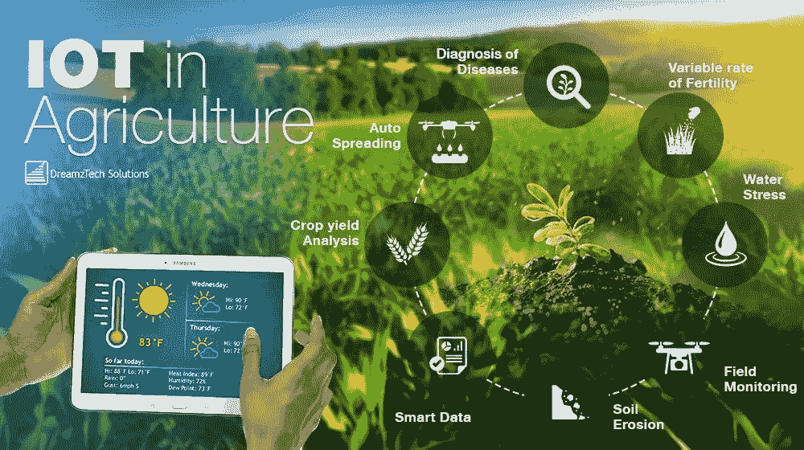

# 多媒体物联网在颠覆智能和未来农业中的作用

> 原文：<https://medium.com/analytics-vidhya/the-role-of-internet-of-multimedia-things-in-disrupting-smart-and-future-agriculture-ee0778b41a23?source=collection_archive---------21----------------------->

物联网是互联网领域的重大进步之一(印度孟买国家工业工程研究所(NITIE)信息技术应用小组和 Madakam，2015)。这些想法有助于将具有检测、激活和处理控制功能的物理对象相互联系起来。随着水资源日益减少，灌溉过程在管理农业用地中的水储量方面起着至关重要的作用。植物的水分供应不足将导致呼吸困难，这将导致叶子褪色和土壤中干燥颗粒的分散。在这篇研究论文中，图像处理技术、物联网传感器和节点以及机器学习参数的特征被用于达成灌溉决策。本研究论文中的想法是通过贡献 IoMT(多媒体物联网)和机器学习的混合工作来改进之前的工作，因为在智能农场中使用智能灌溉系统从而减少了水的浪费并提高了收成的盈利能力(Alvi *et al.* ，2015)。

提出的框架旨在利用数字图像处理和 IoMT 的原理分析从媒体捕获的视觉信息和多种数据。(阿尔祖比*等*，2019 年)

在拟议的工作中，植物最初满足了对水的需求。由于传感器本质上是动态的，它们不断地将信息传输到主节点。从主站检索可用数据集后，将对数据进行调查。开启/关闭泵的理想措施取决于各工厂(北达科他州杜尔孙和奥兹登)的规格卡所形成的数据。图像处理和分析框架在多媒体传感器通信的帮助下连续处理记录的图像。服务器接收记录的图像测量，并与其他可用的传输数据集合并，以做出适当的决策(夏尔马*等人*，2015)。因此，机器学习在训练可用数据集和根据传感器传送的记录图像得出结论方面发挥着重要作用。

因此，到目前为止，每种植物都有一个升级的原则。这说明了我们的未来和基于 IoMT 的智能农业。

***当前视角:***

Weka 通常用于提供分类解决方案(Cunningham 和 Holmes，n.d .)。为了监控植物的浇水时间，使用了 Weka 功能。为了训练多媒体传感器，使用了无线传感器网络机制。然后，提议的原型接收感测到的图像，并因此用于每次训练(Garner 等人，未注明)，以获得准确的情况传感器读数，从而提出打开/关闭水泵的理想选择(浇水框架)。

土壤中的裂缝和叶子颜色变黄以图像的形式从所提出的模型中被捕获。IP 摄像机用于捕捉图像，然后将图像发送到服务器以分析捕捉到的图像(匿名，未注明)。MATLAB 属性用于检查土壤中的裂缝、土壤中的水分含量以及叶子颜色的变化。一旦在服务器端接收到图像，就用从连接的传感器记录的相关读数和供水系统的状态进行检查。这一过程是在多媒体传感器(即 IP 摄像机)的帮助下实现的，并且结果用机器学习方法来简化。检测到的多媒体信息(图片)将在没有其他常规传感器的情况下被考虑，以筛选和批准水系统框架(匿名，未注明)。

***未来潜力&结论:***

物联网传感器已经在不断发展，其中一种方法是预测地球的状态，这对植物有利。智能水系统框架与 WSN 的调查和每种植物的预测生态行为相关(匿名，未注明)。为了检测多媒体数据，在当前的智能灌溉框架中使用了多媒体远程传感器，这些传感器相应地依赖于 DIP 和 MATLAB 结果。

从提出的思想中，无数即将到来的研究想法浮出水面。一般观点，如分析叶子边缘的外观、叶子上看到的斑点、提供能量的营养物(即半乳糖)以及检查影响等，有助于诊断植物问题(Cavazza 等人，2018 年)。推动 IoMT 的想法可以另外应用于各种用途，而不是智能和未来园艺(匿名，未注明)。IoMT 可用于医疗保健、能源消耗切断、供应链资源管理、物流和社会管理。