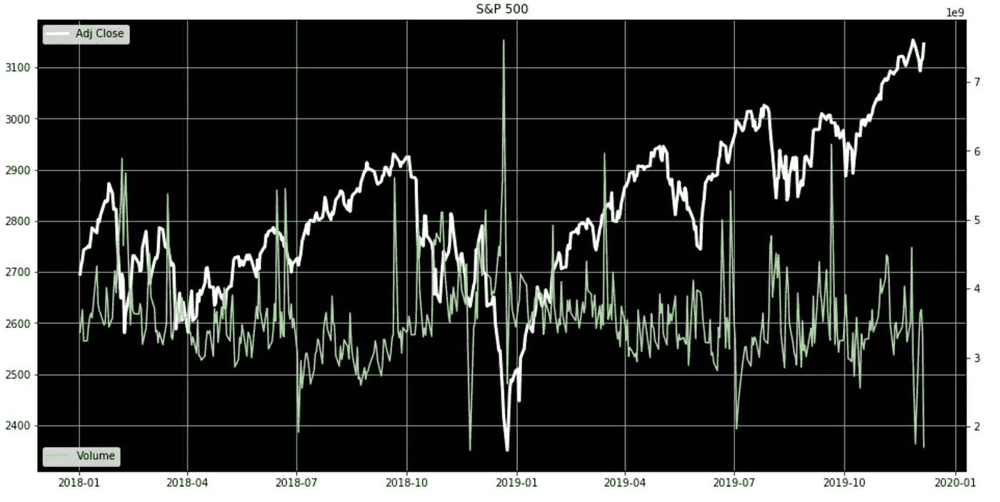
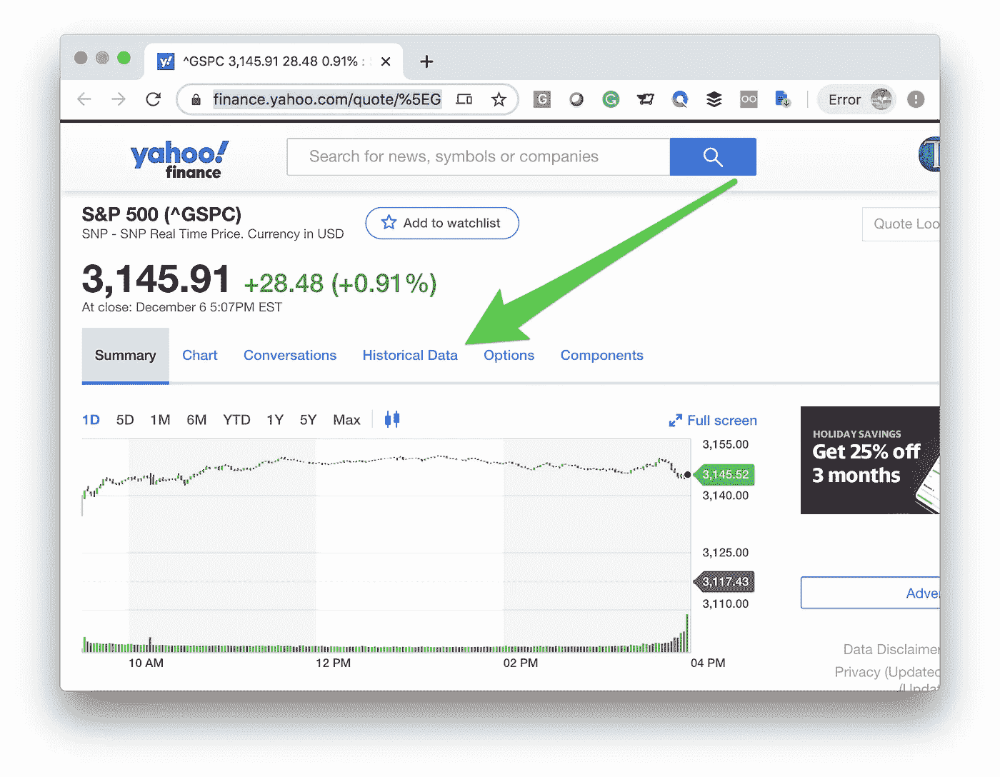
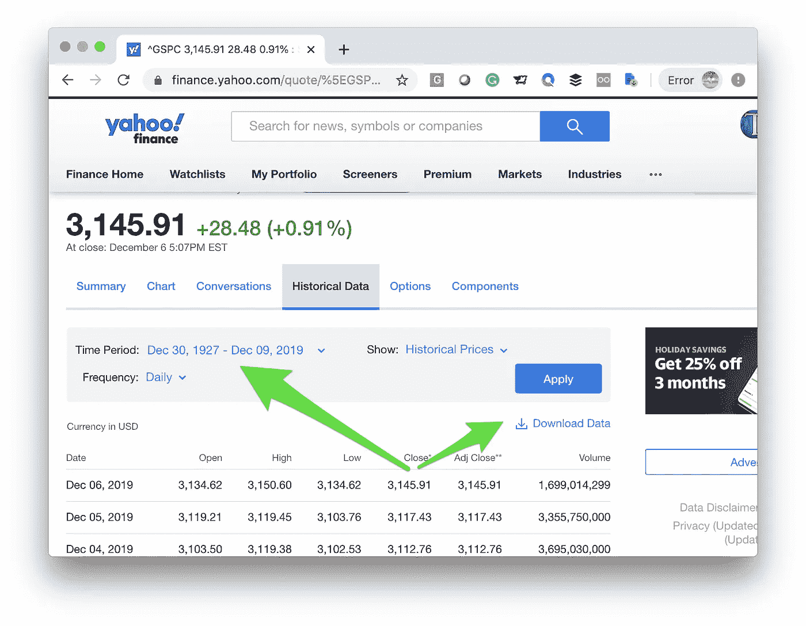
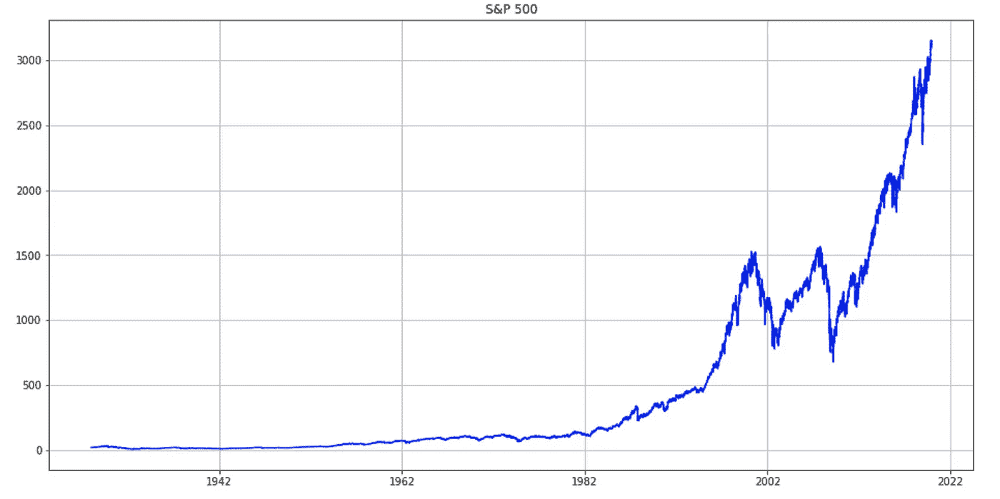
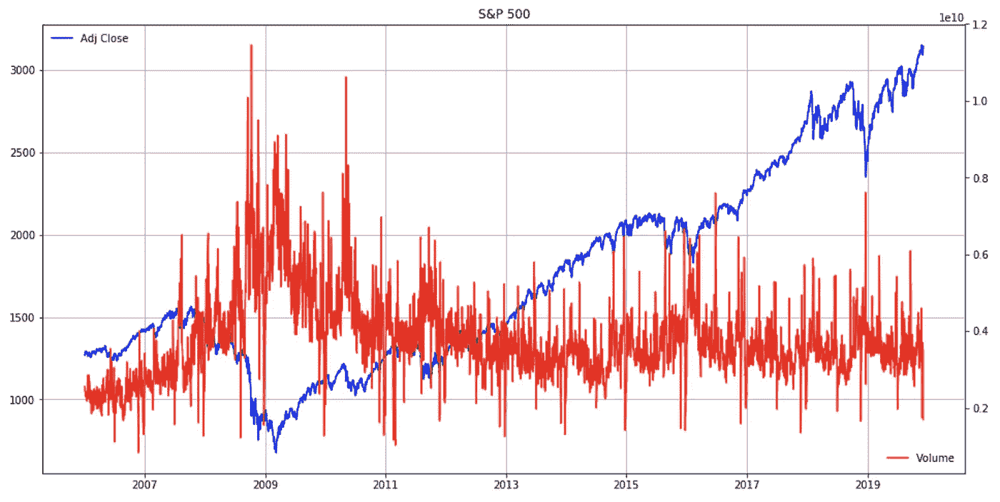
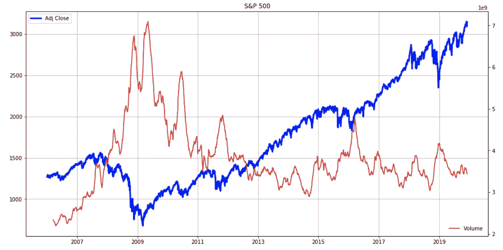

# 标准普尔 500，所有指标的鼻祖——让我向您展示用 Python 构建一个指标是多么容易

> 原文：<https://medium.com/analytics-vidhya/the-s-p-500-the-granddaddy-of-all-indicators-let-me-show-you-how-easy-it-is-to-build-one-in-af8a441a451d?source=collection_archive---------23----------------------->



*最初发表于*【ViralML.com】

*标准普尔 500 是世界经济的晴雨表。如果我必须去一个荒岛，并且只能拿一个市场指数，这将是一个。*

*有很多方法可以将它分割成一个指标，可能是你的想象力所能承受的。让我们挑选价格和数量，让事情变得简单。你会看到当数量激增时，麻烦就来了。但是这些数据从何而来？*

*标准普尔 500 由在美国交易所上市的 500 家最大的公司组成。每只股票都以其已发行股票的总市值来衡量。这一强大而有力的指数包含了美国 80%的股票市值，其 30%的收入来自美国以外。它是衡量所有其他金融产品的基准。*

*这就是为什么它也是一个伟大的市场指标。*

# *用 Python 绘制标准普尔 500*

*没有什么比回答我们自己的市场问题更令人满意的了，使用 Python 很容易做到这一点。让我带你完成这个简单的练习。让我们从雅虎财经[下载标准普尔 500 历史数据。他们已经允许我们免费下载这些数据很多年了——感谢雅虎！](https://finance.yahoo.com/quote/%5EGSPC)*

**

*点击“历史数据”链接。*

**

*然后选择可用的最大时间段(是的，可以一直追溯到 1927 年)，点击蓝色的“应用”按钮，最后，单击“下载数据”链接。这将把所有数据下载到本地机器上的逗号分隔文件(CSV)中。*

# *Python 和 Matplotlib*

*打开你信任的 Jupyter 笔记本，放入雅虎标准普尔 500 CSV 文件的同一个文件夹。调用包括“Matplotlib”在内的几个库。使用“熊猫”将数据加载到内存中，并稍微清理一下。*

```
*%matplotlib inline
import matplotlib
import matplotlib.pyplot as plt
import pandas as pd
import numpy as np
import datetime
path_to_market_data = ‘/Users/manuel/Documents/financial-research/market-data/2019–12–06/’sp500_df = pd.read_csv(path_to_market_data + ‘^GSPC.csv’)
sp500_df[‘Date’] = pd.to_datetime(sp500_df[‘Date’])
sp500_df = sp500_df.sort_values(‘Date’, ascending=True)
sp500_df.head()fig, ax = plt.subplots(figsize=(16, 8))
plt.plot(sp500_df[‘Date’], sp500_df[‘Adj Close’], color=’blue’)
plt.title(‘S&P 500’)
plt.grid()
plt.show()*
```

**

*很简单，对吧？让我们将卷添加到图表中，因为它包含在下载的数据中。是的，通过添加一个额外的 y 轴，使用 Matplotlib 仍然是微不足道的。*

```
*sp500_df_tmp = sp500_df[sp500_df['Date'] > '01-01-2006']fig, ax = plt.subplots(figsize=(16, 8))
plt.plot(sp500_df_tmp['Date'], sp500_df_tmp['Adj Close'], color='blue')
ax.legend(loc='upper left', frameon=False)
plt.title('S&P 500')
plt.grid()# Get second axis
ax2 = ax.twinx()
plt.plot(sp500_df_tmp['Date'], 
         sp500_df_tmp['Volume'], label='Volume', color='red')
ax2.legend(loc='lower right', frameon=False)plt.show()*
```

**

*明白我说的“所有指标的鼻祖”是什么意思了吗？看看红色的交易量叠加图，它似乎在乱世中飙升。*

# *用滚动平均来清理事物*

*让我们通过应用滚动平均值来降低音量。这会让我们的眼睛看起来更舒服。滚动平均简单地按时间顺序遍历数据序列，并对一定量的过去数据进行平均，以计算一个新点。在 Pandas 中，使用“rolling()”函数很容易做到这一点。*

```
*sp500_df_tmp = sp500_df[sp500_df['Date'] > '01-01-2006']fig, ax = plt.subplots(figsize=(16, 8))# ax.set_facecolor('xkcd:black')
plt.plot(sp500_df_tmp['Date'], sp500_df_tmp['Adj Close'], linewidth=3, color='blue')plt.title('S&P 500')
plt.legend(loc='upper left') 
plt.grid()# Get second axis
ax2 = ax.twinx()
plt.plot(sp500_df_tmp['Date'], 
         sp500_df_tmp['Volume'].rolling(window=50).mean().values, label='Volume', color='red')
ax2.legend(loc='lower right', frameon=False)plt.show()*
```

**

*是的，我们可以看到数量的增加意味着变化和/或麻烦。这是有道理的，因为担心的人会抛售头寸，其他人会因为希勒的“非理性繁荣”效应而加入投机行列。可能有无数的原因和故事与这些高峰有关，但我们并不真正关心“为什么”，我们真正关心的只是“什么时候”。*

# *最后*

*就像我之前说的，没有什么比回答我们自己的市场问题更令人满意的了！*

*对冲基金超级明星复兴科技公司就是这样发现其第一个模式的吗？谁知道呢，而且肯定不是用 Python 写的(Python 很老，但 Renaissance 更老)。*

*如果你喜欢这种方法，也就是“双手卷起袖子”的方法，可以看看我在维拉尔学校的免费入门课，只需注册订阅我的时事通讯，我就会免费发给你。*

*[](https://www.viralml.com/deal.html?t=39194) [## 市场分析与 Python -简介-学习找到自己的答案，基本面和…

### (即使您已经在我的时事通讯上，并且想要参加该课程，也只需再次注册并单击“是”即可…

www.viralml.com](https://www.viralml.com/deal.html?t=39194) 

如果你想了解更多，这里有“[Python Track](https://www.viralml.com/applied-fundamental-market-analysis-tract.html)应用基本面市场分析”的链接。


关注我在 ViralML.com[和](https://www.viralml.com/) [amunategui.github.io](https://amunategui.github.io/) 的最新项目。

作者:"[基本面指标小书:用 Python 进行实际市场分析:用 Python、Jupyter 笔记本和免费数据找到你的市场定位。](https://amzn.to/2DERG3d)”

最初发表于[ViralML.com](https://www.viralml.com/blog-content.html?l=The-SP-500-The-Granddaddy-of-All-Indicators.html)*