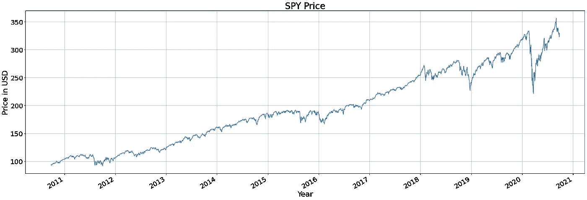
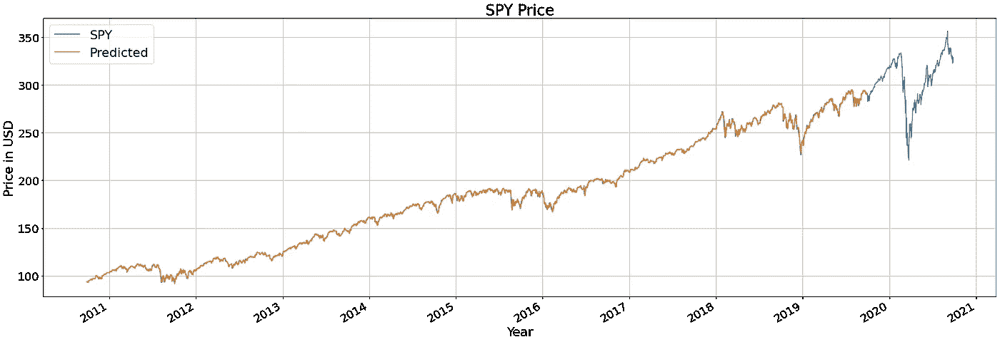
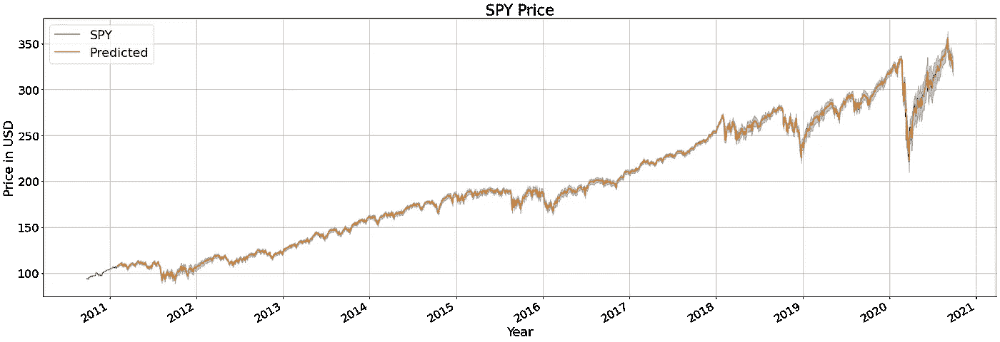
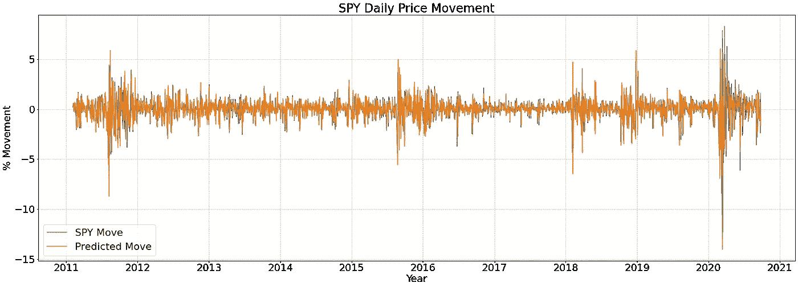
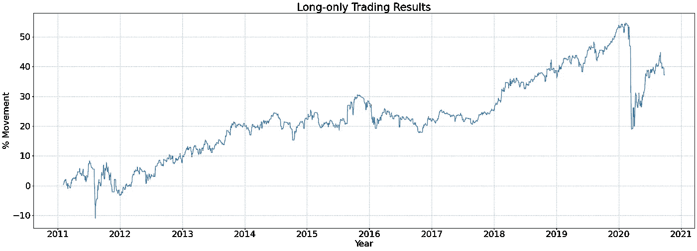

# 价格未来价格预测的科学

> 原文：<https://medium.com/analytics-vidhya/the-science-of-future-price-prediction-5a488334f2c7?source=collection_archive---------10----------------------->

图片来自 StockSnap

自中世纪以来，股票市场一直是许多追求财富和金钱的人的幻想。即使是最聪明的人也加入了晦涩混乱的投机世界。有关于艾萨克·牛顿爵士投资南海公司赚了和赔了相当于今天数百万美元的故事。注意投机这个词，不是投资。投机是指一个人在“猜测”未来的价格，基于一些猜测，但没有强有力的基础。对比投资和投机是一个广泛的话题，我将在另一个时间讨论它。

我们在这篇文章中提出的问题是，我们是否可以用自动方法预测资产的下一个价格。我们将根据经验回答这个问题，并展示一种预测未来价格的流行方法。更具体地说，我们将使用 ARIMA 模型。最后，我们将根据利润和损失来衡量这些方法的性能。

我承诺，我只会在这个职位发展基础水平的数学。我所说的基本是指我不会展示所用方法的内部——尽管这很有趣。我将只使用一些基本的来计算利润，我相信这是每个人最喜欢的部分——钱！

***注意，本帖不构成理财建议。如果你想投资，请咨询专业人士。最重要的是，做你自己的研究。***

# 基准

首先，让我们看看 10 年前购买并持有价值 100 美元的 S&P500(间谍)指数股票能赚多少钱。间谍被认为是一个基准，这意味着，对许多人来说，它是观察金融市场表现的首选。其他一些受欢迎的基准是道琼斯工业平均指数(DJI)，纳斯达克综合指数(IXIC)。

过去 10 年的间谍价格(来源:雅虎财经/作者)

投资回报率约为 251%！2011 年投资约 93 美元的人，今天将拥有约 351 美元。好吧，如果有人推测间谍的价格呢？我们将使用 ARIMA 模型来回答这个问题。

# 资料组

在这项研究中，我们将使用从 Yahoo！金融。我们收集了从 2010 年 9 月 27 日到 2020 年 9 月 25 日的 10 年调整后每日收盘数据。我们向前填充数据中可能丢失的任何值。

# ARIMA，ARIMA！

玩笑归玩笑，ARIMA 代表**一个** uto- **R** 过度 **I** 整合**M**v**A**平均。它是一种应用于时间序列数据以执行分析或预测未来数据点的统计方法。如果您对编码和/或技术细节不感兴趣，请随意跳过接下来的三段，直到我回到正轨。

对于有技术倾向的读者来说，ARIMA 模型是 ARMA 模型的推广。也可以“分解”成 AR、I、MA 三个子模型。 ***AR*** 部分捕获一个数据点与 ***p*** 之前的数据点之间的依赖关系。 ***I*** 部分只是一个使时间序列静止或去除趋势的操作。它基本上是将每个数据点减去前一个数据点 ***d*** 次。最后，*部分基本上是一个移动平均线，或者说是最后一个 ***q*** 数据点的平均值。*

*我将在这里暂停一下，并提出我在为本文做研究时偶然发现的一个问题。 ***你会在网上找到的很多*** 代码和帖子都有一个根本问题:*数据泄露*。那是什么意思？这意味着分析使用未来数据进行预测。这是错误的。为什么？因为在现实世界中，模型无法访问未来的数据。使用未来数据的模型很可能是有偏见的，并且很可能会返回不切实际的结果。*

*回到正轨。*

*我们使用 ARIMA 根据过去预测未来价格。我们将数据分成 90%用于训练，10%用于测试。我们训练的模型呈现 1.09 的平均绝对误差和 2.61 的均方误差。下图显示了训练模型在 SPY 真实值上的投影。*

**

*学过 ARIMA 模式的间谍。有些 SPY 没有“预测”值，因为它是为测试而设置的。来源:作者*

*我们感兴趣的不仅仅是它的拟合程度，还有它对未来价格的预测程度，因为那是钱的所在。下图显示了我们的模型对价格的预测效果。*

**

*ARIMA 模型的预测和置信区间。来源:作者*

*我们的模型在大部分间谍曲线上概括得相当好。阴影区域表示 95%的置信区间。也就是说，我们的模型有 95%的把握预测将位于阴影区域内。有趣的是观察我们的模型如何处理 2020 年的市场不确定性。*

# *钱，钱，钱，钱，钱，钱！*

*我知道你很想知道模特挣多少钱。所以我们开始吧。第一个发现 ARIMA 盈利模式的是衡量它多长时间是*。也就是说，我们的模型多久预测一次市场的运动。下图显示了间谍的预测和实际每日价格变动。**

****

**间谍的每日价格变动。请注意 2020 年是如何出现强烈波动的。来源:作者**

**我们现在可以创建一个交易策略，尝试使用 ARIMA 模型获利。我们选择采用只做多的日内交易策略。也就是说，如果 ARIMA 模型认为间谍价格上涨，我们在开盘时买入，收盘时卖出。在下图中，我们显示了间谍的累积利润。**

****

**根据 ARIMA 仅做多日交易策略，对间谍投资的累计利润总额(来源:作者)**

**遵循我们的策略，10 年后的回报率约为 35%。这意味着 2010 年的 100 美元投资到 2020 年将会产生 35 美元的收益。不错吧？是的，但不如买入并持有策略那样令人印象深刻。**

# **结论**

**对我们问题的简短回答是:*我们不确定*。我们可以肯定的是，股票市场不适合胆小的人。涨跌、熊市和牛市吸引了并将继续吸引许多投资者。只有最强的才能生存。**

**在某种程度上，我们可以说我们可以预测一只股票的价格。我们发现其他几个作者在讨论这个话题，他们中的许多人强调这是一个困难的问题。最后，做你自己的研究，如果你找到了预测股票价格的准确方法，享受免费的午餐吧！记得做自己的研究，明智地选择资产。**

**我正在写每日知识药丸，这样你可以保持你的知识敏锐！我写的是数据科学，机器学习与金融的交叉。请随意连接并查看我的其他文章！[点击这里查看我的最新文章！](https://vnasilva.medium.com/asking-simple-in-stock-price-prediction-d4d8d1412881)**

# **参考**

**[1][https://www . business insider . com/is AAC-Newton-lost-a-fortune-on-englands-hotest-stock-2016-1](https://www.businessinsider.com/isaac-newton-lost-a-fortune-on-englands-hottest-stock-2016-1)**