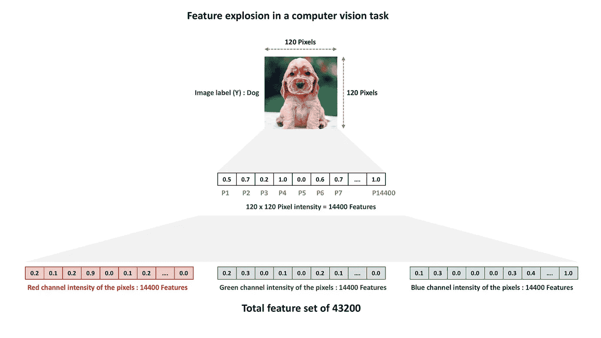
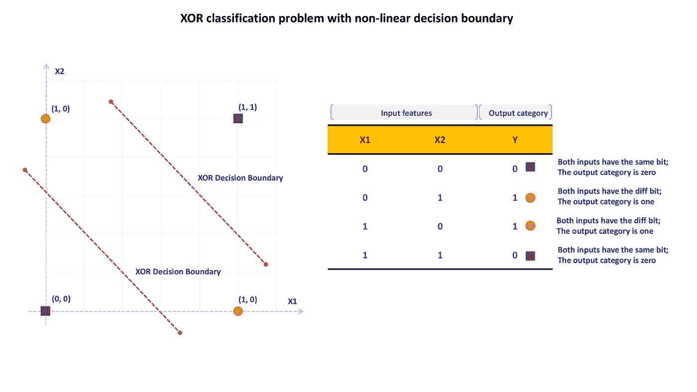
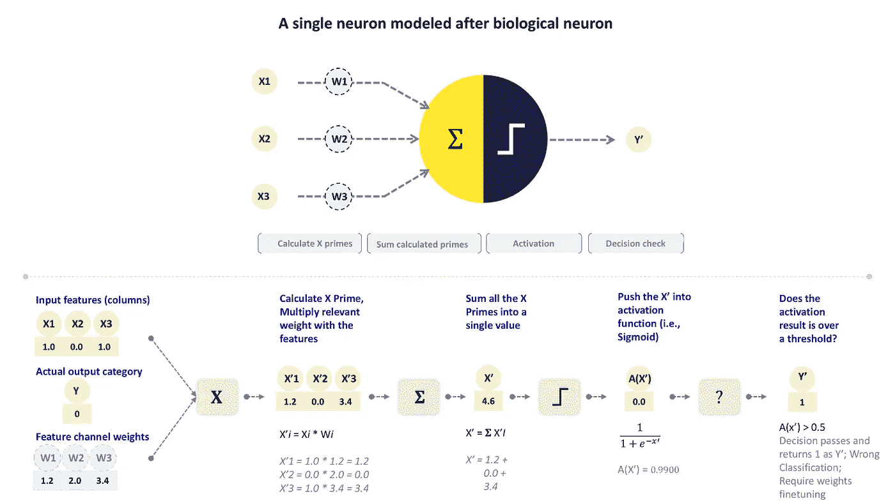
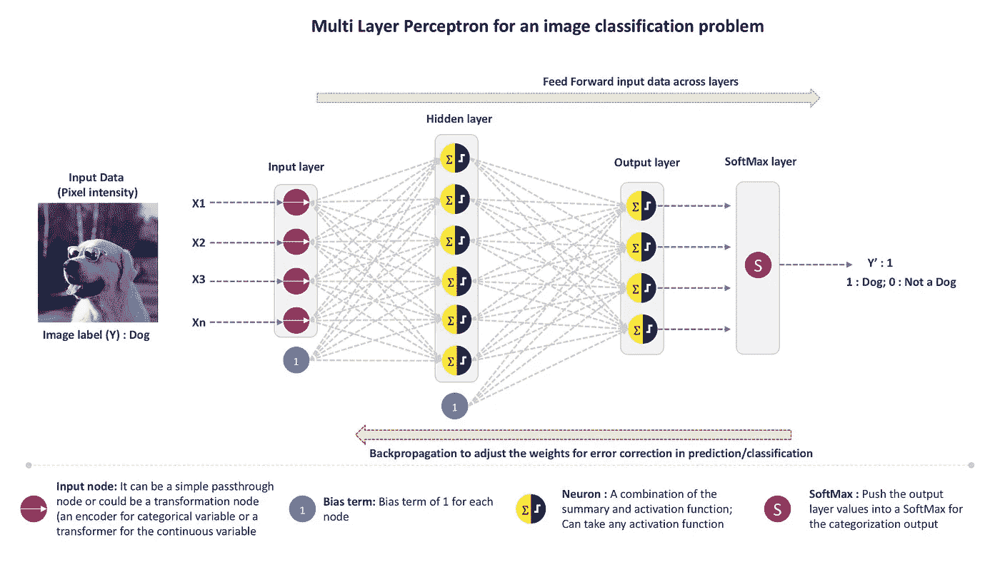
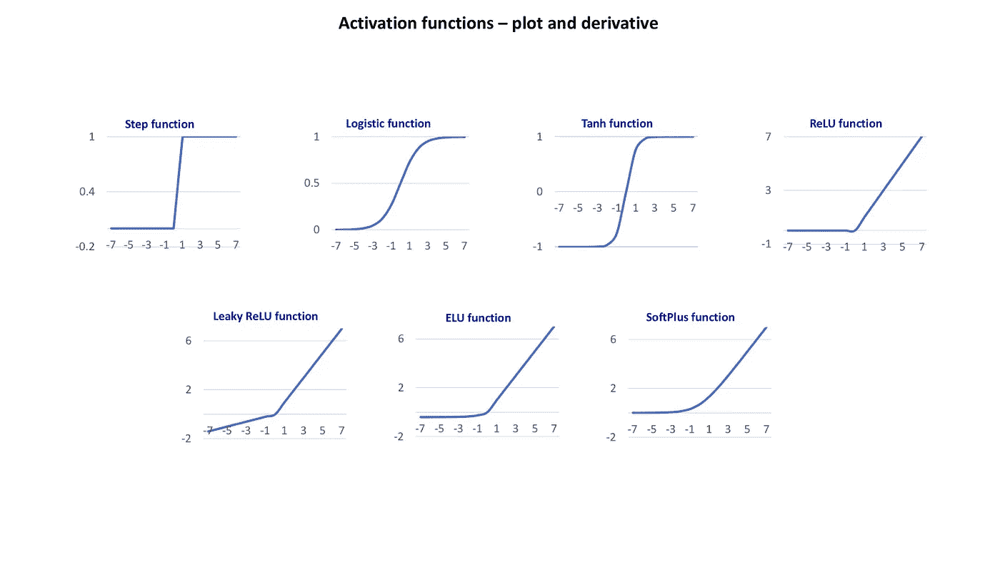
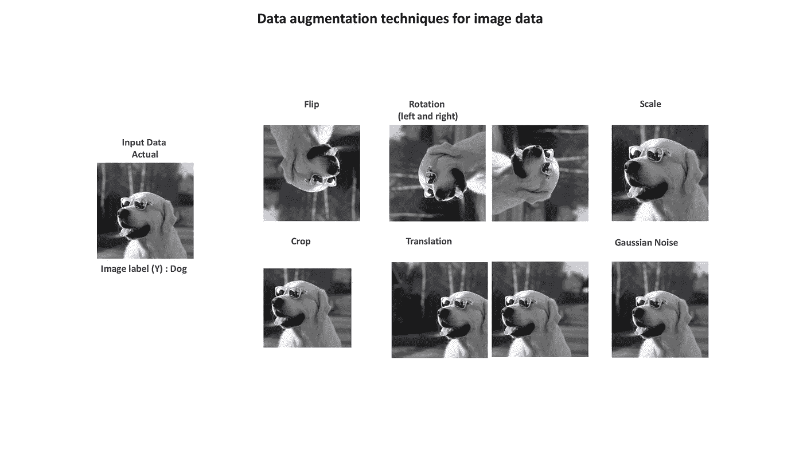
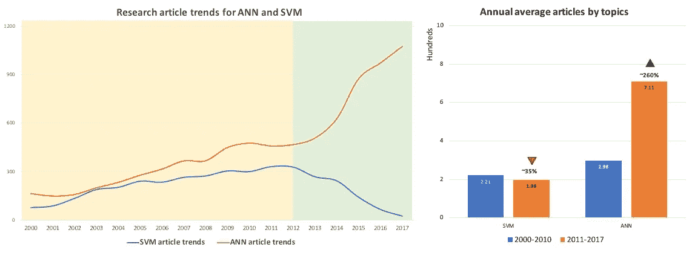

# 两种算法的混战——神经网络与支持向量机

> 原文：<https://medium.com/analytics-vidhya/the-scuffle-between-two-algorithms-neural-network-vs-support-vector-machine-16abe0eb4181?source=collection_archive---------0----------------------->

深度学习(DL)已经成为任何分析或商业智能项目讨论中的常用词。它属于更广泛的人工智能研究领域，具体来说是机器学习算法的一部分。与特定任务算法相比，这些模型纯粹基于**学习模式**和在给定数据中找到的表示(理解数据模式与拟合直线、超平面或决策边界)。学习可以有监督、半监督和无监督。

DL 模型在计算机视觉、语音识别、自然语言处理、生物信息学、药物设计和机器翻译(从一种人类语言到另一种语言的翻译；即英语到印地语)来列举几个例子。

简单来说，大多数深度学习模型都涉及**在特定的架构布局中堆叠多层神经网络**，用于预测或分类问题(强化和生成架构处理一组不同的现实世界问题)。神经网络是通用的、健壮的和可扩展的，并且它们可以容易地处理高维度任务(极端数量的特征集；即，在对象识别中——识别图像是否包含猫或狗，每个像素颜色通道将是一个特征；一个 120x120 的图像产生一个 14400 像素的矩阵，将它乘以三得到 RGB 通道强度。我们将从 43200 个特性开始)

简单图像分类任务中的特征爆炸(即，图像是否包含狗或猫)

在 2010 年中期神经网络兴起之前，**支持向量机曾经在文本分类和语音识别等高维预测问题中发挥重要作用**。

在传统的分类任务中(即，基于给定的症状列表和家庭健康记录预测患者是否将被诊断患有疾病；输出总是“是”或“否”以及输出的倾向)，目标是找到区分目标变量类别的决策边界(疾病状态:是或否)，当数据是线性可分的但无法理解非线性关系时，逻辑回归工作良好。

**SVM 采用内核技巧和最大间隔概念，在非线性和高维度任务中表现更好**。即使是强大的 SVM 模型，在大多数情况下，也会受益于适当的特征选择和特征提取/转换技术。

人工神经网络概念对计算机科学世界来说并不是什么新鲜事物。这是由沃伦麦卡洛克和沃尔特皮茨在 1943 年首次提出的，美国海军研究办公室在 1957 年委托弗兰克罗森布拉特构建感知机(神经网络)算法。单层感知器的性能没有达到预期，因为它只能捕获有限的线性模式，堆叠两个或更多的神经层(前馈神经网络或多层感知器)可以提高性能，但**仍然无法预测异或函数。**

不连续 XOR 判定边界

1969 年，马文·明斯基和塞莫尔·帕尔特在他们题为《感知机》的书中指出，这些网络不可能模拟简单的异或函数。多年来，这本书的引用使得人工神经网络领域的进展非常有限，甚至为零。直到 20 世纪 80 年代，该算法才重新成为活跃的研究，2012 年【Geoffrey Hinton 在 Imagenet 挑战赛中展示了使用广义反向传播算法来训练多层神经网络，这彻底改变了深度学习领域。

DL 使用的增长也应归功于使能字段。数据处理领域在 2010 年中期发生了突破性的变化。Hadoop 分布式生态系统改变了处理和存储数据的方式。单核处理器的处理能力比 20 世纪 80 年代的处理器提高了数倍，物联网的出现使得大量的数据收集成为可能，为神经网络提供了急需的训练数据。**与多核处理器相比，图形处理单元在矩阵乘法方面表现出色**，神经网络严重依赖矩阵运算来完成必要的计算。感谢世界各地的游戏玩家，因为他们，现在神经网络可以在 GPU 上训练得更快。没有你的不懈努力和刚毅，这个世界就不会有更好的 GPU。

神经网络的**基本单元是单个神经元**，它是根据生物大脑中的神经元松散模拟的。给定层(即，层 1)中的每个神经元将连接到下一层(即，层 2)中的所有或同样多的神经元。神经元之间的连接模仿了生物大脑中的突触。一个神经元只有在从它的前身接收到足够的输入信号(在数量上超过设定的阈值)时，才会触发输出信号。

模仿生物神经元的单个神经元

**随着时间的推移，提高神经网络性能的技术列表帮助它击败了 SVM:**

1.**反向传播**:多层感知器(MLP)，具有输入、隐藏和输出神经层。训练 MLP 是一项无法完成的任务，直到 1986 年 Rumelhart 发表了一篇介绍反向传播训练算法(也称为使用反向模式自动 diff 的梯度下降)的文章。对于每个训练记录(数据点),该算法计算每层的神经元输出，然后最终在输出层进行预测(正向传递),根据预测与实际输出的偏差计算预测误差。然后使用预测误差来改变所有先前层中神经元的权重(反向传播),直到它到达输入层，以提高整个网络的预测精度。

2.**隐藏层和每个隐藏层的神经元数量**:单层神经网络可以给出合理的结果，但是将它们堆叠在一起可以提高网络的学习能力。用于人脸检测的多层神经网络将优于单层神经网络。当堆叠时，较低层可以捕捉较低层的细节(即，将面部与背景分开的线)，中间隐藏层可以捕捉中层细节(即，正方形和圆形)，而输出层可以检测高层特征(即，眼睛的像素位置)。增加更多的层和每层更多的神经元将导致模型过度拟合、更长的训练时间和消失/爆炸梯度问题，因此这些参数将需要仔细考虑。

3.**激活函数**(消失和爆发梯度——非饱和激活函数):激活函数根据来自前一个神经元的输入信号，决定神经元何时触发以及输出的大小。它可以是 sigmoid、tanh、softmax 或 ReLU 变体。通常使用 ReLU(校正线性单位)作为输入和隐藏层的激活函数。对于输出图层，如果是分类任务，则为 softmax 如果是预测，则为实际值。当在深层神经网络中使用 RELU 时，反向传播信号在到达输入层时要么减小到零，要么爆炸成一个大数，没有合适的反向传播信号，在较低层中权重将永远不会改变。ReLU 的变体前来救援。泄漏 ReLU、随机化泄漏 ReLU、参数泄漏 ReLU 和指数线性单元(eLU)。性能测试显示了以下优先顺序。

**ELU >漏热路(及其变种)>热路>坦恩>物流(乙状结肠)**

4.**批量归一化** : Sergey Ioffe 和 Christian Szegedy 在 2015 年的论文中提出了 BN 来解决消失和爆炸梯度问题。就在每层的激活功能之前，将输入置零并归一化，然后通过两个新参数(一个用于缩放，另一个用于偏移)进行缩放和偏移。这让模型学习每一层中训练数据的最佳比例和平均值

5.**重用预训练层(迁移学习)**:预训练模型的较低层权重可以重用，而不是从头开始训练新模型。如果我们正在构建一个模型来识别一只狗的面包，那么我们可以使用模型的较低层权重来确定图像中的动物是否是一只狗

6.**更快的优化器**:优化器计算反向传播信号，这有助于网络调整所有层的神经元权重。优化器的性能和速度直接影响网络的训练速度。Boris Polyak 在 1964 年提出的动量优化是所有优化器的鼻祖。后来出现了内斯特罗夫加速梯度，阿达格拉德，RMSProp 和亚当优化。亚当比其他优化者表现更好

7.**学习率调度**:找到合适的学习率很关键。较小的学习率将永远达不到最优解，而较大的学习率将越过边界而不是达到最优解。强烈建议在开始阶段使用较高的学习率，在训练阶段降低学习率，而不是恒定的学习率。通常优化者应该为用户解决这个问题。

8.**提前停止以及 l1 和 l2 调整**:当性能与之前的时期相比实际下降时，停止训练网络。使用 l1 或 l2 范数对神经元权重(而不是偏差)进行调整有助于避免网络过度适应训练数据

9.**辍学**:这个概念是由 Geoffrey Hinton 在 2012 年提出的，它帮助网络避免了过度适应。在每一次训练迭代中，包括输入在内的所有层中的神经元都有概率 p 退出网络训练。这种技术导致在每次迭代中训练新的架构，并导致在不过度适应训练数据的情况下提高模型准确性

10.**数据扩充**:贴标签的数据比 DL 土地上的任何贵金属都有价值。每个网络都需要大量的标记数据来进行训练(即，在给定图像中猫和狗的对象检测中，我们需要标记图像来进行训练——图像被人标记为猫或狗)。然而，当我们有足够的标记训练数据时，可以对标记数据点添加一些修改，以生成更多的标记训练数据(即，通过将猫图像旋转一个角度或改变几个像素的像素强度)。

对于每个标记的图像数据点，我们可以使用数据扩充生成多个数据点

【academic.microsoft.com 研究文章趋势】识别领先算法:

让我们看看从 2000 年开始发表的文章《神经网络与支持向量机的趋势》。神经网络的文章数量有了显著的增长，在过去的七年里，它们在活跃的研究方面已经大大超过了 SVM。

关于神经网络(标签:ANN、神经网络、LSTM 和 CNN)和 SVM(标签:SVM 和支持向量机)的文章集。

我希望机器学习算法之间的混战能够带来更好的智能产品，为人类的努力服务。