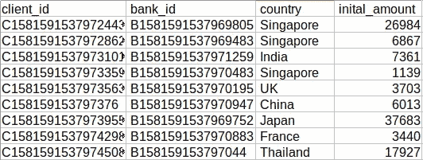

# 模拟的秘密—第二部分

> 原文：<https://medium.com/analytics-vidhya/the-secret-of-simulation-part-2-d59c1c2ed44f?source=collection_archive---------24----------------------->


威廉·艾文在 [Unsplash](https://unsplash.com?utm_source=medium&utm_medium=referral) 上的照片

随着系统的增长，模拟也在增长。人们正在进行不同类型的模拟，以了解系统在现实世界中是如何工作的。

在我的[之前的博客](/@ritikjain51/secrets-of-simulation-2b314cd8c297)中，我对模拟做了一个简单的了解。以及基本模拟是如何工作的。我还讨论了我们所有的模拟模型。

在这篇博客中，我将只讨论与基于时间的**基于智能体的模拟**。我们有几个系统可以及时进行评估。金融领域的银行系统、交易系统、股票交易系统或生物系统中的人类进化等等。时间是系统进化中的一个重要因素，因为随着时间的变化，环境也在变化，进化也在继续。

对于这个博客，我们正在考虑全球客户之间的交易系统。

在深入使用案例之前，让我们先了解一下*什么是基于代理的模拟*及其变体。基于代理的模拟*是一种包括一些实体来处理操作的模拟。*例如*，如果一个人向另一个客户转账，有一个代理人(银行)将验证和核实交易，以便进一步处理。在这种情况下，一个实时代理处理所有请求。因此，如果我们为*转账系统*创建模拟，那么我们需要一个编程代理，它将作为一个真正的代理工作。这就是为什么我们需要*基于智能体的模拟。**

*有时，我们会有不止一个代理人参与互动，促成交易。这种类型的模拟称为 ***基于多智能体的模拟*。***

****问:事务型系统是基于单智能体的模拟还是基于多智能体的模拟？****

*一些模拟是时间相关的。如果我们谈论的是我们上面讨论过的系统。它们是基于时间的系统。使用两种时间机制的模拟*

*   *下一个事件时间推进*
*   *固定时间增量时间推进*

***下一个事件时间提前**机制未来事件的发生时间基于一系列事件。*

***固定时间增量时间推进**机制时钟推进特定的时间单位(δt)进行增量。增量只会在固定时间后发生，任何事件都不会影响时间增量。*

****问:哪种机制适用于我们的系统？****

****交易流水系统****

**

*交易流程系统*

*如上图所示，交易流系统是一个基于多智能体的模拟**。为了进行交易，我们有多个客户、商家和银行。***

***交易步骤**
为了使交易成功，业务流转了一些步骤*

1.  *发送方将使用所有接收方的详细信息从其端发起交易。*
2.  *交易详细信息转到汇款人的银行进行交易验证。*
3.  *验证后，交易被转发到中央系统进行验证*
4.  *收款人的银行接收经过验证的详细信息，以便进行银行级验证。*
5.  *在所有验证之后，交易被接收到接收方。*

*为了模拟交易，我们必须创建一个基础环境。*

****仿真模型和结构****

*模拟模型文件结构包含参与者、参数、输出工具和初始化模拟。*

```
*Simulator
|
|----- Actor
|       |
|       |----- Bank
|       |
|       |----- Client
|       |
|       |----- Transaction
|        
|----- Parameter
|       |
|       |----- Configuration
|
|----- Output
|       |
|       |----- DBModel
|       |----- CSVModel
|
|----- utils
|       |
|       |----- helperutils
|
|----- Simulation*
```

*在模拟结构中，我们有类似于代理的 Actor。它包含银行、客户和交易文件。在参数中，我们有所有的初始配置参数。*

****config . py****

```
*nClients = 1000 # number of clients
nBanks = 100 # number of banks
nSteps = 60 # number of days*
```

*在配置文件中，我们正在初始化基本配置。*

*由于我们计划模拟 60 天，因此我们将 nSteps 初始化为 60。这里，nSteps 的单位是天。*

****Client.py****

```
*class client(object):
      def __init__(self, id, bank, amount, country):
          self.id = id
          self.bank_id = bank
          self.amount = amount # Initial Amount
          self.country = country* 
```

*在 Actor 中，我们有一个客户端类，我们在其中初始化客户端细节。并将数据存储到一个数据库中*

**

*模拟客户数据*

****Bank.py****

```
*class client(object):
      def __init__(self, id, country):
          self.id = id
          self.country = country
          self.n_customer = 0

      def inc_customer(self):
          self.n_customer += 1*
```

*在 Actor 中，我们有一个 Bank 类，其中存储了所有与银行相关的信息，如银行 id、所在国家和银行拥有的客户总数。*

**

*模拟银行数据*

***transaction . py***

```
*class Transaction(object):
      def make_transaction(self, sender, receiver, amount):
          self.sender = sender
          self.receiver = receiver
          self.amount = amount*
```

*在 Actor 中，我们也有一个事务类，在那里我们存储所有发生的事务。在事务数据中，我们从发送方和接收方对象中提取数据。*

*在设置好所有的基础环境后，我们准备好与客户端进行交互以生成模拟。*

*为了生成模拟，我们使用**固定增量时间推进机制。在这个机制中，我们已经将天数设置为 60。但是在每一个间隔中，我们应该做一些事务(事件)。对于事件，我们将使用一个随机函数来查找每个间隔中的事件数。***

*现在，在每个事件中，我们都使用概率方法来生成从发送者到接收者的可转移金额。*

****simulation . py****

*在模拟中，我们使用随机过程来选择汇款人、收款人和转账金额。*

```
*from Actor.client import Client
from Actor.bank import Bank
from Actor.transaction import Transaction
from utils import helperutils
from parameters import configclass Simulation(object): 
       def __init__(self):
           self.nSteps = config.nSteps
           self.nClients = config.nClients
           self.nBanks = config.nBanks def init_client(self):
           self.client_list = []
           for id in zip(range(self.nClient), helperutils.generate_id()):bank_id = np.random.choice(self.bank_list).get_id()
               self.client_list.append(Client(id, bank_id, helperutils.get_country())

        def init_bank(self):
            self.bank_list = []
            for id in zip(range(self.nClient), helperutils.generate_id()):
             self.client_list.append(Bank(id,helperutils.get_country()) def init_transaction(self):
            for step in range(config.nSteps): sender = np.random.choice(self.client_list)
                receiver = np.random.choice(self.client_list)
                Transaction(sender, receiver, helperutils.get_amount())*
```

*该函数将生成事务并将数据存储到数据库中。*

**

*模拟交易数据*

****结论****

*在这篇博客中，我提到了一些先进的模拟模型，如基于代理和多代理的模型。基于智能体的模型有助于用单智能体模拟系统。而基于多主体的模型有助于模拟所有复杂的系统，如银行系统等。我们也讨论了一些机制，在我们的模拟环境中加入时间因素。最后，我们借助 python 编程创建了一个仿真环境并生成了结果。*