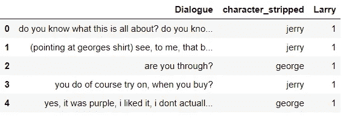
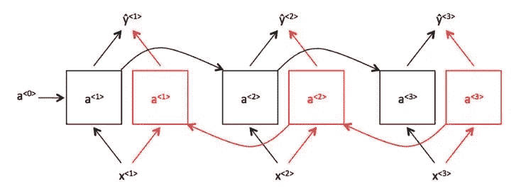
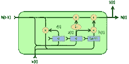
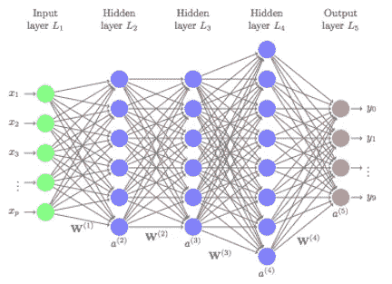
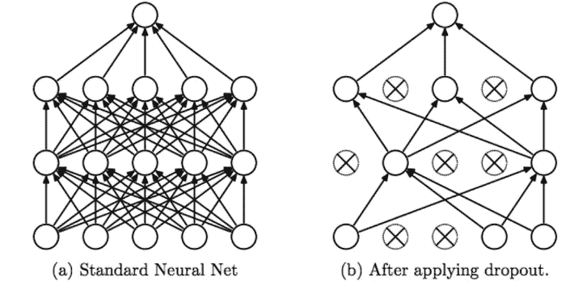

# 关于宋飞的深度学习

> 原文：<https://medium.com/analytics-vidhya/the-seinfeld-fc3c40d2910a?source=collection_archive---------15----------------------->

《宋飞正传》一直是我最喜欢的电视剧之一，所以当我看到 Kaggle 上完整的[《宋飞正传》](https://www.kaggle.com/thec03u5/seinfeld-chronicles)数据集时，我无言以对。

github 笔记本电脑:

[](https://github.com/ktzioumis/The-Seinfeld/blob/master/The-Seinfeld.ipynb) [## ktzioumis/The-Seinfeld

### 此时您不能执行该操作。您已使用另一个标签页或窗口登录。您已在另一个选项卡中注销，或者…

github.com](https://github.com/ktzioumis/The-Seinfeld/blob/master/The-Seinfeld.ipynb) [](https://github.com/ktzioumis/The-Seinfeld/blob/master/Larry%20David.ipynb) [## ktzioumis/The-Seinfeld

### 此时您不能执行该操作。您已使用另一个标签页或窗口登录。您已在另一个选项卡中注销，或者…

github.com](https://github.com/ktzioumis/The-Seinfeld/blob/master/Larry%20David.ipynb) 

起初，将深度学习应用于宋飞正传的想法似乎很奇怪，开始时我只是很高兴在数据中玩一玩，发现一些有趣的事情，如“拉里·戴维写了 58 个学分的宋飞正传的最多集”，“除了第六季，乔治在每一季中说的话都比伊莱恩多”，“超人在 17 集里被提到 24 次”。

但是拉里·戴维事件又回到了我的脑海中，并深深地印在了我的脑海中。他的写作学分数量让第二多产的作家相形见绌(彼得·梅尔曼和拉里·查尔斯各 19 学分)。拉里·戴维的角色在《宋飞正传》尚未流行、仍在摸索中的剧集的早期尤为关键。拉里·戴维写了第一季 5 集中的 4 集和第二季 12 集中的 8 集。在第三季中，他的总集数增加到了 14 集，但到了这个时候，这个系列已经有整整 23 集了。

作为一名作家，拉里·戴维有效地将这部剧变成了现在的样子，并写出了剧中的角色是谁，以及他们将成为谁。

# 拉里·戴维分类器

拉里·戴维对宋飞的贡献是巨大的。他惊人的 58 集的写作学分占总集数的三分之一。他对剧中人物和风格的影响是不可估量的，是吗？如果拉里·戴维如此有用；在创造这些角色的过程中，我能从他自己写的情节中提取出多少拉里·戴维的影子呢？

通过使用带有自然语言处理的 Keras 深度学习模型，目标是训练一个模型来判断拉里·戴维是否写了一段给定的对话。

每段对话都有标记，根据其剧集和季节编号以及拉里·戴维是否在该集中出现，创建一个“拉里”专题



对话的单个片段仅使用 20000 个最常见的单词进行标记，并转换为统一长度的填充序列。

```
tokenizer = text.Tokenizer(num_words=20000)
tokenizer.fit_on_texts(list(scripts['Dialogue'].values))
list_tokenized_train = tokenizer.texts_to_sequences(scripts.Dialogue.values)
X_t = pad_sequences(list_tokenized_train,maxlen=100)
y=scripts.Larry.values
```

数据被分成 75%的训练集和 25%的测试集，从训练集中，深度学习模型适合 10%的保持以进行验证。仅使用标记对话创建的最佳模型是双向门控递归单元(200 个节点)和三个密集连接的层(200、100、50 个节点)以及训练 2 个时期的下降(0.2)。听起来，确实是，一整口。分解一下:

*   双向-双向层在向前和向后两个方向上顺序处理数据，每个方向使用一半的节点。这种结构允许模型具有关于每一步序列的向前和向后信息。



*双向图*

*   门控递归单元-门控递归单元是一种跨数据步骤传递部分(而非全部)内部状态信息的单元。通过不断更新他们的内部状态，他们可以学习什么是重要的要记住，什么时候可以忘记它。



*门控循环单元图*

*   密集连接层——完全连接层中的神经元与前一层中的所有激活具有完全连接。因此，它们的激活可以通过矩阵乘法以及随后的偏置偏移来计算。



*密集连接的神经网络*

*   Dropout 根据选定的概率，随机选择单个节点从网络中退出。这防止了对特定节点路径的过度依赖和过度拟合



Srivastava，Nitish，等.“辍学:防止神经网络过度拟合的简单方法”

*   epoch —通常定义为“一遍整个数据集”，用于将训练分成不同的阶段，这对于日志记录和定期评估非常有用。

是啊。你知道，深度学习神经网络…


但是成功了！该模型在预测拉里·戴维是否是一段看不见的对话的作者时有 70%的准确率。

从这里开始，我想对 Seinfeld 脚本进行进一步的编辑，以删除简单的问候和短语，更复杂的语言将更具特色，并可能提高模型预测作者的能力。任何作家都可能写出“嗨”，我不想知道“嗨”，忘了“嗨”。此外，这个模型没有考虑到谁在说话，拉里如何写个人角色，这增加了另一个可以解决的复杂性。

我非常希望这只是系列文章的第一部分。随着我在自己的生活中不断回到宋飞，我希望在我作为一名数据科学家的职业生涯中继续回到宋飞。