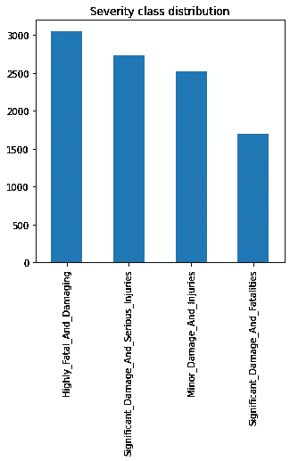
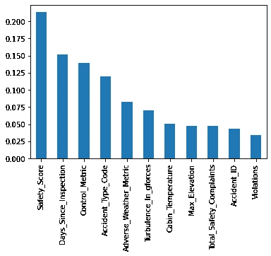
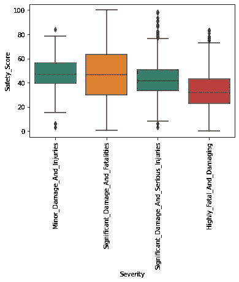
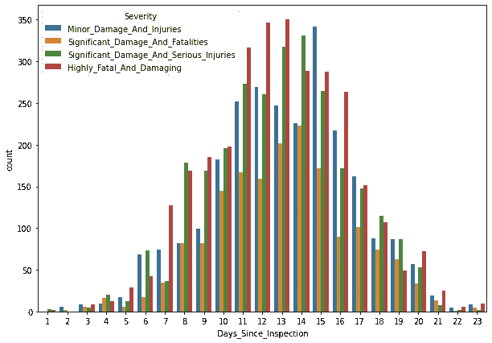

# 飞机事故的严重性

> 原文：<https://medium.com/analytics-vidhya/the-severity-of-airplane-accidents-305136e495b8?source=collection_archive---------12----------------------->

根据过去的事故预测飞机事故的严重程度

# 介绍

多年来，乘飞机一直是流行的旅行方式；它省时、实惠，而且极其方便。根据 [FAA](https://www.faa.gov/air_traffic/by_the_numbers/) 的数据，截至 2019 年 6 月，美国每天有 2781971 名乘客乘坐飞机。乘客认为飞行是非常安全的，因为进行了严格的检查，并采取了安全措施来避免和/或减轻任何事故。然而，仍然有一些不幸事件的机会。

*在这里，重点是分析来自* [*黑客地球*](https://www.hackerearth.com/challenges/competitive/airplane-accident-severity-hackerearth-machine-learning-challenge/) *比赛的数据集，该比赛由*事件期间记录的某些参数组成，例如机舱温度、经历的湍流、事故之前的安全投诉数量等，以预测未来事故的发生。

焦点问题:

1.  哪个因素对事故影响最大？
2.  飞机在安全性方面得分高吗？
3.  最后一次检查是什么时候，对事故有什么影响？

最后，我们将制作一个模型来预测飞机事故的严重程度

这里是 GitHub 资源库链接，可以看到与博客[并排的代码](https://github.com/lonecoder007/Aeroplane_Severity_Prediction)

# 数据分布和重要特征

在处理不同的数据集时，出现的一个问题是不平衡的数据集，这会导致有偏见的分析。因此，我们首先要检查数据分布情况。

数据分布看起来不错

现在，我们将使用集成技术“树外分类器”来找出哪些特征是重要的。我们可以看到这一点

“安全得分”是所有特性中最重要的，其次是“自检查以来的天数”

# 事故发生前飞机有多安全？

**安全得分**基于对坠机和飞行员相关严重事故数据的综合分析，并结合其他分析。最高分是 100 分。我用箱线图来了解飞机在事故严重程度方面的安全性

查看结果，我们可以看到飞机的安全分数处于中间位置，事故越严重，平均分越低。我们还可以看到，在某些情况下，安全分数很高，在 80-100 之间，我们必须检查其他因素

# 最后一次检查是什么时候，对事故有什么影响？

检查是飞机生命周期中的一个重要阶段。在检查过程中，通常会做出关于维护飞机并使其保持最佳状态的重要决定。因此，了解事故发生前最后一次检查是什么时候非常重要。

因此，结果显示钟形曲线，其中大部分检查是在 11-16 天之间完成的。我们还可以看到，随着天数的增加，与其他事故相比,“高致命性和高破坏性”事故的数量明显增加

# 模型构建和实施

我们将在这里使用的模型是****。**梯度增强背后的直觉是，当与先前的模型结合时，最佳可能的下一个模型最小化整体预测误差。关键的想法是为下一个模型设定目标结果，以最小化误差。**

**正如我们在上面看到的特性的相关性，我们可以去掉一些特性。我们将采用前 5 个特征，即“座舱温度”、“最大高度”、“总安全投诉”、“事故识别”、“违规”和“紊流力度**’**。此外，由于我们拥有大量数据，删除特征也将有助于避免**过度拟合。****

## **几行代码**

**从 sklearn.ensemble 导入 GradientBoostingClassifier
从 sklearn.model_selection 导入 GridSearchCV，cross_val_score**

**pm_grid={'learning_rate':[0.2，0.3，0.5]，' max_depth':[5，6，7]，' random_state'[10] }**

**grid _ model = GridSearchCV(estimator = model，param_grid=pm_grid，cv=5，verbose=10，n_jobs=-1)**

**grid_model.fit(X，Y)**

**准确性=cross_val_score(估计值=grid_model，X=X，y=Y，cv=5，得分='f1_weighted ')**

**我们得到了 0.97 的平均准确率，相当高，因为我们的数据集很小**

# **结论**

***在本文中，我们分析了以往关于*飞机事故严重程度的数据，并建立了预测模型。**

1.  **我们发现大多数飞机得分较低(接近 40-50 分，满分为 100 分)**
2.  **我们发现，随着自上次检查以来天数的增加，事故发生的几率和严重程度也在增加**
3.  **我们创造了一个训练有素的模型**