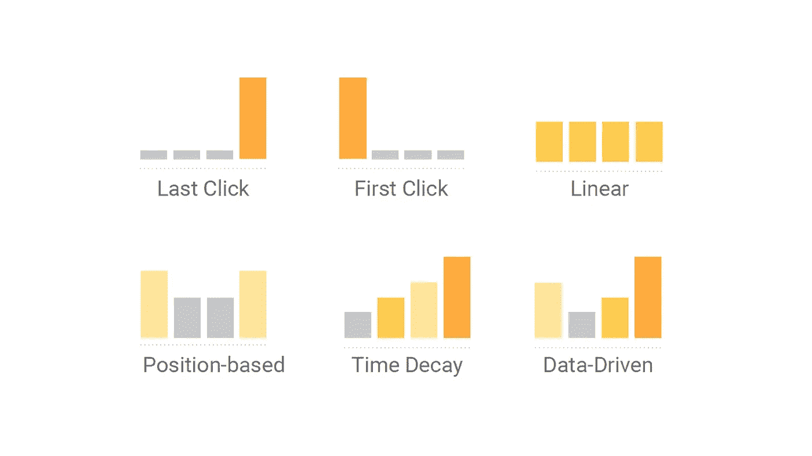
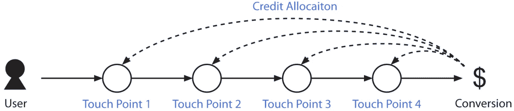
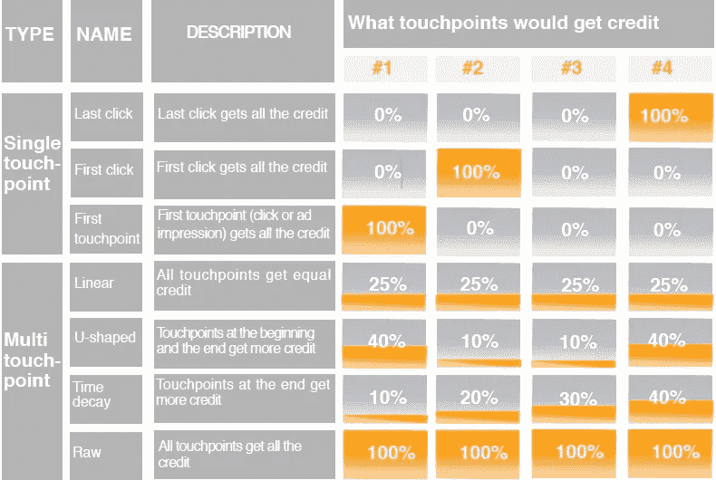
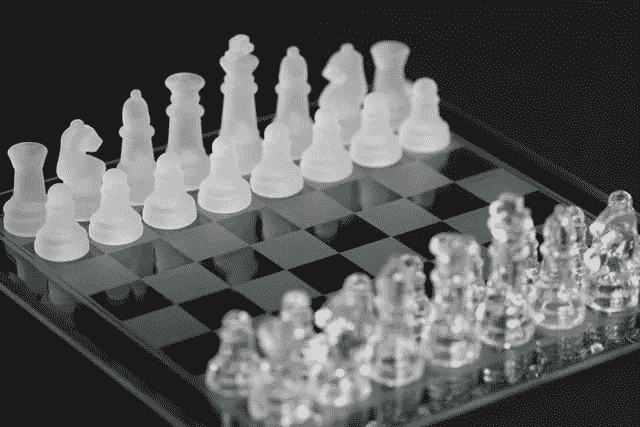
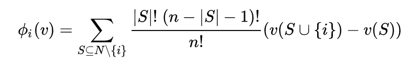
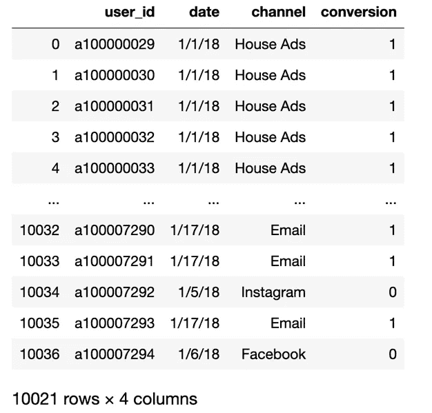
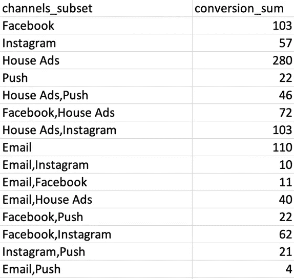
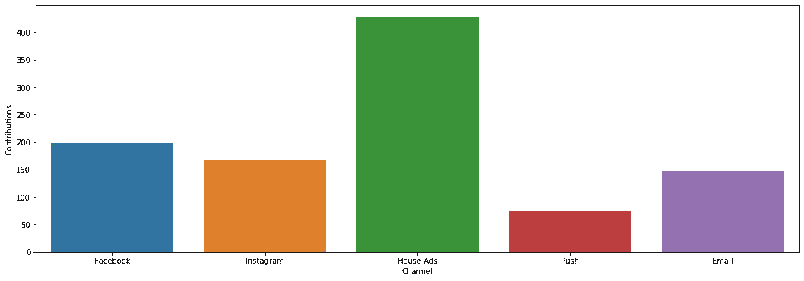

# 多接触归因营销模型 Shapley 价值方法——第 1 部分

> 原文：<https://medium.com/analytics-vidhya/the-shapley-value-approach-to-multi-touch-attribution-marketing-model-e345b35f3359?source=collection_archive---------1----------------------->



哪一款适合您的业务？

# 介绍

在网络广告领域，媒体效果评估是决策过程中的重要一环。由于一个广告的成本是基于点击或印象的数量，所以了解每个行动的媒体效果是非常重要的。由于每个渠道的性质不同，需要了解每个渠道的营销效果。因此，为了理解在线营销活动的影响，必须考虑多渠道归因模型。



顾客之旅

# 基于规则的模型

常见的归因分析模型包括:

*   最后一次点击:用户购买所有贡献值之前的最后一个接触点
*   第一次点击:用户访问路径上的第一个接触点获得所有贡献值
*   线性模型:用户访问路径上的所有接触点均分贡献值
*   时间衰减模型:用户访问路径上越早的接触点获得的贡献值越大



基于规则的模型

# 基于规则与算法

多接触归因是数字营销中非常流行的营销科学技术。传统的基于规则的模型，如最后一次触摸(点击)模型或基于位置的模型，具有根深蒂固的偏见，使它们无效。

营销渠道越多，客户行为路径越复杂，就越需要有洞察力的归因模型来帮助确定渠道价值、优化渠道组合和资源分配。一个细微的渠道差异，或许能帮助企业在市场竞争中胜出。

那么，多触点归因营销模式是怎么回事呢？幸运的是，数据驱动的归因模型可以检测通道变化并调整通道权重值，因此在大多数情况下会更准确。

**基于不同的数学理论提出了几种数据驱动模型:** [**马尔可夫模型**](https://en.wikipedia.org/wiki/Markov_model#:~:text=In%20probability%20theory%2C%20a%20Markov,it%20assumes%20the%20Markov%20property).) **，** [**博弈论**](https://en.wikipedia.org/wiki/Game_theory) **模型，生存分析模型等。**在本帖中，我们将只讨论博弈论模型和 Shapley 值。Shapley 值也被用作谷歌分析数据驱动的归因模型的一种方法。

# 合作博弈与沙普利值

> 沙普利值是由诺贝尔经济学奖获得者罗伊德·S·沙普利提出的，作为一种在团队成员中公平分配团队产出的方法。
> 
> 在**博弈论**中，**沙普利值**是一个解决方案的概念，将收益和成本公平地分配给联盟中的几个参与者。**沙普利值**主要适用于每个参与者的贡献不相等，但他们相互合作以获得回报的情况。



安妮·尼加德摄影

营销渠道是合作游戏中的参与者，他们中的每一个都可以被认为是为了推动转化而一起工作。换句话说，这种方法公平地分配了每个接触点对转化的贡献。

在我们开始之前，我想介绍几个我们将在后面的计算中使用的关键概念。请注意，我将特征函数简单地定义为联盟生成的转换的总和。

*   N =渠道{室内广告、脸书、电子邮件、谷歌等。}是一组玩家
*   **S =联盟，玩家的子集，渠道在形成联盟的地方一起工作。**
*   **|𝑆|是联合𝑆的基数，并且该和延伸到不包含信道 I 的 n 的所有子集𝑆上。**
*   **N = N 的数量**
*   **v(S) =一个实值函数 v，称为特征函数。S 的贡献表示 N(通道)的联合。就是计算后每个通道的权重。**
*   **Weight = |S|！(n-|S|-1)！/n！**
*   **边际贡献= v(S U {i})-v(S)** 增量加权和减去没有 v(S)的联盟



Shapley 值可以使用以下公式计算

> 作为这篇文章的目的，我不会让你困惑于解释整体方法论来证明这一点。见[此处](https://www.math.ucla.edu/~tom/Game_Theory/coal.pdf)求证。但你需要知道 Shapley 值方法的基本思想是，它对每个渠道的所有可能联盟的边际贡献进行加权平均。

我们将使用来自 [Kaggle](https://www.kaggle.com/kavitabhagwani/marketing-campaign) 的样本营销数据集。

下载完数据后，我们需要做一些操作。这里我们只需要四个变量: **user_id，date，channel，conversion** 。请将转换标记为 1，否则标记为 0。并删除空数据。

下面是 Python 代码，供大家参考。



应该会得到类似这样的结果。

下一步，我们想得到渠道子集，S，联盟和他们的转换的总和。



输出可能看起来像这样

供参考的 MySQL 代码

```
SELECT channels_subset, sum(b.conversion) as conversion_sum
FROM(
SELECT user_id, GROUP_CONCAT(DISTINCT(channel)) as channels_subset, max(conversion) as conversion
FROM(
SELECT user_id,channel,conversion
FROM demo.simulated_data
ORDER BY user_id,channel
) a
GROUP BY user_id)
b
GROUP BY channels_subset;
```

然后我们会用 Python 计算权重和边际贡献。

首先，我们需要导入 Python 中的模块

```
import pandas as pd
import itertools
from collections import defaultdict
from itertools import permutations,combinations
import numpy as np
```

创建一个函数，返回所有可能的通道组合

```
def power_set(List):
    PS = [list(j) for i in range(len(List)) for j in itertools.combinations(List, i+1)]
    return PS
```

返回一组频道的所有可能子集

```
def subsets(s):
    '''
    This function returns all the possible subsets of a set of channels.
    input :
            - s: a set of channels.
    '''
    if len(s)==1:
        return s
    else:
        sub_channels=[]
        for i in range(1,len(s)+1):
            sub_channels.extend(map(list,itertools.combinations(s, i)))
    return list(map(",".join,map(sorted,sub_channels)))
```

计算每个联盟的价值。

```
def v_function(A,C_values):
    '''
    This function computes the worth of each coalition.
    inputs:
            - A : a coalition of channels.
            - C_values : A dictionnary containing the number of conversions that each subset of channels has yielded.
    '''
    subsets_of_A = subsets(A)
    #print(subsets_of_A)
    #exit()
    worth_of_A=0
    for subset in subsets_of_A:
        #print("subset:", subset)
        if subset in C_values:
            #print("subset:", subset, "; Value:", C_values[subset])
            worth_of_A += C_values[subset]
    return worth_of_A
```

计算一个数(非负整数)的阶乘

```
def factorial(n):
    if n == 0:
        return 1
    else:
        return n * factorial(n-1)
```

这里是最终代码

```
def calculate_shapley(df, col_name):
    '''
    This function returns the shapley values
            - df: A dataframe with the two columns: ['channels_subset', 'conversion_sum'].
            The channel_subset column is the channel(s) associated with the conversion and the count is the sum of the conversions. 
            - col_name: A string that is the name of the column with conversions
            **Make sure that that each value in channel_subset is in alphabetical order. Email,PPC and PPC,Email are the same 
            in regards to this analysis and should be combined under Email,PPC.
            ***Be careful with the distinct number of channels because this can signifcantly slow the perfomance of this function.
            Remember the total possible combinations of channels is 2^(n) where n is the number of channels. If you have 30 channels
            this is 1,073,741,824 combinations. 

    '''
    c_values = df.set_index("channels_subset").to_dict()[col_name]
    df['channels'] = df['channels_subset'].apply(lambda x: x if len(x.split(",")) == 1 else np.nan)
    channels = list(df['channels'].dropna().unique())

    v_values = {}
    for A in power_set(channels):
        v_values[','.join(sorted(A))] = v_function(A,c_values)
    #print(v_values)
    n=len(channels)
    shapley_values = defaultdict(int)for channel in channels:
        for A in v_values.keys():
            #print(A)
            if channel not in A.split(","):
                #print(channel)
                cardinal_A=len(A.split(","))
                A_with_channel = A.split(",")
                A_with_channel.append(channel)            
                A_with_channel=",".join(sorted(A_with_channel))
                # Weight = |S|!(n-|S|-1)!/n!
                weight = (factorial(cardinal_A)*factorial(n-cardinal_A-1)/factorial(n))
                # Marginal contribution = v(S U {i})-v(S)
                contrib = (v_values[A_with_channel]-v_values[A]) 
                shapley_values[channel] += weight * contrib
        # Add the term corresponding to the empty set
        shapley_values[channel]+= v_values[channel]/n 

    return shapley_values
```

我们在这篇文章中使用的样本数据，我们得到了下面的结果

```
defaultdict(int,
            {'Facebook': 198.50000000000003,
             'Instagram': 168.0,
             'House Ads': 427.83333333333337,
             'Push': 74.16666666666669,
             'Email': 146.5})
```

我们终于可以想象它了。

```
#visualizations
import matplotlib.pyplot as plt
from pandas.plotting import scatter_matrix
%matplotlib inline
import seaborn as snsresult = DataFrame(list(dict(calculate_shapley(data, "conversion_sum")).items()),columns = ['Channel','Contributions'])# Visualization
plt.subplots(figsize=(18, 6))
sns.barplot(x='Channel', y='Contributions', data=result)
plt.show()
```



自己试试吧！

# 结论

在本帖中，我们将介绍如何使用原始数据来创建数据驱动的归因模型。真实世界的数据甚至更复杂，但至少你知道它是如何工作的。

我还打算用 R 和 Python 写另一篇关于多触点归因模型的马尔可夫链方法的文章。敬请期待！

好吧，让我知道你的想法。如果你喜欢这篇文章，请点击下面的**按钮**，别忘了**把它分享到社交媒体**。

***参考:***

1.  [合作博弈与沙普利值](https://www.youtube.com/watch?v=w9O0fkfMkx0) [文森特·奈特](https://www.youtube.com/channel/UCJoZNbN4ziZBIfzC1zjuHYA)
2.  [数据驱动的营销归因](https://towardsdatascience.com/data-driven-marketing-attribution-1a28d2e613a0) [詹姆斯·金利](https://towardsdatascience.com/@jameskinley?source=post_page-----1a28d2e613a0----------------------)
3.  [基于收入的归因建模](https://arxiv.org/pdf/1804.05327.pdf) — arXiv