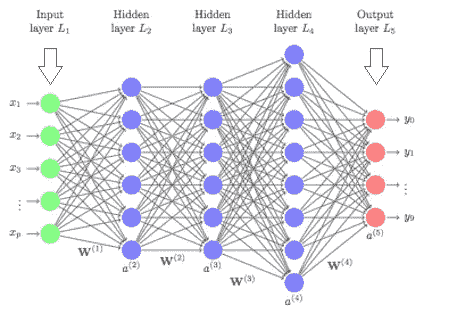
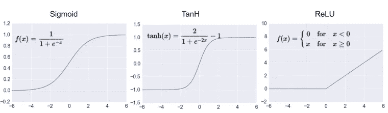
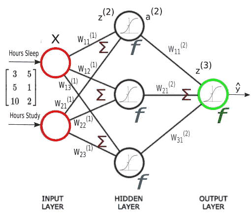
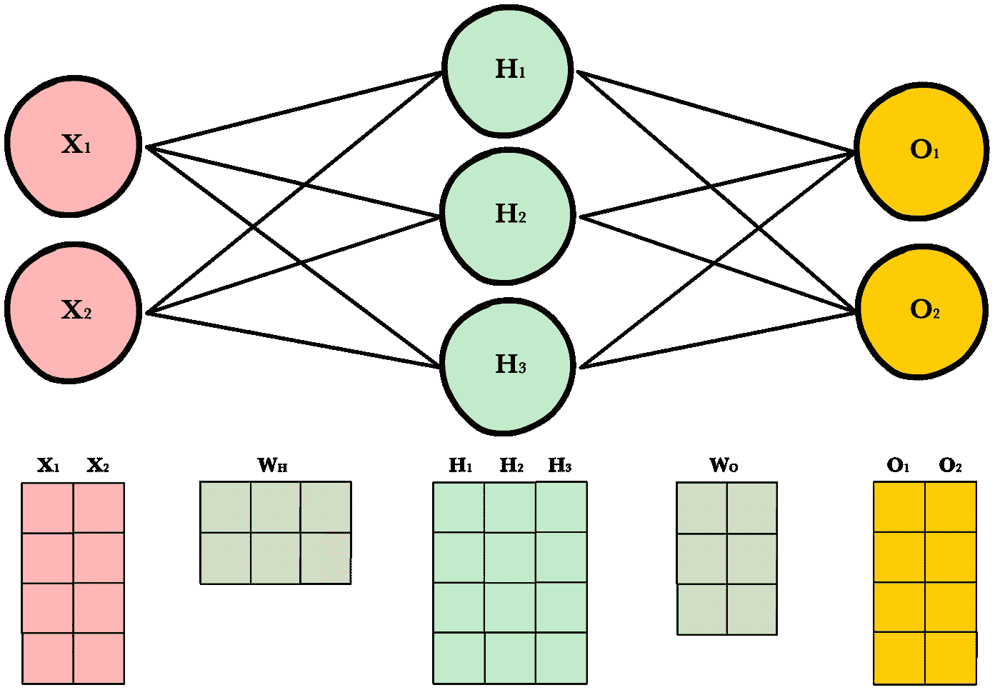

# 你能在网上找到的深度学习的最短介绍

> 原文：<https://medium.com/analytics-vidhya/the-shortest-introduction-to-deep-learning-you-will-find-on-the-web-25a9975bbe1d?source=collection_archive---------1----------------------->

具有三个隐层的简单人工神经网络。来源:[https://orpograph . com/WP-content/uploads/2019/01/deep learn . png](https://orbograph.com/wp-content/uploads/2019/01/DeepLearn.png)

机器学习(ML)最有前景的发展是深度学习。在 DL 中，我们构建了一个人工神经网络(ANN ),基本上我们使用多层线性回归，每层都有一个激活函数，将非线性引入 ANN。这些激活函数通常是 sigmoid 函数，如逻辑函数(也称为 sigmoid)或 tangens 双曲线函数(tanh)。最近，整流线性单元(ReLU: f(x) = max(x，0))在大多数情况下显示出改进的结果。然而，数学家们首先忽略了它，因为它在 f(0)处不可微。吴大学的 Hornik 教授在 21 世纪初指出，这些人工神经网络结构可以逼近任何函数，即使只有一个隐层，这就是普遍逼近定理(UAT)。

最常见的激活功能。来源:https://www.kdnuggets.com/wp-content/uploads/activation.png

这个图非常好地展示了在矩阵乘法的每一层之后，激活函数是如何被使用的。在这种情况下乙状结肠。来源:[**https://www . bogotobogo . com/python/sci kit-learn/images/neural network 2-Forward-Propagation/NN-with-components-w11-etc . png**](https://www.bogotobogo.com/python/scikit-learn/images/NeuralNetwork2-Forward-Propagation/NN-with-components-w11-etc.png)

DL 中有趣的一点是，我们可以将任何形状的数据作为输入和输出。这意味着数据就是数据。它不必是特定于领域的某种特殊数据。我们可以在医疗诊断或客户流失预测中使用与股票价格预测相同的技术，只需做一些小的实际调整。

DL 中的一个巨大问题是优化。多伦多大学的 Hinton 教授在 1986 年提出了反向传播算法。该算法用于导出人工神经网络每个参数的偏导数，关于从模型输出 Y 和目标输出 t 的差异中导出的一些成本函数。常用的成本函数包括回归的均方误差或分类任务的交叉熵。使用 pytorch 或 tensorflow 等现代库，导数的推导是自动处理的。我们只需要定义向前传球，这就是 ANN 函数。它由每一层的矩阵乘法(线性回归)和下面的激活函数组成，如前所述，激活函数给人工神经网络带来非线性。

矩阵乘法。来源:[https://ml-cheat sheet . readthedocs . io/en/latest/_ images/dynamic _ resizing _ neural _ network _ 4 _ OBS . png](https://ml-cheatsheet.readthedocs.io/en/latest/_images/dynamic_resizing_neural_network_4_obs.png)

在 DL 中，我们过去和现在都有一个巨大的问题，就是数据中有太多的差异。这意味着我们拟合了太多的噪声，这往往导致完美的样本内模型，但更糟糕的样本外模型。这也是由于 UAT，因为我们的人工神经网络在理论上可以完美地拟合任何函数，这通常导致样本中几乎完美的拟合，然而我们的人工神经网络不关心真实的依赖性。它只是通过描述样本内分布来最小化我们的成本函数。这个问题被称为方差-偏差权衡，它曾经是一个问题，至今仍未完全解决。然而，新概念像简单地使用更多的训练数据、迁移学习、标准化(批量、权重、层、组等。)和权重共享已经显示出提高了这些神经网络的泛化能力。然而，这一概念的问题在于，它们没有根据概念的转变(即投入 X 和产出 Y 之间的关系随着时间的推移而发生的变化)进行调整。然而，(深度)强化学习(RL)可能会产生这个问题的解决方案。在 RL 中，代理与虚拟或真实环境交互，并试图最大化回报。因此，该代理创建它可以训练自己的新数据。这里最值得注意的是谷歌 Deep Mind 开发的 AlphaZero，它通过与自己对弈来学习下围棋、象棋和五子棋。在几个小时内，它在所有这些游戏中比以前任何人或软件玩家都要好。虽然 RL 目前还没有在商业案例中得到利用，但进一步的开发可能会增加它的独家新闻和重要性，并且可能是我们开发人工通用智能的最佳机会(AGI)。

强化学习。来源:[https://www . kdnugges . com/images/reinforcement-learning-fig 1-700 . jpg](https://www.kdnuggets.com/images/reinforcement-learning-fig1-700.jpg)

如果您有任何意见或问题，请随时使用评论部分。

## 你可能会对我的其他一些文章感兴趣

 [## 为什么数学家讨厌统计学和机器学习

### 数学家讨厌统计学和机器学习，因为它们解决了数学家没有答案的问题。的…

medium.com](/@christoph.ostertag/why-mathematicians-hate-statistics-and-machine-learning-6f5758d13cc9)  [## 兑换一美元的方法:Python 中的计数(生成函数和级数乘法)

### 先举个简单的例子:我们想知道有多少种方法可以从镍币和一角硬币中得到 20 美分。

towardsdatascience.com](https://towardsdatascience.com/ways-to-change-a-dollar-counting-in-python-generative-functions-and-series-multiplication-50aae1a167e2)  [## 为模糊字符串匹配建立一个可扩展的搜索引擎

### 在模糊匹配中，我们的目标是根据字符串 A 和字符串 B 的接近程度对它们进行评分。我们想找到…

towardsdatascience.com](https://towardsdatascience.com/build-a-scalable-search-engine-for-fuzzy-string-matching-751bd09f6074) 

> 在 Medium 上关注我，不要错过任何关于人工智能、机器学习、数学和创业的新帖子！ [**克里斯托夫**奥斯特塔格](https://medium.com/u/f140c5aaa3b0?source=post_page-----25a9975bbe1d--------------------------------)

 [## 克里斯托夫·奥斯特塔格培养基

### 阅读 Christoph Ostertag 在媒体上的文章。商业信息系统学生。我的兴趣包括…

medium.com](/@christoph.ostertag)