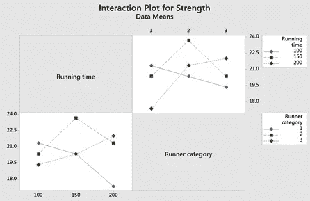
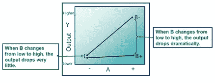
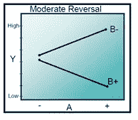
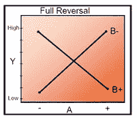
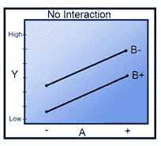
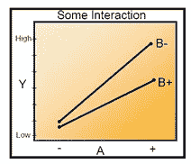
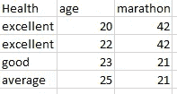
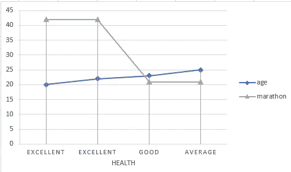

# 交互图在统计学中的意义

> 原文：<https://medium.com/analytics-vidhya/the-significance-of-interaction-plots-in-statistics-6f2d3a6f77a3?source=collection_archive---------0----------------------->

交互图用于理解一个变量的行为取决于另一个变量的值。在回归分析、DOE(实验设计)和 ANOVA(方差分析)中分析交互作用效应。

这个博客将帮助你理解相互作用图及其影响，如何在统计设计中解释它们，以及如果你不把它们包含在你的统计模型中你将面临的问题。

在任何统计研究中，无论是产品开发、制造过程、模拟、健康、测试等等。许多变量会影响预期结果(响应)。改变/调整这些变量会直接影响结果。

**回归方程中的相互作用图/效应** :
确定两个变量是否以线性方式相关
了解关系的强度
了解当 X 值增加一个单位时 Y 值会发生什么
建立一个预测方程，使我们能够预测 X 的任何水平
相关性用于衡量两个连续变量(双变量数据)之间的线性关系
皮尔逊相关系数“r”将始终介于–1 和+1 之间
–1 的相关性表示强烈的负相关，一个因素增加，另一个因素减少
1 的相关性表示强烈的正相关，一个因素增加，另一个因素也增加

**试验设计(DOE)中的交互图/效果:** DMAIC(定义、测量、分析、改进和控制)流程的分析阶段将许多输入缩小到关键的几个， 现在有必要确定关键少数输入的适当设置，因为:
关键少数可能存在相互作用
关键少数将具有实现最佳结果的首选范围
确认在 DMAIC 过程(如回归)的分析阶段确定的因素之间的因果关系
了解实验的原因有助于选择设计和集中实验的努力

**设计实验的原因是:**
解决问题(改善流程响应)
优化(最高产量或最低客户投诉)
稳健性(恒定响应时间)
筛选(进一步筛选关键的少数到重要的少数 X)

**解决问题:** 消除有缺陷的产品或服务
减少处理交易流程的周期时间

**优化:** 数学模型需要移动过程响应
机会以满足不同的客户要求(规格或 VOC)
稳健设计
提供一致的过程或产品性能
降低输出响应对输入变量变化的敏感性，包括
噪声变量
设计过程知道哪些输入变量难以保持

**筛选:** 

**方差分析中的交互作用图/效应:** 方差分析(Anova)用于确定连续数据组的均值是否存在差异。
方差分析的功效是估计和检验交互效应的能力。
有两种方法——单向 ANOVA 和双向 ANOVA
1。单向 ANOVA 是一种统计检验，它在只考虑一个独立变量或因素的情况下，比较样本内组均值的方差。
2。双向方差分析与单向方差分析一样，是一种基于假设的检验。然而，在双向方差分析中，每个样本以两种方式定义，并因此分成两个分类组。

**在 Anova** 中使用交互作用图的示例:
通过绘制分类变量的每个值的平均值绘制主效应图。一条线连接每个变量的点。看这条线来确定一个分类变量是否存在主要效应。Minitab 还会在整体平均值处绘制一条参考线。

**将连接手段的线解释如下:**
当线是水平的(平行于 x 轴)时，不存在主效果。所有因子水平的响应均值都是相同的。当线条不水平时，存在主效应。所有因子水平的响应均值并不相同。线的斜率越陡，主效应的幅度越大。

ANOVA 中显示跑步时间、马拉松类型和强度的交互图示例

**交互影响/图定义:** 当变量共同作用影响流程的输出时，就会发生交互。交互图是通过将两个变量一起绘制在同一个图上而构建的。它们采用下图的形式。注意，在该图中，变量“A”和 Y 之间的关系随着变量“B”的水平变化而变化。当“B”处于高(+)电平时，变量“A”对 y 几乎没有影响。

当“B”处于低(-)电平时，A 对 y 有强烈的影响。相互作用的特点是两条线之间的非平行性。

虽然这些图有助于解释相互作用的影响，但使用假设检验来确定这种影响在统计上是否显著。图可以显示代表随机样本误差而不是实际效果的非平行线。p 值和假设检验帮助你从噪音中找出真正的影响。

平行线:不发生相互作用。

非平行线:发生相互作用。线越不平行，相互作用的强度越大。

**不同互动的例子**:

**实时例子——跑马拉松**:如果我们想计划在未来一年内跑一场马拉松，我们需要了解因变量和自变量，如年龄、鞋型、速度、风力、耐力、有氧运动强度、营养、体重、练习时间、教练、方法、地点等。这种效应称为主效应。仅评估主要影响的意义不大，通过以适当的方式调整所有这些变量，我们可以获得期望的响应，即在预期时间内完成马拉松比赛。

马拉松跑步的例子。仅代表

在相互作用图上，平行线表示没有相互作用，而不同的斜率表示可能存在相互作用。

抽样资料

交互图

如您所见，交互图在统计和数据分析领域非常重要。有许多工具可用于理解交互作用。基于变量和响应绘制交互的工具有 Minitab、IBM SPSS、Microsoft Excel 等。

通过 [Linkedin](https://www.linkedin.com/in/sureshhp/) 和 [Medium](https://hpsuresh12345.medium.com/about) 与我联系，获取新文章和博客。

— — — * — — — * — — — * — — — * — — — * — — — * — — — * —

*“培养学习热情。如果你这样做了，你将永远不会停止成长*

— — — * — — — * — — — * — — — * — — — * — — — * — — — * —