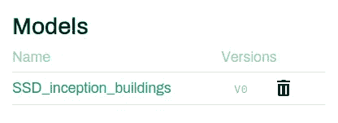

# 迁移学习变得简单

> 原文：<https://medium.com/analytics-vidhya/the-simple-path-to-transfer-learning-faa4b0cf60f6?source=collection_archive---------10----------------------->

每一个新的计算机视觉实验都是同样的故事

*   **努力寻找开放数据**在线创建数据集
*   花几天时间**创造某种地面真相**
*   **找到一个适合我的代码/检查点/权重用例的预训练模型**
*   在找到方法**消除那些 CUDA 或 Tensorflow 错误之前，进行 40 次训练**
*   终于有了一个训练有素的模型，但是**不得不运行一个笔记本来向我的同事展示结果**(并且忘记跟踪指标和日志)

然后这只是一次训练，但是现在你必须**微调你的模型，**比较结果，也许**带来更多的数据，**你可能会在这个过程中丢失一些东西，**更不用说你的项目的可重用性了。**

仔细想想，这个程序应该不是数据科学家的日常。随着近几年网上可用资源的增加，我们不需要重新发明轮子。

> 我们不应该专注于复制知识，而应该关注如何利用已经完成的工作来提高绩效

我甚至没有提到整个数据/运营部分，这将是另一篇文章的一部分，但您已经了解了整体情况。

**但这 5 点是强制性的，目的是让人工智能在行业中发挥作用，好消息是:**

> 你不必再关心了

我将向您展示如何利用 Picsell.ia 平台不再浪费时间，并始终跟踪您的所有项目。

出于这个目的，假设我们想从头开始训练一个 CV 模型来检测航空图像中的建筑物。

# 数据收集

在[这篇文章](/@thibautlucas13/picsell-ia-open-dataset-hub-launch-7ae5793ed586)中，我们向您展示了我们的 [**开放数据集中心**](https://app.picsellia.com) ，在这里您可以找到由我们的用户策划的公共数据集，您可以自由克隆这些数据集。

> 让我们看看是否有包含一些建筑物的数据集

答对了，这就是我们需要的！包含 55000 个分段建筑物的 993 个航空图像，访问该数据集和地面真相只需 3 分钟。

项目审查界面的屏幕截图

> 在这里，我们很幸运地找到了一个已经注释过的数据集，但是多亏了我们优化的注释接口，您很快就可以完成了！

# 2.建筑搜索

现在我们有了干净的数据集，让我们从开放模型中心选择一个架构

> 是的，它与开放数据集中心是一回事，但用于预训练模型

我们选择了在 COCO 上训练的 SSD_Inception，因为它的架构健壮，训练速度快。

让我们将它附加到我们的项目中(我们已将其重命名为 SSD_inception_buildings)，现在我们可以在“项目概述”中看到它:

# 3.培养

现在有趣的事情开始了，我们将使用 Picsell.ia Python SDK(是的，另一个新特性)的强大功能无缝地训练我们的模型，并直接在平台中跟踪结果。

首先，您需要您的 API 令牌(在您的配置文件部分)和您的项目令牌(在项目-设置→项目令牌)

您的项目令牌应该如下所示

> 然后，我们将从平台转移到我们的 github，并使用我们的回购之一:

 [## picsell-ia/培训

### 无论你是一名人工智能爱好者，顶级研究员还是一家开发产品的人工智能初创公司。了解如何利用…

github.com](https://github.com/Picsell-ia/training) 

您可以选择名为*“Object _ Detection _ TF1 _ easy . ipynb”*的笔记本文件，点击这个小按钮:

> 如果你没有足够的硬件来训练你的模型，它可以让你在谷歌合作会议中打开我们的笔记本(但是如果你足够幸运拥有顶级的 GPU，你也可以在你的机器上克隆我们的回购)

从现在开始，我假设您已经在 collab 中打开了一个会话，并且我们的笔记本已经在您的眼前打开。

您应该看到的第一行是

这允许您直接在 collab 虚拟机上克隆我们的 Github 存储库，设置 Tensorflow 和我们的包的正确版本。

这个包装器函数用于“包装”我们的 python 库所做的所有繁重工作，如果您对深入的概述感兴趣，可以查看'[Object _ Detection _ tf1 . ipynb](https://github.com/Picsell-ia/training/blob/master/Object_Detection_TF1.ipynb)或我们的[文档](https://docs.picsellia.com/)。但是现在……

吴恩达和他在 Coursera 的名言

现在，您所要做的就是输入您的令牌，即我们之前选择的模型名称，并运行之前声明的函数。

> 你应该看到奇迹发生了:

正如您所看到的，picsellia 模块正确地处理了所有的事情，简单地说，它所做的是:

*   **将您的图像和注释下载到机器**(以正确的格式)
*   **巧妙分割数据集**用于训练和测试
*   **从数据集中的遮罩**中提取边界框
*   **获取您在平台上选择的模型的原始检查点**
*   **用正确的参数初始化模型**，这样你就不会得到一些奇怪的错误
*   从检查站开始训练

# 4.形象化

现在培训已经结束，picsellia 模块将负责将所有重要数据发送到平台，以便您和您的团队可以从那里跟踪实验，以下是包装器的最后步骤:

*   发送检查点
*   发送日志和指标
*   发送一些验证结果
*   发送重量，使其在我们的服务引擎中可用

我们完了。现在，让我们回到平台，看看 picsellia 为您带来了什么:

Picsell.ia 上的仪表盘截图

欢迎来到您的项目培训仪表板！如你所见，它收集了关于你的数据、训练日志和评估指标的所有重要信息，所以你再也不用运行它来给别人看了。

最棒的是，如果您返回笔记本继续培训，它将自动从之前保存的检查点开始培训，并在您的控制面板中创建一个包含新信息的“v2”选项卡，但您仍可以访问您的实验的“v1”。

> 这就是 Picsell.ia 的力量

您可能已经看到，我们在包装器中调用了一个名为“send_weights”的函数，显然，它会发送平台上模型的最终重量。

这允许你做几件事:

*   **在我们的模型中心公开展示您的模型**
*   **直接在项目“操场”部分的**平台上用你的模型进行推理，并用它来注释更多的数据。

如您所见，您的型号就在您的型号列表中:

# 5.测试

这里是操场，现在你可以简单地对你选择的图像进行推理:

> 只训练 5000 个纪元就不错了。

瞧，你已经看到了你可以用我们的新平台做什么，我们创造了这些工具，所以你可以专注于当今人工智能中真正重要的东西: ***科学和商业***

如果您想进一步了解 Picsell.ia，我邀请您阅读我们的文档，尝试一些东西，如果您需要任何帮助，请给我们写信！

我们有许多社区可供您加入，与其他用户和我们的数据科学家进行讨论:

*   Reddit : [r/picsellia](https://www.reddit.com/r/picsellia/)
*   Slack : [Picsell.ia](https://join.slack.com/t/picsellia-community/shared_invite/zt-eizzh9ci-mDmTEwy2H1LAFRms~f0hCg)

我希望你喜欢这本书，并且你会在我们的产品中找到自己的路，如果你觉得这篇文章有用，请不要犹豫分享或喜欢它！

下节课再见！