# 模拟人生 4 现代 Python 修改:调试

> 原文：<https://medium.com/analytics-vidhya/the-sims-4-modern-python-modding-debugging-3736b37dbd9f?source=collection_archive---------7----------------------->

目前，唯一已知的调试方法是使用 PyCharm Pro。回到今年 7 月 28 日，Sigma1202 发现 PyCharm pro 有一个可以用来运行代码以添加调试功能的包，Sigma1202 研究出了如何在模拟人生 4 中实现这一点。

这是一个到 Sigma1202 视频的[链接，视频解释了这个过程。](https://www.youtube.com/watch?v=RBnS8m0174U)

如果你没有使用我的样板模板，那么上面的链接应该很容易理解，但是我对样板模板做了一个令人兴奋的更新，我增加了自动完成大部分工作的能力。同样，这需要花费金钱的 PyCharm Pro，如果你没有使用 PyCharm Pro，那么你必须求助于调试模拟人生 4 代码的老方法。

PyCharm Pro 是要花钱的，如果你想现在开始使用，但以前没有使用过，但又不想现在就付费，并测试它是否有效，它会提供免费试用。

## Settings.py

增加了一些新的设置。

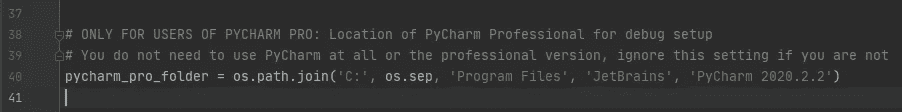

这是您的 PyCharm Pro 文件夹的路径。它被设置为版本`2020.2.2`的默认值。在不久的将来，这可能会更新，所以你可能需要尽快改变这一点。

接下来我们再来几个设置**，你一般可以保持原样**。它必须安装 2 个脚本模块到你的游戏中，这些设置指的是。

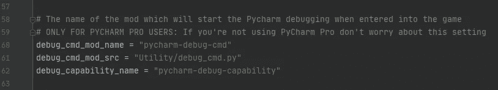

*   `debug_cmd_mod_name`是添加游戏内调试命令的 mod 名称
*   `debug_capability_name`是添加调试功能的 mod 名称。

还有一个额外的设置`debug_cmd_mod_src`，它指向添加游戏内调试命令的文件。

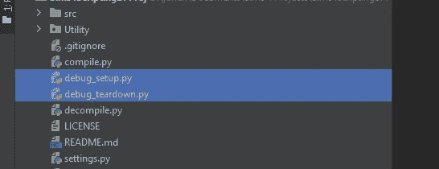

现在有两个新的文件，`debug_setup.py`和`debug_teardown.py`。

编译、打包和安装这两个 mod。

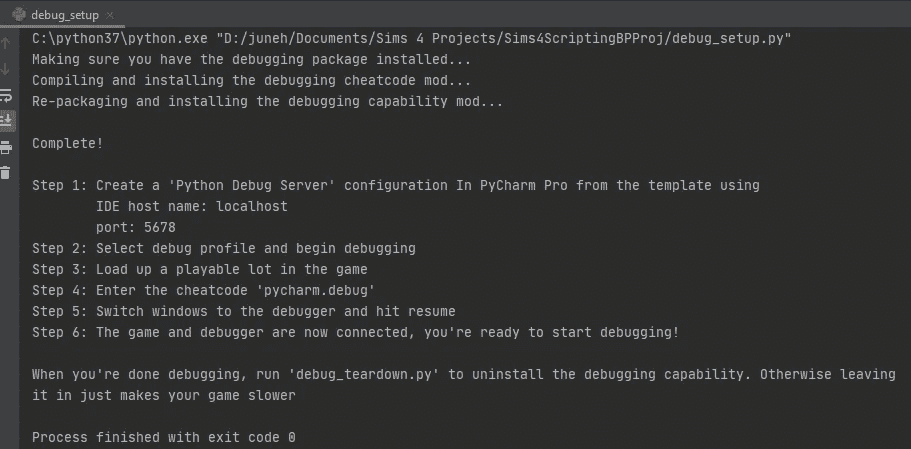

它就现在该做什么提供了一套清晰的说明。在游戏中你会发现这两个新的 mod 文件。

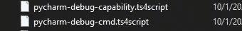

就像说明书上说的，你已经准备好了

```
Step 1: Create a 'Python Debug Server' configuration In PyCharm Pro from the template using
        IDE host name: localhost
        port: 5678
Step 2: Select debug profile and begin debugging
Step 3: Load up a playable lot in the game
Step 4: Enter the cheatcode 'pycharm.debug'
Step 5: Switch windows to the debugger and hit resume
Step 6: The game and debugger are now connected, you're ready to start debugging!
```

让我们遵循前两个说明，这是我们必须自己做的准备工作。对于步骤 1，我们需要添加调试配置。

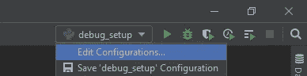

转到`Edit Configurations...`

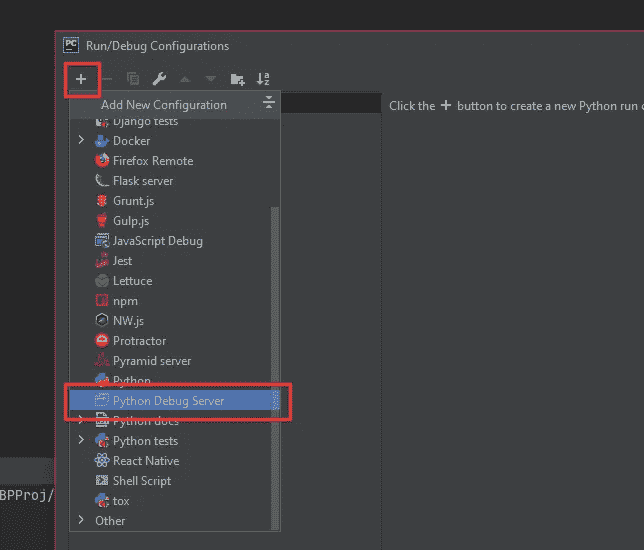

点击`+`按钮，然后点击`Python Debug Server`。

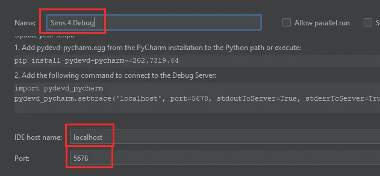

您可以随意命名，将`IDE host name`和`Port`设置为消息中显示的内容。

现在，让我们按照步骤 2 启动调试器。

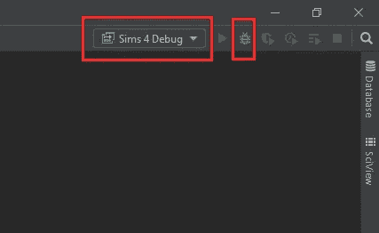

从我们刚刚制作的列表中选择您的调试器，然后单击 debug 图标。

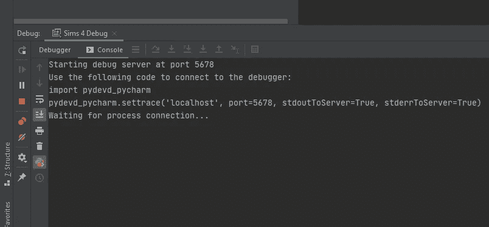

它现在正在等待游戏伸出手来连接，所以让我们按照步骤 3-5。加载一个可玩的游戏并在作弊控制台中输入`pycharm.debug`。

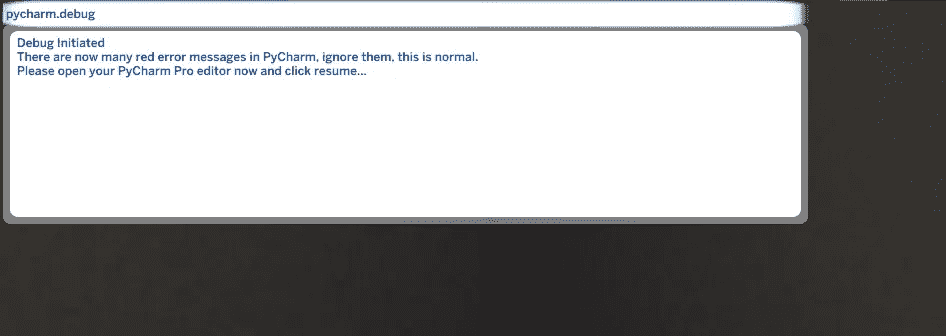

并且将窗口切换回编辑器，果然，有许多错误消息

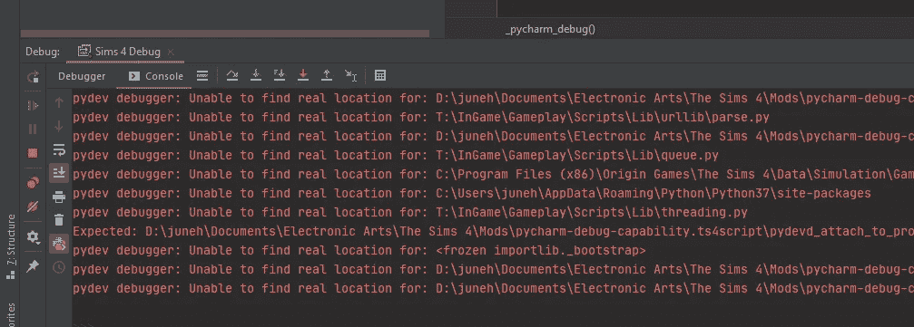

但是让我们按指示点击恢复

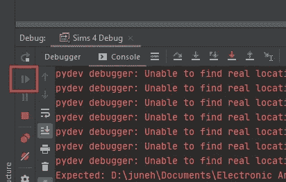

现在出现更多的错误消息，这是正常的

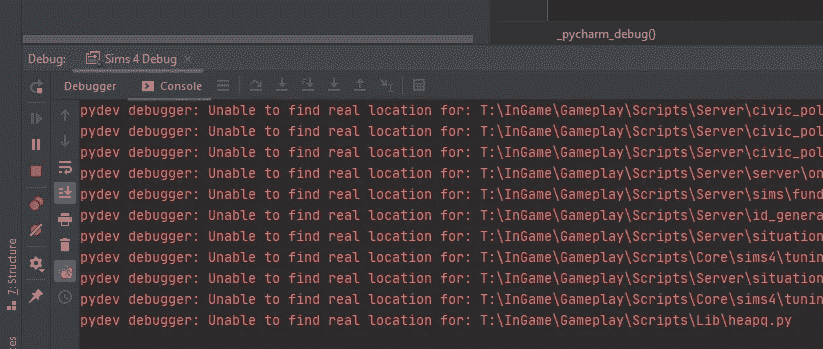

让我们回到游戏，现在我们看到这条消息

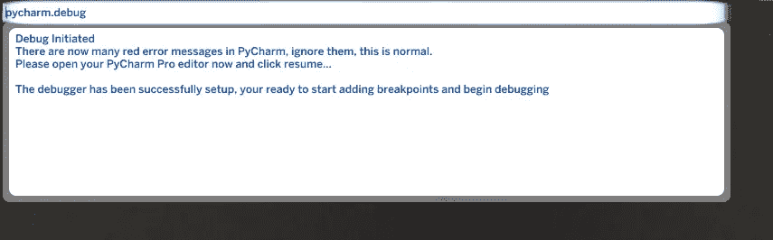

这告诉我们，我们已经准备好了。在这一点上，通过点击行号和代码之间的空间将断点添加到您的游戏模式，一个红点将出现在那里，如下图所示。

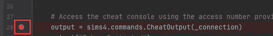

这意味着当游戏运行到那一行时，你的 mod 将会冻结，调试器将允许你开始调试。对于如何调试的帮助，我建议搜索谷歌或只是玩玩和学习。

当你完成调试后，关闭游戏，点击停止按钮，在编辑器中停止调试。

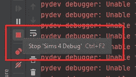

正如在最后的步骤列表中所述，当你完成调试时调用`debug_teardown.py`,因为否则它只会减慢你的游戏速度。

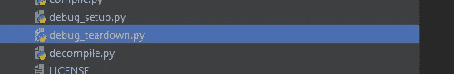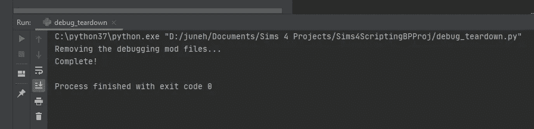

这将删除 2 个调试模式文件。你现在可以走了。

## 真高兴我开始了样板工程

能够在同一个编辑器中运行一个脚本来自动设置调试内容真是太好了。我希望你和我一样喜欢它。真正的调试打开了许多大门，否则没有一个合适的调试器是很痛苦或不可能的。

我讨厌它需要一个付费的编辑来做这件事，但这是我们现在所拥有的一切，它比以前的选择好得多。

再次感谢 Sigma1202 解决了这个问题。