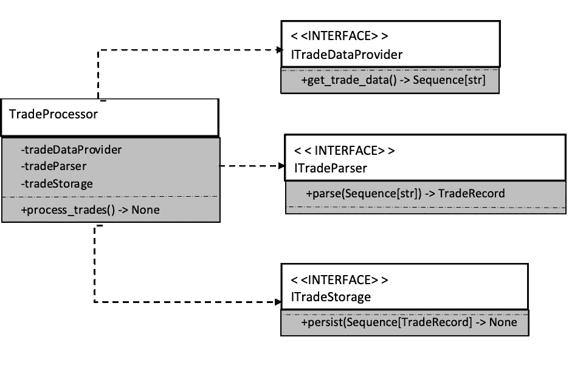
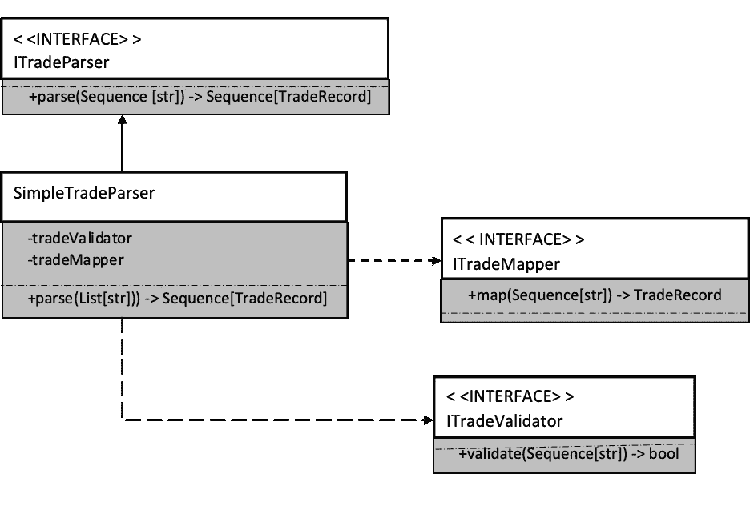

# 单一责任原则

> 原文：<https://medium.com/analytics-vidhya/the-single-responsibility-principle-9c3ccf20fd13?source=collection_archive---------16----------------------->


单一责任原则(SRP)指导开发人员编写有一个*且只有一个*原因需要更改的代码。如果一个类有不止一个改变的理由，它就有不止一个责任。有不止一个责任的类应该被分解成更小的类，每个类应该只有一个责任和改变的理由。

本文解释了这个过程，并向您展示了如何创建只有一个单一职责但仍然有用的类。通过委托和抽象的过程，一个包含太多改变理由的类应该将一个或多个职责委托给其他类。

很难夸大委托给抽象的重要性。它是自适应代码的关键，没有它，开发人员将很难适应 Scrum、看板和其他敏捷框架所要求的不断变化的需求。

# **问题陈述**

为了更好地解释拥有太多职责的类所带来的问题，本节探索一个例子。清单 1 显示了 TradeProcessor 类。这个类从文件中读取记录并更新数据库。

尽管它很小，但是这种代码很常见，并且经常需要处理新的特性和需求的变化

```
class TradeProcessor:
  lots_size: float = 100000.0 def process_trades(self, stream: Sequence[str]) -> None:
    lines: List[str] = []
    line: str
    for line in stream:
      lines.append(line) trades: List[TradeRecord] = [] line_count: int = 1
    for line in lines:
      fields: List[str] = line.split(',') if len(fields) != 3:
        print(f'WARN: Line {line_count} malformed. Only {len(fields)} fields(s) found.')
        continue if len(fields[0]) !=6:
        print(f"WARN: Trade currencies on line {line_count} malformed: '{len(fields)}'")
        continue trade_amount: Optional[int] = int_try_parse(fields[1])
      if trade_amount is None:
        print(f"WARN: Trade amount on line {line_count} not a valid integer: '{fields[1]}'") trade_price: Optional[float] = float_try_parse(fields[2])
      if trade_price is None:
        print(f"WARN: Trade price on line {line_count} not a valid decimal: '{fields[2]}'") source_currency_code: str = fields[0][:3]
      destination_currency_code: str = fields[0][3:6]

      trade = TradeRecord(source_currency_code,
                          destination_currency_code,
                          trade_amount/self.lots_size,
                          trade_price)
            trades.append(trade) line_count += 1

    engine = create_engine('sqlite:///trades.db', echo=False)
    metadata = MetaData(engine)
    tbl = Table('trade_table',
                metadata,
                autoload=True,
                autoload_with=engine) for trade in trades:
      ins = tbl.insert(None).values(
                    source_currency=trade.source_currency,
                    destination_currency=trade.destination_currency,
                    lots=trade.lots,
                    price=trade.price)
            conn = engine.connect()
            conn.execute(ins)print(f'INFO: {len(trades)} trades processed')
```

**图 1** 贸易处理器

这不仅仅是一个有太多责任的班级的例子；这是单个*方法*承担过多责任的一个例子。通过仔细阅读代码，您可以看出这个类试图实现什么:

1.它从流参数中读取每一行，并将每一行存储在一个字符串列表中。

2.它从每一行中解析出单独的字段，并将它们存储在一个更结构化的 TradeRecord 实例列表中。

3.解析包括一些验证和一些控制台日志记录。

4.每个 TradeRecord 都是通过调用一个将交易插入数据库的过程来保存的。

TradeProcessor 的职责是读取流、解析字符串、验证字段、记录日志和插入数据库。单一责任原则指出，这个类和所有其他类一样，应该只有一个改变的理由。然而，TradeProcessor 的实际情况是，它会在以下情况下发生变化:

*   当您决定不使用流作为输入，而是从对 web 服务的远程调用中读取交易时。
*   当输入数据的格式发生变化时，可能会添加一个额外的字段来指示交易的经纪人。
*   当输入数据的有效性规则改变时。
*   当数据库以某种方式发生变化时——也许 insert_trade 存储过程也需要一个新的代理参数，或者您决定不将数据存储在关系数据库中而选择文档存储，或者数据库转移到您必须调用的 web 服务之后。

对于这些变化中的每一个，这个类都必须被修改。此外，除非您维护各种版本，否则不可能修改 TradeProcessor，使其能够从不同的输入源读取数据。想象一下，当您被要求添加在 web 服务中存储交易的功能时，维护是多么令人头疼，但前提是必须提供特定的命令行参数。

# **为清晰起见进行重构**

重构 TradeProcessor 的第一个任务是将 process_trades 方法分割成更小的方法，这样每个方法都专注于一个责任。下面的每个清单显示了重构后的 TradeProcessor 类中的一个方法，后面是对这些变化的解释。

首先，清单 2 显示了 process_trades 方法，它现在只不过是委托给其他方法。

```
def process_trades(self, stream: Sequence[str]) -> None:
  lines: Tuple[str] = self.__read_trade_data(stream)
  trades: List[TradeRecord] = self.__parse_trades(lines)
  self.__store_trades(trades)
```

**清单 2**process _ trades 方法非常简单，因为它将工作委托给其他方法。

原始代码由流程的三个不同部分组成——从流中读取交易数据，将流中的字符串数据转换为 TradeRecord 实例，以及将交易写入持久性存储。注意，一个方法的输出被输入到下一个方法的输入中。在从 __parse_trades 方法返回交易记录之前，不能调用 _ _ store _ trades 在从 __read_trade_data 方法返回行之前，不能调用 __parse_trades。

按照顺序，让我们看看清单 3 中的 __read_trade_data。

```
def __read_trade_data(self, stream: Sequence[str]) -> Tuple[str]:
  return tuple(_line for _line in stream)
```

**清单 3** __read_trade_data

这段代码保留了 process_trades 方法的原始实现。它被简单地封装在一个方法中，该方法将结果字符串数据作为一个字符串元组返回。注意，这使得返回值是只读的，而最初的实现不必要地允许流程的后续部分添加更多的行。

接下来是清单 4 所示的 __parse_trades 方法。它与最初的实现有些不同，因为它也将一些任务委托给了其他方法。

```
def __parse_trades(self,
                   trade_data: Sequence[str]) -> List[TradeRecord]:
  trades: List[TradeRecord] = []
  line_count: int = 1
  for line in trade_data:
    fields: List[str] = line.split(',')
    if not self.__validate_trade_data(fields, line_count):
      continue
    trade = self.__map_trade_data_to_trade_record(fields)
    trades.append(trade)
    line_count += 1
  return trades
```

清单 4 __parse_trades 委托给其他方法来限制它的复杂性。

该方法将验证和映射责任委托给其他方法。如果没有这种授权，这部分程序仍然会过于复杂，而且会保留太多的责任。清单 5 中显示的这个 __validate_trade_data 方法返回一个布尔值，指示贸易行的任何字段是否无效。

```
def __validate_trade_data(self,
                          fields: Sequence[str],
                          line_count: int) -> bool:
  if len(fields) != 3:
    self.__log_message(f'WARN: Line {line_count} malformed. Only {len(fields)} fields(s) found.')
    return False if len(fields[0]) != 6:
    self.__log_message(f"WARN: Trade currencies on line {line_count} malformed: '{len(fields)}'")
    return False trade_amount: Optional[int] = int_try_parse(fields[1])
  if trade_amount is None:
    self.__log_message(f"WARN: Trade amount on line {line_count} not a valid integer: '{fields[1]}'")
    return False trade_price: Optional[float] = float_try_parse(fields[2])
  if trade_price is None:
    self.__log_message(f"WARN: Trade price on line {line_count} not a valid decimal: '{fields[2]}'")
    return False return True
```

**清单 5** 所有的验证代码都是一个单独的方法。

对原始验证代码所做的唯一更改是，它现在委托了另一个方法来记录消息。使用 __log_message 方法，而不是在需要的地方嵌入对 print 函数的调用，如清单 6 所示。

```
def __log_message(self, message: str, *args, **kwargs) -> None:
  print(message, *args, **kwargs)
```

清单 6_ _ log _ message 方法目前只是 print 的同义词。

回到堆栈的 __parse_trades 方法，清单 7 显示了它委托的另一个方法。该方法将表示流中各个字段的字符串列表映射到 TradeRecord 类的一个实例。

```
def __map_trade_data_to_trade_record(self,
                             fields: Sequence[str]) -> TradeRecord:
  source_currency_code: str = fields[0][:3]
  destination_currency_code: str = fields[0][3:6]
  trade_amount = int(fields[1]) trade_price = float(fields[2])
  trade_record = TradeRecord(source_currency=source_currency_code,
                     destination_currency=destination_currency_code,
                     lots=trade_amount/self.lots_size,
                     price=trade_price)
  return trade_record
```

**清单 7** 从一种类型到另一种类型的映射是一项独立的职责。

这个重构引入的第六个也是最后一个新方法是 __store_trades，如清单 8 所示。这个方法包装了与数据库交互的代码。它还将信息日志消息委托给前面提到的 __log_message 方法。

```
def __store_trades(self, trades: Sequence[TradeRecord]) -> None:
  engine = create_engine('sqlite:///trades.db', echo=False)
  metadata = MetaData(engine)
  tbl = Table('trade_table',
               metadata,
               autoload=True,
               autoload_with=engine) for trade in trades:
    ins = tbl.insert().values(source_currency=trade.source_currency,
                    destination_currency=trade.destination_currency,
                    lots=trade.lots,
                    price=trade.price)
    conn = engine.connect()
    conn.execute(ins)self.__log_message(f'INFO: {len(trades)} trades processed')
```

**清单 8** 既然 __store_trades 方法已经就位，这个类中的职责就划分得很清楚了。

回顾这次重构，您可以看到它是对原始实现的明显改进。然而，你真正做到了什么？尽管新的 process_trades 方法无疑比最初的整体方法要小，而且代码可读性更好，但是您在适应性方面的收获很少。您可以更改 __log_message 方法的实现，例如，让它写入文件而不是控制台，但这涉及到对 TradeProcessor 类的更改，而这正是您想要避免的。

这种重构已经成为真正分离这个类的职责的重要垫脚石。这是为了清晰而不是适应性的重构。下一个任务是将每个职责分成不同的类，并将它们放在接口后面。你需要的是真正的抽象来实现有用的适应性。

在继续阅读之前，如果您不熟悉 Python 中的接口(在我写这篇文章之前我并不熟悉)，请阅读这篇文章，它解释了 Python 的这种常见的计算机编程概念(至少在其他语言中)。[https://realpython.com/python-interface/](https://realpython.com/python-interface/)

# **抽象的重构**

在新的 TradeProcessor 实现的基础上，下一个重构引入了几个抽象，允许您处理这个类的几乎任何更改请求。虽然这个运行的例子可能看起来很小，甚至可能无关紧要，但对于本课的目的来说，它是一个可行的发明。此外，像这样的小应用程序发展成更大的应用程序是不是很常见。当少数人开始使用它时，功能请求开始增加。

通常，术语*原型*和*概念验证*适用于这种所谓的小型应用程序，从原型到生产应用程序的转换是相对无缝的。这就是为什么向抽象重构的能力是适应性开发的试金石。没有它，无数的请求会变成一个“大泥球”——一个类，或者一个集合中的一组类，几乎没有责任的描述，也没有可辨别的抽象。结果是应用程序没有单元测试，难以维护和增强，但这可能是业务线的关键部分。

重构 TradeProcessor 进行抽象的第一步是设计接口的接口，它将用来执行读取、处理和存储交易数据这三个高级任务。图 1 显示了第一组抽象。



**图 1**trade processor 现在将依赖于三个新的接口。

因为在第一次重构中，您将 ProcessTrades 中的所有代码都转移到了单独的方法中，所以您应该很清楚应该在哪里应用第一次抽象。按照单一责任原则的规定，这三个主要责任将由不同的类来处理。你不应该有从一个类到另一个类的直接依赖，而是应该通过接口工作。因此，这三项职责被分解到三个独立的接口中。清单 9 显示了 TradeProcessor 类在这一变化后的样子。

```
class TradeProcessor:
  def __init__(self,
               trade_data_provider: ITradeProvider,
               trade_parcer: ITradeParser,
               trade_storage: ITradeStorage) -> None:
    self.trade_data_provider = trade_data_provider
    self.trade_parcer = trade_parcer
    self.trade_storage = trade_storage def process_trades(self) -> None:
    lines: Sequence[str] = self.trade_data_provider.get_trade_data()
    trades: Sequence[TradeRecord] = self.trade_parcer.parse(lines)
    self.trade_storage.persist(trades)
```

清单 9trade processor 现在是一个流程的封装，仅此而已。

这个类现在和它以前的版本有很大的不同。它不再包含整个流程的实现细节，而是包含流程的*蓝图*。该类模拟将贸易数据从一种格式转换为另一种格式的过程。这是它唯一的责任，唯一的关注，也是这个阶级应该改变的唯一理由。如果过程本身发生变化，这个类用变化来反映它。但是如果您决定不再从流中检索数据、记录到控制台或者将交易存储在数据库中，那么这个类就保持不变。

TradeProcessor 现在所依赖的接口都存在于一个单独的程序集中。这确保了客户端和实现程序集都不会相互引用。实现这些接口的三个类(StreamDataProvider、SimpleTradeParser 和 SqlAlchemyTradeStorage 类)也分离到另一个程序集中。请注意，这些类有一个命名约定。首先，前缀 I 从接口名中删除，并替换为该类所需的特定于实现的上下文。因此 StreamTradeDataProvider 允许您推断它是 ITradeDataProvider 接口的一个实现，该接口从 Stream 对象中检索其数据。SqlAlchemyTradeStorage 类使用 SqlAlchemy 来保存交易数据。

ITradeDataProvider 接口不依赖于 Stream 类。以前版本的检索交易数据的方法需要一个流实例作为参数，但是这人为地将该方法与依赖项联系在一起。当你创建接口和重构抽象时，重要的是不要保留依赖关系，否则会影响代码的适应性。我们已经讨论了从流以外的源中检索交易数据的可能性，因此重构确保了从接口中移除这种依赖性。相反，StreamTradeProvider 需要一个流作为构造函数参数，而不是方法参数。通过使用构造函数，你几乎可以依赖任何东西而不会污染接口。清单 10 展示了 StreamTradeDataProvider 的实现。

```
class StreamTradeProvider(ITradeProvider):
  def __init__(self, stream: Sequence[str]):
    self.stream = stream def get_trade_data(self) -> Tuple[str]:
    return Tuple(_line for _line in self.stream)
```

清单 10 上下文可以通过构造函数参数传递给类，保持接口整洁。

请记住，TradeProcessor 类是这段代码的客户端，它只知道 get_trade_data 方法通过 ITradeDataProvider 的签名。它不知道真正的实现是如何检索数据的——也不应该知道。

从这个例子中可以提取出更多的抽象概念。记住，最初的 parse_trades 方法委派了验证和映射的责任。您可以重复重构的过程，这样 SimpleTradeParser 类就不会有多个责任。图 2 用统一标记语言(UML)展示了这是如何实现的。



**图 2**SimpleTradeParser 也被重构，以确保每个类都有一个单独的职责。

将职责抽象成接口(及其伴随的实现)的过程是递归的。当您检查每个类时，您必须确定它所具有的职责，并将其分解，直到该类只有一个职责。清单 11 显示了 SimpleTradeParser 类，它在适当的时候委托给接口。其变化的唯一原因是贸易数据的整体结构发生了变化——例如，如果数据不再使用逗号分隔的值，而是使用制表符，或者 XML。

```
class SimpleTradeParser(ITradeParser):
  def __init__(self,
               tradeValidator: ITradeValidator,
               tradeMapper: ITradeMapper) -> None:
    self.tradeValidator = tradeValidator
    self.tradeMapper = tradeMapper

  def parse(self, trade_data: Sequence[str]) -> List[TradeRecord]:
    trades: List[TradeRecord] = []
    line: str
    for line in trade_data:
      fields: List[str] = line.split(',')
      if not self.tradeValidator.validate(fields):
        continue
      trade = self.tradeMapper.map(fields)
      trades.append(trade)
    return trades
```

**清单 11** 解析贸易数据的算法封装在 ITradeParser 实现中。

```
class SimpleTradeValidator(ITradeValidator):
  def __init__(self, logger: ILogger) -> None:
    self.logger = loggerdef validate(self, fields: Sequence[str]) -> bool:
  field_len: int = len(fields)
  if field_len != 3:
    self.logger.log_warning(
           f'Line malformed. Only {field_len} field(s) found.')
    return False
  field_one: str = fields[0]
  if len(field_one) != 6:
    self.logger.log_warning(
           f"Trade currency malformed: '{field_one}'")
    return False trade_amount: Optional[int] = int_try_parse(fields[1])
  if trade_amount is None:
    self.logger.log_warning(
           f"WARN: Trade amount not a valid integer: '{fields[1]}'")
    return False trade_price: Optional[float] = float_try_parse(fields[2])
  if trade_price is None:
    self.logger.log_warning(
           f"WARN: Trade amount not a valid decimal: '{fields[2]}'")
    return False return True
```

**清单 12** 重构后的 SimpleTradeValidator 类

在这一点上，快速回顾是必要的。请记住，就代码的功能而言，您没有改变任何东西。从功能上来说，这段代码做的和以前完全一样。但是，如果您想以任何方式增强它，您可以轻松地做到这一点。使代码适应新用途的额外能力证明了重构代码的努力是值得的。

回头参考这段代码的潜在增强的原始列表，这个新版本允许您在不触及现有类的情况下实现每个增强。

*   请求:您决定不使用流作为输入，而是从对 web 服务的远程调用中读取交易。
*   解决方案:创建一个新的 ITradeDataProvider 实现，从服务中提供数据。
*   请求:输入数据的格式发生了变化，可能增加了一个额外的字段来指示事务的代理。
*   解决方案:更改 ITradeDataValidator、ITradeDataMapper 和 ITradeStorage 接口的实现，这些接口处理新的代理字段。
*   请求:输入数据的验证规则改变。
*   解决方案:编辑 ITradeDataValidator 实现以反映新的规则变化。
*   请求:数据库以某种方式发生了变化——也许 insert_trade 存储过程也需要一个新的代理参数，或者您决定不将数据存储在关系数据库中而选择文档存储，或者数据库移到了您必须调用的 web 服务之后。
*   解决方案:如果存储过程发生变化，您需要编辑 SqlAlchemyTradeStorage 类以包含 broker 字段。对于其他两个选项，您可以创建一个使用 MongoDB 来存储交易的 MongoTradeStorage 类，并且可以创建一个 WebServiceTradeStorage 类来隐藏 web 服务背后的实现。

我希望你现在有点相信通过接口抽象、积极重构和坚持单一责任原则的组合是适应性代码的基础。

当你到达一个场景，其中你的代码是整齐地委托给抽象，可能性是无限的。

# **结论**

单一责任原则对代码的适应性有非常积极的影响。与不遵循该原则的等价代码相比，符合 SRP 的代码会产生更多更小、范围更直接的类。如果没有它，就会有一个类或一组类相互依赖，职责混乱，SRP 引入了秩序和清晰。

这篇文章没有涉及的是所有这些类在运行时是如何编排的。在本文中，将接口传递给构造函数被认为是理所当然的，但是我的下一篇文章将描述实现这一点的各种方法。

这篇帖子的所有代码都可以在这里找到:[https://github . com/eddiethedean/single _ respons ibility _ principle](https://github.com/eddiethedean/single_responsibility_principle)