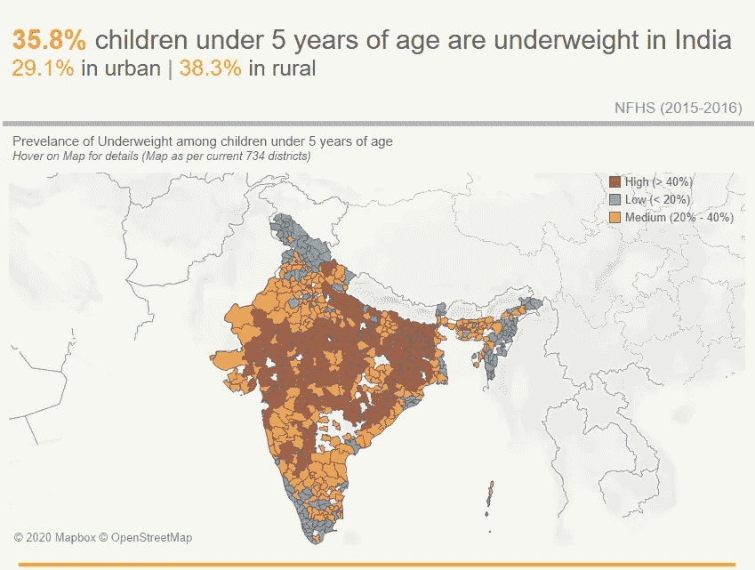
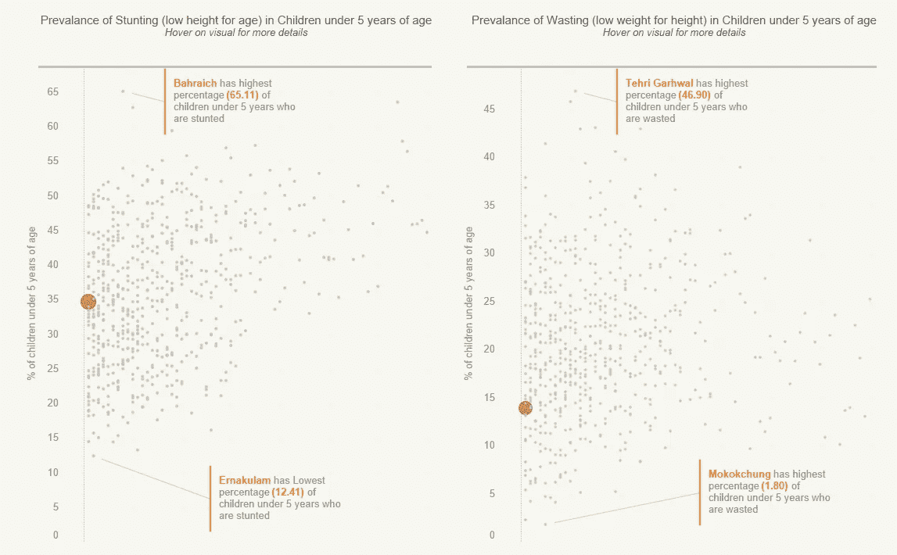
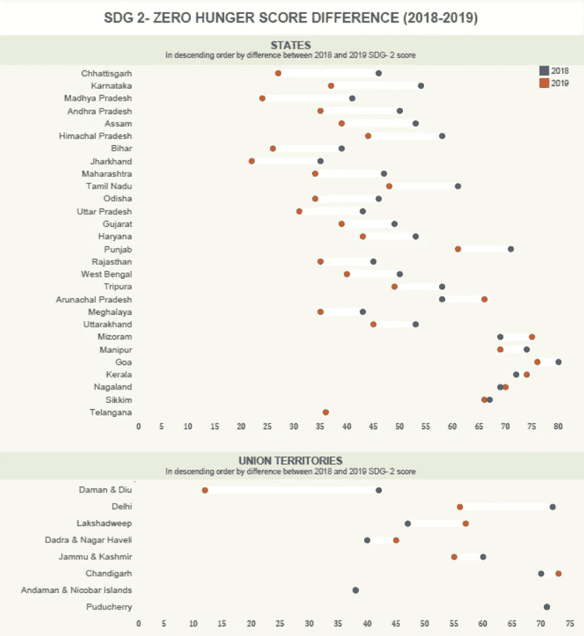
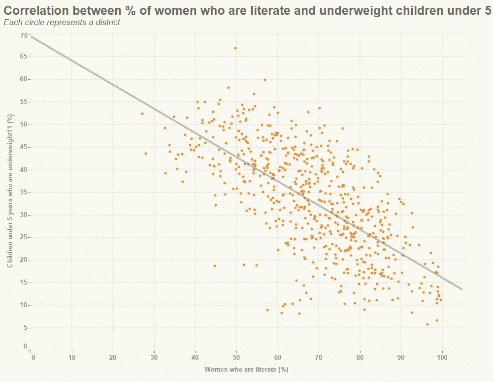

# 印度的营养状况

> 原文：<https://medium.com/analytics-vidhya/the-state-of-nutrition-in-india-9dd1c2fdf04a?source=collection_archive---------27----------------------->

总理纳伦德拉·莫迪宣布 9 月为“2020 年波山月”，以强调将营养意识转化为群众运动的重要性。Poshan 的字面意思是营养，是总理整体营养总体计划的首字母缩写，实质上是 POSHAN Abhiyaan 领导下的一场运动，旨在通过社区动员提高认识。但它能在多大程度上解决印度的营养问题仍是一个悬而未决的问题。

根据 2017-2019 年世卫组织、WFP、联合国儿童基金会、国际农业发展基金会和联合国粮农组织的联合报告“世界粮食安全和营养状况”的统计，全球有 6.73 亿营养不良人口，其中 1.892 亿(28%)在印度。此外，2019 年，印度有 2600 万 5 岁以下儿童受到消瘦(体重低于身高)的影响，有 4030 万 5 岁以下儿童受到发育迟缓(身高低于年龄)的影响。

根据 2015-2016 年全国家庭健康调查，5 岁以下儿童的营养状况特别差。消瘦的比例高达 21%，发育迟缓的比例为 38.4 %。而 35.8 %的 5 岁以下儿童体重不足。

比哈尔邦、北方邦、恰尔肯德邦、奥里萨邦、中央邦和拉贾斯坦邦的几个地区体重不足儿童的比例超过 40%。

NFHS 3(2005-2006 年)和 NFHS 4(2015-2016 年)之间的趋势表明，发育迟缓从 NFHS 3 的 48%稳步下降到 NFHS 4 的 38%,然而，根据“NFHS 4 全印概况”，消瘦水平从 2005-2006 年的 20%上升到 2015-2016 年的 21%。

参观[*(https://public.tableau.com/profile/palak.khanna#！/viz home/for nutrition article/dashboard 2)*](https://public.tableau.com/profile/palak.khanna#!/vizhome/ForNutritionarticle/Dashboard2)查看印度 5 岁以下儿童发育迟缓和消瘦的地区详情。

POSHAN Abhiyaan 的目标是确保到 2022 年实现印度无营养不良。启动第一年在 315 个区实施，第二年在 235 个区实施，目标是确保孕妇、母亲和儿童的全面发展和充足营养。而印度也在努力实现旨在消除饥饿的可持续发展目标 2，确保到 2030 年所有人全年都能获得安全、营养和充足的食物。

目标 2 的可持续发展目标指数得分，各邦在 22 至 76 之间，中央直辖区在 12 至 73 之间。果阿是表现最好的邦，昌迪加尔是表现最好的联邦直辖区。然而，根据 NITI Aayog 的“可持续发展目标印度指数报告”, 20 个邦和 3 个中央直辖区的指数得分低于 50。

深入研究 NFHS 4 的数据以发现儿童营养水平变量之间的相关性，一个有趣的发现浮出水面，表明妇女的识字率(特别是较高的识字率)与 5 岁以下体重不足儿童的比例呈负相关。据观察，识字妇女比例较高的地区体重不足儿童的比例较低。

尽管根据第四次 NFHS 调查，接受过 10 年或 10 年以上学校教育的妇女比例仅为 35.7%。因此，强调有必要高度重视旨在促进妇女高等教育的方案。

通过全面的提高认识运动，Anganwadi 工人和社区参与肯定能够改善营养水平和儿童保育做法。本着"思考国家，行动地方"的理念，希望" POSHAN maah "有助于儿童和母亲的全面发展，有助于实现消除饥饿的第二个可持续发展目标，确保所有人都能获得安全、营养和充足的食物。随着新冠肺炎·疫情的出现，政府解决营养不良多方面问题的挑战无疑变得更大了。印度能成功应对这一挑战吗？是时候说出真相了。