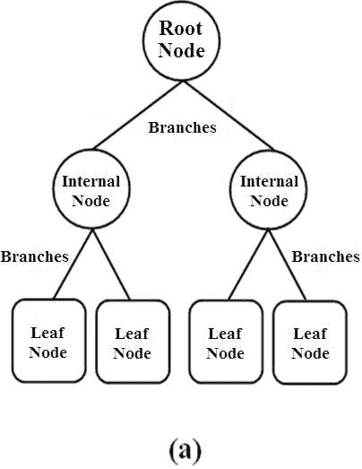
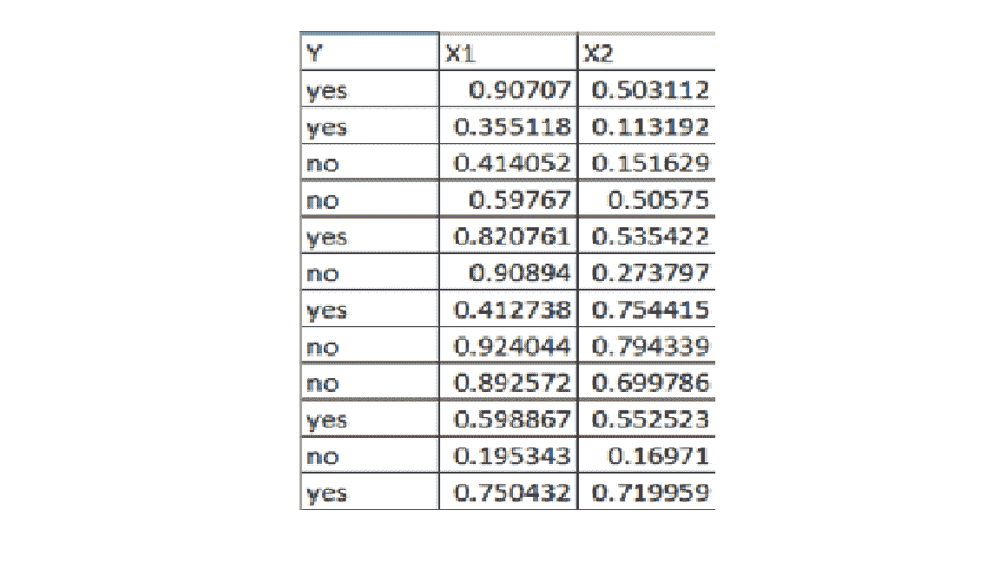
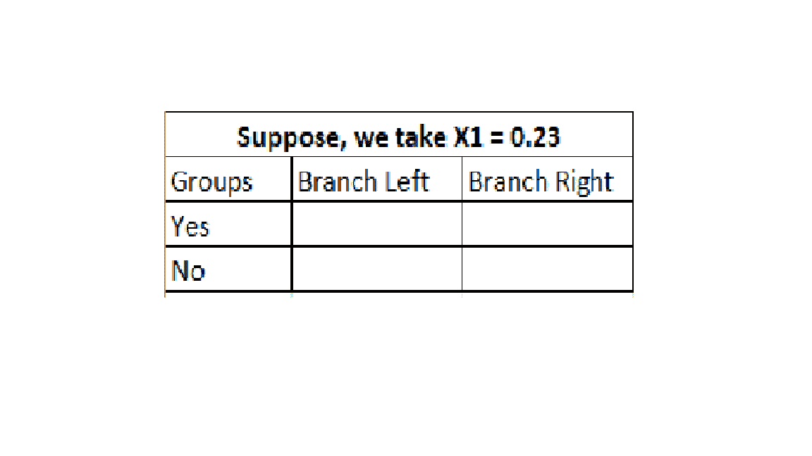
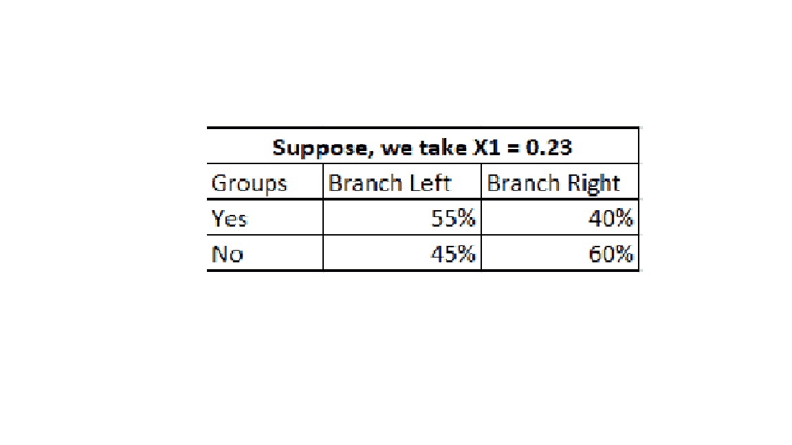
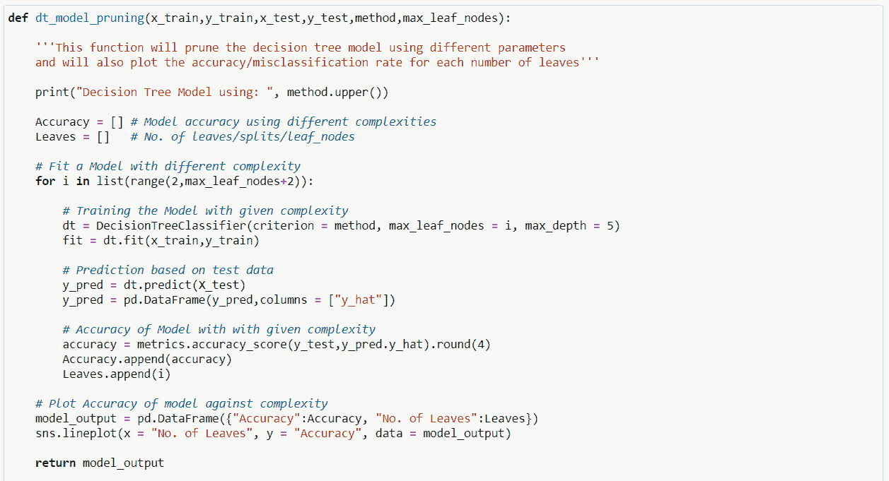
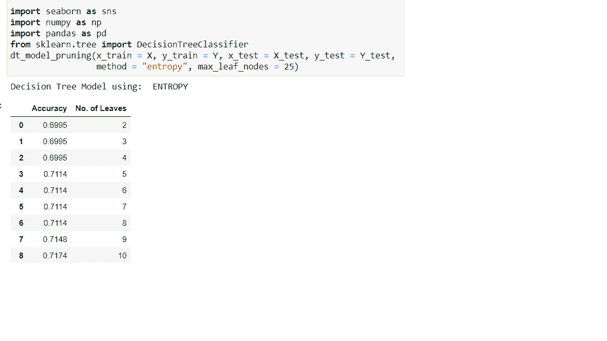
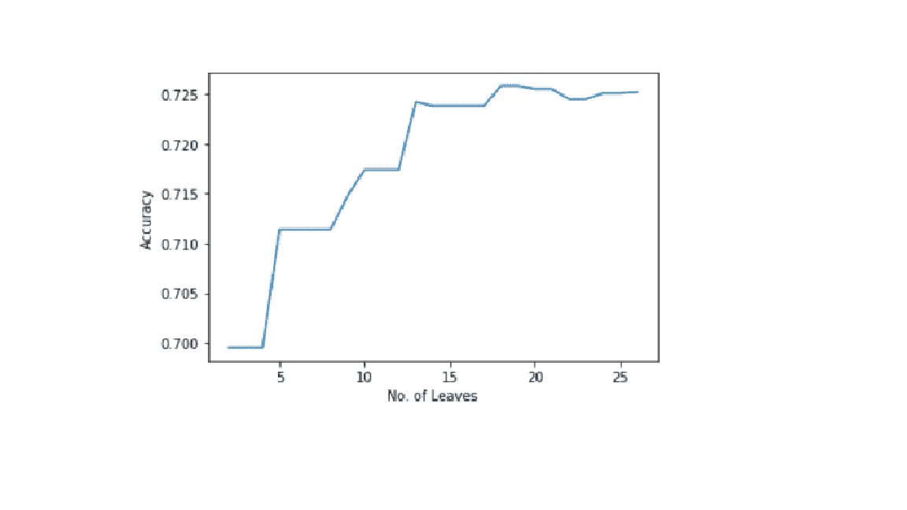

# 使用 Python 的决策树建模的逐步方法

> 原文：<https://medium.com/analytics-vidhya/the-step-by-step-approach-using-decision-tree-modeling-using-python-4ef1b4a3fe3?source=collection_archive---------20----------------------->

大家好，

希望你们都很好，很安全！！

在这篇文章中，我试图展示我在决策树建模方面的知识和经验。相信这篇文章能对任何想从头了解决策树模型的人有所帮助。

声明人:所使用的数据、Python 代码、输出和图形与任何项目无关。这篇文章的读者必须有统计学和 python 编程的背景

开始吧！！！

在我们开始之前，一些与决策树相关的关键词。

为了预测案例，决策树使用涉及输入变量值的规则。规则以树状结构分层排列，节点由线条连接。节点代表决策规则，线条对规则进行排序。树顶部的第一个规则称为*根节点。*后续规则被命名为*内部或内部节点。*只有连接的节点称为*叶节点。*要对新案例进行评分，请检查输入值，并应用决策树模型定义的规则。

决策树模型可以通过以下三个步骤实现:

1.预测新情况:在我们建立模型之前，我们必须清楚我们的模型将要预测什么。可以有如下三种类型的预测:

*决策* —您的模型使用输入为每个案例做出最佳决策(例如:将案例分类为潜在和非潜在客户)

*排名* —您的模型使用输入对每个案例进行最佳排名。(例如，模型试图将高价值案例排在低价值案例的前面。)

*估计* —您的模型使用输入来最佳预测目标值。(例如，如果您的变量是数值型的，则为具有输入观测值的所有案例的目标平均值；如果您的变量是分类型的，则为事件的概率)

2.输入选择:这一步需要搜索最能预测(决策/排序/估计)响应变量值的输入。这可以通过做来实现

输入减少—维度空间中的冗余，以及

输入减少——在你的维度空间中无关紧要

冗余输入不会给出任何其他输入没有解释过的新信息。

不相关的输入不提供关于目标的任何信息。对于决策树模型，建模算法会自动忽略不相关的输入。

3.优化复杂性:拟合一个模型需要搜索所有可能的模型。

它涉及偏差和方差之间的权衡。不够复杂的模型可能不够灵活，这可能导致*欠拟合*，从而系统性地丢失信号(高偏置)。

人们认为最复杂的模型应该总是比其他模型表现得更好。但是复杂模型可能过于灵活，这可能导致过度拟合，即适应特定样本中的细微误差(高方差)。

我们必须选择适当的复杂度来给出最好的概括。

我们将通过使用以上三个步骤来实现决策树建模。

1.  预测新情况:让我们考虑值为“是”或“否”的二元响应变量。因此，我们的模型输出将是一个*决策(或者“是”或者“否”)*。
2.  输入选择:决策树建模通过使用三种技术来处理*维数灾难*问题。

卡方自动交互检测(CHAID):当我们处理区间标度输入时，输入变量的所有值都作为潜在的分裂点。让我用两个输入 x1 和 x2 来表示，如下所示:

对于特定输入(比如 x1)的选定数据点，生成两个组。输入值小于该数据点的情况称为*分支向左。*输入值大于该数据点的情况称为*向右分支。*见下图:

现在，我们将简单地通过计算目标结果的比例来填充上面的 2*2 列联表。见下图(下图仅为示例，并非实际数据):

一旦我们有了这个表，我们将计算皮尔逊卡方统计量，用于量化表中各列计数的独立性。较大的卡方值表示左分支中“是”的比例不同于右分支中“是”的比例。结果比例的较大差异表明分割良好。

我们将对所有其他数据点进行同样的处理。由于我们将基于所有其他数据点进行多重比较，因此*类型 1 错误*的几率会增加。因此，我们将使用 *logworth =* -log(卡方值 *p 值*)来操作 *p 值*。

因为每个分割点对应一个统计测试，所以 *p 值*需要调整一个等于正在进行的测试数量的因子。这个膨胀的 *p 值*被称为 *Bonferroni 校正。*

*要进行拆分，必须至少有一个 logworth 超过阈值(决策树模型中的一个参数)。*

如果你知道皮尔逊卡方统计的细节，这很简单。

熵和信息增益:熵是每个标签的概率乘以该标签的对数概率的总和。在上面 X1 = 0.23 的 2*2 表中，熵的计算方法是 P(事件)=事件的比例* log(事件的比例)

现在，对于要发生的分割，我们将进行如下计算:

分裂发生前的熵:如你所见，我们在原始数据中有 6 个是和 6 个否。P(是)= 0.50 * log(0.50)而 P(否)= 0.50 * log(0.50)而熵 _before = P(是)+P(否)

左分支的熵(即 X1 < 0.23): P(Yes) = 0.55 * log(0.55) then P(No) = 0.45* log(0.45) and entropy_left = P(Yes)+P(No)

Entropy for Branch Right(that is X1 > 0.23): P(是)= 0.40* log(0.40)然后 P(否)= 0.60* log(0.60)并且熵 _ 右= P(是)+P(否)

分割后的熵:我们现在将合并熵 _ 左和熵 _ 右，即熵 _ 后=熵 _ 左+熵 _ 右。

现在，通过比较熵 _before 和熵 _after，我们将得到信息增益，即信息增益=熵 _ before-熵 _after。

信息增益衡量我们通过使用该特定特征进行分割获得了多少信息(X1 = 0.23)。在树的每个节点，对每个特征进行这种计算，并选择具有最大信息增益的特征进行分割。

基尼系数:基尼系数，也称为基尼系数，计算随机选择时某一特定特征被错误分类的概率。如果所有的元素都与一个类联系在一起，那么它就可以被称为纯类。

让我们来感知基尼指数的标准，就像熵的性质一样，*基尼指数在值 0 和 1 之间变化，其中 0 表示分类的纯度，即所有元素都属于一个指定的类别或者只存在一个类别。1 表示元素在各种类中的随机分布。基尼指数值为 0.5，表明一些阶层的要素分布均等。*

基尼指数是通过从 1 中减去每一类概率的平方和来确定的，在数学上，基尼指数可以表示为:

基尼指数= 1 —总和(P)**2。

在设计决策树时，基尼系数最小的特征将被优先考虑。

3.优化复杂性:决策树建模是基于输入空间的不同规则的集合。我们将通过评估测试或验证数据的规则来找到合适的复杂度。可以使用不同的统计数据来衡量决策树模型的性能。同样，它基于目标变量的预测类型和测量水平。

这里，我们有一个*二元*目标变量，其预测类型等于*决策。*适当的统计可以是多个真阳性和多个真阴性。

真阳性:使用您的模型将主要决策(是)与*实际的*主要结果进行匹配会产生真阳性。

真正的否定:使用您的模型将次要决策(否)与实际的*次要结果相匹配会产生真正的否定。*

精度= tp + tn。我们将使用不同数量的规则(决策树模型)来分析准确性，以设置适当的复杂度。

现在让我们用 Python 来实现它。我尝试将决策树模型的整个过程自动化，如下所示:

可以清楚地看到，精确度在 18 个叶节点树附近最大。因此，我们将采用 18 叶决策树。脚本中的一些参数需要澄清。

方法=用于构建决策树模型的标准。它主要用于决策树模型开发过程中的输入/特征选择。Python sklearn 只支持熵和基尼。你也可以用这个片段来表达基尼。

max_leaf_nodes =减少叶节点的数量。这会影响树的大小。

max_depth =降低树的深度以构建一般化的树。根据对测试数据的验证，将树的深度设置为 3、5、10

希望有帮助。

谢谢大家！！！

乌尔维什·沙阿