# 逻辑回归的故事…

> 原文：<https://medium.com/analytics-vidhya/the-story-of-logistic-regression-3a978fdc4fe2?source=collection_archive---------12----------------------->

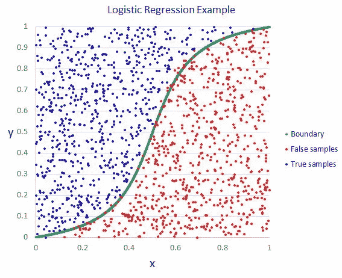

逻辑回归是一种简单而优雅的分类技术，通常用于寻找能最好地分离正负点的超平面(多维)或线(2D ),或者说逻辑回归是二元分类的最好技术之一。

我将非常直接地解释 LR 中的所有细节(现在简称为逻辑回归)。

## 这是一个奇妙的算法，只要把算法当成一个故事，把它的方程当成一首诗，你就会自动爱上机器学习。

那我们开始吧，

所以 LR 的目标是找到能最好地分离正负点或分离两个不同类的超平面。

在本系列文章中，我将尝试通过几何和损失函数来解释 LR 算法。

让我们从地理开始

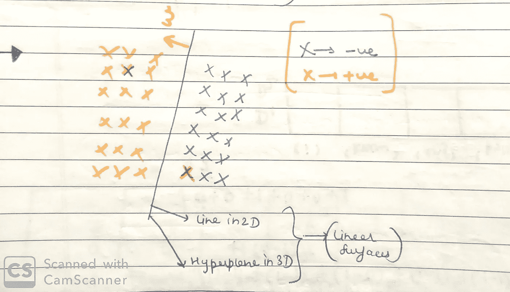

在上图中，我们可以看到有两个不同的类别，假设橙色是正的，蓝色是负的，现在我们的目标是找到最佳可能的直线(如果 2D)或最佳可能的超平面(如果多维)，那么直线的方程是什么

y=mx+c，其中 c 是截距，m 是直线的斜率。

超平面的方程是什么？

w^T *x+b=0，其中 t 表示转置，等式表示(w 转置 x+b)，其中 w 是维数为 d 的向量，x 也是维数为 d 的向量，b 是标量(截距)。

这里的“w”始终垂直于超平面。

所以如果我对所有的维度进行推广，我可以说在 LR 中，我们需要找到超平面的方程

w^T *x+b=0

## 所以基本上任务很简单，我只需要找到 w 和 b。

这里我们做了一个很大的假设，如果你注意到我们说我们只需要找到一个超平面来分离两个类，如果这两个类不是线性可分离的呢？

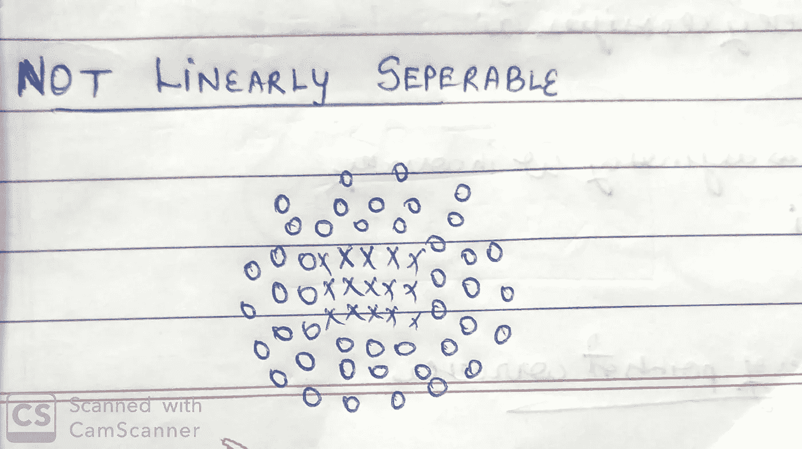

比如上图。

***逻辑回归假设——我们假设类是线性可分的***

如果你读过我的其他文章，我们也看到了朴素贝叶斯和 KNN 的一些假设

***假设朴素贝叶斯-特征是有条件独立的***

***KNN 假设——一个点的邻域与一个点*** 相同

让我们回到逻辑回归，所以我们知道假设，现在我们知道如果类不是线性可分的，我们不能使用逻辑回归。

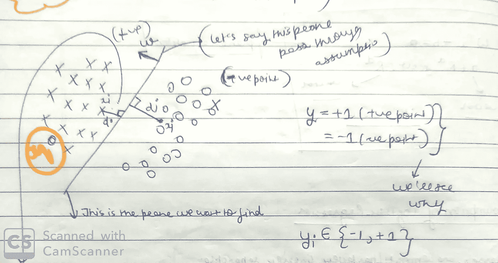

举个例子，我们有两个类，正的和负的，假设有一个正的点时 y=+1，有一个负的点时 y=-1。现在有人会问，为什么我们在其他算法中取 y=0，而在这里取 y=-1。我一会儿会谈到这一点。

所以现在我们有了属于{-1，+1}的 yi

现在我们知道离超平面的距离是 di=w^T*xi/||w||，这里 w 垂直于超平面和一个单位向量所以||w||是 1，那么

di=w^T*xi(从超平面到所有正点的距离)

如图所示，假设 xi 是所有的正点，xj 是所有的负点。

然后 dj=w^T*xj(distance 从双曲线到所有的负点)

我们可以说

di=w^T*xi > 0 (w 和 xi 向量在同一侧)

0 然后易=+1

如果 w^T*xi <0 then yi=-1

*现在我想提一个小细节，这个分类器不是完美的，这也会出错，就像对于 xq 点> 0 但是 yi=-1 所以很明显这个分类器会出错。*

让我们看一些案例:

案例 1

如果易=+1 而 w^T*xi>0

## 然后，***>0***

案例 2

如果易=-1、<0

## then, ***、>***

它仅仅意味着当分类器正确分类时， ***yi*w^T*xi > 0 这个条件满足。***

案例 3

如果易=+1、<0

## then, ***、< 0、***

案例 4

如果易=-1 和

## 然后，***yi*w^t*xi<0***

它仅仅意味着每当分类器分类错误时， ***yi*w^T*xi < 0 这个条件满足。***

这就是我们把负点设为 y=-1 的原因。

那么我们的主要目标是什么，得到最少的错误分类点和最多的分类点，所以基本上我们想要的是尽可能多的点

yi*w^t*xi 0，所以如果我们找到一个平面，它的 w 满足上述条件，我们就完成了。

## 我们有一个优化问题，我们需要找到最大化上述条件的最佳 w*

优化问题可以在下图中看到。

正如我告诉你的，对我来说，算法是故事，方程是诗歌，所以让我们从这个故事的第二部分开始。

现在我们有了一个基本的数学问题，我们需要得到“w”或超平面，使其最大化带符号的 distance(yi*w^T*xi).的总和

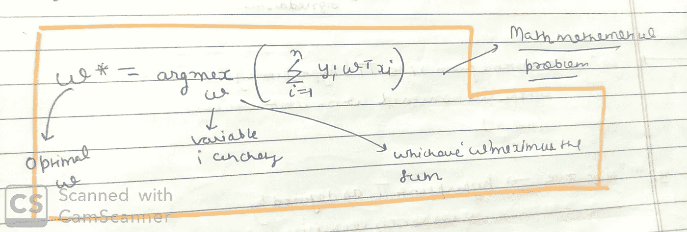

现在让我们看看这个陈述有什么问题，我们如何优化我们的解决方案，让我们举一个简单的例子，我们有一个离群值。所以对于所有的“x”，yi=1(我们假设图中所有的“x”都是正的，所有的“0”都是负的)，所以对于图中所有的“0”，yi=-1。

让我们看一些案例…

情况 1:现在的任务仍然是找到最佳的“w”或超平面，它使符号距离的和最大化，所以假设算法找到了超平面 1(如下图所示)，让我们找到图片的符号距离的和。

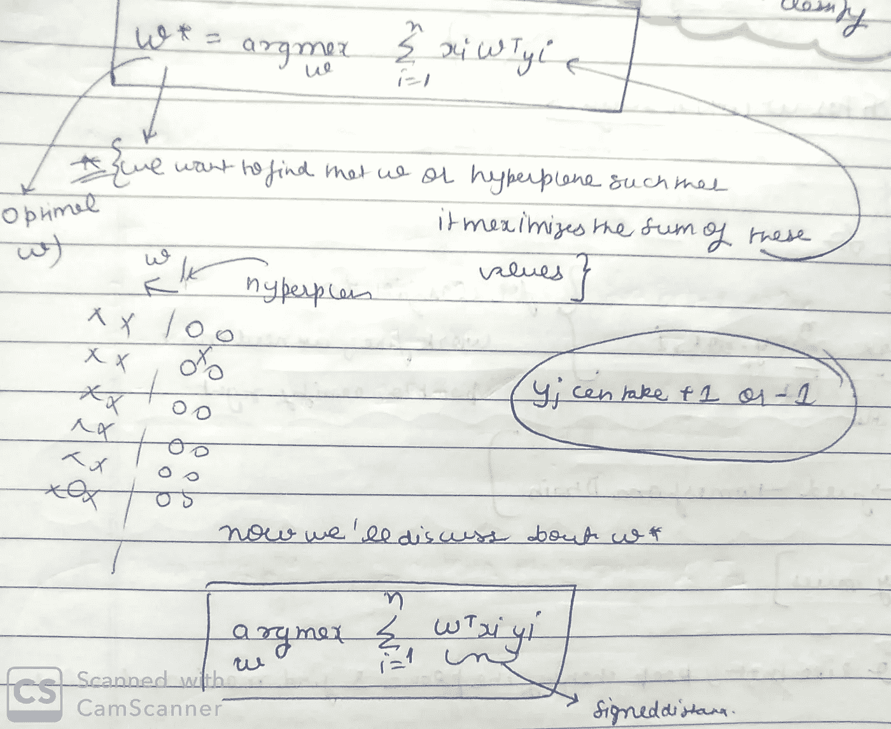

除了离群点，所有的点到超平面的距离都是 1，离群点到超平面 1 的距离是 100。

在图中我们可以看到 sum 结果是-90。

情况 2:现在的任务仍然是找到最佳的“w”或超平面，它使符号距离之和最大化，所以假设算法找到了超平面 2(如下图所示)，让我们找到图片的符号距离之和。

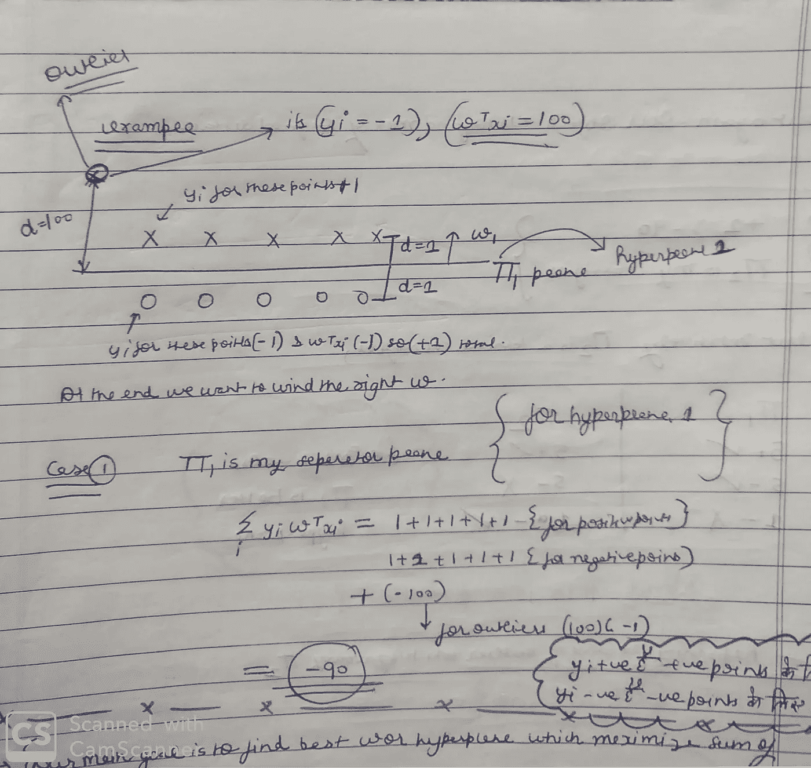

对于除离群点之外的所有点，距超平面的距离增加 1，离群点距超平面 2 的距离为 1。

在这幅图中，我们可以看到总和为 1

***现在，如果我们按照陈述“我们想要最大化符号距离的和的超平面，我们将选择超平面 2(和是 1)而不是超平面 1(和是-90°)，但是如果我们直觉地思考，超平面 1 是最好的分类器，只有一个错误。***

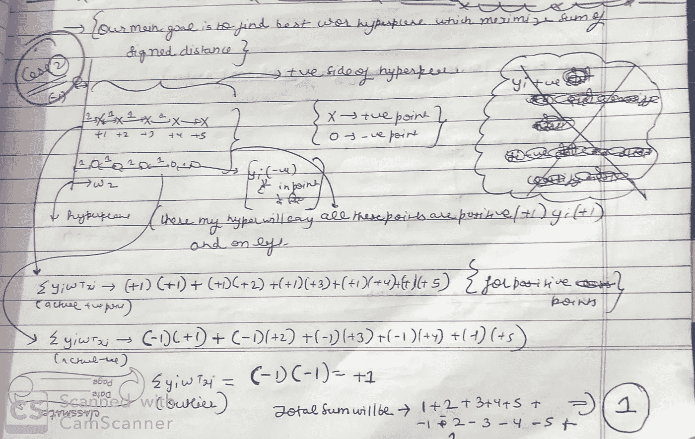

现在该怎么办？

我们能不能想出一些东西，可以减少额外的距离，因为我们刚刚从离群值中得到这个问题。

## ***如果带符号的距离很小——按原样使用带符号的距离***

***如果带符号的距离很大——使用一个可以逐渐减少额外距离的功能***

如下图所示，我绘制了有符号距离 vs f(有符号距离)，这个 f(有符号距离)必须能够像图中那样逐渐减少额外的距离。

这种逐渐变小的距离被称为“挤压”。

因此，我们可以将优化方程替换为

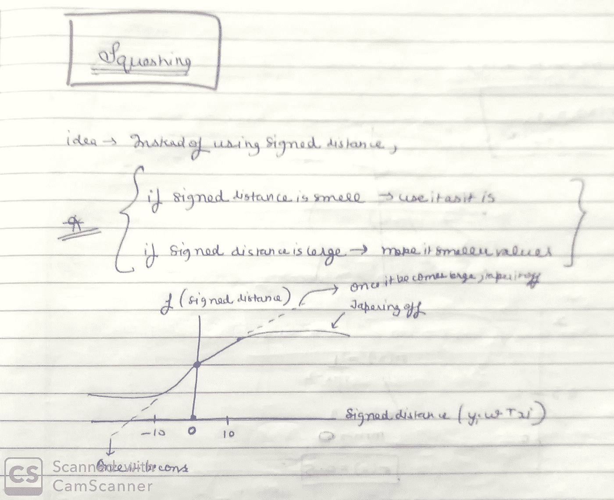

## 现在的问题是，使用哪个函数？

有许多函数可以帮助攻丝，但我们更喜欢如图所示的***s 形函数*** ，这有两个主要原因。

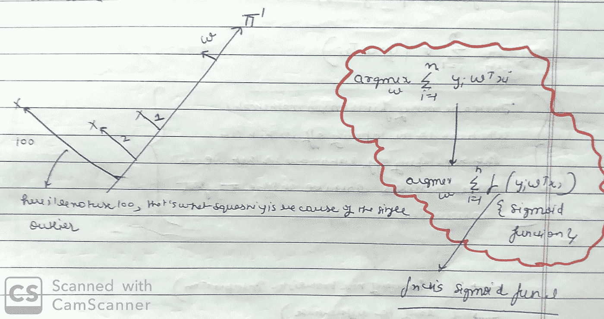

它有一个很好的概率解释。

很容易求导，我们希望我们的函数容易求导，否则我们将无法解决优化问题。

1.  一篇文章就够了，我会在下一篇文章中继续“**逻辑回归的故事**”,
2.  感谢您的阅读，请在评论中分享您的想法。

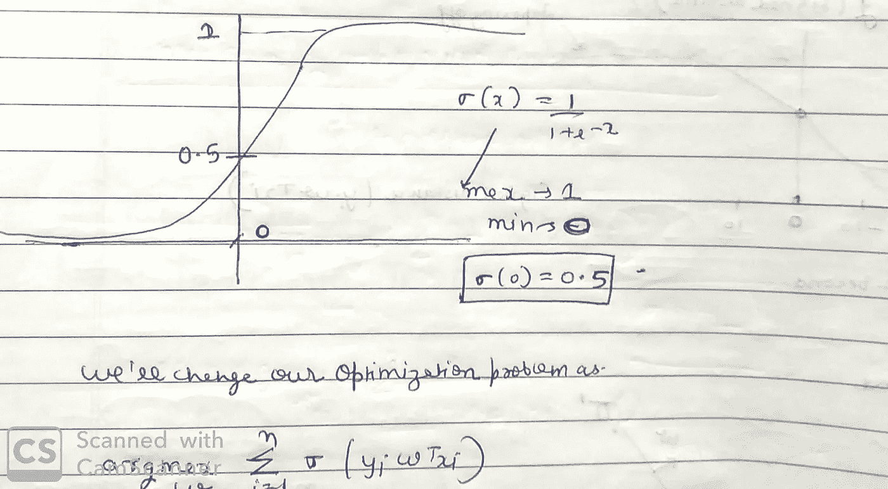

Thats enough for one article, i will continue “**The story of Logistic Regression**” in next articles,

## THANKS FOR READING AND PLEASE SHARE YOUR THOUGHTS IN COMMENTS.