# 逻辑回归的故事还在继续…

> 原文：<https://medium.com/analytics-vidhya/the-story-of-logistic-regression-contiues-2170395afb39?source=collection_archive---------16----------------------->

在这篇文章中，我将继续讲述逻辑回归的故事，如果你还没有阅读上一篇文章，这里是 [**链接**](/analytics-vidhya/the-story-of-logistic-regression-3a978fdc4fe2)

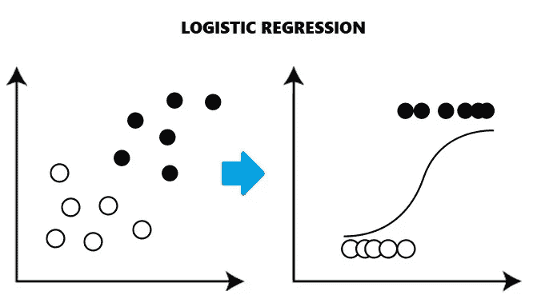

让我把事情说得简单明了，即使在这篇文章中，我也无法完成逻辑回归，因为这是一个广泛的话题，我们正在详细讨论它，所以最好计划一下我们将在这篇文章中讨论的内容。

## 我们将涵盖:

1.  ***西格玛函数的概率方法。***
2.  ***最优化理论。***
3.  ***我们将通过几何推导 LR 的优化问题。***
4.  ***权重向量***
5.  ***我们将处理过度拟合问题。***
6.  ***我们将详细看到 L1 和 L2 的正规化。***

所以让我们开始吧，

## ***西格玛函数的概率方法***

现在我们已经导出了优化问题，它可以通过挖掘距离来处理异常值，我们知道为什么要使用 sigma 函数。我们使用西格玛函数的原因之一是它有很好的概率解释。

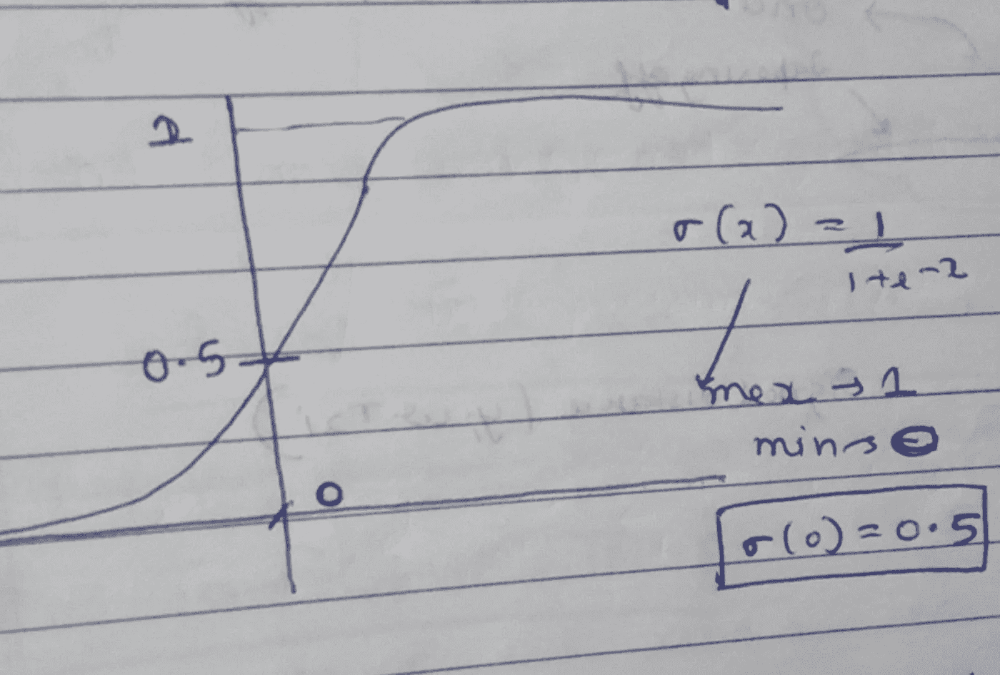

现在让我们看看西格玛函数的概率解释。

案例 1

假设我们有同样的分类问题，其中我们用否定来分类肯定，所以让我们想象一个查询点位于超平面上，现在直觉上有 50 -50 的机会将查询点分类为肯定的和否定的。那么点为正的概率是多少，毫无疑问是 0.5，负的也是一样。

P(Y=1)=0.5

我们有一个 sigma 函数，其定义为

sigma=1/(1+e^(-s))这里是 LR，

s=yi*w^T*xi，对于上面的问题，w^T*xi 是“0 ”,因为点位于超平面上，所以 s=0，这意味着 sigma =0.5 与概率相同(上面找到的)

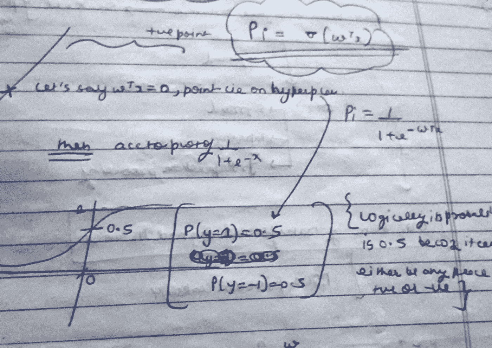

案例 2

假设我们有相同的分类问题，其中我们用否定分类肯定，所以让我们想象一个查询点位于距离超平面 100 处，如图所示，现在首先根据我们的 sigmoid 函数，下面是 sigma 函数的图形。

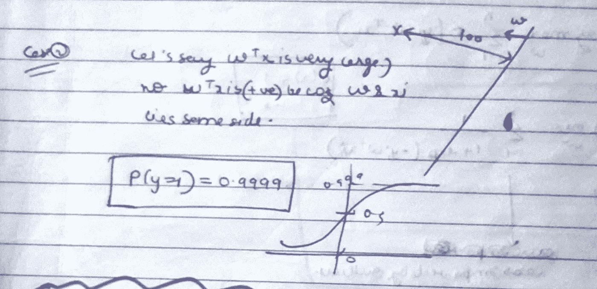

当这个点在一个很远的距离，比如说从超平面的 w^T*xi(distance)是 100，正如我上面提到的，在 w 的同一个方向上，根据图表，它的值将是 0.99999，你也可以从公式中得到，意味着 P(Y=1)=0.99999 意味着有 99%的可能性 y 属于正类。所以我们可以很容易地得出一个结论，

***【sigma(w^t*xi)=p(y=1】)***，其中 P(y=1)等于概率当 y=1 时表示该点属于正类。

***显然******【sigma(w^t*xi】)的值在 0 到 1 之间，概率值在 0 到 1 之间。***

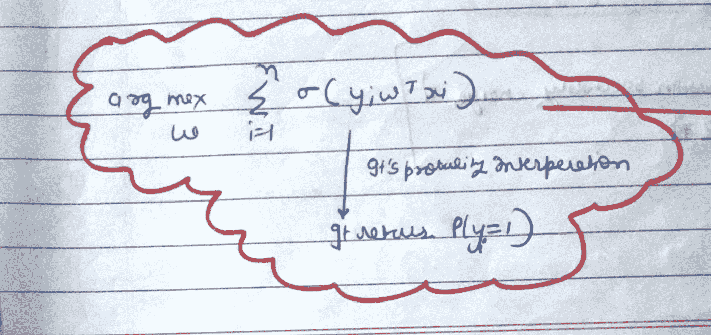

## ***逻辑回归优化理论***

所以我们需要一些优化工具来优化我们的 LR 问题。我们也可以解决前面的优化问题，但我们希望做得更好。

现在我们已经看到了我们的优化问题，它受离群值的影响较小。

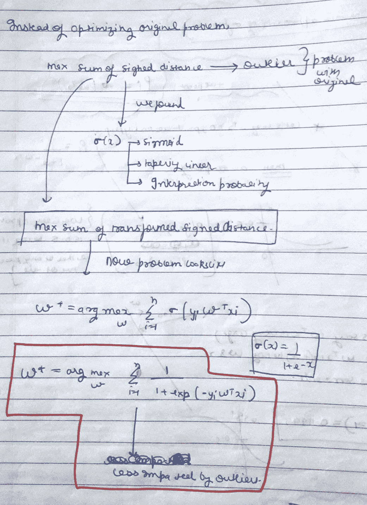

现在，为了找到更优化的一个，让我们了解一些优化理论。

**单调函数**

假设我有两个点 x1 和 x2，我知道 x1>x2，所以如果有一个函数 g(x1)和一个函数 g(x2)

如果 g(x1) >g(x2)，则

g(x)是类似 log(x)的单调递增函数

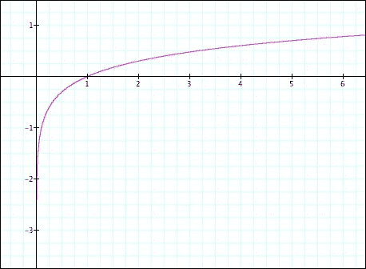

如图所示，如果 x 增加，log(x)也会增加。Log(x)是一个运动增量函数。

现在，假设我们有一个优化问题，我们需要找到 x 的最佳值，使 x^2 最小

现在我们很容易给出它的答案是“0”。正如我们在下图中看到的，对于 x=0，x^2 是 0，这是最小值，所以从上图中 x*值是 0。

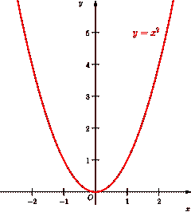

现在让我们假设我有一个函数 g(x) =log(x)，我想找到 x 的最佳值，我可以得到 g(f(x))的最小值，其中 f(x)是 x^2.

所以我又有一个优化问题，我们需要找到使 g(f(x))最小的 x

g(f(x))= log(x^2).

现在最优化理论说，如果 g(x)是单调递增的，那么我们在第一个问题中找到的 x*等于我们在第二个问题中找到的 x’(当使用 g(f(x))的时候。

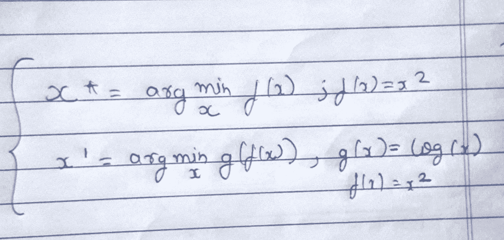

我们也可以从下图中看到，我们发现 x*=0，所以如果我们看到 log(x^2 的图，我们可以看到它在 0 处最小，这是因为 log(x)是一个单调递增的函数。

让我们将这一理论应用于我们的 LR 优化问题

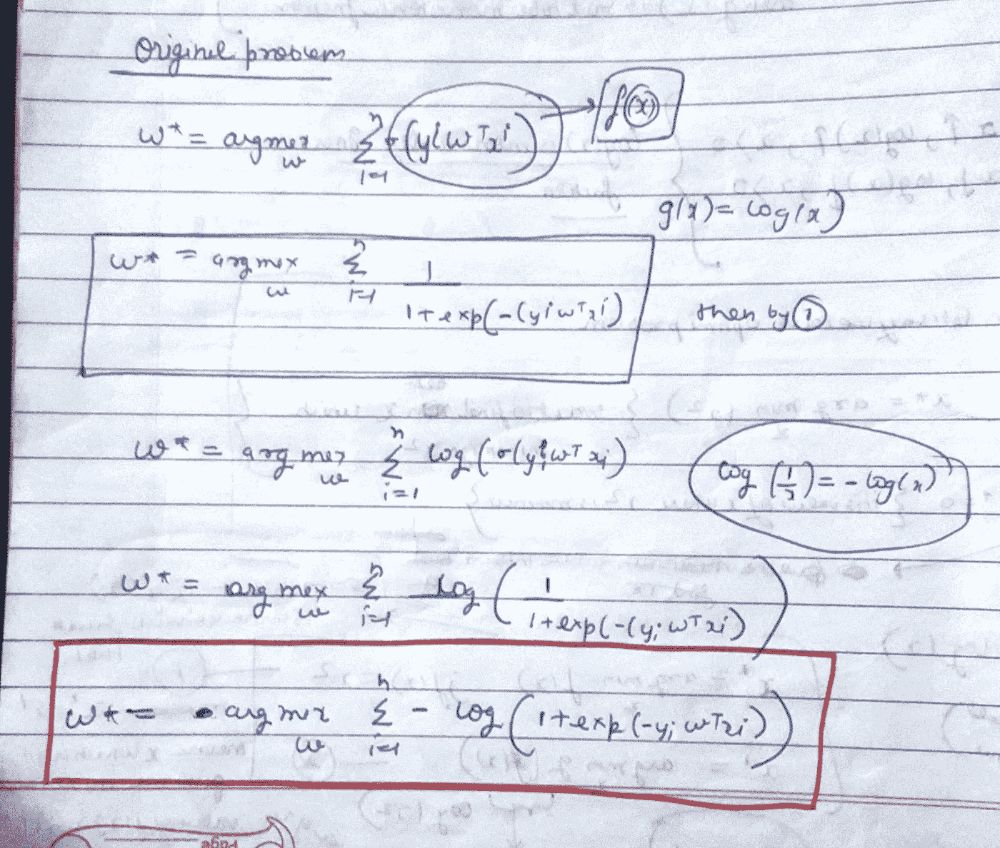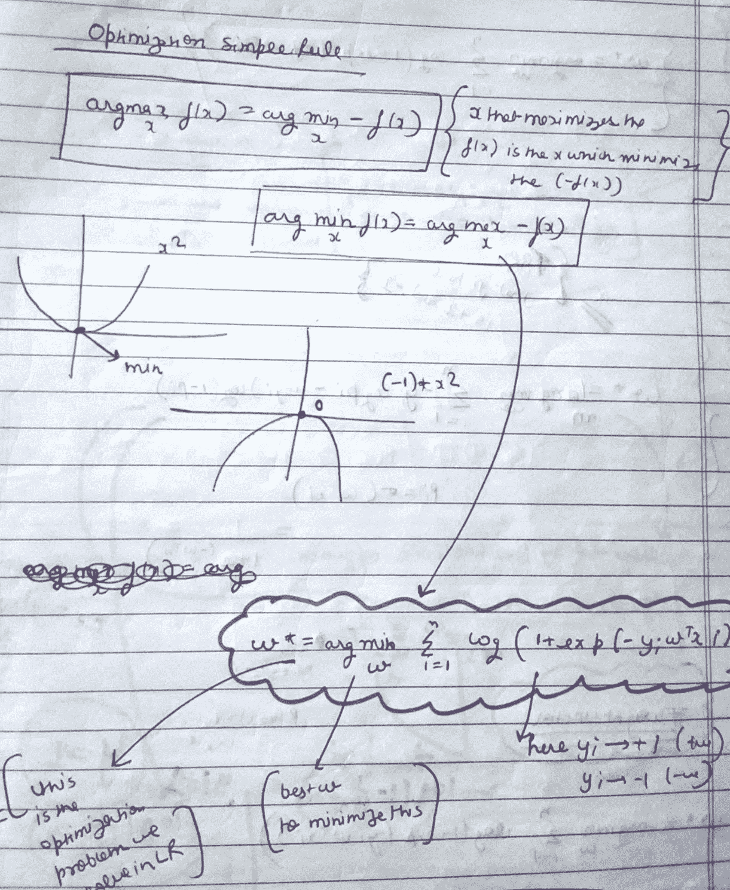

**权重向量**

现在一个想法很容易被误解

“w*”向量，首先这是我们在解决优化问题后得到的向量。

**我们如何解决？**

我们将在以后讨论这个细节，但是现在让我们假设我们得到了 w*(最优 w)，现在我只把 w*写成 w。

所以“w”是一个 d 维向量，因为否则 w^T*x 是不可能的，因为 x 也是 d 维的。

在这里，尺寸仅仅意味着特征

我们可以将 w 向量理解为每个特征的权重。

w=

对于功能

f=

每个要素的权重。

让我们看看测试时会发生什么。

假设你有一个查询点(xq ),你需要找到它的类标签(yq ),可以是正的也可以是负的。

所以如果

**w^T*xq > 0 然后 yq=+ve**

其中 w 是我们在解决优化问题后找到的最优 w。

如果

**w^T*xq < 0 然后 yq=-ve**

## 过度拟合问题

现在我们有一个问题，让我们来解决它。

现在我们得到了优化的问题

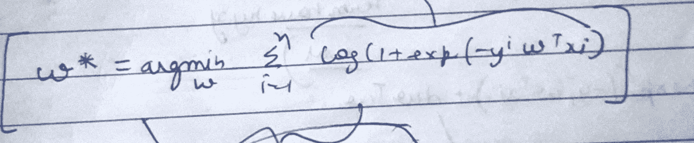

比如说 zi=yi*w^T*xi

现在如果我们分析一下，我们自然知道，exp(-zi)总是大于等于零，(1+exp(-zi))总是大于零，log 是一个单调函数

log(1+exp(-zi))>0

所以不同 zi 的所有 log 值之和大于零，这意味着如果我们想找到最小值，它必须为零。所以基本上我们需要找出 w*，对于它，整个求和项变为零。

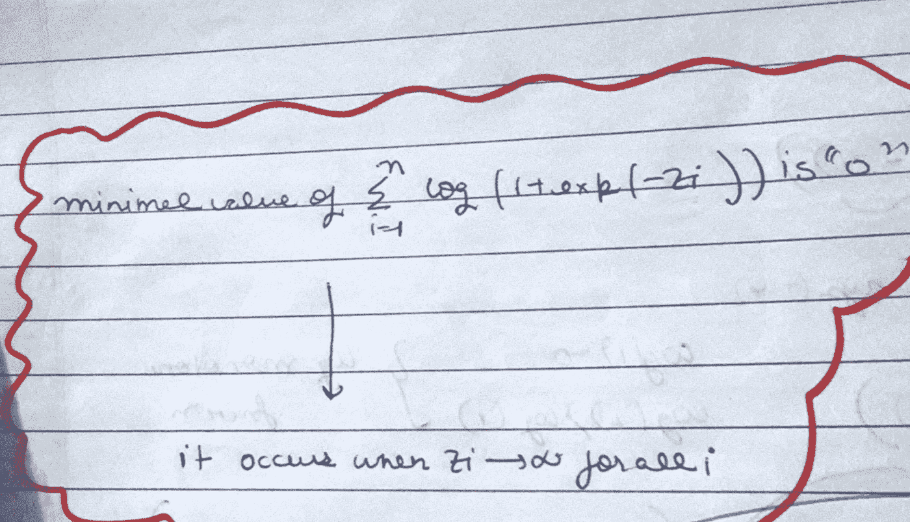

现在，如果我们仔细分析，我们可以说只有在 x=1 时，log 值为“0”，log(1)=0，意味着 1+exp(-zi)=1，意味着 exp(-zi)变为 0，因此 zi 必须变为无穷大。

子，我们给定了易和，当我们说子变得无穷大时，这意味着 w 必须变得无穷大，如果子是无穷大，我们还说子> 0 意味着我们总是正确地分类所有的训练点，这意味着我们过度拟合模型。

如果我们回忆一下，我们正在忘记一个关键的方面，w 垂直于超平面。

w^t*w=1，我们没有在任何地方使用这个条件。

所以让我们用这个。

**如何处理这个问题？**

答案是正则化，有两种类型的正则化 L1 和 L2，正则化简单地说就是增加另一项，这样它就能创造稳定性，减少过度拟合。

**L2 正规化**

如果我们这样写优化问题，

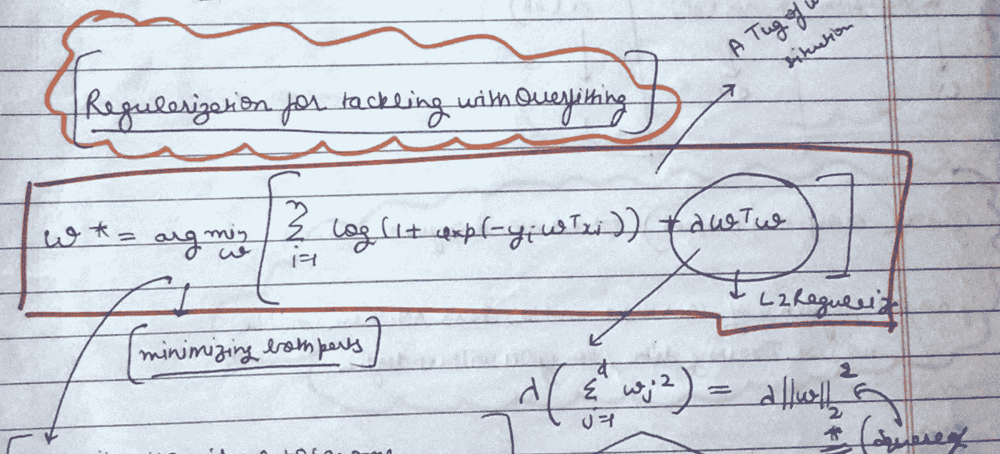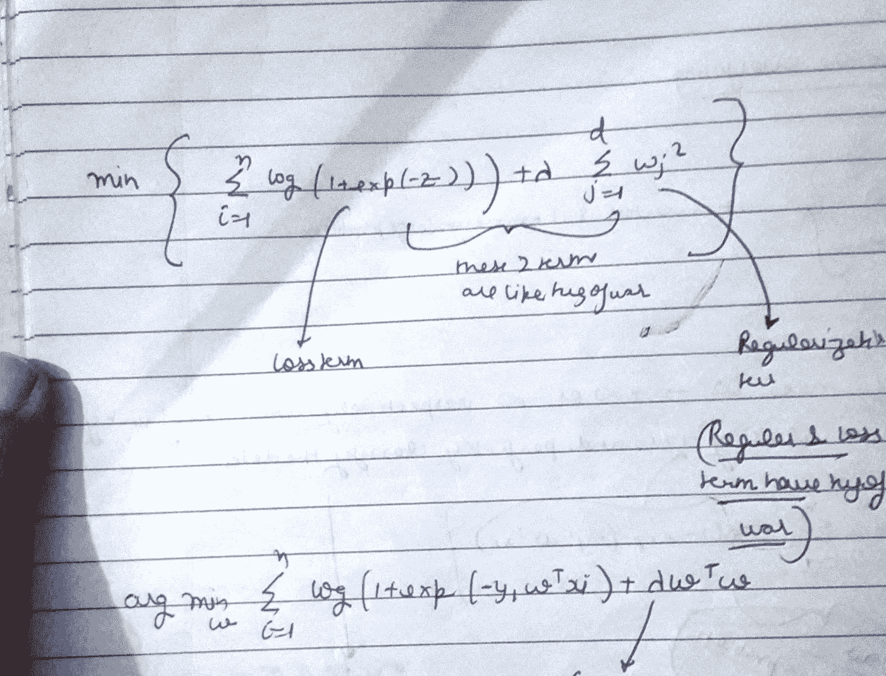

现在，如果我们想找到使整个项最小的 w，如果我们想减少对数项，我们需要增加 w，如果我们增加 w 项，那么正则项将是最大值，我们不会得到最小值，正则项没有用。

现在，如果我们减小 w 的值，那么对数项将不再是 0，我们也找不到最小值。

这里λ是一个超参数，可以通过 [**交叉验证**](/analytics-vidhya/k-fold-cross-validations-in-machine-learning-7fd2f48e0a6f) 找到

所以如果 lamda 是“0”意味着没有正则项意味着过拟合。

如果 lambda 为无穷大，意味着损失项的影响将会更小，因此没有使用训练数据，模型将会欠拟合。

**L1 正规化**

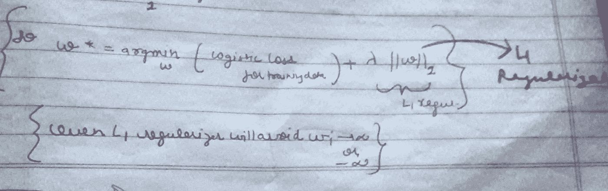

L1 正则化是伟大的，如果你想低延迟，特别是在互联网公司，使用预期结果来在几秒钟内。

它实际上创建了一个逻辑回归的解，即“w”太稀疏，这意味着如果 w 不太重要，如果一些特征在解决方案中不太重要，那么 L1 将使 w 为零。

PPPPPP

[**为什么 L1 在《W》中创造了与 L2 正则化相比的稀疏性？？**](/analytics-vidhya/most-common-data-science-question-part-1-e049e338af4f)

还有另一种正则化方法，那就是**弹性网**。我们基本上结合了 L1 和 L2，并通过交叉验证简单地找到了两个超参数。

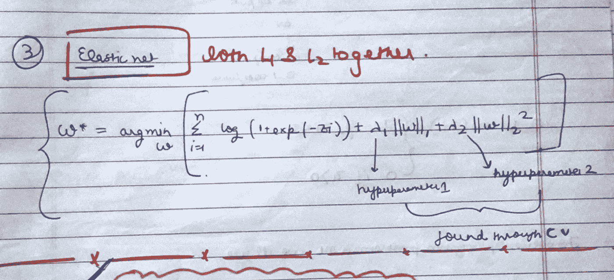

**这篇文章就是这样，这或多或少是逻辑回归背后的故事。**

**感谢阅读。**