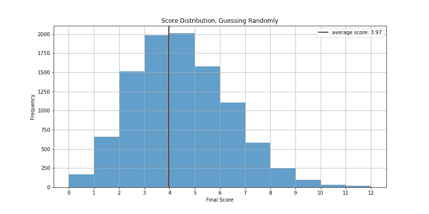
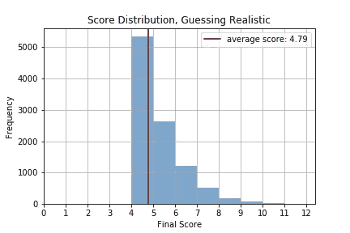
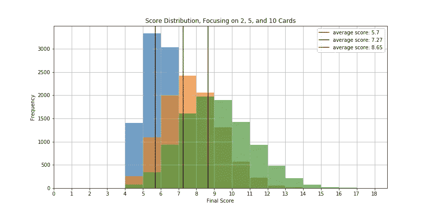
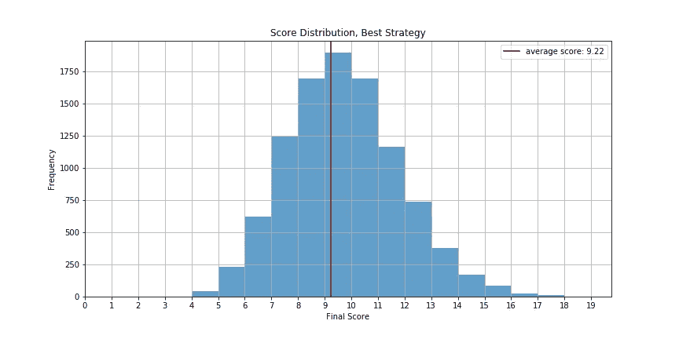
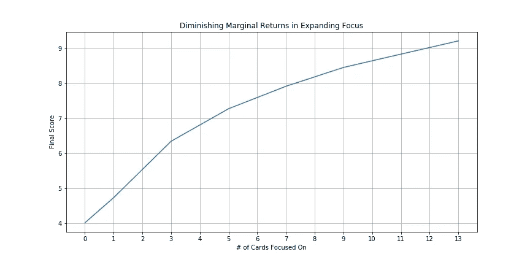
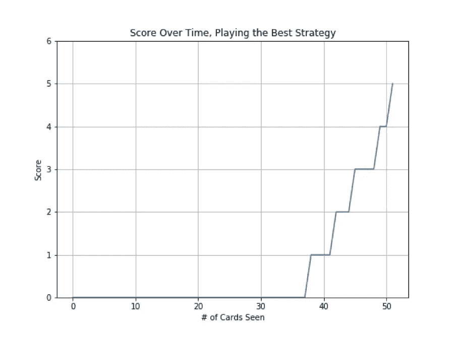
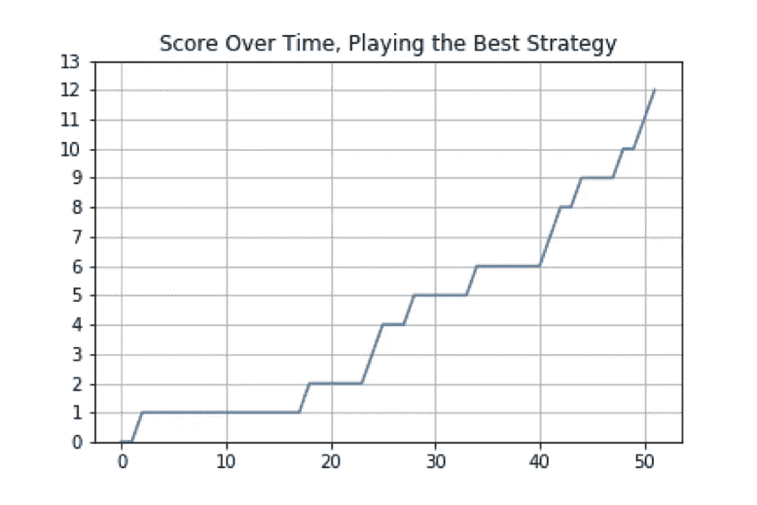
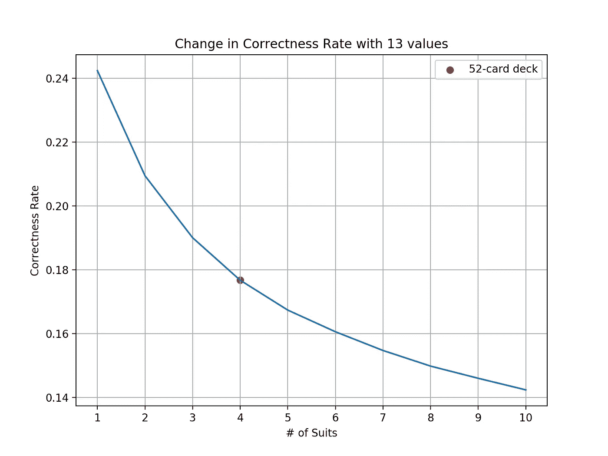
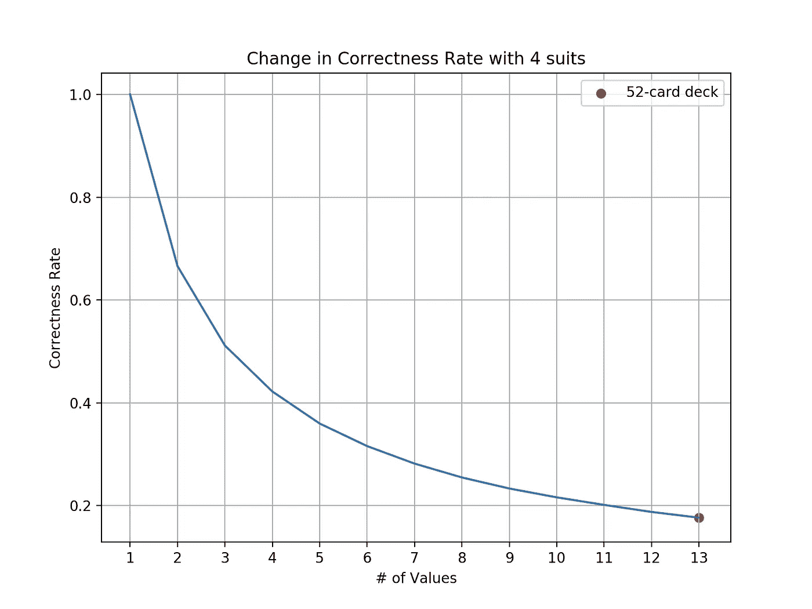
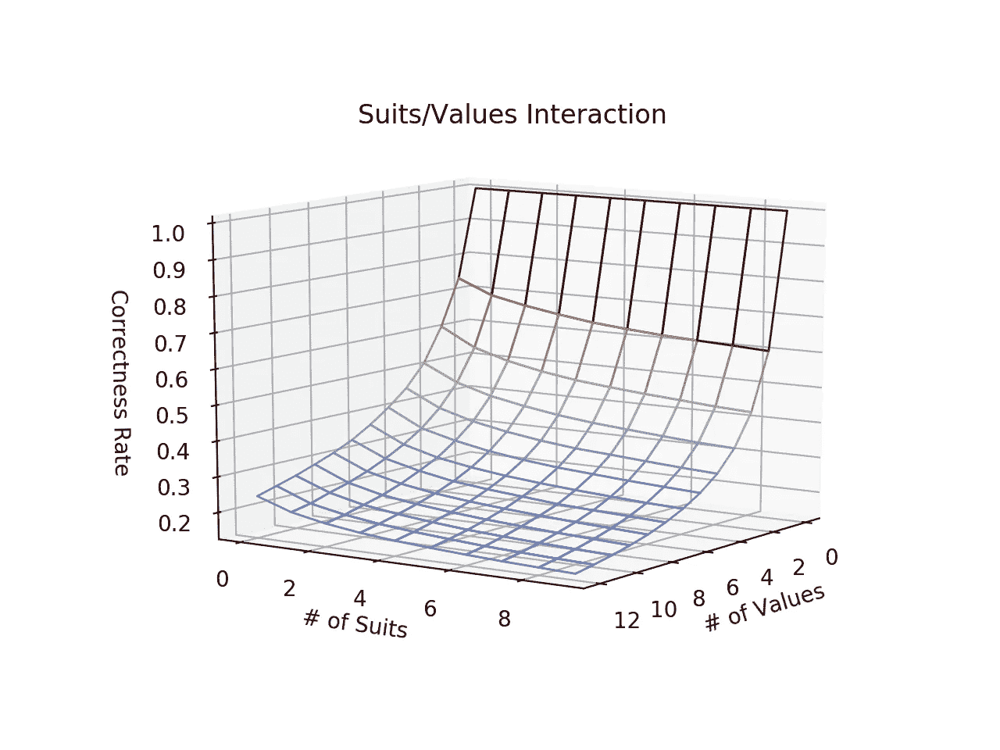

# 史上最蠢的纸牌游戏。

> 原文：<https://medium.com/analytics-vidhya/the-stupidest-card-game-ever-d21edd3935b6?source=collection_archive---------34----------------------->

当我 9 岁的时候，我想到了有史以来最愚蠢的纸牌游戏。它非常简单，可以一个人玩，所以非常适合一个无聊的没事干的孩子。

它是这样工作的:洗一副牌——如果你想让它“真正随机”的话，洗 7 次[——然后一次给自己发一张牌。在你看到每张牌之前，试着猜一下数值(2 到 Ace，不用担心花色)。就是这样！浏览整副牌，确保记录你的分数，也就是你答对了多少。显然，越高越好，我告诉自己，任何高于 4 的游戏都是“好”游戏，因为你可以通过一遍又一遍地猜测相同的值来清楚地得到 4。我想我最好的成绩是 8 分。](https://en.wikipedia.org/wiki/Shuffling#Randomization)

所以是的，这个游戏名副其实。但它会令人惊讶地上瘾，尤其是在你无事可做的时候。因此，在社交距离的第六天左右，当我和我的室友们筋疲力尽地去玩卡丹、巫师或餐桌乒乓球时，我向他们介绍了有史以来最愚蠢的纸牌游戏。我们首先尝试随机猜牌。我们有一次答对了 5 个，但也答对了 2 个，然后是 3 个。尴尬。

我们转向了一个新的策略:数牌，以确定哪些牌更有可能出现。如果能够跟踪所有 13 个值就好了，但是这太难了，所以我们只关注前五个值。我们会从猜 2 开始，每次我们看到任何一张 2-6 的牌，我们都会在心里记下我们见过它。猜对了 2 之后，我们会把我们的猜测改成我们看到次数最少的那张牌。平局将被任意解决——在我们的例子中，我们总是选择具有较低值的卡。

通过关注前五个值来展示你如何去玩

我们配对是为了能够记录更多的卡片。我们每个人都记得 5 张牌，所以我们可以通过插孔覆盖 2，我们最终得到 10 分。感觉真好。但是这个分数到底有多好呢？

我和我的朋友们注意到洗牌确实影响了我们的得分。有时，只是由于随机的机会，我们碰巧在游戏的早期就猜对了，并最终做得很好。其他时候，感觉就像我们漫无目的地转动轮子，在得到一分之前猜了将近一半的牌。如果能找到一种方法来看看我们的策略平均有多好，看看我们的 10 分是否令人印象深刻，那就太好了。

## **设想不同的策略**

幸运的是，这类问题非常适合用[蒙特卡罗模拟](https://en.wikipedia.org/wiki/Monte_Carlo_method)建模。如果你可以写一个算法来玩有史以来最愚蠢的纸牌游戏，你可以运行它数万次。大量的试验意味着你从一个特定的牌组配置中得到的优势或劣势被平滑到一个可能得分的分布中。你可以把这些分数的平均值想象成你在任何一场比赛中应该得到的分数。

这里有一个例子。还记得我想到的第一种玩法吗，就是一遍又一遍地猜同一个值？这是分布图。因为每次你都会得到 4 个*，所以没什么意思。显然，平均值、最小值和最大值都是 4。*

分数直方图，如果你每次都猜中同一张牌

这里有一个稍微复杂一点的策略:随机猜测。有趣的是，平均值仍然大约是 4(随着试验次数的增加，将会接近 4)，但是你也得到一些真正的方差！如果你是一个赌徒，这种策略可能会吸引你——虽然你没有把握在任何游戏中获得 4 分，但你有机会获得 10+的高分……或者你可能一无所获。

如果你随机猜测，得分直方图

但是关于每次都猜测一个常量值的策略，有些事情困扰着我。在某个时候，你会看到(并且猜对)你所有的四张牌，并且你可能还剩下一些牌要看。上面的常量猜测分布假设您继续猜测相同的值，这没有意义—任何理性的玩家都会在这一点上改变它。如果你的策略是“猜一个常数值，直到你看到其中的四个，然后随机猜剩下的一副牌”，这就是分数分布的样子

分数直方图，如果你猜中了同一张牌，直到你看完所有四张牌

正如你所看到的，它砍掉了分布的左半部分——不管怎样，你肯定会得到 4 分，就像持续猜测策略一样。但是你有潜力获得更高的分数。

对我们最终使用的策略进行建模并不太难——我们“关注”一组卡片，选择该组中最少出现的卡片，直到我们看到所有这些卡片，然后在其余的卡片中随机猜测。下面是关注 2 张(蓝色)、5 张(橙色)和 10 张(绿色)卡片时出现的直方图。

比较不同关注级别的得分直方图

那么赢得史上最愚蠢的纸牌游戏的最佳策略是什么呢？那就是“关注”所有 13 个值，记录每个值你看到了多少次，不断猜测你看到最少的那张牌，任意解决平局。下面是这个策略产生的直方图:平均大约是 9.2 张正确的卡片，但是有一个相当大的差异。如果你运行模拟足够长的时间，你可能会得到至少一个 20 分。

如果你把注意力集中在所有 13 张牌的价值上，得分直方图(最佳策略)

我想到的策略实际上只是以下一般规则的一个具体实例:专注于 N 张卡片，直到你知道你已经看到了所有的卡片，然后随机猜测。如果 N = 0，那么这个策略就相当于全程随机猜，你的期望得分是 4.0。如果 N = 1，这相当于猜一张常数牌，直到你把它们都看完，然后再随机猜。这将你的预期分数提高到 4.8 分左右，几乎整整高了一分！您可以增加 N，直到 N = 13(相当于可能的最佳策略)，这样您的预期得分约为 9.2。但是如下图所示，你从扩大的关注范围中获得的边际收益是递减的。对于人类来说，这意味着可能存在一个“甜蜜点”——在这个点上，不值得花费精神能量来跟踪另一张卡。

专注于更多的卡片有助于你获得更高的分数，但是你越高，这种效果就越弱

## **一段时间内的分数**

还有其他方式来看待这个游戏。上面的直方图显示了数万场游戏的*最终得分*，但是想想你的得分在整个游戏中是如何变化的也很有趣。当我和我的朋友玩的时候，我们注意到我们的分数积累不是线性的。通过排除的过程，我们可以合理地确定最后几张牌，并且更有可能正确地选择它们。例如，下面的线形图显示了该算法使用关注所有 13 个值的最佳策略玩的两个游戏。请注意，无论如何，最后一张牌总是猜对的——因为计算机可以跟踪每张牌，所以它肯定知道最后一张牌是什么。此外，请注意，在需要一段时间才能猜对一张卡片的游戏中，最终值只有 5，而在计算机猜对相对较快的游戏中，最终得分为 12。

电脑需要 30 多张卡片才能猜对，但最后只得到 5 分

电脑猜对了一张卡片，猜对了 5 次，最后得了 12 分

为了了解总体模式，我们可以对数万场游戏的这些线图进行平均。下面是那条曲线。这显然不是线性的。为了好玩，你可以设计不同的策略来观察他们的游戏进度。请注意，随机猜测*是否会给你一条线性得分趋势线，这是有道理的——这是唯一一种不会随着游戏的进行而积累信息的策略，因此你总是有相同的概率猜对。然而，如果你扩大你的关注点，并纳入更多的信息，非线性效应变得更加明显。*

无论你选择什么策略，猜完 10 张牌后，你都有可能得到 1 分。但是你关注的牌越多，游戏结束时的回报就越大。

## **变得很奇怪。**

好吧，事实证明你可以更深入一点。考虑到最好的策略，这个 9.2 的平均值一直困扰着我。是什么让 9.2 如此特别？一副有 13 个数值和 4 种花色的 52 张牌能确保最佳策略的预期得分约为 9.2，这是怎么回事？用不同的牌组、不同数量的数值或花色来玩这个游戏，看看这会如何影响获胜分数，这将会很有趣。

首先，由于我们现在讨论的是可变的牌组大小，用原始数字来讨论得分不再有意义，所以我们可以用牌组大小来标准化。而不是 9.2 分，那么，我们在原游戏中的最佳策略给了我们 9.2/52 ≈ 17.7%的正确率。

我的第一个问题是:这个比率仅仅是基于你需要记录的值的数量吗，从 2 到 Ace？为了验证这一点，我在一副假想的 26 张牌上运行了这个模型，有同样的 13 个值，但只有 2 个花色。结果:平均 5.4/26 ≈ 20%的正确率——明显高于我们的原始值！这有几个原因:首先，花色较少的事实意味着“更容易”知道什么时候你已经看到了牌的所有值。例如，一旦你看到你的第二个 2，你就可以把它们从剩下的牌中划掉。等着看四个 2 可能会降低你得分的概率。游戏中的另一个不变因素是你的最后一张牌总是会被猜对，所以一副牌越小，对你的正确率的影响就越大。

似乎一副牌中数值的数量和花色的数量共同决定了我们在玩这个愚蠢的游戏时所看到的正确率。下面是观察这种相互作用的两种方式—第一个图显示了一副牌的正确率，该牌有 13 个值，每个值有不同的花色数量(从 1 到 10)。

每个数值的花色越多，你得到的正确牌就越少

第二个图显示了有 4 种花色的牌组的比率，数值的数量不同(从 1 到 13)。

随着你增加牌中数值的数量，你的正确率会急剧下降

这两种关系都是非线性的，都表明随着你增加花色或数值的数量，你的正确率似乎在衰减(指数级？).然而，当值从 1-13 变化时，你的可能正确率波动很大(从 100%下降到 17.7%)，套装的影响小得多，使你的可能正确率从 25%左右下降到 15%左右。

既然这真的是一个二维输入空间，我们不妨做一个 3D 图来看全貌。在这里！

全貌:花色的数量和价值如何相互作用，以决定你的预期得分

对于这个愚蠢的小游戏，我只能分析到这里。值得一提的是，在保持记录的同时得到 10 分是高于平均水平的，所以我很高兴。

—

如果你想查看代码/探索更多，就在我的 [GitHub](https://github.com/gabeschoenbach?tab=repositories) 上。