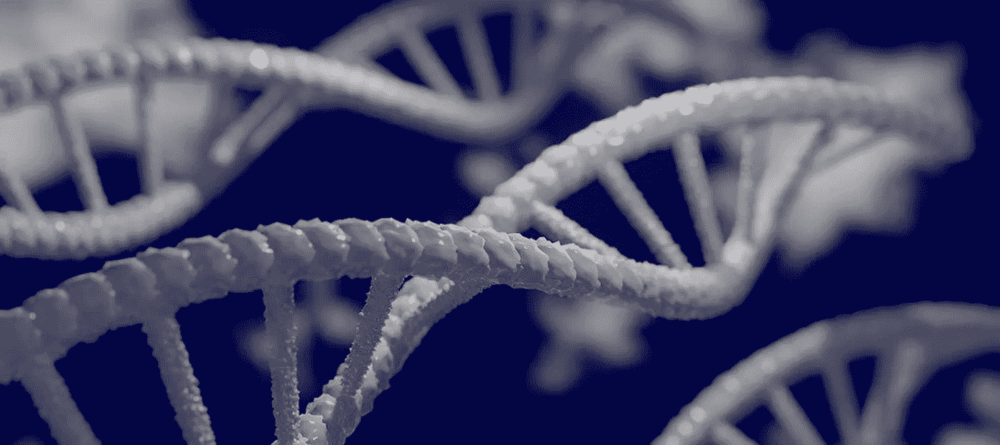

# 特征选择的惊人有效的遗传方法

> 原文：<https://medium.com/analytics-vidhya/the-surprisingly-effective-genetic-approach-to-feature-selection-7eb2b080b713?source=collection_archive---------12----------------------->

来源: [Pixabay](https://pixabay.com/photos/dna-3d-biology-genetic-research-5297378/)

## 对一个被低估的方法的更深入的观察

遗传和进化算法经常被抨击为不足以与神经网络的能力竞争，在很大程度上，这是真的，这就是为什么业界很少考虑这些类型的算法。他们太笼统，而有其他具体的…