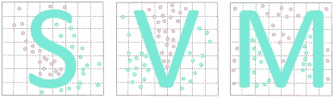
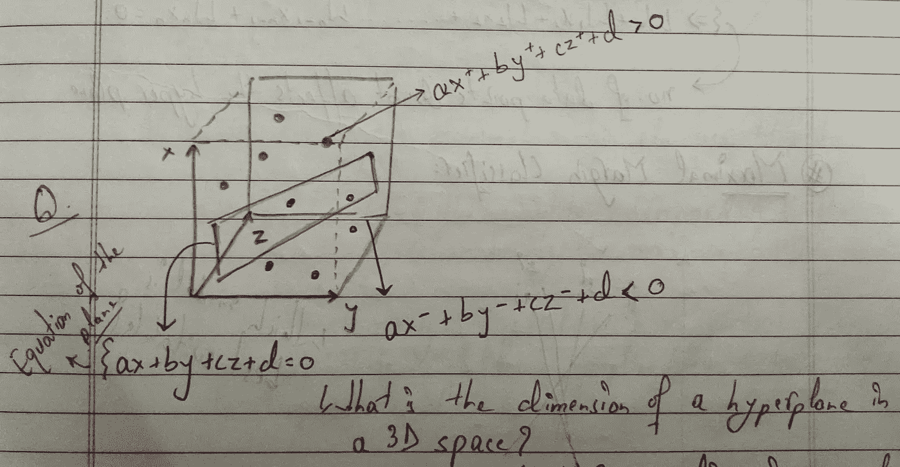
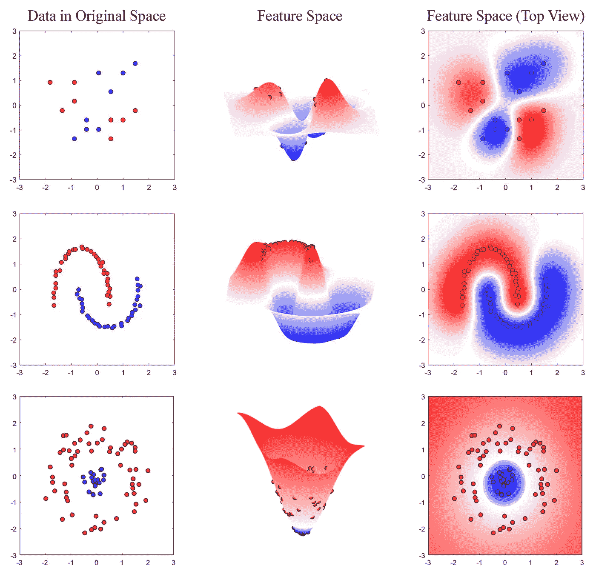
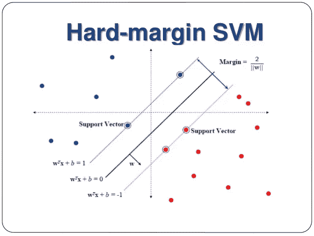
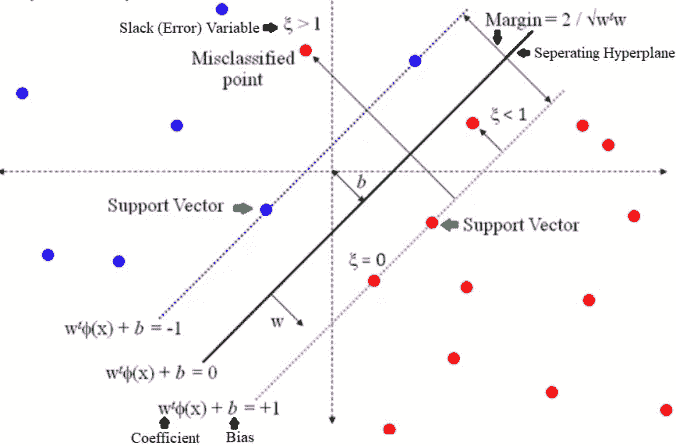
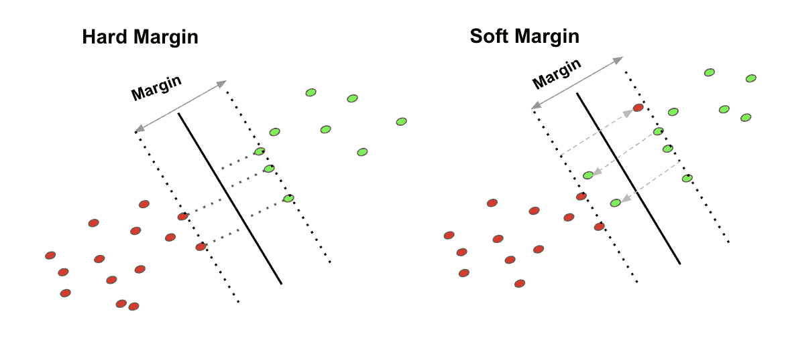
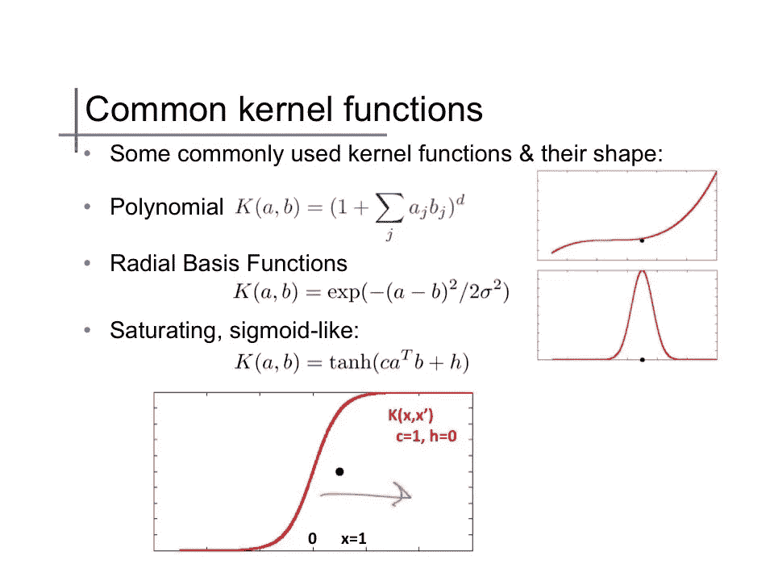

# 我们需要知道的 SVM | |我们实现的 SVM。

> 原文：<https://medium.com/analytics-vidhya/the-svm-we-need-to-know-the-svm-we-implemented-47740d65aa5b?source=collection_archive---------19----------------------->

嘿，伙计们，希望你们都做得很好，首先，这是我上两个博客的延续，在那里我们讨论了关于****的实际糖尿病预测，随后解释了** [**逻辑回归**](https://www.linkedin.com/posts/atul-mishra-5001_why-when-what-logistic-regression-activity-6703335712151924736-kfUH) 以及它如何帮助我们实际应用。**

*   **支持和反馈非常友好，这让我对交付和帮助社区更有热情。**

**这篇文章在很大程度上是对那篇文章的延续，因为在这里我们将讨论我们在**定制管道中使用的另一个算法，SVM(支持向量机)。****

**我们必须理解**什么和为什么**正如我们对逻辑回归所做的那样，同样的事情也必须考虑到 **SVM** 这里。我在想加入这个博客的 **MNIST** 时尚数据集和我[尝试过的 DL 模特](https://github.com/mishra-atul5001/Data-Science-and-ML-insights-Projects/blob/master/Fashion%20MNIST%20with%20Keras.ipynb)，但是那会偏离手头的主题，所以让我们开始吧。**

# **什么是 SVM？**

*   **支持向量机是一种经典且通用的机器学习模型，可用于**分类/回归**甚至**离群点检测。****
*   **它可以对**线性**以及**非线性数据**执行这些操作，但是当在目标变量和预测变量之间存在具有高**非线性**趋势的高维数据时，可以看到 SVM 模型的实际功效。我确实使用了 **SVM 模型**进行[情感分析](https://github.com/mishra-atul5001/Data-Science-and-ML-insights-Projects/blob/master/Customer%20Sentiment%20Analysis%20--%20NLP%20--%20IMDB%20Reviews.ipynb)，并且给了我一些不错的结果。**
*   ****支持向量机**背后的基本思想是在分隔两个或更多类的决策边界和训练实例之间拟合最宽/最大可能的余量。**

****

****可视化表示**二进制 SVM 模型**的****

*   **现在上图属于 2D 的**超平面概念。**这里，**边距**中间的线是我们的**超平面**分隔两个不同的类。那么一条线的数学方程就是 **ax+by+c = 0** 对吧？**
*   **因此，如果我们假设超平面是一条线，那么具有数据点的**的左右边距变成如下等式:对于类 **-1** 为 **ax+by+c < 0** ，对于类 **1** 为 **ax+by+c > 0** 。这个数学很重要，因为现在我们有 2 维，当我们进入 3 维或推广 N 维时会发生什么。****
*   **现在，让我们也接触一下 **3D 平面**概念，以便达到 **N 维**通用性。所以，SVM 把一个三维超平面称为**“平面”。**这里平面的方程变成了 **ax+by+cz+d = 0。**与此类似，向量边距变成了**平面的正负**方面。**

****

**从我的 SVM 笔记剪->三维平面**

*   **有谁能回答这个-> **三维空间中超平面**的维数是多少？答案:**特征数量-1** 。3D 平面中的特征有 **{x，y，z}** 。**
*   **对于**D(10/1000/百万)维**，我们的最终等式为:***sum(x1 . w1+x2 . w2+x3 . w3+…………..+xd.wd)+c = 0*** ，其中 x1，x2，x3…..xd 是**尺寸**，w1、w2、w3……wd 是**系数**，c 是我们的常数。**
*   **由该方程表示的模型称为**线性鉴别器**，是重要的技术面试问题之一。但到目前为止，我们只讨论了什么是 SVM，并且只考虑了线性可分数据。现在，在 SVM 的**为什么部分**中，我们将看到 **SVM 对非线性可分数据**的威力。**

# **为什么是 SVM？**

*   **分类问题可以用 **Logistic 回归**解决，但是哦等一下，Logistic 回归不是更适合**二元分类吗？如果我有 2 门以上的课怎么办？如果我有一个更高维的数据呢？如果我的数据不是线性的怎么办？****
*   **在这种情况下，我们需要 SVM 的力量来产生一个平面/超平面，它可以更好地分离阶级。但是有一个技巧，你希望自己付出多少代价来错误地分类这些点，以便实现一个更好/稳定的模型？我们先来看一些非线性可分的例子，然后再来讨论这个问题。**

****

****非线性趋势**的方式和观点**

*   **这些乱七八糟的趋势数据确实让我们在建模时有些困难，但这就是我们需要弄清楚的地方，我们是想要**硬边际分类**还是**软边际分类**。**
*   ****硬页边距分类**规定所有数据点必须严格远离页边距，并位于页边距的右侧。**

****

****硬保证金 SVM****

*   **不利之处在于，这些硬边界分类器通常过拟合，并且仅当数据是线性可分的时才适用。**
*   **除此之外，它们甚至对异常值**敏感**，这也导致了过度拟合的性质。**
*   **我们还将讨论/比较**硬利润和软利润**。**
*   **为了克服硬边界分类所面临的所有挑战，为了更好地概括和有一个更可行的模型，使用了**软边界分类**。**

****

****软保证金 SVM****

*   **这里我们给出了模型，以错误分类一些数据点，这在硬保证金是禁止的。这赋予了模型以更时尚的方式拟合数据点的能力。**
*   **这里的目标是**在保持边缘街道尽可能大和限制边缘违规之间找到一个好的平衡。****
*   **现在，你可能会想，既然我们允许软利润模型执行一些错误分类，那么模型如何是最优的？嗯，从这个角度来想，**你必须从 A 点旅行到 B 点，有多条路线可以到达它**。路径 **A-C-B** 可能比路径 **A-D-B** 多 3 到 4 公里，但是这条路很难走，所以你要做的是，选择更合适的路径，这样你的旅程会变得舒适。**
*   **类似地，我们允许错误分类，但是我们也通过**超参数调整**和使用**松弛变量**来控制错误分类。松弛变量告诉你变量相对于**边缘和超平面的位置。****
*   **让我们看看对比，继续前进！**

****

****硬 vs 软****

**这对于我们来说很重要，因为只有这样，如果采访者问，你如何选择一个最好的 SVM 模式，我们才能引用。让我再引用一次:**最好的 SVM 模型是在区分两个类的决策边界和训练实例之间具有最大余量的模型。****

**现在，我们在糖尿病预测实践中实现的 SVM 是硬边界分类器，因为我们有线性可分的数据点。包括这一点，你可能会奇怪，为什么我没有谈到正在 SVM 使用的**内核**。**

*   **很好地，当必须对非线性数据点使用软边界分类器时，通常会考虑核。他们需要自己一个详细的解释和实现，我将在接下来的文章中展示。但是我不会让你蒙在鼓里，所以简单地说一下，我会告诉你什么是不同种类的内核，以及它们看起来是怎样的。**

****

**SVM 核**

# **我想分享的几点:**

*   **与逻辑回归分类器不同，SVM 分类器**不输出每个类别**的概率。我的一个同事陈述了这一点，然后分享了一个链接，**意为 SVM 也输出概率，但它一半是真的，一半是假的。****
*   **为了澄清这个事情，让我这样引用:**SVM 模型输出一个测试/训练实例和一个决策边界之间的距离，这个距离可以作为一个置信度得分。但是，这个分数不能直接转换成班级概率。**现在在 **sklearn** 中，如果我们在创建 SVM 模型时设置***probability = True***，那么在训练时，该模型使用 SVM 模型上的**逻辑回归来校准概率。这将把 ***predict_proba()和*** 方法注入到 SVM。****

# **面试问题:**

*   **为什么使用 SVM 时缩放输入很重要？ **SVM 试图拟合数据点和决策边界之间的最大街道/边距。因此，如果训练集没有缩放，那么它将倾向于忽略可能在一个类中非常远的小特征。****
*   **一个 **RBF** SVM 模型被训练，但是它倾向于过度拟合训练数据，我们能做些什么？如果 RBF SVM 模型对数据拟合不足，这将导致施加过多的限制，技术上称为正则化。所以可能会有太多的管制。现在，为了减少正则化，我们需要增加正则化超参数γ或 C，或者同时增加两者。**
*   **尝试加州数据集的 SVM 回归。**锻炼尝试。****

## **结论**

**这就是我对这篇文章的全部看法。我知道这可能太理论化了，但是我试着用一种更技术化——非技术化的方式来表达，这样每个人都能理解 SVM 工作的要点，它们是什么，并且能传递相同的解释。**

**另外，在下一篇文章中，我想加入**时尚 MNIST 数据集和 DL 模型**或者**继续 ML 并引入决策树/高斯朴素贝叶斯模型。所以请在评论区告诉我你对下一篇博客的看法和选择。在那之前，保持安全…保持卫生。****

**反馈始终是持续改进的输入。**