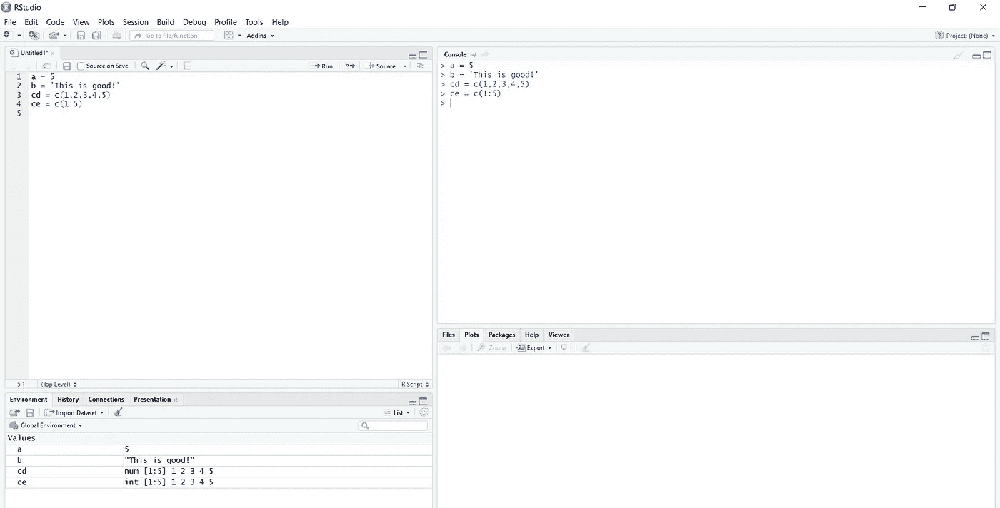

# 将程序员和非程序员聚集在一起的技术；稀有

> 原文：<https://medium.com/analytics-vidhya/the-technology-that-brings-programmers-and-non-coders-together-r-87f0a283276f?source=collection_archive---------16----------------------->

## 对于想要进入分析领域的来自不同背景的人来说，从哪种工具或技术开始总是不太确定；r 回答了这个问题

马库斯·温克勒在 [Unsplash](https://unsplash.com?utm_source=medium&utm_medium=referral) 上的照片

对于来自工程或 IT 背景的人来说，学习 Python 或 R 只是他们必须掌握的另一种语言。然而，对于来自市场营销、金融、经济或会计专业的学生来说；Excel 是最先进的。他们必须从头开始学习所有其他的东西，这就是 R 发挥重要作用的地方。

由于 R 的简单性和功能性，即使这个人不熟悉编码概念或者没有技术背景，也很容易进入。编译器、变量、初始化的概念以及与此相关的东西，对于有人使用 r 来说几乎完全被跳过，没有必要。

python 带来的适应性、多功能性和灵活性伴随着复杂性和混乱。什么版本是兼容的，使用什么平台，使用什么媒介，路径是否正确，这些都是伴随 Python 而来的问题。r 能够跳过所有的技术术语，直接触及分析的核心。

理解了语法、库和 UI 的基础知识之后，就可以直接研究数据、列、缺失值、模型和图表了。可视化在每个领域都很常见，它让我们理解数据集中的上下文和比较；这就是为什么我们在 Python 中有 Tableau、Excel 图表、条件格式和 Seaborn。在 R 中创建它们也很简单，因此对于程序员和非编码人员来说都很常见。直方图、散点图、箱线图、词云都易于使用和解释，这也是 ggplot 在 r 中如此常用的原因之一。

此外，在许多情况下，非编码人员通过统计数据，如平均值、中值、相关性、线性回归、p 值、R、方差等概念来进行分析。在这种情况下，R 更容易使用，而且非常简单。作为数学和概率的一部分，它比编码和陈述的镜头更容易学习。除此之外，R studio 的 GUI 也是使用 R 的最常见方式。它向您展示了创建了哪些变量，这些变量中包含哪些元素，以及变量的类型。这对于非编码人员来说也很重要，他们可以看到他们作为代码运行的内容，并且实时实现。

作者照片

由于所有这些小细节，这种简单性，特别是在像数据科学这样复杂的领域，给了 R 一个非编码人员固有的优势，因此，能够在团队分析中包括每个人。